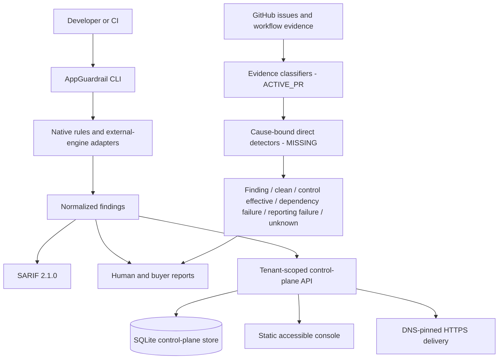

# AppGuardrail architecture

This document is the discoverable entry point for AppGuardrail's as-built and
target architecture. Status is explicit: PR #911's issue inventory and
evidence-classification foundation is `ACTIVE_PR`; issue-complete direct
detection is still `MISSING`. Existing CLI, scanner, control-plane, reporting,
and SQLite behavior is
`IMPLEMENTED_ON_PROTECTED_MAIN` at base commit
`0d07baae44a40edfcaec5e42c7fb9351510ca9f0`.

The active PR registers 414 issue identities and 417 rows, but those rows
collapse to 20 unique family/claim semantics. Formal per-issue cause binding is
0/414, independently validated direct detector efficacy is 0/417, and
protected-main operational proof is 0/414. Registry presence and classifier
branch coverage are not detector efficacy.

## System context

AppGuardrail is a dependency-free Python security product with three separable
surfaces:

1. a local CLI and packaged rule engine for source, configuration, dependency,
   and infrastructure scanning;
2. a tenant-scoped control plane for scan history, drift, reports, retention,
   and bounded notifications; and
3. an evidence adapter layer that classifies native and external security-gate
   results without treating workflow failure as a vulnerability.

Each surface operates standalone. CWL repositories integrate through CLI,
SARIF, JSON, HTTP, or GitHub workflow contracts; no consumer reads the
control-plane database directly.

## Component boundaries

- `scanner/cli` owns command parsing, project traversal, the native scan
  pipeline, optional external-engine invocation, SARIF, and report entrypoints.
- `scanner/rules` owns packaged declarative rules. Pattern-only rules are not
  represented as structural analysis.
- `appguardrail_core/findings.py`, `rules.py`, `sarif.py`, and `reports.py` own
  normalized evidence and presentation contracts.
- `appguardrail_core/controlplane.py` owns authenticated HTTP handlers and the
  current SQLite repository boundary; `controlplane_schema.py` owns migrations.
- `pinned_https.py` owns SSRF-resistant, redirect-revalidated HTTPS delivery.
- `issue_detection.py` and `issue_detection_registry.json` own the `ACTIVE_PR`
  inventory, closed classifier schemas, and bounded workflow-observation model.
  They do not yet bind each issue to a source collector, direct detector, and
  independent oracle.
- GitHub workflows are orchestration only. A collector or a failed Check is
  evidence input, never detector efficacy by itself.

## Authority and data flow

The target authoritative source identity for a finding is the
scanner/rule/tool plus its version, rule identifier, location, fingerprint, and
exact source revision. The target workflow identity additionally includes
repository, producer, run/job/attempt, event, head, source-artifact identity,
evidence reference, digest, and attestation. The active-PR envelope binds only
producer, run, head, evidence reference, and payload digest; repository and
source-artifact identity are not bound. It is therefore an external observation,
not direct detector authority. Issue title, labels, prose, and issue number
select requirements; they cannot assert a runtime outcome.

Results are fail-closed. Missing, malformed, extra, stale, or unauthenticated
evidence yields `unknown` with an unsatisfied gate. A correctly rejected
untrusted dispatch is `control_effective`; an unavailable provider is
`dependency_failure`; publishing a result without changing the source finding
is `reporting_failure`.

## Deployment and persistence

The CLI needs no service. The optional control plane is one Python process with
an application-owned SQLite database and static console. Production-scale
managed storage is `PLANNED` behind the same repository functions; it is not
claimed as implemented. The issue-detection registry is packaged immutable
configuration, not an operational database. Its conceptual evidence model is
documented separately and must not be mistaken for persisted tables.

## Documentation map

- Product requirements: [`docs/product/PRD.md`](docs/product/PRD.md)
- Technical requirements: [`docs/engineering/TRD.md`](docs/engineering/TRD.md)
- Issue detection contract: [`docs/issue-detection-contract.md`](docs/issue-detection-contract.md)
- Architecture decisions: [`docs/adr/README.md`](docs/adr/README.md)
- UML views: [`docs/architecture/UML.md`](docs/architecture/UML.md)
- Conceptual ERD/evidence model: [`docs/architecture/EVIDENCE_MODEL.md`](docs/architecture/EVIDENCE_MODEL.md)
- Security policy: [`SECURITY.md`](SECURITY.md)
- Threat model: [`docs/THREAT_MODEL.md`](docs/THREAT_MODEL.md)
- Test strategy: [`docs/TEST_STRATEGY.md`](docs/TEST_STRATEGY.md)
- Operability and recovery: [`docs/OPERABILITY.md`](docs/OPERABILITY.md)
- Incident response: [`docs/INCIDENT_RUNBOOK.md`](docs/INCIDENT_RUNBOOK.md)
- Requirement-to-evidence traceability: [`docs/TRACEABILITY.md`](docs/TRACEABILITY.md)
- Machine-readable delivery state: [`docs/issue-detection-traceability.json`](docs/issue-detection-traceability.json)
- Contributor constraints: [`AGENTS.md`](AGENTS.md) and [`CLAUDE.md`](CLAUDE.md)
- Release history: [`CHANGELOG.md`](CHANGELOG.md) and `CHANGELOG.d/`

## Quality attributes

Security, tenant isolation, evidence provenance, deterministic local operation,
exact owned statement coverage, accessible interaction, bounded resource use,
rollback, and standalone/MSA interoperability are current release properties.
Exact branch coverage remains a target without a PR #911 gate. The documentation
fitness gate prevents active-PR inventory counts
from being promoted to protected-main efficacy. CSAP and SOC 2 are design
targets; this repository does not claim certification.
