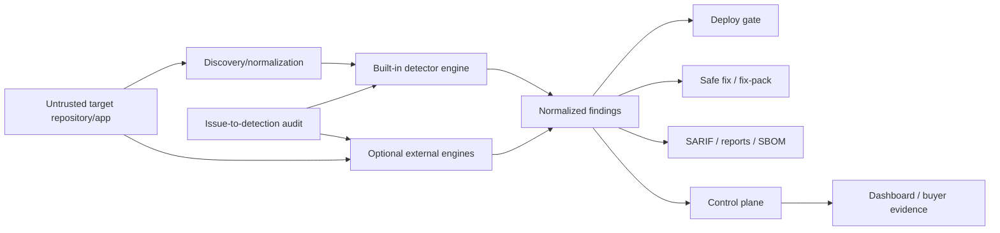
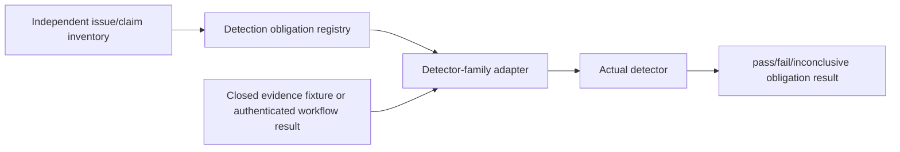
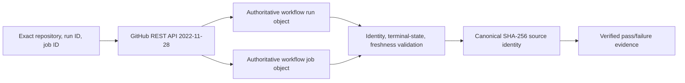
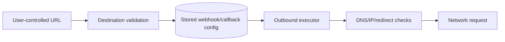
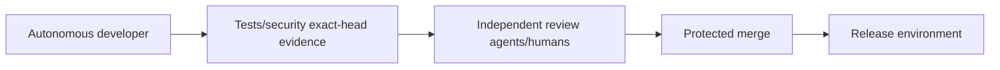

# AppGuardrail Architecture

**Status:** Accepted as-built/target architecture with maturity labels  
**Last reviewed:** 2026-08-14

## Architectural goal

AppGuardrail converts application/security evidence into deterministic findings, reviewable remediation, continuous policy gates, and longitudinal assurance without conflating optional external scanners, issue metadata, or historical coordination with executable detection truth.

## Component view

## Detector authority

The detector that observes evidence is authoritative for its finding. `scanner/rules/*.yml` is not automatically executable in full: supported `pattern-regex` entries can be evaluated by the lightweight engine, while Semgrep-style structural `pattern:` fixtures remain non-executable by the built-in matcher unless explicitly routed to a working structural engine.

External engines retain their own engine/rule/version provenance. AppGuardrail normalizes their output but does not claim their analysis was performed internally.

## Issue-to-detection boundary

A registry maps requirement identity to executable detector family; it cannot assert the detector answer. Historical PR #911 remains a non-authoritative inventory prototype. Issue #938 and PR #939 replace its broad draft with one bounded, source-authoritative detector vertical slice.

## Source-authoritative GitHub Actions evidence

`appguardrail_core.github_actions_evidence` is the first source-authoritative evidence acquirer. It does not accept a caller Boolean as detector truth. The production CLI fetches the exact GitHub run and job over a fixed HTTPS origin, rejects redirects and identity mismatch, caps response size, requires completed security-relevant states, rejects future/stale/duplicate evidence, and emits a bounded canonical digest. Raw logs, bearer credentials, and arbitrary cross-repository content are outside this evidence object.

This slice is an acquisition-and-verification contract, not a claim that every historical issue family is directly detected. Each future detector family must supply its own authoritative source, independent oracle, mutation evidence, and production-path proof.

## SSRF architecture

Stored SSRF prevention and scanner detection are separate controls. The control-plane write boundary was hardened through PR #924, while PR #910 added the packaged built-in rule `python-stored-ssrf-webhook-url`; both are implemented on protected `develop`. The detector is intentionally bounded to Python `set_webhook` direct and one-hop persistence flows covered by its regression corpus and does not claim universal interprocedural SSRF detection.

## Control-plane boundary

Current standalone control plane is stdlib HTTP + SQLite, with tenant API-key roles and scan/history/drift/webhook configuration. Persistent organization identity is resolved from authenticated key context, not untrusted payload strings. Enterprise replacement of SQLite is behind stable repository service functions and requires migrations/authz/recovery evidence.

## Remediation authority

Autofix can perform only narrowly proven semantics-preserving transformations. Other fixes are guidance for a user/agent and become accepted only after rescanning/reverification. Model-generated remediation is never a substitute for scanner evidence.

## Automation authority

The development model does not own qualifying approval, protected merge, release, or reviewer credentials. Scheduler blocks are RCA inputs; one blocked PR does not idle unrelated safe work.

## Deployment modes

1. **CLI/library:** one-shot local scan/report/SBOM/fix.
2. **CI monitor:** installed GitHub workflow generating findings/SARIF and optional control-plane push.
3. **Control plane:** standalone multi-tenant scan history/drift/dashboard/webhook service.
4. **Organization evidence:** read-only aggregation of repository/PR/action evidence for acquisition/security diligence.

These modes share normalized contracts but can operate separately.

## Change control

A new detector engine, evidence acquirer, persistent schema, tenant authority, arbitrary autofix class, outbound target policy, issue-audit semantics, or automation credential boundary requires ADR and synchronized technical/security/test documentation.