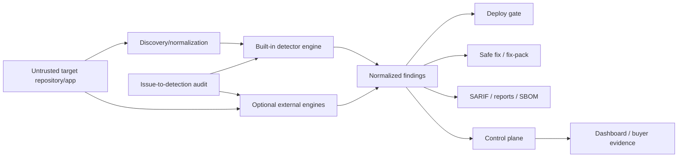
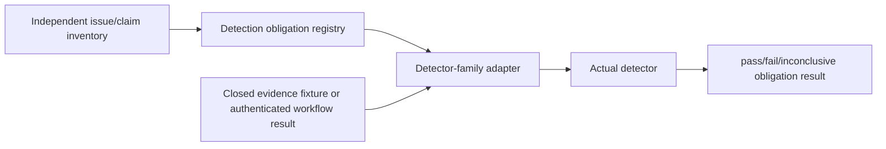
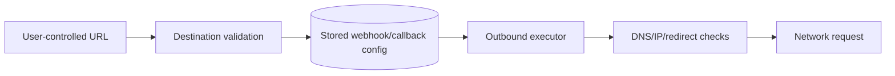
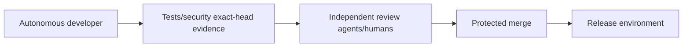

# AppGuardrail Architecture

**Status:** Accepted as-built/target architecture with maturity labels  
**Last reviewed:** 2026-08-12

## Architectural goal

AppGuardrail converts application/security evidence into deterministic findings, reviewable remediation, continuous policy gates, and longitudinal assurance without conflating optional external scanners, issue metadata, or historical coordination with executable detection truth.

## Component view

```mermaid
flowchart LR
    TARGET[Untrusted target repository/app]
    DISC[Discovery/normalization]
    BUILTIN[Built-in detector engine]
    EXT[Optional external engines]
    FIND[Normalized findings]
    GATE[Deploy gate]
    FIX[Safe fix / fix-pack]
    SARIF[SARIF / reports / SBOM]
    CP[Control plane]
    DASH[Dashboard / buyer evidence]
    ISSUE[Issue-to-detection audit]

    TARGET --> DISC
    DISC --> BUILTIN
    TARGET --> EXT
    BUILTIN --> FIND
    EXT --> FIND
    FIND --> GATE
    FIND --> FIX
    FIND --> SARIF
    FIND --> CP
    CP --> DASH
    ISSUE --> BUILTIN
    ISSUE --> EXT
```

## Detector authority

The detector that observes evidence is authoritative for its finding. `scanner/rules/*.yml` is not automatically executable in full: supported `pattern-regex` entries can be evaluated by the lightweight engine, while Semgrep-style structural `pattern:` fixtures remain non-executable by the built-in matcher unless explicitly routed to a working structural engine.

External engines retain their own engine/rule/version provenance. AppGuardrail normalizes their output but does not claim their analysis was performed internally.

The proposed
`github-actions-pull-request-target-untrusted-head-execution` built-in rule
owns a job-local GitHub Actions trust-boundary signal. A deterministic analyzer
requires all four causal elements: a `pull_request_target` trigger, repository
privilege in the same job, explicit materialization of an event-derived PR head,
and subsequent execution of a local action, script, test, or build from that
tree. It recognizes equivalent dot/bracket event expressions and one-hop
workflow-, job-, or same-step `env` bindings used by the same shell command
segment as Git tree selection. A fetch alone is insufficient; checkout/switch
must select the revision, or a worktree must select it and the shell must enter
that worktree before local execution. Action checkout materialization is bound
specifically to its owned `with.ref` input, including flow mappings. It
does not merge evidence across jobs or treat
YAML-looking action inputs, comments, or run-block data as workflow authority.
Same-repository author predicates do not change the result because collaborator
branches remain mutable. Ordinary `pull_request`, metadata-only
`pull_request_target`, trusted base checkout, authority isolated in another job,
and a conservatively recognized scalar or block job-level event guard whose
every disjunct admits only non-PR-target events remain
outside the finding boundary. The canonical prevention boundary remains a
metadata-only trigger followed by a separately reviewed default-branch
execution workflow.

The proposed `github-actions-runtime-package-without-integrity` built-in rule owns
the narrow workflow-source signal where one step binds a versioned registry
package environment value to the exact package-selector position of that step's
`npx`/`npm exec` auto-install command. A deterministic line/state analyzer tracks
step-local field indentation, blank block-scalar lines, exact variable boundaries,
compact or expanded step mappings, intervening YAML comments, and shell heredoc
state. Heredoc body text is ignored unless an unquoted body is
redirected to a target that the same step later makes executable with `chmod`.
Lexical proximity is therefore not promoted to causal execution. The rule does
not claim that a download or registry compromise occurred. Central protected workflow prevention, immutable tool
distribution, consumer configuration, and this repository-local
detector remain separate controls.

## Issue-to-detection boundary

```mermaid
flowchart LR
    HIST[Independent issue/claim inventory]
    REG[Detection obligation registry]
    ADAPT[Detector-family adapter]
    DET[Actual detector]
    EV[Closed evidence fixture or authenticated workflow result]
    RES[pass/fail/inconclusive obligation result]

    HIST --> REG
    REG --> ADAPT
    EV --> ADAPT
    ADAPT --> DET
    DET --> RES
```

A registry maps requirement identity to executable detector family; it cannot assert the detector answer. PR #911 is active-PR implementation of this contract.

## SSRF architecture

```mermaid
flowchart LR
    INPUT[User-controlled URL]
    VALID[Destination validation]
    STORE[(Stored webhook/callback config)]
    EXEC[Outbound executor]
    DNS[DNS/IP/redirect checks]
    NET[Network request]

    INPUT --> VALID
    VALID --> STORE
    STORE --> EXEC
    EXEC --> DNS
    DNS --> NET
```

Stored SSRF prevention and scanner detection are separate controls. The control-plane write boundary was hardened through PR #924, while PR #910 added the packaged built-in rule `python-stored-ssrf-webhook-url`; both are implemented on protected `develop`. The detector is intentionally bounded to Python `set_webhook` direct and one-hop persistence flows covered by its regression corpus and does not claim universal interprocedural SSRF detection.

## Control-plane boundary

Current standalone control plane is stdlib HTTP + SQLite, with tenant API-key roles and scan/history/drift/webhook configuration. Persistent organization identity is resolved from authenticated key context, not untrusted payload strings. Enterprise replacement of SQLite is behind stable repository service functions and requires migrations/authz/recovery evidence.

## Remediation authority

Autofix can perform only narrowly proven semantics-preserving transformations. Other fixes are guidance for a user/agent and become accepted only after rescanning/reverification. Model-generated remediation is never a substitute for scanner evidence.

## Automation authority

```mermaid
flowchart LR
    DEV[Autonomous developer]
    VERIFY[Tests/security exact-head evidence]
    REVIEW[Independent review agents/humans]
    MERGE[Protected merge]
    RELEASE[Release environment]

    DEV --> VERIFY
    VERIFY --> REVIEW
    REVIEW --> MERGE
    MERGE --> RELEASE
```

The development model does not own qualifying approval, protected merge, release, or reviewer credentials. Scheduler blocks are RCA inputs; one blocked PR does not idle unrelated safe work.

## Deployment modes

1. **CLI/library:** one-shot local scan/report/SBOM/fix.
2. **CI monitor:** installed GitHub workflow generating findings/SARIF and optional control-plane push.
3. **Control plane:** standalone multi-tenant scan history/drift/dashboard/webhook service.
4. **Organization evidence:** read-only aggregation of repository/PR/action evidence for acquisition/security diligence.

These modes share normalized contracts but can operate separately.

## Change control

A new detector engine, persistent schema, tenant authority, arbitrary autofix class, outbound target policy, issue-audit semantics, or automation credential boundary requires ADR and synchronized technical/security/test documentation.
