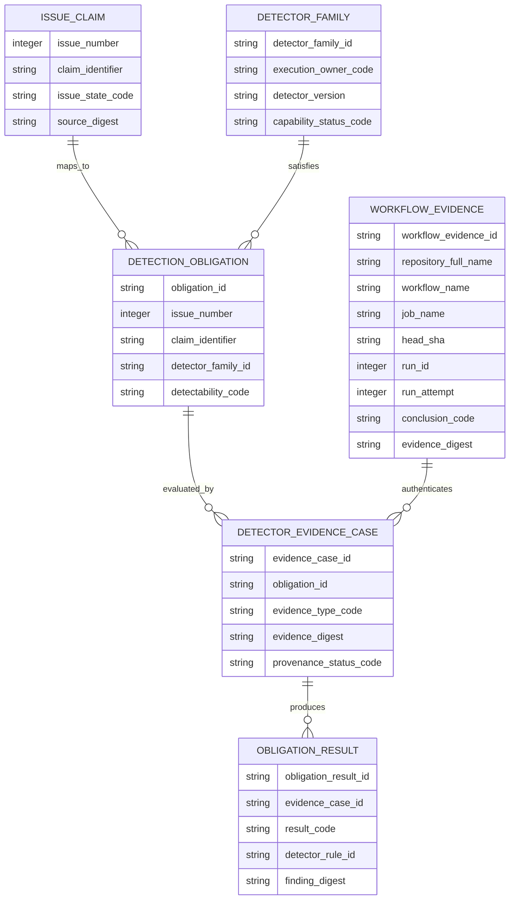
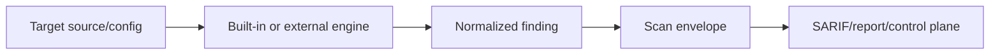

# AppGuardrail Logical and Persistence ERD

**Status:** Accepted cross-cutting data model; active-PR detector-obligation entities are labelled.  
**Last reviewed:** 2026-08-09

Current control-plane persistence is SQLite behind repository service functions. The scanner itself is primarily filesystem/in-memory and emits normalized finding envelopes. This ERD distinguishes current persistent scan history from active-PR/planned detection-obligation evidence.

## Current control-plane model

```mermaid
erDiagram
    ORGANIZATION_RECORD ||--o{ API_KEY_RECORD : authorizes
    ORGANIZATION_RECORD ||--o{ SCAN_RECORD : owns
    SCAN_RECORD ||--o{ FINDING_RECORD : contains
    ORGANIZATION_RECORD ||--o| WEBHOOK_CONFIG : configures
    SCAN_RECORD ||--o{ DRIFT_RECORD : compares

    ORGANIZATION_RECORD {
      string organization_id PK
      string organization_name
      datetime created_at
    }

    API_KEY_RECORD {
      string api_key_id PK
      string organization_id FK
      string key_digest
      string role_code
      datetime created_at
      datetime revoked_at
    }

    SCAN_RECORD {
      string scan_id PK
      string organization_id FK
      string repository_name
      string commit_sha
      integer blocking_finding_count
      string schema_version
      datetime created_at
    }

    FINDING_RECORD {
      string finding_id PK
      string scan_id FK
      string rule_id
      string engine_code
      string severity_code
      string category_code
      string file_path
      integer line_number
      string bounded_metadata_json
    }

    DRIFT_RECORD {
      string drift_record_id PK
      string scan_id FK
      string previous_scan_id
      integer new_blocker_count
      string calculation_version
    }

    WEBHOOK_CONFIG {
      string webhook_config_id PK
      string organization_id FK
      string normalized_destination
      string destination_policy_version
      datetime updated_at
    }
```

Exact physical SQLite table/column names may differ; migrations/source remain authoritative. Persistent object naming should converge on descriptive two-or-more-word `snake_case` when schema changes occur.

## Detection obligation model — PR #911 active target

This second model is an **active-PR logical contract**, not a protected-develop persisted schema. PR #911 may use committed JSON/registry/fixtures rather than these as database tables.

## Identity and tenancy invariants

- API key identity resolves organization authority; repository/org strings inside scan payloads cannot elevate access.
- Finding IDs, scan IDs, issue numbers, rule IDs, and GitHub run IDs are evidence identities, not authorization identities.
- Webhook destination strings are protected network destinations and must pass policy before persistence/execution.
- Raw secrets discovered in target code are not copied into durable findings; retain rule/location/fingerprint or bounded redacted evidence instead.

## Finding provenance

A finding retains engine/rule/provenance across transformations. AppGuardrail must not erase the distinction between built-in and external-engine evidence.

## Schema evolution rule

A future managed PostgreSQL control plane requires explicit migration/rollback, tenant authorization/RLS where used, idempotency/concurrency, webhook/egress security, backup/recovery, retention/deletion, and cross-tenant tests. Conceptual issue-obligation entities become persistent only through such a reviewed migration, not merely by being drawn here.