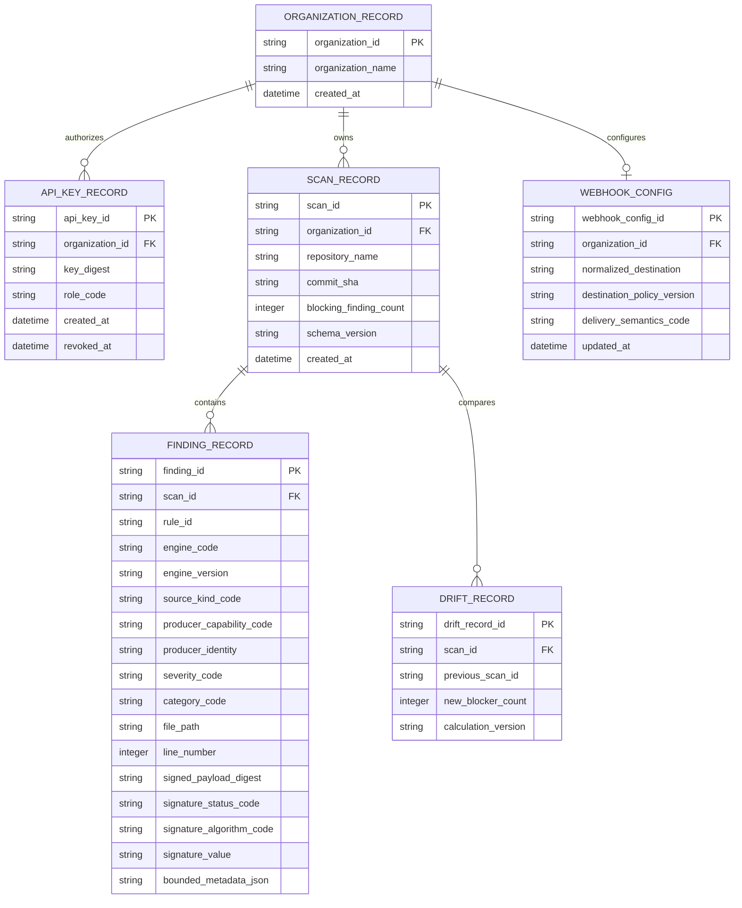
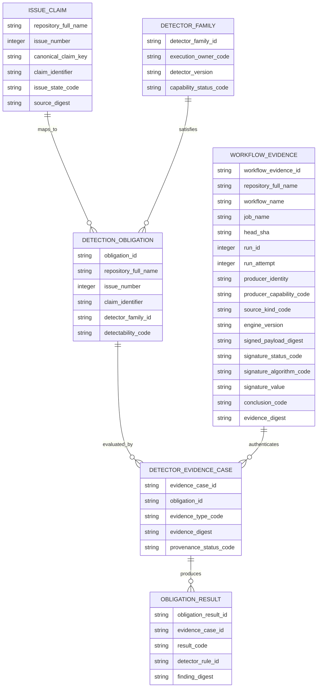
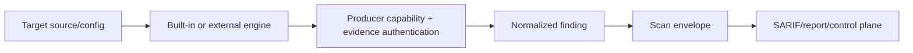

# AppGuardrail Logical and Persistence ERD

**Status:** Accepted cross-cutting data model; active-PR detector-obligation entities are labelled.  
**Last reviewed:** 2026-08-09

Current control-plane persistence is SQLite behind repository service functions. The scanner itself is primarily filesystem/in-memory and emits normalized finding envelopes. This ERD distinguishes current persistent scan history from active-PR/planned detection-obligation evidence. Exact physical SQLite table/column names remain source/migration authority; logical evidence fields below define the product contract even when the current store embeds them in a normalized JSON envelope.

## Current control-plane model

Persistent object naming should converge on descriptive two-or-more-word `snake_case` when schema changes occur.

### Finding evidence provenance contract

`bounded_metadata_json` is supplementary metadata, not the provenance/authentication authority. A normalized finding that participates in trusted evidence records the following logical keys explicitly:

- `engine_code` and `engine_version` — exact detector/adapter identity and version;
- `source_kind_code` — built-in source scan, external engine import, workflow evidence, historical/imported evidence, or another closed source class;
- `producer_capability_code` and `producer_identity` — which component/identity was authorized to create the evidence class;
- `signed_payload_digest` — canonical digest over the immutable normalized evidence envelope, including rule, engine/version, source, producer, location/fingerprint, and bounded evidence metadata;
- `signature_status_code`, `signature_algorithm_code`, and `signature_value` — explicit authentication result and signature material where cryptographic authentication is required.

A local built-in detector may use a closed `not_applicable_local` signature status when provenance is established inside the same verified process boundary; imported/workflow evidence cannot be promoted to authenticated evidence unless its required producer capability, digest coverage, and signature/attestation validation succeed. Missing, malformed, unsupported, mismatched, or unverifiable signature evidence produces `evidence_untrusted`, never `completed_clean` or a registry PASS.

## Webhook delivery model

The current generic webhook implementation is **at-most-once per local scan event**: it performs one best-effort POST after destination validation and does not schedule automatic retries. There is therefore no receiver deduplication or synthetic delivery identifier that may be relied on for retry safety today. `delivery_semantics_code` documents this logical contract as `at_most_once_current`.

A future retrying webhook design must be a reviewed contract change that adds a stable `delivery_id`, persists delivery-attempt state, requires receiver-side deduplication on that identifier, revalidates the destination at every attempt/redirect, and caps retry/backoff. Until that exists, transport failure is retained as bounded evidence and is not retried automatically by the current webhook path.

## Detection obligation model — PR #911 active target

This second model is an **active-PR logical contract**, not a protected-develop persisted schema. PR #911 may use committed JSON/registry/fixtures rather than these as database tables.

### Issue-claim identity and storage scope

Issue numbers are repository-local. A claim is uniquely scoped by the composite identity `(repository_full_name, issue_number, claim_identifier)`; no implementation may key a retained issue claim by issue number alone.

`repository_full_name` is the canonical GitHub `owner/repository` identity. `canonical_claim_key` is a stable versioned semantic key from the retained issue-claim registry, not a transient list position. `claim_identifier` is generated deterministically from the versioned namespace plus canonical repository identity, decimal issue number, and canonical claim key. Equivalent registry regeneration must produce the same identifier; a different repository with the same issue number/key must produce a different composite identity. A semantic claim replacement is represented as a new canonical claim key/identifier with explicit supersession rather than silently reusing the old identity.

The documentation/registry contract tests must cover stable regeneration and cross-repository issue-number collisions before PR #911 can promote this model.

### Workflow evidence authentication contract

`WORKFLOW_EVIDENCE` does not become trusted merely because a run is green. Its producer identity/capability, source class, exact workflow/run/head identity, engine/workflow version, canonical signed payload digest, signature/attestation status, algorithm, and signature value are explicit evidence fields. The signed digest covers the immutable evidence envelope including repository, workflow/job, exact head, run/attempt, producer capability, conclusion, and referenced detector-evidence digest. Verification must reject a digest mismatch, wrong repository/head/run identity, unauthorized producer capability, unsupported algorithm, invalid signature, or missing required attestation as `evidence_untrusted`.

## Identity and tenancy invariants

- API key identity resolves organization authority; repository/org strings inside scan payloads cannot elevate access.
- Finding IDs, scan IDs, issue numbers, rule IDs, and GitHub run IDs are evidence identities, not authorization identities.
- Repository identity is part of every retained issue-claim identity; issue number alone is never globally unique.
- Webhook destination strings are protected network destinations and must pass policy before persistence/execution.
- Raw secrets discovered in target code are not copied into durable findings; retain rule/location/fingerprint or bounded redacted evidence instead.

## Finding provenance

A finding retains engine/rule/provenance across transformations. AppGuardrail must not erase the distinction between built-in and external-engine evidence or treat unauthenticated imported evidence as an authenticated detector result.

## Schema evolution rule

A future managed PostgreSQL control plane requires explicit migration/rollback, tenant authorization/RLS where used, idempotency/concurrency, webhook/egress security, backup/recovery, retention/deletion, provenance/signature validation, and cross-tenant tests. Conceptual issue-obligation entities become persistent only through such a reviewed migration, not merely by being drawn here.