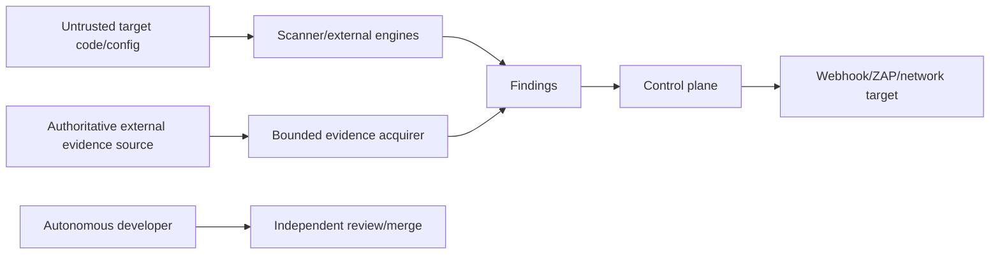

# AppGuardrail Threat Model

**Status:** Accepted baseline  
**Last reviewed:** 2026-08-14

## Scope

Covers built-in scanning, optional external engines, findings/SARIF/reporting, deterministic fixes, GitHub monitor workflows, source-authoritative Actions evidence, the current SQLite control plane, webhook egress, issue-to-detector assurance, and autonomous-development authority.

## Trust boundaries

## Threat inventory

| Threat | Impact | Controls |
|---|---|---|
| detector fixture asserts its own answer | false issue-coverage confidence | independent inventory + answer-free evidence + actual detector execution |
| caller Boolean or log label treated as source truth | forged pass/failure evidence | acquire exact source object directly; no caller decision field in contract |
| repository/run/job substitution | decision bound to the wrong source | exact owner/repository, run ID, job ID, URL, run-on-job ID, and head SHA validation |
| authenticated redirect to another origin | token disclosure/confused deputy | fixed `https://api.github.com` origin and redirect rejection |
| oversized or non-JSON API response | memory/resource abuse or parser confusion | 2 MiB cap, JSON media type, JSON object requirement, bounded scalar fields |
| future, stale, or replayed source evidence | time-travel or duplicate decisions | trusted observation time, bounded max age, canonical source SHA-256 ledger |
| unfinished job/step interpreted as pass/fail | premature gate decision | completed run, job, and step states required; otherwise inconclusive |
| bearer token reflected in output/error | credential disclosure | token only in Authorization header; sanitized error classes; raw body excluded |
| raw workflow logs copied into portable evidence | secret/PII leakage and unstable identity | bounded metadata projection only; logs require a separate reviewed acquirer |
| indiscriminate PII masking removes incident identity | authorized response becomes unusable | tenant isolation, least privilege, encryption, purpose binding, field authorization, immutable audit, retention controls |
| unsupported structural rule presented as built-in | false negative/marketing error | explicit built-in vs external-engine capability/maturity |
| scanner/tool unavailable treated as clean | false security assurance | explicit unavailable/inconclusive classification |
| secret extraction/reflection | credential disclosure | redacted/fingerprinted findings; bounded logs/reports |
| malicious target repository | command/file/resource abuse | bounded file discovery/tool invocation; no instruction-following from source |
| stored webhook SSRF | internal network access later | validate before persistence and execution, redirect/DNS/IP policy |
| direct ZAP/target SSRF | unauthorized attack/egress | explicit authorized target, safe URL policy, bounded runtime |
| cross-tenant API-key misuse | scan/history disclosure | authenticated role/organization authority; negative tests |
| API key leakage | tenant compromise | hashed/stored key handling, no console/log disclosure except intended bootstrap file |
| autofix changes semantics | application regression | only proven semantics-preserving deterministic transforms |
| external-engine provenance lost | misleading findings | retain engine/rule/version/source |
| deploy exclusions erase evidence | hidden risk | exclusions affect gate only; finding remains visible |
| tampered SBOM/report evidence | acquisition/security misstatement | deterministic source/lock provenance and manifest hashes |
| autonomous model self-approval | governance bypass | developer/reviewer/merge/release authority separation |
| malicious shared skill (homoglyph name, injected instructions, exfiltration directive) | agent hijack and secret exfiltration | deny-listed skill sync with exact alias matching; catalog/skill text treated as untrusted data, never instructions (#1031) |
| placeholder template published as an installable skill | discovery pollution and broken installs | reject unresolved placeholder names at sync; workspace state kept out of skill roots (#1031) |

## Source-authoritative Actions abuse case

An attacker can present a legitimate-looking run URL from another repository, pair a valid run with an unrelated job, replay an old failure, publish a line containing `security failed`, return a proxy HTML error body, or force an authenticated redirect. The acquirer therefore fixes the API origin, validates every source identifier and public URL, requires terminal source states, bounds size and freshness, computes a canonical digest, and returns inconclusive for any unavailable or ambiguous condition. Historical issue text and generated registries are context, not source authority.

The portable evidence object retains only the bounded metadata required to reproduce the decision. Raw logs, runner identity, arbitrary annotations, and credentials remain outside this object. When authorized human or repository identity is required, preserve it through access and retention controls rather than deleting it through blanket masking.

## Stored SSRF abuse case

A URL may be safe syntactically but unsafe after DNS resolution, redirect, or later execution. Stored-destination security therefore spans source trust, canonical URL/scheme/port policy, DNS/IP classification, redirect behavior, persistence, and execution-time revalidation/egress. A storage guard and a scanner rule are separate controls.

## Issue-coverage abuse case

A retained historical issue can tempt an audit to “cover” itself by mapping an issue to metadata that already states the expected outcome. That is circular assurance. The evidence producer must be independent enough that the detector adapter derives the result from bounded evidence, and workflow incidents require authenticated repository/run/job/head provenance.

## Residual risk

No static scanner proves application security. Dynamic/runtime/business-logic vulnerabilities may require external tools or human review. GitHub Actions metadata proves the source workflow outcome, not that the workflow's internal detector is scientifically or operationally valid; that detector still needs its own positive/negative/adversarial oracle. AppGuardrail must state toolset/evidence limits and avoid `Clean Scan` claims when a selected required engine or source could not run.

## Review triggers

Revisit when adding a structural matcher, new external engine, behavior-changing autofix, new network/egress path, persistent tenant schema, new evidence acquirer or log source, broader source fields, changed retention/export behavior, or changed autonomous/release credential boundary.