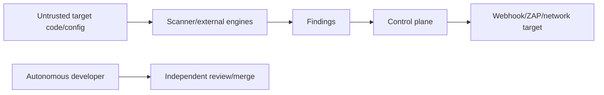

# AppGuardrail Threat Model

**Status:** Accepted baseline  
**Last reviewed:** 2026-08-09

## Scope

Covers built-in scanning, optional external engines, findings/SARIF/reporting, deterministic fixes, GitHub monitor workflows, the current SQLite control plane, webhook egress, issue-to-detector assurance, and autonomous-development authority.

## Trust boundaries

## Threat inventory

| Threat | Impact | Controls |
|---|---|---|
| detector fixture asserts its own answer | false issue-coverage confidence | independent inventory + answer-free evidence + actual detector execution |
| unsupported structural rule presented as built-in | false negative/marketing error | explicit built-in vs external-engine capability/maturity |
| scanner/tool unavailable treated as clean | false security assurance | explicit unavailable/inconclusive classification |
| secret extraction/reflection | credential disclosure | redacted/fingerprinted findings; bounded logs/reports |
| malicious target repository | command/file/resource abuse | bounded file discovery/tool invocation; no instruction-following from source |
| stored webhook SSRF | internal network access later | validate before persistence and execution, redirect/DNS/IP policy |
| direct ZAP/target SSRF | unauthorized attack/egress | explicit authorized target, safe URL policy, bounded runtime |
| cross-tenant API-key misuse | scan/history disclosure | authenticated role/organization authority; negative tests |
| API key leakage | tenant compromise | hashed/stored key handling, no console/log disclosure except intended bootstrap file |
| autofix changes semantics | application regression | only proven semantics-preserving deterministic transforms |
| external-engine provenance lost | misleading findings | retain engine/rule/version/source |
| deploy exclusions erase evidence | hidden risk | exclusions affect gate only; finding remains visible |
| tampered SBOM/report evidence | acquisition/security misstatement | deterministic source/lock provenance and manifest hashes |
| hostile remediation text reaches an agent as executable content | prompt/script injection or secret disclosure | inert text serialization, IssueOps redaction, bounded fields, no dynamic code handlers |
| handoff payload is altered or malformed in transit | agent consumes false remediation/provenance | schema/version/size validation and recomputed bundle digest |
| autonomous model self-approval | governance bypass | developer/reviewer/merge/release authority separation |

## Stored SSRF abuse case

A URL may be safe syntactically but unsafe after DNS resolution, redirect, or later execution. Stored-destination security therefore spans source trust, canonical URL/scheme/port policy, DNS/IP classification, redirect behavior, persistence, and execution-time revalidation/egress. A storage guard and a scanner rule are separate controls.

## Issue-coverage abuse case

A retained historical issue can tempt an audit to “cover” itself by mapping an issue to metadata that already states the expected outcome. That is circular assurance. The evidence producer must be independent enough that the detector adapter derives the result from bounded evidence, and workflow incidents require authenticated repository/run/job/head provenance.

## Residual risk

No static scanner proves application security. Dynamic/runtime/business-logic vulnerabilities may require external tools or human review. AppGuardrail must state toolset/evidence limits and avoid `Clean Scan` claims when a selected required engine could not run.

## Remediation handoff boundary

The handoff is a bounded transport artifact, not an authority grant. It copies
only normalized remediation fields and selected identifiers, redacts obvious
secrets, and rejects malformed or digest-tampered input. A caller-provided
source digest identifies an input claim but does not authenticate acquisition;
the producer remains responsible for source authority. UI clipboard fallback
and announcements are separate consumers and must preserve this boundary.

## Review triggers

Revisit when adding a structural matcher, new external engine, behavior-changing autofix, new network/egress path, persistent tenant schema, new issue-evidence source, or changed autonomous/release credential boundary.
