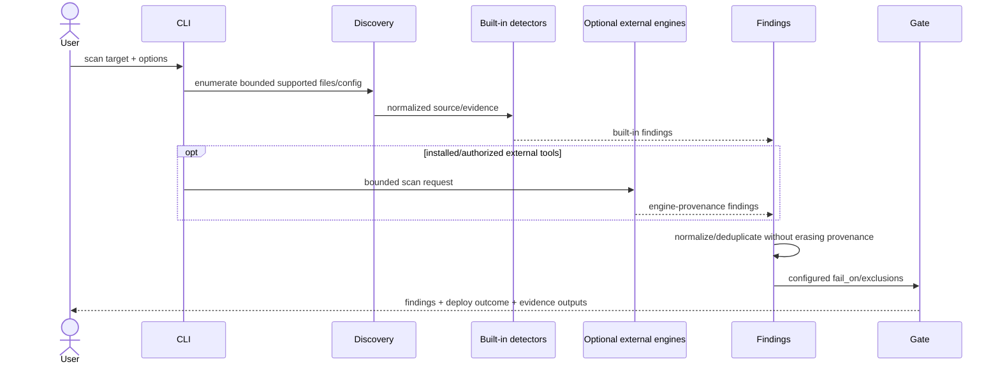
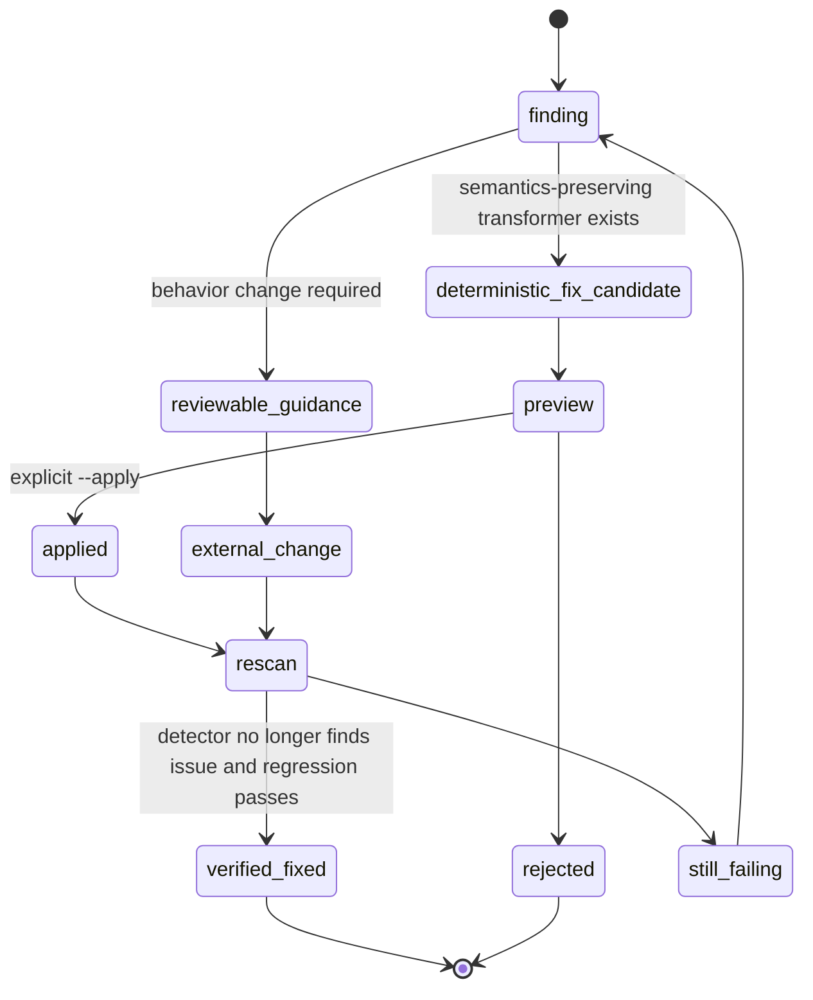
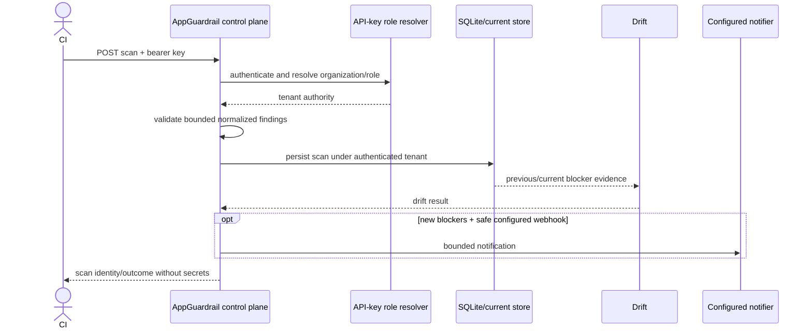
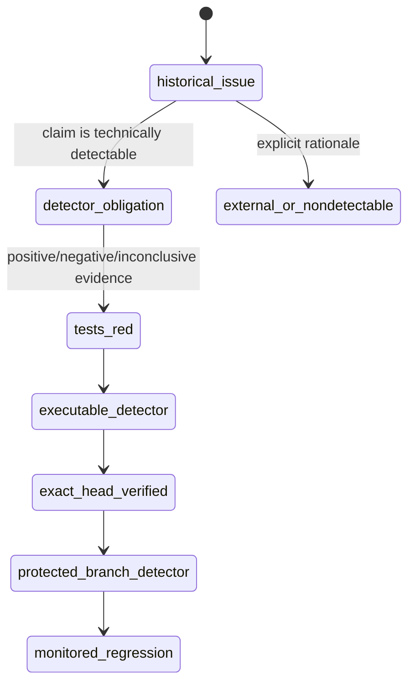
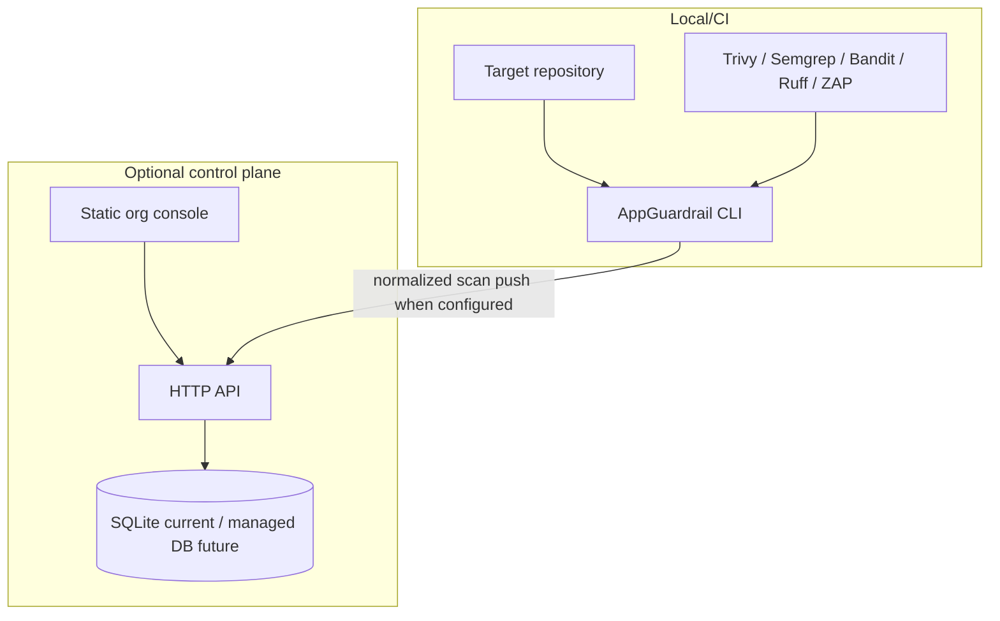
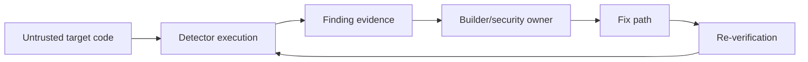

# AppGuardrail UML and Runtime Views

**Status:** Accepted cross-cutting diagrams; active-PR boundaries labelled.  
**Last reviewed:** 2026-08-09

## Scan sequence



## Issue-obligation sequence — PR #911 active target

```mermaid
sequenceDiagram
    participant Inventory as Independent issue inventory
    participant Registry as Obligation registry
    participant Adapter as Detector adapter
    participant Detector as Actual executable detector
    participant Evidence as Closed/authenticated evidence

    Inventory->>Registry: retained issue/claim identities
    Registry->>Registry: map each to detector family/obligation
    Registry->>Adapter: detector obligation
    Evidence->>Adapter: evidence only; no expected answer
    Adapter->>Detector: execute real detector
    Detector-->>Adapter: finding / clean / inconclusive
    Adapter-->>Registry: obligation result + evidence digest
```

The registry cannot create `PASS` by declaring an issue `implemented` or by embedding the expected finding in fixture metadata.

## Safe remediation state machine



## Control-plane scan ingestion sequence



## Detection maturity state



PR/issue text alone does not move a claim to `protected_branch_detector`.

## Deployment view



## Authority flow



A finding can trigger guidance but does not grant mutation authority. A clean rerun plus required repository gates is the verification loop.

## Maintenance rule

When a new scanner, persistent service, detection-obligation class, outbound executor, fix authority, or tenant boundary changes, update these diagrams with PRD/TRD/Architecture/ERD/Threat/Test/Operability/ADR/Traceability in the same reviewed change.