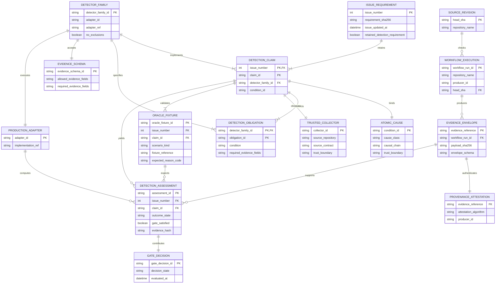
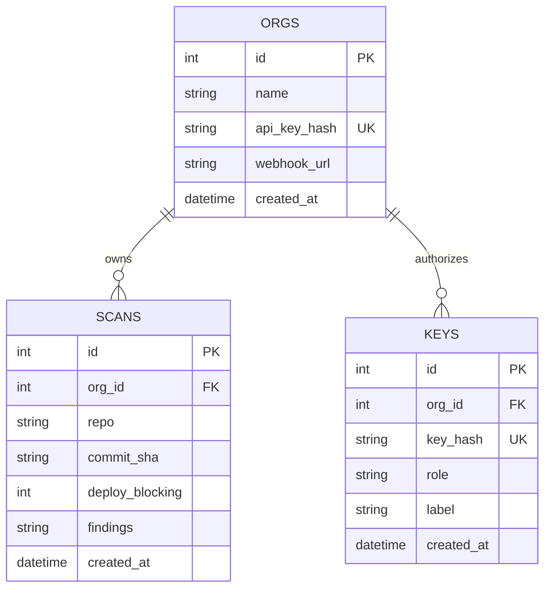
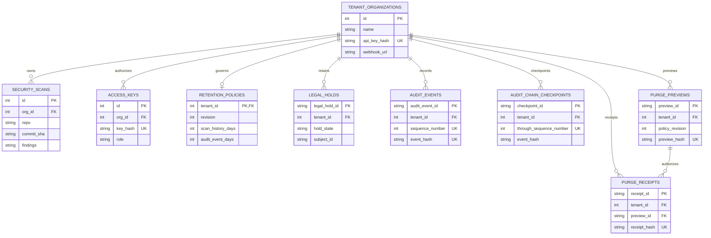

# AppGuardrail evidence and persistence models

This model explains evidence authority and traceability. It is not a claim that
these entities are database tables. The protected-main control plane persists
its current SQLite `orgs`, `keys`, and `scans` schema. The issue-derived model
below is accepted target architecture: PR #911 currently persists only issue
identity, generic claim/family mapping, contracts, fixtures, and digests. It
does not yet persist claim-specific cause, collector, oracle, or evidence links.

## Conceptual ERD

`claim_id` repeats across issues: 417 rows currently contain only 20 unique
claim IDs. The target key is therefore the composite `(issue_number, claim_id)`
until a globally unique `cause_id` is introduced.

`obligation_id` also repeats across families: the registry has 140 obligation
rows but only 104 distinct bare IDs. Its target key is the composite
`(detector_family_id, obligation_id)`, which is unique for all 140 rows.
`ORACLE_FIXTURE` and `DETECTION_ASSESSMENT` use the composite foreign key
`(issue_number, claim_id)` to `DETECTION_CLAIM`; neither column is a valid
standalone claim reference.

## Protected-main legacy physical ERD

`appguardrail_core.controlplane.connect()` currently creates and uses this
legacy runtime schema on protected `develop`:

## Canonical v2 migration schema

`appguardrail_core.controlplane_schema` defines and tests this migration target,
but the primary control-plane `connect()`/HTTP path does not yet invoke it.
Schema availability is implemented; application integration, purge execution,
and protected-main operational proof remain `PARTIAL`.

The current DDL does not declare `purge_receipts.preview_id` unique, so one
preview can reference zero or many receipts. If the product chooses a strict
one-preview/one-receipt idempotency invariant, that requires a schema migration
and tests; the ERD must not claim it before the constraint exists.

## Persistence boundary

- Persisted by the current runtime: legacy `orgs`, `scans`, and `keys`, including
  role-scoped API-key hashes, findings JSON, drift, and webhook configuration.
- Defined by the v2 migration module but not integrated into the main runtime:
  canonical names, retention policy, legal hold, append-only audit,
  checkpoints, purge previews/receipts, and schema versioning.
- Packaged configuration in `ACTIVE_PR`: issue requirements, claims, detector
  families, obligations, evidence schemas, fixtures, adapter references, and
  requirement digests in `issue_detection_registry.json`.
- Runtime only: source logs, HMAC capability, evidence envelopes, adapter
  assessments, and gate aggregation unless an authorized consumer stores them.
- Never persisted by this contract: raw secrets, raw authorized source logs, or
  attestation keys.

The conceptual entity names use descriptive multiword snake_case. Existing
one-word SQLite table names remain the protected-main runtime schema; the v2
migration is not evidence that the serving path has adopted them.

## Invariants

These are release-target invariants, not a claim about the active PR:

1. Every `issue_requirement` has at least one cause-bound `detection_claim`.
2. Every claim resolves to a trusted collector, native `production_adapter`,
   and independent oracle through a closed `detector_family`.
3. Every obligation has independent vulnerable, fixed, near-miss, malformed,
   partial, and unknown executions outside the production registry.
4. Runtime authority comes from evidence schema and provenance, never from the
   issue requirement.
5. `source_revision`, `workflow_execution`, and `evidence_envelope` identities
   are distinct and cannot substitute for each other.
6. A `gate_decision` cannot be satisfied by unknown, dependency failure,
   reporting failure, or confirmed finding.

Current gap: 0/414 issues meet the first cause-bound invariant and 0/417 claims
have independently validated direct-detector efficacy.
