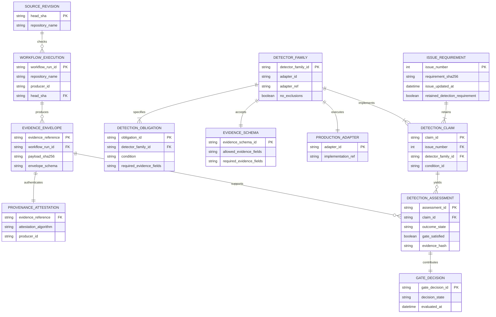

# AppGuardrail conceptual evidence model

This model explains evidence authority and traceability. It is not a claim that
these entities are database tables. The protected-main control plane persists
its current SQLite `orgs`, `keys`, and `scans` schema; the issue-derived model
below is immutable registry plus runtime data in PR #911.

## Conceptual ERD

## Persistence boundary

- Persisted today: tenant organizations, role-scoped API-key hashes, scan
  records, findings JSON, drift metadata, webhook configuration, and schema
  versioning in the control-plane SQLite store.
- Packaged configuration in `ACTIVE_PR`: issue requirements, claims, detector
  families, obligations, evidence schemas, fixtures, adapter references, and
  requirement digests in `issue_detection_registry.json`.
- Runtime only: source logs, HMAC capability, evidence envelopes, adapter
  assessments, and gate aggregation unless an authorized consumer stores them.
- Never persisted by this contract: raw secrets, raw authorized source logs, or
  attestation keys.

The conceptual entity names use descriptive multiword snake_case. Existing
one-word SQLite table names are legacy protected-main schema and require a
separate migration ADR; this PR does not silently rename persisted objects.

## Invariants

1. Every `issue_requirement` has at least one `detection_claim`.
2. Every claim resolves to one callable `production_adapter` through a closed
   `detector_family`.
3. Every obligation has positive, negative, and unknown executions.
4. Runtime authority comes from evidence schema and provenance, never from the
   issue requirement.
5. `source_revision`, `workflow_execution`, and `evidence_envelope` identities
   are distinct and cannot substitute for each other.
6. A `gate_decision` cannot be satisfied by unknown, dependency failure,
   reporting failure, or confirmed finding.
