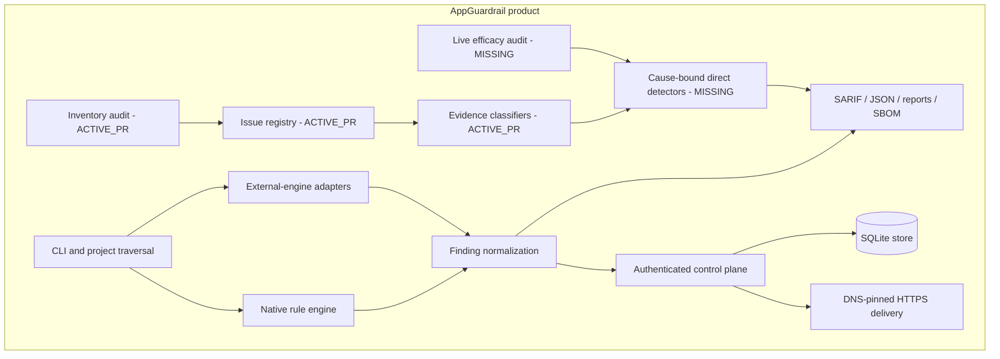
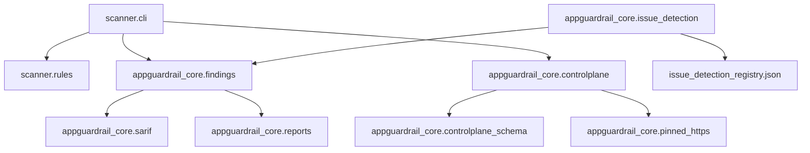
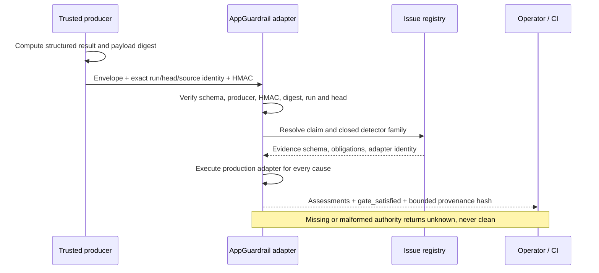
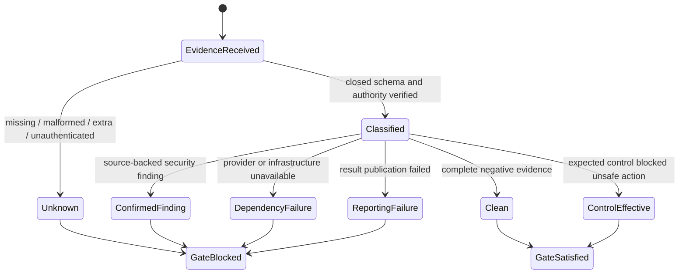
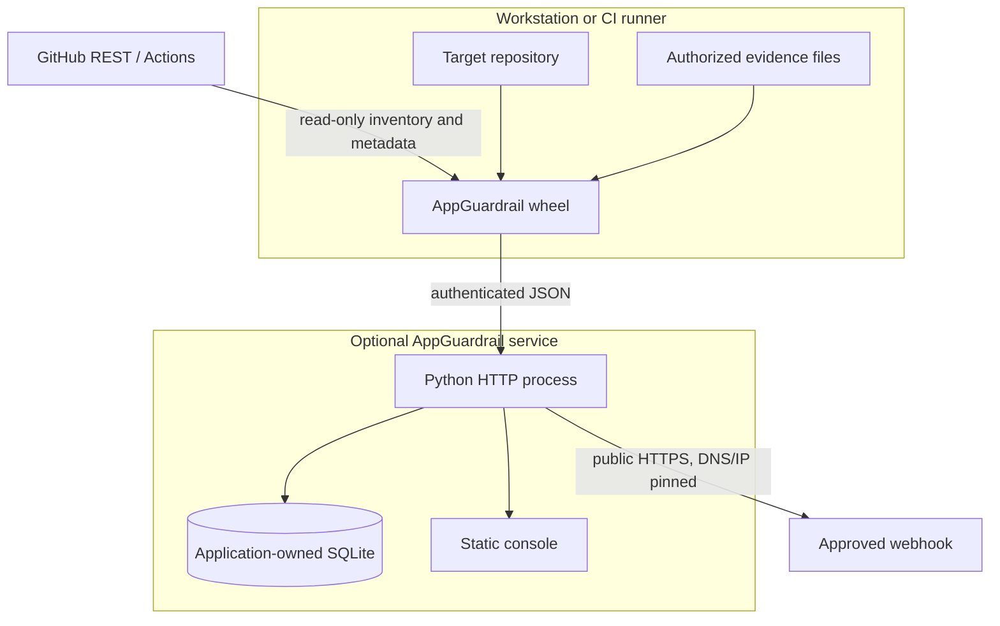
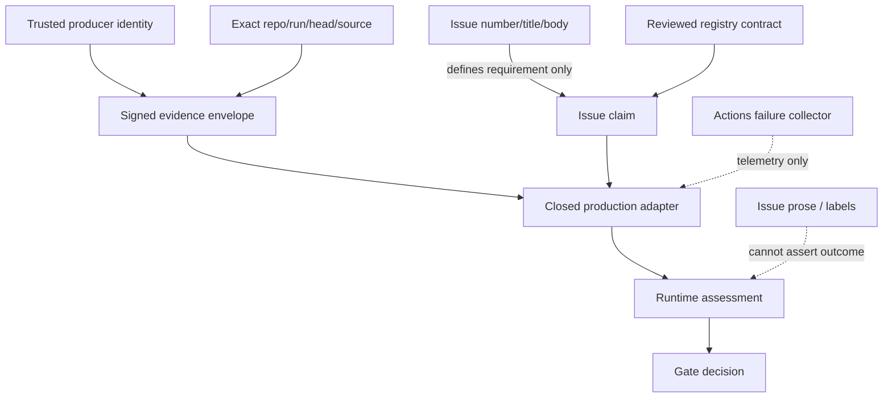

# AppGuardrail UML views

The diagrams are architecture-as-code. Components are labeled
`IMPLEMENTED`, `ACTIVE_PR`, or `MISSING`; target sequences do not claim a
current call path.

## Component diagram

## Package diagram

## Sequence diagram

This is the accepted target sequence. PR #911 stops at generic classifier
execution because claim-specific collectors, direct detectors, and independent
oracles are not yet bound.

## State diagram

## Deployment diagram

## Authority diagram

