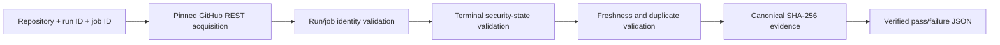

# GitHub Actions Source-Authoritative Evidence

**Maturity:** bounded production vertical slice  
**Implementation:** `appguardrail_core.github_actions_evidence`  
**CLI:** `appguardrail-actions-evidence`  
**Related:** issue #938, PR #939, ADR-0007

## What the buyer can verify

Use this interface when the security decision must prove which GitHub Actions run and job produced it. The verifier contacts GitHub directly and returns a source-bound result; it does not accept a caller's `passed=true` or `failed=true` field as detector truth.



Each successful evidence object identifies:

- the exact repository;
- workflow and job names;
- run and job IDs;
- head commit SHA;
- branch and triggering event;
- exact GitHub run/job URLs;
- terminal job conclusion;
- failed step numbers;
- source update and observation times;
- a deterministic source digest;
- the probe and acquirer contract versions.

## Run it

Set a least-privilege token with **Actions: read** for the target private repository. Public resources can be read without that permission, but the CLI intentionally requires an explicit token so production invocation does not silently change its authentication model.

```bash
export APPGUARDRAIL_GITHUB_TOKEN='github_pat_...'

appguardrail-actions-evidence \
  --repository ContextualWisdomLab/.github \
  --run-id 30769144488 \
  --job-id 91553355284
```

Interpret the exit code before taking the next action:

| Exit | Meaning | Operator action |
|---:|---|---|
| `0` | Source-verified security pass | Persist the JSON evidence and continue the protected workflow. |
| `1` | Source-verified security failure | Persist the JSON evidence, open or update the incident/remediation record, and block the affected gate. |
| `2` | Evidence unavailable or invalid | Do not infer pass or failure; fix source identity, permissions, freshness, or availability and retry. |

A historical replay must use an explicitly expanded but still bounded freshness window:

```bash
appguardrail-actions-evidence \
  --repository ContextualWisdomLab/.github \
  --run-id 30769144488 \
  --job-id 91553355284 \
  --max-age-hours 720
```

Reject a source object already processed by the caller's immutable digest ledger:

```bash
appguardrail-actions-evidence \
  --repository ContextualWisdomLab/.github \
  --run-id 30769144488 \
  --job-id 91553355284 \
  --seen-source-digest "$ALREADY_RECORDED_SHA256"
```

## Evidence schema example

```json
{
  "schema_version": "1.0",
  "probe_ref": "github_actions_job_v1",
  "acquirer_ref": "github_rest_api_v2022_11_28",
  "repository": "ContextualWisdomLab/.github",
  "workflow_name": "OpenCode Review Dispatch current-head",
  "job_name": "opencode-review",
  "run_id": 30769144488,
  "job_id": 91553355284,
  "head_sha": "2a83043b0239ba827153c934f87e469dba4f96f0",
  "branch_name": "main",
  "event_name": "repository_dispatch",
  "run_url": "https://github.com/ContextualWisdomLab/.github/actions/runs/30769144488",
  "job_url": "https://github.com/ContextualWisdomLab/.github/actions/runs/30769144488/job/91553355284",
  "job_conclusion": "failure",
  "detector_state": "failure",
  "failed_step_numbers": [19],
  "source_updated_at": "2026-08-02T23:44:00Z",
  "observed_at": "2026-08-03T00:00:00Z",
  "source_digest_sha256": "<64 lowercase hexadecimal characters>"
}
```

The digest covers a canonical projection of the authoritative run and job objects. It deliberately excludes `observed_at`, bearer credentials, raw logs, annotations, runner names, and unrestricted response fields. Re-observing unchanged source data therefore yields the same source digest.

## Security and privacy boundary

### Controls applied by the acquirer

- exact HTTPS API origin: `https://api.github.com`;
- no redirect following;
- exact versioned API header: `2022-11-28`;
- allowed Actions resource paths only;
- 30-second request timeout;
- 2 MiB response maximum;
- JSON media type and JSON object required;
- exact repository/run/job URL and identifier binding;
- 40-hex head SHA binding;
- completed run, job, and step states only;
- security-relevant workflow or job name required;
- future, stale, malformed, unsupported, and duplicate evidence rejected;
- sanitized acquisition errors that do not repeat the token or response body.

### PII without indiscriminate masking

AppGuardrail does not treat blanket masking as the default control because removing actor, repository, or audit identity can make authorized incident response unusable. Apply these controls at the persistence and control-plane layer instead:

1. isolate evidence by tenant and authorized repository scope;
2. use least-privilege Actions-read credentials and short credential lifetimes;
3. encrypt evidence in transit and at rest with tenant-aware key policy;
4. bind collection to a documented security or audit purpose;
5. authorize fields and exports by role;
6. retain only bounded run/job metadata required for the decision;
7. log immutable access, export, deletion, and replay events;
8. apply legal hold and retention policy without changing the evidence digest;
9. avoid raw logs unless a separate, reviewed log-evidence acquirer is used.

## Failure diagnosis

| Error pattern | Likely cause | Next action |
|---|---|---|
| `missing_token` | CLI credential absent | Provide an Actions-read token through the environment, not the command line. |
| `HTTP 403` | token lacks access or policy denies access | Confirm repository scope and Actions-read permission. |
| run/job URL mismatch | wrong repository or identifier | Copy the exact run and job IDs from the same GitHub run. |
| non-security evidence | selected build is not classified as a security workflow/job | Use the actual security job or extend the reviewed security-name taxonomy separately. |
| future-dated evidence | source clock exceeds the trusted observation clock | Correct clock synchronization or supply a verified observation time through the library interface. |
| stale evidence | freshness window too narrow for the intended replay | Increase `--max-age-hours` only for the approved replay period. |
| duplicate digest | source object was already ingested | Reuse the prior evidence record instead of creating a second decision. |
| response limit or invalid JSON | upstream proxy/error body or unexpected API behavior | Diagnose network controls; do not treat the result as pass. |

## Test and release evidence

The exact-head gate runs:

```bash
python -m pytest -q \
  tests/test_github_actions_evidence.py \
  tests/test_github_actions_evidence_edges.py \
  tests/test_github_actions_evidence_validation_edges.py \
  tests/test_github_actions_evidence_docstrings.py
```

Coverage.py 7.15.4 is checked out at verified source commit `4c0e7ff425ecbb33e2b994b41118a71eb4e39021` and runs without an unpinned PyPI resolution:

```bash
PYTHONPATH="$PWD/.tools/coveragepy:$PWD" \
  python -m coverage run --branch -m pytest -q <focused tests>

PYTHONPATH="$PWD/.tools/coveragepy:$PWD" \
  python -m coverage report \
    --include='appguardrail_core/github_actions_evidence.py' \
    --precision=2 \
    --show-missing \
    --fail-under=100
```

The merge gate requires 100% statements, 100% branches, complete shipped-symbol docstrings, the full repository test matrix, `appguardrail-scan`, SAST, CodeQL, dependency/supply-chain checks, and an independent current-head approval.

## Requirement traceability

| Issue #938 requirement | Production symbol | Verification |
|---|---|---|
| authoritative acquisition | `GitHubApiClient.get_json`, `acquire_actions_job` | client and exact-endpoint tests |
| explicit probe/acquirer | `PROBE_REF`, `ACQUIRER_REF` | failure fixture assertion |
| source identity | `verify_actions_job` | run/job URL, ID, SHA mismatch tests |
| fail closed | validation and acquisition error types | malformed, stale, future, duplicate, unfinished, wrong-origin tests |
| independent historical shape | #815-shaped run/job fixture | source projection and expected outcome assertions |
| production CLI | `main`, console script | pass/failure/error exit-code tests |
| token protection | `GitHubApiClient` bounded output/errors | token non-disclosure tests |
| 100% coverage/docstrings | dedicated exact-head workflow | coverage and AST docstring gates |
| architecture and operations | ADR-0007, this guide, `ARCHITECTURE.md` | documentation review |

## Scope boundary

This slice proves one reusable GitHub Actions source-evidence contract. It does not claim direct detector efficacy for every historical issue or scanner family. Add the next detector only after identifying its authoritative source, creating an independent oracle, proving true/false/adversarial cases, and integrating it through a real production entrypoint.

## References

GitHub. (2026). *REST API endpoints for workflow jobs*. GitHub Docs. https://docs.github.com/en/rest/actions/workflow-jobs

Joint Task Force. (2020). *Security and privacy controls for information systems and organizations* (NIST Special Publication 800-53 Rev. 5, Release 5.2.0). National Institute of Standards and Technology. https://doi.org/10.6028/NIST.SP.800-53r5

Souppaya, M., Scarfone, K., & Dodson, D. (2022). *Secure software development framework (SSDF) version 1.1: Recommendations for mitigating the risk of software vulnerabilities* (NIST Special Publication 800-218). National Institute of Standards and Technology. https://doi.org/10.6028/NIST.SP.800-218

Supply-chain Levels for Software Artifacts. (2026). *SLSA specification version 1.2*. Linux Foundation. https://slsa.dev/spec/v1.2/

Bray, T. (Ed.). (2017). *The JavaScript Object Notation (JSON) data interchange format* (RFC 8259). Internet Engineering Task Force. https://doi.org/10.17487/RFC8259
