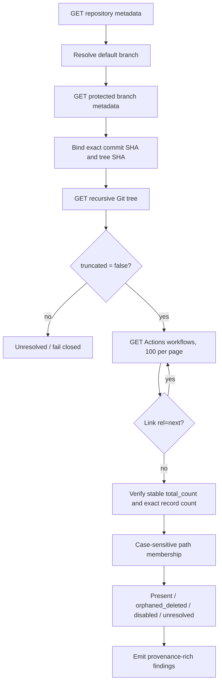

# GitHub Actions Workflow Registry Evidence

**Status:** Active implementation for issue #929; not shipped on protected `develop` until merge.  
**Boundary:** Read-only governance detector. It never enables, disables, recreates, deletes, or edits a GitHub Actions workflow.

## Purpose

Deleting a workflow file does not, by itself, prove that the corresponding GitHub Actions registry identity is inactive. AppGuardrail therefore binds the live Actions workflow registry to one exact protected default-branch commit and its recursive Git tree. The detector reports an active registry identity as `orphaned_deleted` only when the exact case-sensitive workflow path is absent from that source-bound tree.

This control is evidence-oriented rather than name-oriented. Words such as `once`, `apply`, `finalize`, `repair`, `bootstrap`, and `writer` increase triage priority, but a live workflow file with one of those words is not an orphan. Conversely, an active workflow whose exact path is absent is an orphan even if its name has no temporary-writer hint.

## Evidence flow



The source sequence is deliberately ordered:

1. `GET /repos/{owner}/{repo}` supplies the repository identity and current default branch.
2. `GET /repos/{owner}/{repo}/branches/{branch}` must identify that same branch as protected and supplies the exact commit SHA plus tree SHA.
3. `GET /repos/{owner}/{repo}/git/trees/{tree_sha}?recursive=1` supplies the source paths. `truncated: false` is mandatory for a complete result.
4. `GET /repos/{owner}/{repo}/actions/workflows?per_page=100` supplies the registry. Further pages are followed only from GitHub's `Link` header and only when they stay on the fixed `api.github.com` origin and same repository path.
5. The page `total_count` must remain stable and equal the number of collected records. Duplicate workflow IDs, unsupported record shapes, or future unknown states prevent a clean inventory.
6. Active source-backed records are compared with the exact tree. Validated `dynamic/...` records owned by GitHub services remain explicitly `dynamic_managed`; they are not repository files and therefore are not source-orphan candidates. Disabled records remain explicitly disabled. Unknown registry states remain unresolved.
7. Repository and protected-branch metadata are fetched again after registry pagination. A changed default branch, commit SHA, tree SHA, protection state, or repository identity makes the inventory incomplete.

## Classification contract

| Registry evidence | Exact source path | Result | Scanner action |
|---|---|---|---|
| `active` | present | `present` | no finding |
| `active` | absent | `orphaned_deleted` | WARNING with exact workflow/source provenance |
| `active` with validated `dynamic/...` path | not applicable | `dynamic_managed` | no source-orphan finding |
| state beginning with `disabled` | present or absent | `disabled` | no orphan finding |
| unknown/future state | any | `unresolved` | WARNING plus incomplete-inventory finding |
| incomplete or untrusted source evidence | unknown | inventory incomplete | WARNING; never clean |

The orphan finding includes workflow ID, workflow name, exact path, registry state, repository, default branch, protected branch commit SHA, recursive tree SHA, verification timestamp, and a read-only remediation. The remediation directs a trusted operator to confirm the source absence and use GitHub's workflow lifecycle API; it explicitly tells the operator not to recreate a deleted writer file merely to clean up registry state.

## Fail-closed boundaries

AppGuardrail refuses to infer a clean state when any material evidence boundary is ambiguous:

- repository identity or default branch does not match the requested repository;
- the current default branch is not reported as protected;
- commit or tree SHA is missing or malformed;
- the recursive tree is truncated, has the wrong SHA, or has an unsupported shape;
- workflow pages are absent, malformed, count-inconsistent, duplicated, or incomplete;
- HTTP 403/404/5xx, DNS/transport failure, timeout, non-JSON response, malformed JSON, or oversized response occurs;
- a redirect or pagination URL leaves the fixed GitHub API origin/repository boundary;
- pagination cycles or exceeds the bounded page limit;
- GitHub introduces a workflow state that this version does not understand.
- repository/default-branch/protected-branch identity changes during collection.

A 404 is therefore evidence unavailability in the collector, not proof that the entire inventory or repository is clean. Likewise, a truncated recursive tree cannot be used to declare that a workflow path is absent.

## Security and privacy

The implementation uses Python's standard library and a fixed HTTPS GitHub API origin. Redirects are rejected. JSON bodies are bounded before parsing. Pagination URLs are origin- and repository-scoped. An optional GitHub token is read from an environment variable and added only to the outbound Authorization header; it is not placed in findings, logs, serialized inventory output, or remediation text.

The detector is read-only by construction. Its production module contains no workflow mutation endpoint. This separation lets an untrusted CI scan surface governance evidence without granting the scan job authority to disable automation.

## False-positive and false-negative boundaries

**False-positive controls.** Exact case-sensitive source membership is authoritative for source-backed classification. GitHub-managed records use validated `dynamic/<owner>/<workflow>` paths and are reported separately rather than compared with repository files. A workflow name containing `once` or another writer-like word is not sufficient to alert when its file is present. Disabled registry records are not reported as active orphans. Historical commits are not used to override the current protected default-branch tree.

**False-negative controls.** Missing permissions, transient GitHub failures, tree truncation, pagination defects, default-branch movement, unknown states, and malformed payloads all become unresolved/incomplete rather than clean. This detector covers GitHub Actions workflow registry identities only; it does not claim visibility into external schedulers, GitHub Apps, cloud cron systems, or automation outside the repository's Actions registry.

## Operator interface

Run the production module directly:

```bash
python -m appguardrail_core.github_workflow_registry ContextualWisdomLab/appguardrail
```

By default the collector reads a token from `GITHUB_TOKEN`. `--token-env NAME` selects a different environment variable without exposing the token in output.

Exit status is deterministic:

- `0`: complete inventory with no active orphan;
- `1`: complete inventory containing at least one confirmed active orphan;
- `2`: incomplete or unresolved inventory.

JSON output includes `schema_version`, the source-bound inventory, and normalized governance findings suitable for preservation with buyer-diligence or incident evidence.

## Verification

The regression suite in `tests/test_github_workflow_registry.py` exercises the production entrypoint's evidence boundary, including:

- active present workflow whose name contains `once`;
- active deleted workflow;
- disabled orphan;
- path case difference;
- GitHub-managed Copilot, Dependabot, and CodeQL dynamic workflow paths;
- protected/default-branch identity movement;
- default-branch or protected commit movement during pagination;
- recursive-tree truncation;
- changing or incomplete workflow counts;
- duplicate workflow IDs and malformed records;
- HTTP 403, 404, 500, DNS/transport failures;
- non-JSON, malformed JSON, and oversized responses;
- hostile, malformed, cyclic, and overlong pagination;
- API-version and Authorization header propagation;
- CLI clean/orphan/unresolved exit behavior.

The implementation was developed test-first. The initial regression failed because the production module did not exist. The focused production module then reached 100% statement and branch coverage in the local verification environment before the PR was opened. Repository-wide and protected-branch claims remain pending until exact-head CI and independent review succeed.

## Traceability

- Collector incident: issue #929.
- Production implementation: `appguardrail_core/github_workflow_registry.py`.
- Adversarial regression evidence: `tests/test_github_workflow_registry.py`.
- Cross-cutting promotion status: `docs/TRACEABILITY.md`.
- Post-integration operational cleanup remains separate: a trusted operator must disable confirmed orphan registry identities and repeat the live inventory. The detector itself does not close that operational step.

## References

GitHub. (2026). *API versions*. GitHub Docs. https://docs.github.com/en/rest/about-the-rest-api/api-versions

GitHub. (2026). *REST API endpoints for Git trees*. GitHub Docs. https://docs.github.com/en/rest/git/trees?apiVersion=2026-03-10

GitHub. (2026). *REST API endpoints for workflows*. GitHub Docs. https://docs.github.com/en/rest/actions/workflows?apiVersion=2026-03-10

GitHub. (2026). *Using pagination in the REST API*. GitHub Docs. https://docs.github.com/en/rest/using-the-rest-api/using-pagination-in-the-rest-api?apiVersion=2026-03-10
