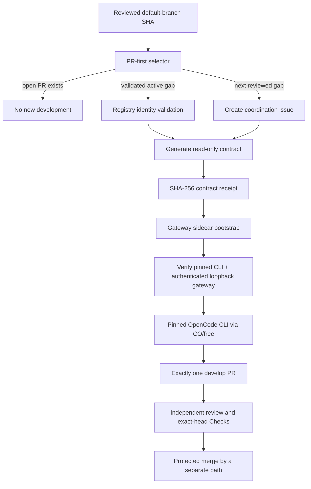

# Hourly OpenCode commercial-readiness agent

AppGuardrail runs one bounded commercial-readiness pass at `17 * * * *`. The workflow is PR-first: it does not start a buyer-visible product slice while any pull request is open. When the pull-request queue is empty, it either selects an existing validated commercial issue or creates the next issue from the reviewed default-branch `COMMERCIAL_GAPS` registry.

## Security and trust boundary

The default branch is the only source of task authority. The workflow checks out the exact scheduled or manually selected default-branch SHA with persisted checkout credentials disabled. A feature branch, pull-request event, issue body, issue comment, model response, downloaded document, or webpage cannot define or widen the model task.

GitHub issue title, body, and comments are **untrusted observations**. The selector accepts an active issue only when it has exactly one known hidden registry marker and its title exactly matches the reviewed registry entry. Unknown, duplicated, or mismatched identities fail closed before any gateway provider credential is exposed.

Before the model step, the workflow creates `.commercial-agent-contract.md` from the reviewed registry. The file contains the gap identifier, objective, acceptance criteria, engineering constraints, issue number, and protected handoff rules. The workflow makes it read-only, records its SHA-256 digest, and instructs the agent to verify that digest. `.commercial-agent-contract.md` is the sole task authority below repository policy files.

The development model does not read the issue title, body, or comments. The selector validates the issue marker and exact title before contract generation; the model receives only the positive issue number embedded in the trusted contract for human-visible tracking and the `Closes #<number>` pull-request reference.

## Credentials and provider

OpenCode uses the organization-owned contextual-orchestrator gateway. GitHub Actions gives the sidecar any available `BYTEZ_API_KEY`, `NVIDIA_NIM_API_KEY`, `NVIDIA_NIM_API_KEY_SUB`, `OPENROUTER_API_KEY`, and `OPENAI_API_KEY` only at the trusted sidecar bootstrap step. OpenCode receives an ephemeral loopback `CONTEXTUAL_ORCHESTRATOR_TOKEN`, never a provider credential.

The central sidecar is expected to copy provider credentials into its process-local credential store and scrub the bootstrap variables before model-controlled work can run. The immutable pin used by this change does not yet prove that scrub: `ContextualWisdomLab/.github#1742` tracks the owner-side RED/GREEN repair. This consumer is not merge-ready until that defect is fixed in an immutable central revision and this workflow bumps to the repaired pin.

`COPILOT_GITHUB_TOKEN` must never be configured, referenced, or used by this scheduler. The existing review-agent credentials, models, approval rules, and required Checks are independent and must not be changed by the development path.

The model selector is the gateway virtual model:

```text
contextual-orchestrator/orchestrator/free
```

The gateway chooses a currently eligible free route from its discovered catalog. The workflow does not name a provider-specific primary or helper model.

The OpenCode CLI archive is pinned to version `1.18.13` with SHA-256 `8d500b20fed2d26e537e221895b1a575476571b4f0089bb29fb13eeb8eb9e937`. The central gateway boundary is pinned to immutable `ContextualWisdomLab/.github/.github/actions/orchestrator-free-sidecar@73b250f568d8892ead48bff85de06a4e3eb34e93` until the owner-side repair above ships.

The `commercial-builder` primary agent may edit repository files and run bounded shell commands, but it cannot access external directories, web search, web fetch, or nested agents. Its default configuration outside that named agent remains read-only.

## Workflow sequence



The workflow has one non-cancelling single-flight concurrency group. If a run is still active when the next hourly event arrives, GitHub serializes the later run instead of terminating the active OpenCode reasoning or tool-execution slice. The repository does not impose a `timeout-minutes` deadline on the model-backed job; user cancellation, provider termination, platform limits, and explicit administrative termination remain distinct external stop conditions.

Before model execution, `scripts/ci/verify_commercial_gateway_handoff.py` verifies the installed OpenCode version and performs an authenticated `GET /v1/models` against the exported numeric-loopback gateway URL using the sidecar bearer file. Redirects, remote hosts, malformed bearer files, CLI-version drift, invalid JSON, and empty model catalogs fail closed. This is a bounded control-plane handshake, not model inference, so its transport timeout does not terminate reasoning work.

The workflow then records a SHA-256 digest of the gateway bearer before model execution. The post-model disclosure check does not source control-plane shell or reacquire provider secrets; it first proves the bearer file still matches that trusted digest, then scans the result for the gateway bearer. This prevents model-controlled mutation of the loader or bearer file from being treated as trustworthy post-model evidence.

Independent CodeRabbit, OpenCode review, security, and merge workflows may continue after the builder opens its pull request. Review waiting does not grant the builder permission to merge, change credentials, or weaken repository protection.

## Engineering contract

Every generated task requires:

- visible RED-to-GREEN test-first commit ordering;
- exact 100% statement coverage for changed production code;
- complete public and non-obvious-behavior docstrings;
- realistic correctness, tenant-isolation, security, and recovery tests;
- current authoritative primary standards or peer-reviewed evidence for material decisions;
- APA 7th references in operator documentation;
- a `CHANGELOG.d` fragment;
- standalone operation and modular MSA compatibility with ContextualWisdomLab organization infrastructure and naruon;
- contextual-orchestrator reuse only where it creates a clear modular benefit;
- exactly one pull request targeting `develop`;
- no direct merge, tag, publication, release, or branch-protection change.

UI or workflow-experience slices must use Figma or Product Design before implementation when a visual interaction contract is material. Quantitative evidence should use an accessible exact-value representation and Visualize when a chart improves the decision.

## Failure and recovery semantics

The workflow fails closed when any of the following occurs:

- selector output is malformed;
- an active issue has no positive integer number;
- the issue marker is unknown or duplicated;
- the issue title differs from the reviewed registry;
- the trusted contract is empty or cannot be hashed;
- none of the five supported gateway bootstrap credentials is available;
- contextual-orchestrator cannot produce a usable `orchestrator/free` route;
- the pinned OpenCode executable and authenticated gateway handoff cannot be verified;
- the pre-model bearer integrity receipt cannot be produced or the post-model bearer no longer matches it; or
- the agent cannot produce a tested, reviewable PR.

The compatibility reconciliation command is read-only reconciliation. It can report the PR-first or active-gap state after an interrupted pass, but it never adds labels, edits issues, changes credentials, or dispatches another agent. The next hourly run can safely reselect the same validated issue because the workflow creates at most one open product slice and the open-PR gate prevents parallel implementation branches.

Rollback is performed by reverting the scheduler merge on the protected default branch. Existing issues and pull requests remain ordinary GitHub records; disabling the schedule does not rewrite or delete them. The independent manual development and review paths remain available.

## Operational verification

Before merge, the current head must prove:

1. selector and trust-boundary unit tests pass;
2. scheduler production modules touched by the change have exact 100% statement coverage;
3. production docstrings remain complete;
4. workflow syntax and immutable action pins are valid;
5. hourly concurrency is non-cancelling and the model-backed job has no repository-authored elapsed-time deadline;
6. the pinned CLI, token-loader export, authenticated loopback gateway, and bearer-integrity handoff pass executable tests;
7. no direct provider endpoint/model or `COPILOT_GITHUB_TOKEN`/Jules handoff remains;
8. the central provider-environment scrub in `ContextualWisdomLab/.github#1742` is released immutably and this consumer is pinned to it;
9. security, SAST, and repository tests pass on the same head;
10. all review threads are resolved; and
11. a reviewer other than the last pusher approves the same head.

A release is not implied by merging the scheduler. Version promotion and `CHANGELOG.md` release sections require a separately validated product release candidate.

## References

Anomaly. (2026a). *GitHub integration*. OpenCode documentation. https://opencode.ai/docs/github/

Anomaly. (2026b). *Providers: OpenAI-compatible*. OpenCode documentation. https://opencode.ai/docs/providers/

ContextualWisdomLab. (2026). *Contextual Orchestrator gateway contract*. https://github.com/ContextualWisdomLab/contextual-orchestrator

Anomaly. (2026c). *Agents*. OpenCode documentation. https://opencode.ai/docs/agents/

Anomaly. (2026d). *Permissions*. OpenCode documentation. https://opencode.ai/docs/permissions/

GitHub. (2026a). *Automatic token authentication*. GitHub Docs. https://docs.github.com/actions/security-for-github-actions/security-guides/automatic-token-authentication

GitHub. (2026b). *Events that trigger workflows*. GitHub Docs. https://docs.github.com/actions/using-workflows/events-that-trigger-workflows

GitHub. (2026c). *Security hardening for GitHub Actions*. GitHub Docs. https://docs.github.com/actions/security-for-github-actions/security-guides/security-hardening-for-github-actions

GitHub. (2026d). *Using concurrency*. GitHub Docs. https://docs.github.com/actions/using-jobs/using-concurrency

GitHub. (2026e). *Workflow syntax for GitHub Actions*. GitHub Docs. https://docs.github.com/actions/reference/workflows-and-actions/workflow-syntax

GitHub. (2026f). *Actions limits*. GitHub Docs. https://docs.github.com/actions/reference/limits

NVIDIA. (2026). *NVIDIA NIM APIs*. NVIDIA API documentation. https://docs.api.nvidia.com/nim/
