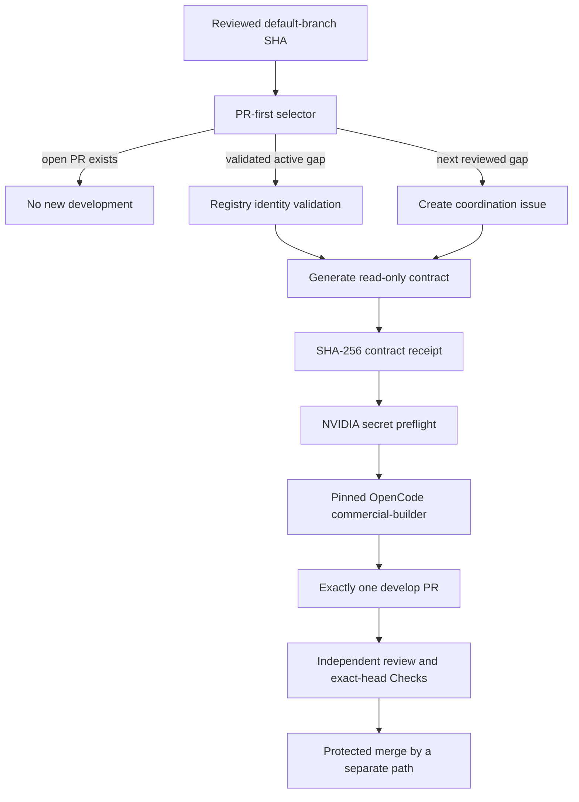

# Hourly OpenCode commercial-readiness agent

AppGuardrail runs one bounded commercial-readiness pass at `17 * * * *`. The workflow is PR-first: it does not start a buyer-visible product slice while any pull request is open. When the pull-request queue is empty, it either selects an existing validated commercial issue or creates the next issue from the reviewed default-branch `COMMERCIAL_GAPS` registry.

## Security and trust boundary

The default branch is the only source of task authority. The workflow checks out the exact scheduled or manually selected default-branch SHA with persisted checkout credentials disabled. A feature branch, pull-request event, issue body, issue comment, model response, downloaded document, or webpage cannot define or widen the model task.

GitHub issue title, body, and comments are **untrusted observations**. The selector accepts an active issue only when it has exactly one known hidden registry marker and its title exactly matches the reviewed registry entry. Unknown, duplicated, or mismatched identities fail closed before `NVIDIA_NIM_API_KEY` is exposed.

Before the model step, the workflow creates `.commercial-agent-contract.md` from the reviewed registry. The file contains the gap identifier, objective, acceptance criteria, engineering constraints, issue number, and protected handoff rules. The workflow makes it read-only, records its SHA-256 digest, and instructs the agent to verify that digest. `.commercial-agent-contract.md` is the sole task authority below repository policy files.

The workflow deliberately does **not** ask the model to read the issue as instruction. The issue number is used only as a human-visible tracking identity, marker-verification target, and `Closes #<number>` reference.

## Credentials and provider

OpenCode uses its built-in `nvidia` provider. GitHub Actions maps the organization secret `NVIDIA_NIM_API_KEY` to the provider variable `NVIDIA_API_KEY` only for the credential preflight and the pinned OpenCode action.

`COPILOT_GITHUB_TOKEN` must never be configured, referenced, or used by this scheduler. The existing review-agent credentials, models, approval rules, and required Checks are independent and must not be changed by the development path.

The primary model is:

```text
nvidia/nvidia/llama-3.3-nemotron-super-49b-v1.5
```

The bounded helper model is:

```text
nvidia/meta/llama-3.3-70b-instruct
```

The GitHub integration is pinned to immutable commit:

```text
anomalyco/opencode/github@77fc88c8ade8e5a620ebbe1197f3a572d29ae91a
```

The `commercial-builder` primary agent may edit repository files and run bounded shell commands, but it cannot access external directories, web search, web fetch, or nested agents. Its default configuration outside that named agent remains read-only.

## Workflow sequence



The workflow has a single-flight concurrency group and does not cancel an in-progress pass. The job timeout is 55 minutes, which keeps each hourly execution bounded while allowing substantial test and documentation work. Central OpenCode review may independently take longer; review waiting does not grant the builder permission to merge or alter protection rules.

## Engineering contract

Every generated task requires:

- visible RED-to-GREEN test-first commit ordering;
- exact 100% statement coverage for changed production code;
- complete public and non-obvious-behavior docstrings;
- realistic correctness, tenant-isolation, security, and recovery tests;
- current authoritative primary standards or peer-reviewed evidence for material decisions;
- APA 7th references in operator documentation;
- a `CHANGELOG.d` fragment;
- standalone operation and modular MSA compatibility with ContextualWisdomLab organization infrastructure and naruon;
- contextual-orchestrator reuse only where it creates a clear modular benefit;
- exactly one pull request targeting `develop`;
- no direct merge, tag, publication, release, or branch-protection change.

UI or workflow-experience slices must use Figma or Product Design before implementation when a visual interaction contract is material. Quantitative evidence should use an accessible exact-value representation and Visualize when a chart improves the decision.

## Failure and recovery semantics

The workflow fails closed when any of the following occurs:

- selector output is malformed;
- an active issue has no positive integer number;
- the issue marker is unknown or duplicated;
- the issue title differs from the reviewed registry;
- the trusted contract is empty or cannot be hashed;
- `NVIDIA_NIM_API_KEY` is missing;
- OpenCode cannot use the selected NVIDIA model;
- the agent cannot produce a tested, reviewable PR.

The compatibility reconciliation command is read-only. It can report the PR-first or active-gap state after an interrupted pass, but it never adds labels, edits issues, changes credentials, or dispatches another agent. The next hourly run can safely reselect the same validated issue because the workflow creates at most one open product slice and the open-PR gate prevents parallel implementation branches.

Rollback is performed by reverting the scheduler merge on the protected default branch. Existing issues and pull requests remain ordinary GitHub records; disabling the schedule does not rewrite or delete them. The independent manual development and review paths remain available.

## Operational verification

Before merge, the current head must prove:

1. selector and trust-boundary unit tests pass;
2. both scheduler modules have exact 100% statement coverage;
3. production docstrings remain complete;
4. workflow syntax and immutable action pins are valid;
5. no `COPILOT_GITHUB_TOKEN` or Jules handoff remains;
6. security, SAST, and repository tests pass on the same head;
7. all review threads are resolved;
8. a reviewer other than the last pusher approves the same head.

A release is not implied by merging the scheduler. Version promotion and `CHANGELOG.md` release sections require a separately validated product release candidate.

## References

Anomaly. (2026a). *GitHub integration*. OpenCode documentation. https://opencode.ai/docs/github/

Anomaly. (2026b). *Providers: NVIDIA*. OpenCode documentation. https://opencode.ai/docs/providers/

Anomaly. (2026c). *Agents*. OpenCode documentation. https://opencode.ai/docs/agents/

Anomaly. (2026d). *Permissions*. OpenCode documentation. https://opencode.ai/docs/permissions/

GitHub. (2026a). *Automatic token authentication*. GitHub Docs. https://docs.github.com/actions/security-for-github-actions/security-guides/automatic-token-authentication

GitHub. (2026b). *Events that trigger workflows*. GitHub Docs. https://docs.github.com/actions/using-workflows/events-that-trigger-workflows

GitHub. (2026c). *Security hardening for GitHub Actions*. GitHub Docs. https://docs.github.com/actions/security-for-github-actions/security-guides/security-hardening-for-github-actions

GitHub. (2026d). *Using concurrency*. GitHub Docs. https://docs.github.com/actions/using-jobs/using-concurrency

NVIDIA. (2026). *NVIDIA NIM APIs*. NVIDIA API documentation. https://docs.api.nvidia.com/nim/
