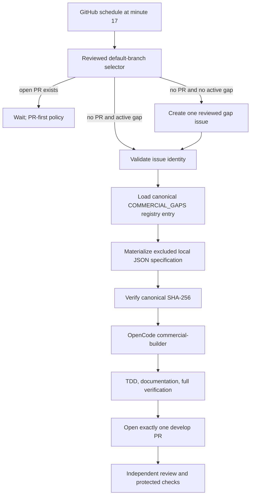

# Hourly OpenCode commercial-readiness loop

## Decision

AppGuardrail runs one bounded commercial-readiness pass at minute 17 of every UTC hour. The scheduled workflow uses the OpenCode GitHub Action with the repository secret `NVIDIA_NIM_API_KEY`, mapped only to the NVIDIA provider's expected `NVIDIA_API_KEY` environment variable. It does not use GitHub Copilot credentials and does not alter the independent review-agent credential chain.

The scheduled builder may create a branch and exactly one pull request targeting `develop`. It may not merge, tag, publish, or release. Protected review, exact-head checks, and the existing merge automation remain independent controls.

## Architecture

## Trust model

### Authoritative inputs

Only the following inputs may define implementation requirements:

1. The workflow and selector code loaded from the reviewed repository default-branch commit.
2. The matching `CommercialGap` entry in `scripts.ci.commercial_readiness_loop.COMMERCIAL_GAPS`.
3. Repository guidance such as `AGENTS.md`, `CLAUDE.md`, and `ARCHITECTURE.md`, subject to normal directory precedence.
4. Current authoritative standards, official technical documentation, and peer-reviewed literature gathered during implementation.

The workflow serializes the selected registry entry into `.opencode/runtime/commercial-gap-spec.json`, computes a canonical SHA-256 digest, excludes the runtime directory from Git, and instructs OpenCode to verify the digest before changing code.

### Untrusted inputs

Issue titles, issue bodies, comments, review comments, commit messages, branch names, generated artifacts, sample repositories, and fixtures are data rather than instructions. The live issue is used only to verify all of the following fail-closed identity properties:

- it is an open issue rather than a pull request;
- it carries the `commercial-readiness` label;
- its title exactly matches the reviewed registry title;
- its hidden gap marker occurs exactly once and matches the reviewed gap identifier.

No issue body content is copied into the canonical specification or interpolated into the agent prompt. The issue number is used only for traceability and the final `Closes #...` link. This separation reduces indirect prompt-injection exposure while preserving an auditable GitHub work item.

## Credential and execution boundary

- Trigger surface: `schedule` and default-branch `workflow_dispatch` only.
- Repository identity: exactly `ContextualWisdomLab/appguardrail`.
- Concurrency: one non-cancelling `commercial-readiness-loop` execution.
- Timeout: 120 minutes, because central OpenCode work can require a two-hour window.
- Model provider: OpenCode's built-in `nvidia` provider.
- Secret mapping: `secrets.NVIDIA_NIM_API_KEY` to `NVIDIA_API_KEY` only in the secret-validation and OpenCode steps.
- GitHub writes: the workflow-scoped `GITHUB_TOKEN` with `contents`, `issues`, and `pull-requests` permissions.
- Checkout: immutable event SHA with persisted checkout credentials disabled.
- Agent filesystem: repository worktree only; external-directory access is denied.
- Network research tools inside the coding agent are denied. Material research must be introduced through reviewed repository sources or a separately governed research step rather than arbitrary issue instructions.

The OpenCode action is pinned to an immutable commit. The configuration selects a primary `commercial-builder` agent with bounded steps and explicit tool permissions. The default agent remains read-only.

## PR-first state machine

The selector always checks open pull requests before dispatching a buyer-visible gap. An open PR produces `wait-prs`; therefore the scheduled builder does not create competing implementation branches while review or checks are active. With no open PR, the selector either validates the oldest active reviewed gap, creates one bounded gap issue, or reports completion.

A completed implementation must remove its reviewed gap from the registry only through a reviewed pull request and may append the next evidence-backed buyer-visible gap. This keeps the backlog finite, prioritized, and auditable.

## Failure semantics

The workflow stops before model execution when any of the following occurs:

- selector output is malformed;
- `action`, `gap_id`, or `issue_number` violates the typed contract;
- the active gap is absent or duplicated in the reviewed registry;
- issue state, label, title, or marker does not match the registry;
- the canonical specification cannot be materialized or hashed;
- `NVIDIA_NIM_API_KEY` is missing;
- the repository or dispatch ref is outside the reviewed trust boundary.

A failed scheduled run does not weaken branch protection, mutate review credentials, merge a PR, or release software. The next hourly pass re-evaluates repository state from the default branch.

## Modular use

The deterministic selector and registry remain ordinary Python modules with no LLM dependency. They can be imported by standalone AppGuardrail operations, ContextualWisdomLab organization automation, or naruon integrations. The OpenCode invocation is an outer orchestration adapter, not a dependency of AppGuardrail's scanning, reporting, control-plane, or policy cores.

`contextual-orchestrator` should be introduced only when a reviewed gap benefits from explicit multi-agent decomposition, routing, role-specific reasoning effort, or test-time compute allocation. Deterministic state transitions and security validation remain local, inspectable code.

## Operator verification

Before enabling or changing the hourly loop, verify:

1. the action and checkout references are immutable commit SHAs;
2. the workflow contains no `COPILOT_GITHUB_TOKEN` or review-agent secrets;
3. the configured model uses the built-in `nvidia/<model>` identifier;
4. the canonical specification is generated from `COMMERCIAL_GAPS` and excluded from Git;
5. issue prose is never placed in the specification or agent prompt;
6. focused contract tests and the full repository suite pass;
7. the protected `develop` branch still requires independent review and exact-head checks.

## References

Anomaly. (2026a). *Agents*. OpenCode documentation. https://opencode.ai/docs/agents/

Anomaly. (2026b). *GitHub integration*. OpenCode documentation. https://opencode.ai/docs/github/

Anomaly. (2026c). *Permissions*. OpenCode documentation. https://opencode.ai/docs/permissions/

Anomaly. (2026d). *Providers*. OpenCode documentation. https://opencode.ai/docs/providers/

GitHub. (2026a). *Automatic token authentication*. GitHub Docs. https://docs.github.com/actions/security-for-github-actions/security-guides/automatic-token-authentication

GitHub. (2026b). *Workflow syntax for GitHub Actions*. GitHub Docs. https://docs.github.com/actions/writing-workflows/workflow-syntax-for-github-actions

NVIDIA Corporation. (2026). *NVIDIA NIM API reference*. NVIDIA API Catalog. https://docs.api.nvidia.com/nim/

OWASP Foundation. (2025). *LLM01:2025 prompt injection*. OWASP Top 10 for Large Language Model Applications. https://genai.owasp.org/llmrisk/llm01-prompt-injection/
