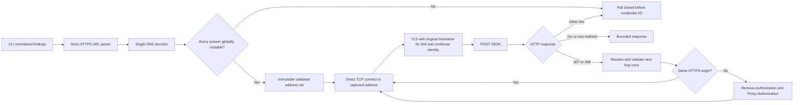

# DNS-pinned control-plane delivery

AppGuardrail sends normalized scan findings to an optional control plane with a bearer credential. That path has a stricter trust boundary than unauthenticated webhook delivery: every initial destination and redirect must use public HTTPS, the exact DNS answers admitted by validation must also be the addresses used by the TCP connection, and the original URL hostname must remain the service identity used for TLS SNI and certificate verification.

This module is independently importable from `appguardrail_core` so standalone installations, ContextualWisdomLab organization services, `naruon`, and other modular MSA consumers can reuse the same transport without importing the scanner CLI.

## Threat model

A preflight-only URL check is insufficient for a credential-bearing request. If the application validates a hostname and the HTTP client resolves it again later, an attacker controlling DNS can return a public address during validation and a private, loopback, link-local, metadata-service, or otherwise disallowed address during connection. This time-of-check/time-of-use difference is a DNS rebinding form of server-side request forgery.

The transport also treats redirects as a new authorization boundary. A redirect may change scheme, host, or port. Credential headers must not follow that change merely because the HTTP library constructs another request.

## Architecture decision

The implementation uses the following contract:

1. Parse an absolute HTTPS URL and reject credentials, fragments, invalid ports—including an explicit port `0`—ASCII control characters, and zone-scoped IPv6 identities before DNS is consulted.
2. Resolve the normalized hostname once with TCP-only `getaddrinfo` parameters.
3. Reject the complete answer set when any returned address is private, loopback, link-local, multicast, unspecified, reserved, non-global, IPv4-mapped IPv6, or zone-scoped.
4. Connect only to the immutable socket addresses captured by that resolver call.
5. Pass the original normalized hostname to `SSLContext.wrap_socket(server_hostname=...)`, preserving TLS SNI and hostname-based certificate verification.
6. Follow only method-preserving HTTP 307 and 308 redirects.
7. Resolve each redirect target exactly once under the same public-address policy.
8. Preserve credential headers only on the same normalized `https` origin. Remove `Authorization` and `Proxy-Authorization` case-insensitively before a cross-origin request.
9. Bound timeout, redirect count, JSON serialization, and response bytes before data is exposed to callers.
10. Return bounded error categories without copying response bodies, credentials, raw socket errors, or tenant data into scanner output.

## Separation from webhook delivery

`appguardrail_core.controlplane._send_alert` remains a generic unauthenticated webhook path. It can preserve its existing public HTTP/HTTPS compatibility and destination policy because it does not carry the AppGuardrail control-plane bearer token. `appguardrail scan --push` uses the dedicated DNS-pinned HTTPS transport. The two policies must not be silently combined.

## Redirect semantics

HTTP 307 and 308 preserve the method and request content. Other 3xx responses are rejected because changing a credential-bearing POST into a GET or applying ambiguous user-agent rewrite behavior would weaken the delivery contract. Relative `Location` values are resolved according to URI reference resolution, then reparsed and revalidated as a new HTTPS destination.

A normalized origin is the tuple `(scheme, hostname, port)`. Explicit port `443` and an omitted HTTPS port are equivalent. Any host or port change removes both sensitive headers by comparing actual header names case-insensitively; this avoids relying on `urllib`'s title-casing behavior.

## TLS service identity

The TCP connection uses the validated IP address, but the TLS handshake continues to use the original hostname. This preserves:

- Server Name Indication for virtual hosting;
- certificate chain validation through the default Python SSL context; and
- reference-identifier matching against the service hostname rather than the numeric peer address.

The transport does not permit HTTP proxy tunneling. Deployments requiring an outbound proxy should terminate this path behind a separately reviewed egress service that enforces equivalent private-address denial and preserves end-to-end TLS service identity.

## Operational egress control

Process-level address pinning is defense in depth, not a replacement for network controls. Enterprise deployments should also deny access from scanner workloads to loopback, link-local, cloud metadata, RFC 1918, unique-local IPv6, internal service ranges, and administrative networks unless an explicitly reviewed destination is required. DNS, proxy, firewall, service-mesh, and container-network policy should agree on the same boundary.

## Failure and recovery semantics

A failed delivery does not turn a completed local scan into a failed scan. The CLI reports a bounded delivery status and retains the local findings output. Retrying is safe only when the control-plane endpoint provides its own idempotency contract; the transport itself does not assume remote deduplication.

Rollback consists of reverting the integration commit. The existing unauthenticated webhook path and local scanner remain independently operational. Do not restore preflight-only bearer delivery as a fallback.

## Verification

The dedicated coverage workflow runs deterministic tests for:

- direct and mixed DNS answers;
- every non-global address class;
- IPv4 and IPv6 socket pinning;
- TLS hostname preservation;
- fallback across only prevalidated addresses;
- initial and redirected DNS rebinding boundaries;
- relative and cross-origin redirects;
- case-insensitive credential removal;
- unsupported redirects and redirect loops;
- malformed headers, URLs, bounds, JSON, and response sizes;
- scanner CLI payload and non-secret error behavior; and
- public package exports, workflow permissions, documentation, and changelog evidence.

Changed production statements in `appguardrail_core/pinned_https.py` must remain at exact unrounded 100% coverage. Public and non-obvious behavior is documented in module, class, method, and function docstrings.

## References

Berners-Lee, T., Fielding, R., & Masinter, L. (2005). *Uniform Resource Identifier (URI): Generic syntax* (RFC 3986). Internet Engineering Task Force. https://www.rfc-editor.org/rfc/rfc3986

Fielding, R., Nottingham, M., & Reschke, J. (2022). *HTTP semantics* (RFC 9110). Internet Engineering Task Force. https://www.rfc-editor.org/rfc/rfc9110

Open Worldwide Application Security Project. (2026). *Server side request forgery prevention cheat sheet*. OWASP Cheat Sheet Series. https://cheatsheetseries.owasp.org/cheatsheets/Server_Side_Request_Forgery_Prevention_Cheat_Sheet.html

Python Software Foundation. (2026a). *http.client—HTTP protocol client* (Python 3.13 documentation). https://docs.python.org/3.13/library/http.client.html

Python Software Foundation. (2026b). *socket—Low-level networking interface* (Python 3.13 documentation). https://docs.python.org/3.13/library/socket.html

Python Software Foundation. (2026c). *ssl—TLS/SSL wrapper for socket objects* (Python 3.13 documentation). https://docs.python.org/3.13/library/ssl.html

Saint-Andre, P., & Hodges, J. (2023). *Service identity in TLS* (RFC 9525). Internet Engineering Task Force. https://www.rfc-editor.org/rfc/rfc9525
