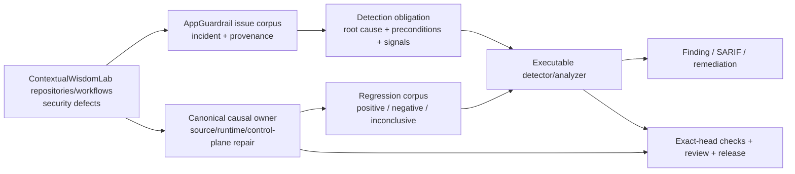

# AppGuardrail product and technical gap baseline

**Snapshot:** 2026-09-08 09:04 UTC
**Authority:** protected `develop` documentation plus live exact-head GitHub evidence  
**Status:** working baseline; not a release, certification, or protected-branch capability claim

## Goal and evidence contract

AppGuardrail is the ContextualWisdomLab security-defect corpus and executable detection/remediation boundary. Buyer value is not a rule count: a retained incident becomes useful only when the causal failure is reproducible, its preconditions and observable signals are explicit, safe lookalikes and equivalent misses are tested, the canonical source owner is repaired when necessary, and exact-head evidence survives ordinary protected integration.

Issue text, registry rows, fixtures, predecessor checks, queued workflows, and model reviews are not detector truth. Executable scanner/analyzer evidence is authoritative. Runtime prevention and scanner detection are separate obligations. Missing, unavailable, stale, cancelled, failed, or inconclusive evidence never becomes `Clean Scan` by omission.

The development loop is:

```text
security corpus → causal owner/root cause → RED regression → smallest safe repair
→ exact-head Checks/current-head review → ordinary protected merge/release
→ protected-owner oracle refresh → next corpus item / buyer-visible Gap
```

Review, check, deployment, or release waits are non-blocking across independent safe lanes. Force push, destructive rebase, self-approval, gate weakening, warning suppression, detection bypass, stale-check reuse, and admin protection bypass are prohibited.

## PRD / TRD / architecture status

The protected PRD and `ARCHITECTURE.md` define four separable product planes:

```text
scan       built-in executable detectors + provenance-preserving external engines
remediate  deterministic safe transforms + reviewable verification guidance
control    tenant-isolated scan/history/drift/API-key/webhook behavior
assurance  SARIF, reports, SBOM, CI/release provenance and buyer evidence
```

`docs/PRD.md` remains product authority; `docs/TRD.md` records technical contracts; root `ARCHITECTURE.md` and `docs/UML.md` remain component/control-flow authorities; `docs/TRACEABILITY.md` binds defect classes to executable evidence; `docs/THREAT_MODEL.md`, `docs/TEST_STRATEGY.md`, and `docs/OPERABILITY.md` define abuse, verification and operations. This baseline does not create a competing architecture.

**UML:** existing architecture/UML material remains authoritative; detector work that changes a component boundary must update it.  
**ERD:** AppGuardrail detector fixtures and issue-corpus metadata are evidence artifacts, not a new transactional aggregate. Control-plane persistence remains the database authority; any new persisted evidence aggregate requires tenant ownership, lifecycle, retention/deletion, provenance, rollback and migration contracts before implementation.

## Context Map



Responsibility boundaries:

- **AppGuardrail** owns executable detection, normalized findings/SARIF, regression evidence, remediation and detector traceability.
- **The causal repository** owns vulnerable product/runtime behavior and must carry the source repair when AppGuardrail is not the defect owner.
- **ContextualWisdomLab/.github** owns organization CI/review/security/release control-plane behavior; leaf repositories must not copy or weaken a central control to bypass an owner defect.
- **External scanners** keep source/tool/version provenance. Normalization does not relabel their evidence as built-in AppGuardrail evidence.
- **Exact-head review/check infrastructure** is acceptance evidence, never a substitute for product truth.

## Security-defect corpus — live 2026-09-08 09:04 UTC snapshot

| Work / corpus item | Exact observed state | Root cause / reusable security meaning | Next safe action |
| --- | --- | --- | --- |
| AppGuardrail #1152, branch `feat/actions-poll-analyzer-emit-1087`, exact head `255cfd866efd971396e132992a474074487f1939` | open/Draft successor stacked on #1133 (`5baeab9...`). RED `f38e398` then GREEN. Emit + structural + #1088 poll corpus 185 passed. Analyzer 417/417 statements and 196/196 branches. Hosted `exact-head-coverage` on this head is SUCCESS. | `_scan_file` now runs `classify_poll_loops` on `.github/workflows/*.{yml,yaml}` and merges with regex by `(rule_id, file)`. Historical vulnerable fixture emits `github-actions-transport-only-poll-bound` once. Historical fixed fixture stays negative. Regex YAML is unchanged. | keep Draft stacked on #1133. Do not Close #1087, #1088, or #1133. Do not invent a third poll-bound ID. |
| AppGuardrail #1133, branch `feat/actions-poll-structural-analyzer-1087`, exact head `5baeab93de2a940b024dd31463ce7417ae990e3a` | open/Draft successor stacked on #1088 (`d9744331...`). REST mergeability is versus the #1088 branch, not protected `develop`. Analyzer GREEN remains `529ecb0`; `5baeab9` adds `.github/workflows/actions-poll-analyzer-coverage.yml`. Hosted `exact-head-coverage` on this head is SUCCESS. ADR-0009 Status Proposed. Emission successor is #1152. | regex adjacency windows cannot prove init-before-loop, unreachable `exit`, reversed comparisons, quoted text, or sibling-job timeouts. Additive `classify_poll_loops` records those causal facts while preserving detector IDs `github-actions-transport-only-poll-bound` and `github-actions-transport-failure-budget-poll-bound`. | keep Draft stacked on #1088. Exact-head coverage is SUCCESS; remaining merge blockers are review and the #1088 base. Do not Close #1087 or #1088. |
| AppGuardrail #1088 / Issue #1087, branch `sentinel/detect-transport-only-poll-bound-1087`, exact head `d9744331b83e9a47d4b0a84f1e81e42e382aa4c2` | open/Draft; mergeable but not merge-ready. RED `d50f49ccea1cbf2aecc6da268850fddfc80db3b6` is repaired by production `99bdf459cf7939896740c61c2c3fe9c222377312`; docs predecessor `e63c34279491c9c8c90764215d6ba39c8ad8d9e3` passed local polling 126/126 and hosted Tests plus six repository controls, while the full local suite had 1,126 pass / one unrelated pre-existing `src/....py` Path/String contract failure. `d9744331...` removes the narrower duplicate `docs/product-technical-gap-baseline.md` from #1088 after verifying complete carryover in canonical single-writer #999; detector/test files are unchanged. On this exact head, Tests, Security Process and four coverage workflows are terminal success; Security Scan, SAST Semgrep and CodeQL PR remain queued. No qualifying independent approval exists; 11 current review threads remain open. | verified `ContextualWisdomLab/.github` incident: a retry budget counted only transport failures, so healthy API/no-verdict iterations could retain a runner. Forward `-gt` and statically positive owning-job `${{ N }}` timeouts are now recognized without accepting reversed/non-expiring, zero/negative/dynamic, or sibling-job bounds. | keep all four detector identities and corpus as G-06 migration oracles. Stay Draft through fresh exact-head Checks/review; keep the Gap baseline only in #999 and do not Close #1087. |
| AppGuardrail #1131 / #1181 dashboard file-picker UX | #1131 exact `5f938580fd32b15fc99508b26cbc47839f577a04` is the canonical Draft with static product/test evidence only. #1181 exact `b4880bfde3facc2bf3bb776946afc74b732a0b65` is a source-neutral one-commit descendant of `2aafa234...` (0 changed files); it reproduces the product/test intent but adds duplicate `.jules/palette.md` doctrine. Exact-head Tests `34197874864` and five other workflows are GREEN; Security Scan `34197874811`, SAST `34197874903`, and CodeQL `34197874838` are queued. | Static markup cannot prove picker activation, keyboard/focus, cancel/reselect, accessibility-tree naming, responsive behavior, or failure states. Draft #1117 browser evidence proves only its XSS boundary and is not protected authority to copy. | keep #1181 Draft/open until #1131 completely carries and accepts the valid delta. Keep #1131 Draft; integrate the browser prerequisite through ordinary ancestry and add exact-head browser/E2E evidence before Ready. |
| AppGuardrail #1189, branch `feat/claude-plugin-deno-pod-1099`, exact head `c13142c6447877a65ad282a0ee482372b6efb7d9` | open/Draft successor stacked on live #1188 (`63c42a7...`), 10 ahead / 0 behind. Original RED `1b02a97` → GREEN `c86ac8c` then non-force restack `0ce7e13`; quoted-task RED `e41648b4bd8e0dd82c7e69b0c8eb7ccc56efb9e4` → admission GREEN `471a89fcd3c3e956f206e3bc4238ec8a4df5b2fd` → inventory-boundary GREEN `0616f328803d91122d93d1bb1792df04d5953223`; traceability head `c13142c...`. Full source/test AST passes with SyntaxWarning denied. Exact patterns pass Deno 5/5 positive and 4/4 negative, CocoaPods 4/4 positive and 5/5 negative, and inventory 4/4 positive and 4/4 negative. No hosted workflow exists on the custom base. | Executable quoted or unquoted exact `deno publish` and `pod trunk push`, including command substitutions, fail under their distinct rule IDs. `deno info`, `pod install`, `pod lib lint`, near-task suffixes, cross-line token assembly, mismatched quotes, assignment/reporting prose, and closed heredoc payloads stay negative. `sbt publish` stays #1188. | keep Draft stacked on #1188. Do not Close #1099 or #1188; local evidence does not replace hosted integration, coverage, or independent review. |
| AppGuardrail #1188, branch `feat/claude-plugin-sbt-conan-1099`, exact head `63c42a76c7b06d2b00ace53cfdde59d56ae9f0ad` | open/Draft successor stacked on live #1187 (`a2a800a...`), 10 ahead / 0 behind. Original RED `a88ac06` → GREEN `34ef68b`; quoted-task RED `ad3a238b1c35158c1301418928d8fa91e32634f8` → GREEN `ccce2a0db42b6998de43fdd85f8f62a3cf7accc4`; substitution RED `25e07a631492f797858ce2622c607d5e6560d599` → GREEN `935a5fd7f4a8d7e979c46d9822ff6a9a2d05e968`; fixture escape cleanup `63c42a7...`. Exact source/test AST passes with SyntaxWarning-as-error; production-helper probes pass 6 positives and 5 negatives. No hosted workflow exists on the custom base. Deno/pod successor is #1189. | Executable quoted or unquoted exact `sbt publish` / `sbt publishSigned`, including `$(...)` and backtick substitutions, fail as `claude-plugin-sbt-publish-command`. `conan upload` remains its distinct class. `sbt compile`, quoted/unquoted `sbt publishLocal`, assignment values, reporting text, and closed heredoc payloads stay negative. | keep Draft stacked on #1187. Do not Close #1099 or #1187. |
| AppGuardrail #1187, branch `feat/claude-plugin-gradle-luarocks-1099`, exact head `a2a800a23033b441afddc2ce386f91ad80f9f372` | open/Draft successor stacked on live #1186 (`fb44e77...`). RED `83a9abd` → GREEN `a2a800a`. Focused gradle/cabal/hex/gem tests 54 passed; plugin suite 556 passed on Python 3.13. No hosted workflow exists on the custom base. Predecessor terraform/helm leftover `scan_result == pass` on `vercel deploy` / `fly deploy` was dropped because #1174 already fail-closes those commands. sbt/conan successor is #1188. | executable `gradle publish` / `gradlew publish` fail as `claude-plugin-gradle-publish-command`. `luarocks upload` fails as `claude-plugin-luarocks-upload-command`. `gradle tasks`, `gradle publishToMavenLocal`, and `luarocks list` stay inventory. Assignment values stay inventory. `cabal upload` stays #1186. `composer publish` and `go upload` are not invented. Snippets are command labels. | keep Draft stacked on #1186. Do not Close #1099 or #1186. |
| AppGuardrail #1186, branch `feat/claude-plugin-cabal-mvn-1099`, exact head `fb44e77367da1746c8460541c0baed3162c850dc` | open/Draft successor stacked on live #1185 (`e350ee0...`), 5 ahead / 0 behind. RED `d057c3d` → GREEN `98dac50`. Focused cabal/hex/pub/gem tests 50 passed; plugin suite 538 passed on Python 3.13. No hosted workflow exists on the custom base. Closed literal here-document payloads are inherited as negative; post-boundary real commands remain positive. Gradle/LuaRocks successor is #1187. | executable `cabal upload` / `cabal v2-upload` fail as `claude-plugin-cabal-upload-command`. `mvn deploy` / `mvn deploy:deploy-file` fail as `claude-plugin-mvn-deploy-command`. `cabal list` and `mvn package` stay inventory. Assignment values stay inventory. `hex publish` stays #1185. `composer publish` and `go upload` are not invented. Snippets are command labels. | keep Draft stacked on #1185. Do not Close #1099 or #1185. |
| AppGuardrail #1185, branch `feat/claude-plugin-hex-conda-1099`, exact head `e350ee0ad6e2e313c2d1e38cbdc4f0418477280e` | open/Draft on current #1184 (`bde4451...`), 8 ahead / 0 behind with Hex/Conda and shared command-context regressions preserved. Exact top source, root regression test, and Hex/Conda test AST pass with SyntaxWarning-as-error; production-helper probes pass 4 negatives and 4 positives. No hosted custom-base acceptance is claimed. Cabal/mvn successor is #1186. Closed literal here-document payloads are inherited as negative; post-boundary real commands remain positive. | executable `hex publish` / `mix hex.publish` and `conda upload` / `anaconda upload` fail closed; info/list, prose, reporting, and assignment values stay inventory. | keep Draft. Do not Close #1099 or #1184. |
| AppGuardrail #1184, branch `feat/claude-plugin-pub-publish-1099`, exact head `bde44516021aa6c1fd6c2be7c7beb9345a671d97` | open/Draft on current #1183 (`4253dde...`), 9 ahead / 0 behind with pub-publish and shared command-context regressions preserved. Pre-restack focused tests passed; no hosted custom-base acceptance is claimed. Closed literal here-document payloads are inherited as negative; post-boundary real commands remain positive. | executable `dart pub publish`, `flutter pub publish`, and legacy `pub publish` fail closed; `dart pub get` and assignment values stay inventory. | keep Draft. Do not Close #1099 or #1183. |
| AppGuardrail #1183, branch `feat/claude-plugin-gem-nuget-1099`, exact head `4253ddeb380245db514c885fc6bf26662515211c` | open/Draft on current #1182 (`2c7b065...`), 11 ahead / 0 behind with gem/NuGet and shared command-context regressions preserved. Closed literal here-document payloads are inherited as negative; post-boundary real commands remain positive. | executable `gem push`, `nuget push`, and `dotnet nuget push` retain distinct fail-closed identities; quoted/reporting/assignment values stay negative. | keep Draft and obtain hosted integration/current-head review. Do not Close #1099 or #1182. |
| AppGuardrail #1182, branch `feat/claude-plugin-alt-publish-1099`, exact head `2c7b0656fdd9e1977483fb007e3173d387254893` | open/Draft on current #1180 (`ecc7a1c...`), 11 ahead / 0 behind with alt-publish and shared command-context regressions preserved. Closed literal here-document payloads are inherited as negative; post-boundary real commands remain positive. | executable `pnpm publish`, `uv publish`, and `poetry publish` fail closed; `yarn npm publish` remains the npm class; quoted/reporting/assignment values remain negative. | keep Draft and obtain hosted integration/current-head review. Do not Close #1099 or #1180. |
| AppGuardrail #1180, branch `feat/claude-plugin-registry-publish-1099`, exact head `ecc7a1c883cd06d80a9431b35aa152282c7a5f9e` | open/Draft on current #1179 (`730d429...`), 14 ahead / 0 behind with registry-publish and shared command-context regressions preserved. Closed literal here-document payloads are inherited as negative; post-boundary real commands remain positive. | executable `npm publish`, `twine upload`, and `cargo publish` retain distinct fail-closed identities; packaging/check/comment/echo/prose/assignment lookalikes remain negative. | keep Draft and obtain hosted integration/current-head review. Do not Close #1099 or #1179. |
| AppGuardrail #1179, branch `feat/claude-plugin-object-store-1099`, exact head `730d42926d383c59e9f01a12df625b32c3824285` | open/Draft on current #1177 (`9e0e4ad...`), 16 ahead / 0 behind with object-store direction and shared command-context regressions preserved. | literal two-operand S3-to-local is inventory; writes, S3-to-S3, ambiguous forms, and later writes fail closed. | keep Draft and obtain hosted integration/current-head review. Do not Close #1099, #1177, or #1174. |
| AppGuardrail #1177, branch `feat/claude-plugin-cloud-deploy-1099`, exact head `9e0e4ad0ef263ae8a265482051df871a74bf871c` | open/Draft on current #1176 (`e29cc87...`), 14 ahead / 0 behind with cloud-deploy and shared command-context regressions preserved. Closed literal here-document payloads are inherited as negative; post-boundary real commands remain positive. | executable AWS/gcloud/Azure deploy commands fail closed; quoted/reporting/prose/assignment values remain negative while environment-prefix, direct substitutions, and later real commands remain positive. | keep Draft and obtain hosted integration/current-head review. Do not Close #1099, #1176, or #1174. |
| AppGuardrail #1176, branch `feat/claude-plugin-path-depth-1099`, exact head `e29cc87bcb33b084c17d563539356f7979136223` | open/Draft on current #1175 (`bb9cd1d...`), 13 ahead / 0 behind with path-depth and shared command-context regressions preserved. Closed literal here-document payloads are inherited as negative; post-boundary real commands remain positive. | paths deeper than 32 components fail closed; the canonical command-context helper remains independent and verified. | keep Draft and obtain hosted integration/current-head review. Do not Close #1099, #1175, #1166, or #1135. |
| AppGuardrail #1175, branch `feat/claude-plugin-unsigned-checksum-1099`, exact head `bb9cd1dd6af007f2b1e85978974150480da3fad6` | open/Draft on current #1174 (`c069e93...`), 13 ahead / 0 behind with unsigned-checksum and shared command-context regressions preserved. Closed literal here-document payloads are inherited as negative; post-boundary real commands remain positive. | digest rows without a non-empty, non-symlink sibling signature fail closed; command-context semantics remain inherited from #1173. | keep Draft and obtain hosted integration/current-head review. Do not Close #1099, #1174, or #1169. |
| AppGuardrail #1174, branch `feat/claude-plugin-hosted-deploy-1099`, exact head `c069e93ed7ca0b82fd19179a6b68f671c3d0be20` | open/Draft; current canonical parent #1173 is `825bf7e46a829b9a09e1c551d896030b2358a5b4`. Git comparison is 16 ahead / 25 behind from merge base `184b4b4...`; hosted-deploy delta remains preserved. | executable `vercel deploy` and `fly deploy` fail closed on the predecessor tree, but the current kubectl/Docker typed-argv and nested-shell parser repair is not integrated. | keep Draft; non-force integrate #1173, then obtain hosted integration/current-head review. Do not Close #1099 or #1173. |
| AppGuardrail #1173, branch `feat/claude-plugin-terraform-helm-1099`, exact head `825bf7e46a829b9a09e1c551d896030b2358a5b4` | open/Draft on exact #1172 `de1b7c1...`; 38 ahead / 0 behind. Source `6667472...`, retained regression `0093507...`, non-force two-parent integration `825bf7e...`. Exact-head compilation and deployment command probes 12/12 pass; hosted workflows 0, current-head approvals 0, unresolved threads 0. | shared structural argv/nested-shell parser now covers kubectl/Docker plus Terraform/Helm with exact token boundaries. Prose/reporting/assignment/noexec remain negative. | keep Draft until hosted integration and independent current-head review. Downstream #1174 must integrate this exact head. Do not Close #1099 or #1172. |
| AppGuardrail #1172, branch `feat/claude-plugin-deployment-write-1099`, exact head `de1b7c1f443a8347f1212e72ab4ed7ff281903c0` | open/Draft on #1171 `9370a0d...`. RED `e6d6062...` covers typed argv and command-context FP/FN. Initial source `a6efcf5...` failed exact verification after deleting adjacent dynamic-eval; non-destructive repair `de1b7c1...` restores it. Exact-head compilation/probes 8/8; hosted workflows 0, approvals 0, unresolved threads 0. | direct typed `kubectl apply`, `docker push`, `docker image push`, and admitted nested-shell payloads fail closed. Descriptions, reporting/no-op commands, assignments, noexec, near verbs, malformed argv, pull/list remain negative. | keep Draft until hosted integration and independent current-head review. #1173 has this exact commit as parent and is 0 behind. Do not Close #1099, #1171, or #1170. |
| AppGuardrail #1171, branch `feat/claude-plugin-credential-store-1099`, exact head `9370a0dd44e9af15c7b6ccb7165c042ad3de377c` | open/Draft successor stacked on #1170 (`b506b82...`). RED `cc3db8c` → GREEN `9370a0d`. Plugin coverage suite 347 passed; detector statement coverage 2505/2505. Deployment-write successor is #1172. | host `.netrc`, AWS credentials, `gh` hosts.yml, Docker config.json, cookie jars, and `~/.ssh/id_*` (not `.pub`) fail as `claude-plugin-credential-store-access`. Chrome/Firefox profiles stay #1150. Hardcoded `ghp_` stays #1137. `gh pr merge` stays #1170. | keep Draft stacked on #1170. Do not Close #1099, #1170, #1150, or #1137. |
| AppGuardrail #1170, branch `feat/claude-plugin-github-merge-release-1099`, exact head `b506b824987326bd82f5fb5f8d037194a21163b6` | open/Draft successor stacked on #1169 (`226ca73...`). RED `527edb5` → GREEN `b506b82`. Focused merge/release tests 16 passed plus inventory lock; detector statement coverage 2455/2455 on Python 3.13. Credential-store successor is #1171. | hook or manifest `gh pr merge` fails as `claude-plugin-github-merge-command`. `gh release` create, upload, delete, or edit fails as `claude-plugin-github-release-command`. On this slice `gh issue create`, `gh pr review`, `gh release list`, `kubectl apply`, and `docker push` stay inventory; kubectl/docker-push successor is #1172. Hardcoded PATs stay `claude-plugin-github-write-token`. Snippets are command labels. | keep Draft stacked on #1169. Do not Close #1099 or #1169. Do not steal checksum-mismatch or github-write-token. |
| AppGuardrail #1169, branch `feat/claude-plugin-checksum-mismatch-1099`, exact head `226ca7356e5ed32c3ac85bba9cc38868e7fda8ae` | open/Draft successor stacked on #1168 (`4b9bcc6...`). RED `c23c4cb` → GREEN `226ca73`. Focused checksum tests 27 passed; detector statement coverage 2424/2424. Merge/release successor is #1170. | first-party `SHA256SUMS` / `*.sha256` files that disagree with bytes on disk fail as `claude-plugin-checksum-mismatch`. Matching checksums, `#` comments, and a missing checksum file are not this class. Cosign/GPG network is not required. | keep Draft stacked on #1168. Do not Close #1099 or #1168. Do not steal `sbom_sha256`. |
| AppGuardrail #1168, branch `feat/claude-plugin-sbom-receipt-1099`, exact head `4b9bcc6eac49c4edb117f28ffa03c9e25c58a320` | open/Draft successor stacked on #1167 (`18bb1a0...`). RED `1461fb5` → GREEN `4b9bcc6`. Coverage suite 287 passed; detector statement coverage 2301/2301 on Python 3.13. Checksum-mismatch successor is #1169. | receipt `sbom_sha256` is SHA-256 of a deterministic CycloneDX 1.5 document from existing SBOM parsers. Verify fails closed on a swapped digest. This is not a second policy hash. Malformed manifests yield an empty-component SBOM. | keep Draft stacked on #1167. Do not Close #1099 or #1167. |
| AppGuardrail #1167, branch `feat/claude-plugin-policy-provenance-1099`, exact head `18bb1a0a87f912989ea3f3328cc7692fda1a9c0c` | open/Draft successor stacked on #1166 (`0ef0f7d...`). RED `bba5b6a` → GREEN `18bb1a0`. Plugin suites 287 passed; detector statement coverage 2272/2272. SBOM-receipt successor is #1168. | receipt `policy_provenance` binds `scanner_release_version` (`_SCANNER_VERSION`) and `scanner_policy_sha256` to this scan. Verify fails closed when version or provenance disagrees with the running scanner. Pass is not Noema admission. | keep Draft stacked on #1166. Do not Close #1099 or #1166. Do not duplicate the policy digest under a second field name. |
| AppGuardrail #1166, branch `feat/claude-plugin-decompression-bomb-1099`, exact head `0ef0f7d7f3c63faa822a8cff5a20e76514285da2` | open/Draft successor stacked on #1165 (`5790559...`). Ratio/depth GREEN `90cd031`; aggregate-budget RED `e1b3f39` → GREEN `0ef0f7d`. Plugin suites 275 passed; detector statement coverage 2238/2238 on Python 3.13. Policy-provenance successor is #1167. | zip/tar members whose uncompressed/compressed ratio exceeds 100, nested archives deeper than 1, or regular in-root members summing above `_MAX_PACKAGE_BYTES` fail as `claude-plugin-decompression-bomb` without extracting. Zip-slip stays #1135. Oversized tree caps stay oversized-package. | keep Draft stacked on #1165. Do not Close #1099 or #1165. Do not extract bomb members. |
| AppGuardrail #1165, branch `feat/claude-plugin-insecure-file-mode-1099`, exact head `57905590731b5fb5cb7bf8b5e9bed43241bd5605` | open/Draft successor stacked on #1164 (`9ef3193...`). RED `6b2a476` → GREEN `5790559`. Plugin suites 251 passed; detector statement coverage 2035/2035 on Python 3.13. Decompression-bomb successor is #1166. | setuid/setgid executable and hook files fail as `claude-plugin-setuid-executable`. World-writable executable and hook files fail as `claude-plugin-world-writable-executable`. Declared `0755` hooks, LICENSE, Git metadata, `.mcp.json`, vendored copies, and symlink hooks are not this class. `chmod +x` of a download stays unsigned-download. | keep Draft stacked on #1164. Do not Close #1099 or #1164. |
| AppGuardrail #1164, branch `feat/claude-plugin-hide-actions-1099`, exact head `9ef3193fb6e05dcdc2000772a53cf2dbbd97dab8` | open/Draft successor stacked on #1163 (`cd5560e...`). RED `f1d9ce7` → GREEN `9ef3193`. Plugin suites 239 passed; detector statement coverage 1988/1988. File-mode successor is #1165. | SKILL/command/agent markdown that hides tool use, rewrites policy, or expands goals fail as `claude-plugin-hide-actions-directive`, `claude-plugin-self-modify-directive`, and `claude-plugin-goal-escalation-directive`. Honest “report each tool call” is not this class. #1163 exfil stays the released #1036 identity. | keep Draft stacked on #1163. Do not Close #1099, #1163, or #1036. Do not copy #1036 YAML regexes. |
| AppGuardrail #1163, branch `feat/claude-plugin-command-skill-reuse-1099`, exact head `cd5560ead4e0f01de0a7e0c97e43bc8f8280fc39` | open/Draft successor stacked on #1161 (`a92e936...`). RED `3505579` → GREEN `cd5560e`. Plugin suites 229 passed; detector statement coverage 1934/1934 on Python 3.13. Hide-actions successor is #1164. | `commands/*.md` and named `agents/*.md` reuse released #1036 injection/exfil identities. `SKILL.md`/`agent.md` stay #1139. Homoglyph/placeholder stay skill-identifier rules. README and root `AGENTS.md` stay guidance. | keep Draft stacked on #1161. Do not Close #1099, #1036, #1161, or #1139. |
| AppGuardrail #1161, branch `feat/claude-plugin-secret-to-mcp-1099`, exact head `a92e936fac322d600c6bf7c7a1aa91be25eb3975` | open/Draft successor stacked on #1158 (`8c9f2d6...`). RED `a3a80f3` → GREEN `a92e936`. Plugin suites 220 passed; detector statement coverage 1929/1929 on Python 3.13. Command-markdown successor is #1163. | named secrets in MCP `env`/`args`/`command` fail as `claude-plugin-secret-to-mcp`. Curl stays #1137. Prompt/log stays #1158. Bounded MCP without secrets is not this class. | keep Draft stacked on #1158. Do not Close #1099, #1158, or #1137. |
| AppGuardrail #1159, branch `fix-ssrf-empty-hostname-7666453064051931080`, exact head `9587261978f4ebb26ac293685d4d223a787a36dc` | converted to Draft at 18:59 UTC. Effective delta is `if not raw: return False` in `_is_safe_url` plus `.jules/sentinel.md`. No new tests. Canonical owner remains #1068. | same empty-host SSRF class as #1068, implemented as a weaker Jules slice without the validator/corpus/API regressions | keep Draft. Do not Close until complete carryover onto #1068 is verified. Do not race #1068 to `develop`. |
| AppGuardrail #1158, branch `feat/claude-plugin-secret-to-prompt-1099`, exact head `8c9f2d61236eb6e8cc1b27402d73fcef37128085` | open/Draft successor stacked on live #1157 (`6f0eb44...`). RED `09a6c2f` → GREEN `8c9f2d6`. Plugin suites 211 passed; detector statement coverage 1878/1878. Secret-to-MCP successor is #1161. | named env secrets copied into prompts, logs, or child `env=` fail as `claude-plugin-secret-to-prompt`. Curl/wget stays #1137 secret-to-network. Hardcoded `sk-` stays provider-secret. Snippets are sink plus env name. | keep Draft stacked on #1157. Do not Close #1099, #1157, or #1137. |
| AppGuardrail #1157, branch `feat/claude-plugin-conflicting-identity-1099`, exact head `6f0eb445ecc0d48dfafd2c3d2525eb7cc1e462f7` | open/Draft successor stacked on #1156 (`a6f6a74...`). Live head narrows collision domains after RED `6f0eb44`: marketplace plugin identifiers still collide; Skills and legacy Commands collide on local invocation names; plugin namespace may equal a local skill name; custom agents stay a separate surface. Secret-to-prompt successor is #1158. | duplicate invocation identities fail as `claude-plugin-conflicting-identity`. Plugin namespace vs `/plugin:skill` is not that class. Non-NFC names stay #1155. Vendored copies stay #1156. | keep Draft stacked on #1156. Do not Close #1099 or #1156. Do not restore the over-broad global `seen` set. |
| AppGuardrail #1156, branch `feat/claude-plugin-vendored-scope-1099`, exact head `a6f6a742701c263efcd83402da1815e065d69706` | open/Draft successor stacked on #1155 (`b85b936...`). Plugin suites 180 passed; detector statement coverage 1709/1709. Conflicting-identity successor is #1157. | undeclared `vendor/`, `node_modules/`, `dist/`, or `*.min.js` copies fail as `claude-plugin-vendored-scope-undeclared` (one scope finding). Hook walks skip those trees. `files[]` can bind generated paths. | keep Draft stacked on #1155. Do not Close #1099 or #1155. Do not flood per-file findings from vendored trees. |
| AppGuardrail #1155, branch `feat/claude-plugin-normalized-name-1099`, exact head `b85b936f04558f66af23a3b65d8ea38df9397d6b` | open/Draft successor stacked on #1154 (`ee43e7d...`). RED `13b97b4` → GREEN `b85b936`. Plugin suites 167 passed; detector statement coverage 1633/1633 on Python 3.13. Vendored-scope successor is #1156. | plugin or marketplace identity names that are not Unicode NFC fail as `claude-plugin-inconsistent-normalized-name`. Precomposed Latin and Hangul stay admitted. Combining marks do not appear in snippets. | keep Draft stacked on #1154. Do not Close #1099 or #1154. Do not steal #1154 malformed-UTF-8 unique delta. |
| AppGuardrail #1154, branch `feat/claude-plugin-malformed-utf8-1099`, exact head `ee43e7d9006261522b854e159d94ca4d84b2aa8c` | open/Draft successor stacked on #1153 (`3f709b0...`). RED `4c930ce` → GREEN `ee43e7d`. Plugin suites 168 passed; detector statement coverage 1614/1614. NFC-name successor is #1155. | marketplace/plugin/MCP JSON that is not valid UTF-8 fails as `claude-plugin-malformed-utf8`. Snippets are labels only. Valid CJK is not this class. Bidi stays concealed-identity. `Infinity` stays nonstandard-json-constant. | keep Draft stacked on #1153. Do not Close #1099 or #1153. |
| AppGuardrail #1153, branch `feat/claude-plugin-nonstandard-json-1099`, exact head `3f709b0caf1252393f73dfef3ba95e732ab13360` | open/Draft successor stacked on #1151 (`822ca12...`). RED `705a7e0` → GREEN `3f709b0`. Plugin suites 148 passed; detector statement coverage 1576/1576 on Python 3.13. Malformed-UTF-8 successor is #1154. | manifest `NaN`, `Infinity`, and `-Infinity` fail as `claude-plugin-nonstandard-json-constant`. Duplicate members stay `claude-plugin-duplicate-json-member`. A finite JSON number is not this class. | keep Draft stacked on #1151. Do not Close #1099 or #1151. Do not steal #1151 deceptive-description unique delta. |
| AppGuardrail #1151, branch `feat/claude-plugin-deceptive-description-1099`, exact head `822ca12f1d8b55ae81f7feb882cc6f3073587256` | open/Draft successor stacked on #1150 (`8a360d2...`). RED `278dab8` → GREEN `822ca12`. Detector statement coverage 1560/1560. Non-standard JSON successor is #1153. | descriptions that claim read-only/local-only while inventory shows write, network, github_write, credential, remote MCP, or shell_execution fail as `claude-plugin-deceptive-description`. Honest network descriptions and empty descriptions are not this class. Bare Firefox stays inventory. | keep Draft stacked on #1150. Do not Close #1099 or #1150. Inventory is evidence, not permission. |
| AppGuardrail #1150, branch `feat/claude-plugin-browser-profile-1099`, exact head `8a360d2b82e21999b2a0515a5ecb7641971da3af` | open/Draft successor stacked on #1146 (`94946c7...`). RED `b369d5f` → GREEN `8a360d2`. Plugin suites 128 passed; detector statement coverage 1444/1444 on Python 3.13. REST mergeable CLEAN versus #1146. Deceptive-description successor is #1151. | host Chrome/Chromium/Firefox profile stores on hook or manifest surfaces fail as `claude-plugin-browser-profile-access`. README path mentions and a bare `Firefox` product name stay `browser_profile_access` inventory. Docker sockets stay `claude-plugin-docker-socket`. | keep Draft stacked on #1146. Do not Close #1099 or #1146. Do not steal #1146 hidden-executable or #1137 Docker unique delta. |
| AppGuardrail #1148, branch `sentinel/fix-dom-xss-console-2387223574376446424`, exact head `a666eef82d6caaa73163241e358c44fbe8172f70` | open/Draft concurrent sentinel on `develop@e71d37e`. Body cites authority `b209e8c` while live head is `a666eef`; `.jules/sentinel.md` remains in the compare. Checks were still admitting at 14:55 UTC. | untrusted finding severity was used as a normal-object key before `innerHTML`; a null-prototype palette plus one normalized/escaped label is the intended repair. This is an inherited-property lookup boundary, not prototype mutation. | keep as concurrent sentinel owner. Do not race the branch. Do not treat robot review as GitHub APPROVE. |
| AppGuardrail #1146, branch `feat/claude-plugin-hidden-executable-1099`, exact head `94946c7014d743484dd6ff2d40f8a67cc3065128` | open/Draft successor stacked on #1145 (`1d42ac5...`). RED `21deb12` → GREEN `94946c7`. Plugin tests 120 passed; detector statement coverage 1428/1428. Browser-profile successor is #1150. | hidden undeclared executable/config surfaces fail as `claude-plugin-hidden-undeclared-executable`. `.git/`, `.gitignore`, LICENSE, `.mcp.json`, and declared `hooks/pre.sh` stay negative for this rule. | keep Draft stacked on #1145. Do not Close #1099 or #1145. |
| AppGuardrail #1145, branch `feat/claude-plugin-dynamic-eval-1099`, exact head `1d42ac55df6b576a61e693e5dca57e238ec8d388` | open/Draft successor stacked on #1144 (`c66dfaf...`). RED then GREEN dynamic-eval tests; detector statement coverage 1006/1006. REST mergeable CLEAN versus #1144. Hidden-executable successor is #1146. | hook `eval`/`exec`/`compile`/`Function` and shell `eval` fail as `claude-plugin-dynamic-eval`. `print()` and `evaluate()` stay negative. | keep Draft stacked on #1144. Do not Close #1099 or #1144. |
| AppGuardrail #1144, branch `feat/claude-plugin-postinstall-download-1099`, exact head `c66dfaf88b29ae478431c2fd1a0d325d91da4bc2` | open/Draft successor stacked on #1143 (`e5051ea...`). RED `8019b14` → GREEN `c66dfaf`. Plugin suites 109 passed; detector statement coverage 1359/1359. Dynamic-eval successor is #1145. | `package.json` install lifecycle scripts that fetch unsigned payloads fail closed, reusing unsigned-download / pipe-to-shell / unpinned-install identities. Lockfile-only trees without those scripts stay `package_install` inventory. | keep Draft stacked on #1143. Do not Close #1099, #1143, or #1138. Do not invent a second download regex family. |
| AppGuardrail #1143, branch `feat/claude-plugin-license-mismatch-1099`, exact head `e5051ea32eeedb708e3f7e04c1f25c395fc4bbbd` | open/Draft successor stacked on #1142 (`d5df6c7...`). RED then GREEN license tests; detector statement coverage 935/935 with plugin suites. REST mergeable CLEAN versus #1142. Postinstall successor is #1144. | NOTICE files count as license evidence. Conflicting SPDX identifiers across the declared license field, LICENSE, and NOTICE fail as `claude-plugin-license-mismatch` without inventing legal approval. | keep Draft stacked on #1142. Do not Close #1099 or #1142. |
| AppGuardrail #1142, branch `feat/claude-plugin-sarif-receipt-1099`, exact head `d5df6c75f97eac677527e44b9b91df41c3825dfc` | open/Draft successor stacked on live #1141 (`e9852bd...`). RED `854a21b` → GREEN `d5df6c7`. Full suite 1180 passed; `claude_plugin_sarif.py` 50/50. License-mismatch successor is #1143. | receipt `sarif_sha256` is SHA-256 of a SARIF 2.1.0 document whose rule IDs match `finding_summary`. Mutating the tree changes both. | keep Draft stacked on #1141. Do not Close #1099 or #1141. Do not invent a second SARIF dialect. |
| AppGuardrail #1141, branch `feat/claude-plugin-catalog-bind-1099`, exact head `e9852bdb9025f3873dbafed9e0381a1798a41b5a` | open/Draft successor stacked on #1140 (`bfa61c9...`). Live head adds canonical marketplace entry selection by plugin name after `80f56b0`. REST mergeable CLEAN versus #1140. SARIF-receipt successor is #1142. | an external marketplace catalog binds `catalog_repository`, `catalog_commit_sha`, and `marketplace_blob_sha`. A floating catalog commit reuses `claude-plugin-floating-git-ref`. Catalog plugin name/repo/ref that disagrees with the retrieved artifact reuses `claude-plugin-source-mismatch`. | keep Draft stacked on #1140. Do not Close #1099 or #1140. Do not fork the receipt schema. |
| AppGuardrail #1140, branch `feat/claude-plugin-scan-cli-1099`, exact head `bfa61c95f8b7126cea316ecc95d558dbcc875e8d` | open/Draft successor stacked on #1139 (`6cd54b3...`). RED `192ae4f` → GREEN `bfa61c9`. CLI tests plus plugin suite 88 passed; new `claude_plugin_scan_cli.py` 79/79; detector gate 1194/1194. Catalog-bind successor is #1141. | `appguardrail scan-plugin --plugin-root` writes the existing deterministic receipt. Exit 0 only when `scan_result` is pass. Missing root fails closed. Pass is not Noema admission. | keep Draft stacked on #1139. Do not Close #1099 or #1139. Do not fork the receipt schema. |
| AppGuardrail #1139, branch `feat/claude-plugin-skill-rule-reuse-1099`, exact head `6cd54b3ec49b085cfd8d3584746f600162d0e1d5` | open/Draft successor stacked on #1138 (`bdb3809...`). Non-destructive merge of #1036 `fdb49c3` plus adapter. Local 74 plugin tests; statement coverage 872/872. REST mergeable CLEAN versus #1138. CLI successor is #1140. | plugin skill/agent surfaces reuse released #1036 identities (`skill-name-homoglyph-confusable`, `skill-manifest-prompt-injection-payload`, `skill-doc-exfiltration-endpoint-directive`, `skill-placeholder-template-unresolved`). The adapter calls the packaged YAML engine and does not copy those regular expressions. ASCII skills still pass; README homoglyphs and skill symlinks are not surfaces. | keep Draft stacked on #1138. Do not Close #1036, #1099, or #1138. |
| AppGuardrail #1138, branch `feat/claude-plugin-unsigned-download-1099`, exact head `bdb380938b33bd9918eafc433ff3081964bd36a4` | open/Draft successor stacked on #1137 (`78c486f...`). RED `e4efb66` → GREEN `bdb3809`. Focused plugin tests 67 passed; `claude_plugin_detector.py` statement coverage 1150/1150. Skill-rule-reuse successor is #1139. | mutable runtime download then execute, and unpinned `https://`/`git+` package installs, fail admission (`claude-plugin-unsigned-executable-download`, `claude-plugin-unpinned-package-install`). Lockfile-backed package trees without postinstall download stay `package_install` inventory. | keep Draft stacked on #1137. Do not Close #1099 or #1137. Do not treat every shell command as malicious. |
| AppGuardrail #1137, branch `feat/claude-plugin-github-docker-authority-1099`, exact head `78c486f4a87c0af19cfa0012d21b5dc27df81f43` | open/Draft successor stacked on restacked #1136 (`32dc0fc...`). Unique TDD item 7: GitHub write tokens, Docker sockets, secret-to-network. Local 61 plugin tests; statement coverage 804/804. REST mergeable CLEAN versus #1136, not protected `develop`. Unsigned-download successor is #1138. | hardcoded `ghp_`/`github_pat_` tokens, `/var/run/docker.sock` / `unix://...docker.sock`, and named secrets copied into curl/wget/fetch fail admission. `gh issue create` and `docker push` remain inventory evidence. Detector snippets keep prefixes/env names; CLI redacts token/secret rule snippets. | keep Draft stacked on #1136. Do not Close #1099, #1036, or #1136. Do not reimplement #1036. |
| AppGuardrail #1136, branch `feat/claude-plugin-receipt-replay-1099`, exact head `32dc0fc81a900c0d829ecfe1fd0a064a32401b95` | open/Draft successor restacked non-force onto live #1135 (`ef28b05...`) after the #998 public-message restack. Unique stale/mismatched receipt replay is preserved. Focused plugin + public-message tests 53 passed on the merge. | a pass receipt is not Noema admission. `verify_plugin_scan_receipt` fails closed on artifact/policy/catalog/source/marketplace digest mismatch and on replay against mutated trees. | keep Draft stacked on #1135. Unique GitHub-write/Docker successor is #1137. Do not Close #1099 or #1135. |
| AppGuardrail #1135, branch `feat/claude-plugin-archive-submodule-1099`, exact head `ef28b05343739aa94ee2f2b942d363de52a1fdec` | open/Draft successor stacked on #1134 after non-force restack onto #998 `8b95c2b`. Receipt-replay successor is #1136 at `32dc0fc`. | zip/tar members that escape the extract root are not followed (`claude-plugin-archive-path-traversal`). Nested `.gitmodules`/gitlink without a recursively admitted 40-character SHA fail admission (`claude-plugin-unadmitted-submodule`). | keep Draft stacked on #1134. Do not Close #1099, #1134, or #1129. Do not extract outside the bounded root. |
| AppGuardrail #1134, branch `feat/claude-plugin-capability-inventory-1099`, exact head `36e8f37bc67392dd04ace4df8dbcdceed371e097` | open/Draft successor stacked on #1129 `c5be73c` after non-force restack. Archive successor #1135 is at `ef28b05`. | inventory is evidence, not permission. Undeclared executables after manifest inventory fail admission (`claude-plugin-undeclared-executable`). Receipt `capability_inventory_sha256` is a sorted-key digest. | keep Draft stacked on #1129. Do not Close #1099, #1129, or #1036. |
| AppGuardrail #1129, branch `security/cwl-issue-detector-families`, exact head `c5be73c52a78a1c63c6ddf212de7d6281b9bd96b` | open/Draft successor stacked on #998 `8b95c2b`. Unique head is a non-force merge of the public-message contract repair onto `24c6dda` lineage. Capability inventory successor #1134 is at `36e8f37`; archive/submodule successor #1135 is restacked at `ef28b05`. | frozen CWL security issues cluster into SAST/DAST families. Catalog SHA/repo/path must bind to the retrieved tree. | keep canonical owners #1088, #966, #1133, #1134, #1135, #1136, #1137, #1138, and #1139. Do not Close #1087, #929, #983, or #1106. |
| AppGuardrail #966, branch `feat/actions-orphan-workflow-evidence-929`, exact head `f70728908df37302a186923cf2a5bf6414a1fbb0` | open/non-Draft. Compare to `develop@e71d37e` is `ahead 16` / `behind 0`. REST `mergeable_state=blocked`. Current-head OpenCode `CHANGES_REQUESTED` at 13:43 UTC on `f707289` is not a detector defect: it refuses approval because same-head CodeQL-compat/Noema/Strix checks failed. Those failures are G-07 pending-handoff / provider-unavailable, not a remaining orphan-detector bug. Relates to #929 and does not auto-close it. | read-only source-bound detector for Actions workflow registry identities that are active in GitHub but absent from the exact default-branch tree. Name hints never substitute for source-path evidence. | keep the source; rerun current-head Noema/Strix/CodeQL-verdict. Do not Close #929. |
| AppGuardrail #998 / Issue #983, branch `security/python-shell-ast-983`, exact head `8b95c2bee24567ab3200a96da807259e023eee73` | open/Draft; REST mergeable but `mergeStateStatus=BLOCKED`; stale OpenCode `CHANGES_REQUESTED` on `e2b0637`. Current-head Tests, AST coverage, Semgrep, osv-scan, Security Process, coverage gates, CodeRabbit, Noema, and `opencode-review` SUCCESS. Strix `strix` FAILURE at 13:12 UTC is `STRIX_PROVIDER_UNAVAILABLE` after 45 minutes, not a new detector FN (G-07). CodeQL compatibility python/actions FAILURE remains the designed pending-handoff; `Dispatch current-head CodeQL scan` is SUCCESS. Predecessor Strix does not transfer. | regex-only `python-command-injection` missed aliased/nested/dotted bindings; AST omitted implicit-shell `getoutput`/`getstatusoutput` until `60cdd3f`; public message must name both implicit-shell families and `subprocess shell=True` distinctly. | stay Draft until current-head Strix/CodeQL-verdict succeed. OpenCode success is robot-review evidence, not GitHub APPROVE. Do not Close #983. |
| `ContextualWisdomLab/.github` protected wall-clock owner repair | protected repair `e29302c05eade7da7b0bdbb453e53980bc9d577b` | adds a 10,800-second total deadline to the original polling owner and fails closed | retain as prevention/control-plane evidence and pinned fixed oracle; it does not by itself satisfy AppGuardrail scanner coverage. |
| `ContextualWisdomLab/.github` #1706, stronger event-driven runner release, latest observed head `21bf1f79a00555fe0f4be797ebac4a426a059094` | open/mergeable but Proposed/non-merge-ready; temporary source-fix work remains owner-side | stronger buyer-visible Gap: even bounded multi-hour waiting consumes required-review capacity | require durable one-shot/event reconciliation source, full-suite GREEN, temporary workflow/helper deletion and resulting exact-head central CI/security/current-head review before ordinary merge. |
| AppGuardrail #1080 / Issue #892, Bearer DNS-rebinding TOCTOU, head `0a752c091489efd4dc7373230f1e242313e7cca6` | open/mergeable; current-head review remains authoritative | preflight URL/DNS validation can diverge from the later credential-bearing connection; family tracks destination/request/credential/reachability and mutation state | finish current-head provenance/control-flow repairs; no predecessor GREEN reuse. This family is also evidence for the structural-analyzer Gap below. |
| AppGuardrail #1117, dashboard scan-history attribute injection, exact head `d3283a168446a71c9f983f14a348712cdb6e7fe5` | open/mergeable/Draft; zero unresolved review threads. All nine repository workflows except CodeQL PR are terminal success. CodeQL PR `34068384347` failed closed only after authenticated dispatch with `VERDICT_STATE=pending`; central exact-head scan runs `34072930847` and `34072932500` are queued. No qualifying independent `APPROVED` review exists. | `/api/v1/scans` history fields enter an `innerHTML` template. An unescaped scan id in a quoted `data-id` attribute could break attribute context; history and summary count fields also require numeric coercion before interpolation; #1091 proved the summary-count sink remained reachable until it was carried into #1117. The branch escapes the id, coerces counts, installs Chromium explicitly in CI, and uses a real browser regression that preserves the malicious dataset value while requiring zero injected `img` elements and zero dialogs. A concurrent update briefly removed the DOM-element oracle and restored a dead read; exact head `d3283a16...` preserves the CI delta, restores both reviewed test invariants, coerces latest/new/critical summary counts, and expands the Chromium fixture to hostile id/count/created-at/repository values. #1091 remains Draft until this successor coverage is exact-head GREEN and complete carryover is reverified. Its concurrent current head `ec9dcfb7ec6a93d5acbb093a8caa3c95b7be2b21` is ahead 2 from `25a8733d967021e275308351354280dfa18684ac`; the effective compare changes only `.jules/sentinel.md`, so no product/test XSS delta was added or removed. | keep production escaping and the realistic browser oracle unchanged. Require exact-head Tests/security/SAST/CodeQL and independent review; inspect normal/loading/empty/error/detail and keyboard/focus behavior before leaving Draft. |
| AppGuardrail #1068, empty-host / unresolved-DNS SSRF, exact head `2379b37f05b12af8e22990965d42da2e69b9c611` | open/mergeable/Draft; source-neutral descendant with no new security delta. All eight repository workflows are terminal success on this exact head. CodeQL PR run `34155024470` successfully dispatched exact-head Python/Actions analysis, then failed closed at `VERDICT_STATE=pending`; this is neither source failure nor GREEN. No qualifying current-head approval exists. One outdated detector thread remains open pending independent confirmation of the bounded truthy-return repair. Generated duplicate #1128 was closed only after exact patch comparison proved complete carryover. | malformed/unresolved destinations previously crossed fail-open validation. The canonical lane rejects missing hosts in both validators, fails closed on `socket.gaierror`, and retains the HIGH/CWE-918 detector, vulnerable/fixed corpus, API/direct validator regressions, and FP/FN traceability. #1128's valid `http://` and `http://user@` obligations are fully preserved. | keep #1068 as the single Draft writer. Wait for current-head CodeQL verdict, independent review and thread resolution; never reuse predecessor results or recreate a duplicate hostless lane. |
| AppGuardrail #1107, webhook storage admission and detector precision, exact head `f10795e294df5b0d9797fc50b201126c998a3632` | open/mergeable/Draft. Exact-head Security Process `34077096473` exposed the local-sink detector false positive; the repaired head has nine fresh hosted workflows queued/pending. Local GREEN is 27/27 stored-SSRF tests, 37/37 SSRF/documentation tests, 1,009/1,009 repository tests, and zero deploy-blocking findings in the real repository scan. CodeGraph was unavailable locally. | the HTTP route and directly callable persistence function had duplicated validation, rejecting the documented empty-string clear value. The runtime repair makes `set_webhook` the single validation/persistence boundary. The existing `python-stored-ssrf-webhook-url` regex then reported the safe delegated route because it did not inspect the local sink body. RED `ead954ad...` fixes the FP/FN contract: one unique top-level, non-rebound sink with unconditional unsafe rejection before SQLite use is negative; unrelated conditional validation and symbol rebinding remain positive. GREEN `f18fec7c...` adds the bounded stdlib AST proof and `f10795e...` records traceability. | keep Draft; require fresh exact-head hosted checks/current review, then integrate #1068 non-destructively after its unresolved-DNS validator reaches protected `develop`. Do not treat persistence validation as delivery-time DNS pinning or weaken the #1068 prerequisite. |
| AppGuardrail #1130, Jules webhook SSRF subset, exact head `0243a1a5a1cef758b14ae85f87b2ea1dd86e9e82` | converted to Draft at 05:37 UTC. Effective delta is `set_webhook`/route plumbing, a regex `try`/`except ValueError` lookaround, and `.jules/sentinel.md`. No runtime tests and no AST FP/FN contract. Canonical owner remains #1107. | same storage-boundary SSRF class as #1107, implemented as a weaker regex-only slice | keep Draft. Do not Close until complete carryover onto #1107 is verified. Do not race #1107 to `develop`. |
| AppGuardrail #972 / Issue #927, branch `feat/scan-assurance-927`, exact head `c488cfffe4dd95a9be8b8ed99e77a86cc8d5d81f` | open/Draft. Non-force restack onto protected `develop@e71d37e` completed 05:37 UTC (`ahead` of predecessor `4ba738a...` by the merge commit only). REST `mergeable=MERGEABLE`, `mergeStateStatus=BLOCKED`. Fresh exact-head checks are in flight and do not inherit predecessor GREEN. | `0 findings` must not render as `clean` unless repository/commit identity, findings digest, detector completion, requested engines, scope, freshness, and gate accounting all verify. Ambiguous evidence is `untrusted`/`failed`/`incomplete`. | keep Draft through current-head Tests/security/SAST/CodeQL/dedicated assurance coverage and independent review. #1005 remains the report-consumer successor and must restack after this head is stable. Do not Close #927. |
| AppGuardrail #1006 / Issue #928, branch `feat/issue-928-evidence-handoff`, exact head `35c28e22b5d50f1da943718cdb1984dcee098d62` | open/non-Draft. Non-force restack onto `develop@e71d37e` completed 05:37 UTC. REST `mergeable=MERGEABLE`, `mergeStateStatus=BLOCKED`. Dashboard clipboard/UI slice remains out of scope. | transport-neutral, redacted, digest-verified remediation bundle so an agent workflow cannot copy hostile or unbounded evidence | require fresh exact-head checks after restack; keep the UI/CSP/Storybook slice as a later G-03 successor. Do not Close #928. |
| AppGuardrail #1036, shared-skill supply-chain detection, exact head `0ef5715468acb674aeb0f3833e820996d4644871` | open/Ready/mergeable. CodeRabbit review exposed raw JSON `\\u04xx` mixed-script evasion and URL-first exfiltration ordering; RED/GREEN `14697f6...`/`53faaeb...` and `f432a09...`/`0ef5715...` preserve escaped Cyrillic-only, ASCII, prose and documentation-URL negatives. Tests, Security Process, Security Scan, SAST Semgrep and four coverage workflows are terminal success. CodeQL PR run `34187414913` is terminal failure because python/actions compatibility jobs read `VERDICT_STATE=pending`; exact-head dispatch job `101945476410` succeeded afterward, but no authenticated terminal verdict is present yet. Twelve historical review threads remain platform-unresolved and a qualifying current-head independent approval is not established. | installable skill/agent manifests can hide mixed-script identifiers via JSON escape serialization or reorder endpoint/data wording; detector evidence must preserve mixed-script, structural-name, directive-verb, and prose-negative boundaries. | keep ordinary protection blocked; accept only an authenticated exact-head CodeQL terminal verdict, fresh current-head review, and evidence-backed thread resolution. Do not treat the pending handoff failure as source-test failure or success. |
| AppGuardrail #1111, repository Actions queue/consolidation, exact head `77d25085b873a38c58cb55bca2300df404365a1c` | open/mergeable with ordinary squash auto-merge enabled and zero unresolved review threads; Tests and Security Process are terminal success; Security Scan, SAST, CodeQL, Strix, Noema and OpenCode remain queued/pending, with no qualifying approval present | prior candidate used unsupported `concurrency.queue: max` and suppressed actionlint, but GitHub concurrency can replace an older pending run even when the running job is not cancelled. RED contract requires release workflows to have no concurrency group; production removes both lossy blocks and the suppression while retaining exact-head cancellation only for PR validation. Current-head follow-up also rejects scalar top-level forms such as `concurrency: release-group`, closing the review-discovered contract hole. | require fresh exact-head workflow/schema evidence and independent review. Preserve every release dispatch/tag as its own run; never reintroduce an unsupported key or warning suppression. |
| AppGuardrail #963 / Issue #550, discarded tenant authorization context, head `c656fe68cc616852f51a97e456cdf4e0b54fa168` | open/mergeable | tenant-admin authorization can be checked while returned tenant context is discarded before global reads or tenant-sensitive mutation | keep detector oracle pinned separately from live causal-owner candidate; refresh fixed oracle only after owner protected merge. |
| `ContextualWisdomLab/clearfolio` #541, causal owner for #550, live head `917b97d153196920da76f9ba4f0df761fdf7a4ac` | open/mergeable; descendant of non-destructive security restoration `1337efe45640740b338d021d64e41c045ecf7201` | concurrent `020c0ec...` reintroduced global/controller-local tenant filtering and keyless SHA-256 retry identity while deleting application/repository/HMAC contracts; restoration preserved history while reinstating tenant-scoped ports and keyed/domain-separated HMAC | require owner exact-head CI/security/review and protected merge; then update AppGuardrail #963 protected fixed-source oracle. |
| Issue #309, `naruon` OpenSSF Best Practices badge | open LOW governance/posture; no code location or reproducible source→sink path | security-program maturity signal, not an application vulnerability | do not manufacture a HIGH source detector; track as governance evidence. |
| Closed #310/#311, Code Scanning analysis-category visibility | closed configuration/assurance findings | GitHub could not compare current analysis categories with protected branch | retain as assurance/configuration corpus; only add detector logic when executable category/provenance drift evidence exists. |

Open `security` labels are not the whole corpus. Closed incidents, source-side fixes, review-discovered FP/FN boundaries, exact failed logs, and authenticated workflow evidence remain regression inputs when they encode a reproducible security failure class.

## Detector-development contract

Every retained security defect must record:

1. **Root cause** — security-relevant state transition or missing enforcement, never title/string identity.
2. **Preconditions** — data/control-flow, configuration, dependency, permission, secret, workflow and environment conditions.
3. **Observable signals** — evidence AppGuardrail can acquire independently.
4. **False-positive boundary** — safe lookalikes, including runtime/shell/protocol semantics that make textual similarity non-causal.
5. **False-negative boundary** — equivalent syntax/control-flow not yet modeled.
6. **Causal owner** — AppGuardrail, product repository/runtime, or `.github` control plane.
7. **Regression evidence** — historical vulnerable incident plus fixed/negative/inconclusive oracle.
8. **Acceptance evidence** — unchanged exact-head tests/security checks, current-head review, protected merge, immutable owner release and consumer bump where a released owner contract is involved.

Where regex families need path reachability, mutable state, shell semantics, or increasingly incompatible adjacency exceptions, stop treating another regular expression as the default answer. Preserve existing rule IDs and corpus as migration oracles and move the shared causal state into an executable structural analyzer.

## Assurance state mapping

The candidate `appguardrail.scan-assurance.v1` contract has one authoritative result field, `scan_outcome_code`: `clean`, `findings_present`, `incomplete`, `failed`, or `untrusted`. Source lifecycle labels are not aliases for that field. `appguardrail.scan-evidence.v1.execution` accepts `completed`, `failed`, or `incomplete`; requested external engines accept `completed`, `unavailable`, `failed`, or `not_requested`.

| Observed evidence condition | Canonical assurance mapping | Required consumer behavior |
| --- | --- | --- |
| all required evidence is current, identity/digest-valid and complete | `clean` only when finding count is zero; otherwise `findings_present` | dashboard may render `Clean Scan` only for `clean`; deploy gate applies its finding threshold to `findings_present` |
| missing, queued, running, cancelled, unavailable, inconclusive, stale, incomplete execution, incomplete detector set, or a requested engine not completed | `incomplete` with a reason preserving the source condition; `inconclusive` maps to `incomplete`, never `clean` | JSON/report/dashboard show incomplete; SARIF records the outcome in run properties; deploy gate fails closed |
| scanner or requested-engine execution failed | `failed` | preserve failure rather than collapsing it into no findings; deploy gate fails closed |
| malformed evidence, repository/commit/digest/count mismatch, future timestamp, or invalid provenance | `untrusted` | reject the assurance claim; deploy gate fails closed |

Dashboard, JSON, SARIF, reports, and deploy gates must consume `scan_outcome_code` from the same assurance envelope. If orchestration has only a lifecycle condition and cannot produce a valid envelope, it must synthesize the corresponding non-clean result at its boundary or withhold a clean result; omission is never `clean`.

## Buyer-visible Gap register

| ID | Buyer-visible Gap | Current evidence | Smallest valuable slice | Exit evidence | Status |
| --- | --- | --- | --- | --- | --- |
| G-01 | A buyer cannot always prove AppGuardrail observed the authoritative source condition instead of trusting a caller assertion. | PRD detector authority plus source-backed security PRs | one end-to-end source identity → executable assessment → immutable evidence/report slice | positive/negative/malformed/unavailable/stale/adversarial cases; exact source digest and black-box production path | **In progress** |
| G-02 | `0 findings` can overstate assurance when detectors/tools/scope/provenance are incomplete. | PRD typed evidence contract; Draft #972 exact head `c488cfffe4dd95a9be8b8ed99e77a86cc8d5d81f` after non-force restack onto `develop@e71d37e`. Core module `appguardrail_core.scan_assurance` already encodes `clean`/`findings_present`/`incomplete`/`failed`/`untrusted`. Dashboard/SARIF/report/gate consumers remain #1005 / later slices. | keep the standalone contract on #972 through current-head checks; then consume it from report/dashboard without copying scanner authority | dashboard/JSON/SARIF/report/gate agree; missing evidence never renders clean | **In progress / active in #972** |
| G-03 | A developer cannot safely transfer remediation/evidence into an agent workflow without CSP, clipboard, redaction, or provenance ambiguity. | Issue #928 remains open; PR #1006 at exact head `35c28e22b5d50f1da943718cdb1984dcee098d62` after non-force restack onto `develop@e71d37e` is active-PR evidence for a transport-neutral, deterministic, redacted and digest-verified JSON contract, while the dashboard UI slice remains explicitly separate. | retain the standalone versioned bundle boundary; then add CSP-safe listener-based copy actions, accessible fallback/live-region behavior, focus handling and browser E2E after the design/Storybook gate | hostile text remains inert; no duplicate listeners; exact success/rejection/fallback behavior; provenance schema and digest verified on an unchanged protected head | **Open / active in #1006** |
| G-04 | Enterprise buyers need defensible retention/deletion/audit/recovery for scan evidence. | control-plane schema and retention/audit work | tenant-owned retention/audit policy integrated into live store/API | migration rollback, backup/restore, authorization, immutable audit and release evidence | **Open** |
| G-05 | Acquisition reviewers lack one compact exact-head source/check/provenance/causal-repair package. | OPERABILITY/assurance contracts; evidence distributed | deterministic buyer-evidence package bound to SHA/run/artifact/release | recomputable digest, no raw secrets, failed vs unavailable distinction, protected-head smoke proof | **Open** |
| G-06 | Stateful regex detector families alternate between FP and FN repairs as control-flow/provenance complexity grows. | #1088 remains the regex corpus owner at `d9744331...`. Draft #1133 `5baeab9` has hosted exact-head coverage SUCCESS. Draft successor #1152 `255cfd8` hooks `_scan_file` with `(rule_id, file)` merge; historical vulnerable count is 1; hosted `exact-head-coverage` is SUCCESS. Regex YAML unchanged. | keep #1152 Draft through remaining review; apply the same pattern to #1080 only after that provenance model is stable | differential corpus against current rules; all historical positives retained; safe negatives stay negative; comparison direction, timeout ownership/static positivity, branch reachability, unreachable control transfers, command-vs-quoted text, declaration order, selected shell/fail-fast state, independent total bounds, and realistic performance measured | **In progress / active in #1152 stacked on #1133** |
| G-07 | Shared required-review/security capacity can be consumed by wait loops even after the original transport-only defect is bounded. | protected `.github` wall-clock repair plus Proposed #1706 event-driven one-shot work; `.github#712` remains the canonical queue/startup RCA and includes AppGuardrail exact-head zero-job CodeQL canary `33640116203` | canonical `.github` one-shot admission + exact-run/event reconciliation, no repository-authored polling/model timeout | RED prerequisite→production GREEN; no real sleeps; exact PR/head/run validation; temporary source-fix machinery deleted; full central suite and required security/review GREEN | **Proposed / active owner prerequisite** |
| G-08 | This baseline can become stale while the security corpus changes rapidly. | PR #999 is the single writer; snapshot 2026-09-08 09:04 UTC records Draft #1189 `0ce7e13` on #1188 `63c42a7` on #1187 `a2a800a` on #1186 `fb44e77`, #1036 Ready at `0ef5715`, canonical file-picker UX #1131 `5f93858`, and #998 Draft `8b95c2b` with Strix/CodeQL-compat pending-handoff (G-07). | refresh from live exact heads while never claiming open candidates as protected behavior | protected merge of current snapshot; subsequent material changes produce another explicit snapshot | **In progress in #999** |

## Technical / TRD gaps

- Built-in regex rules are valid only for explicitly tested syntax/control-flow. Structural semantics not safely representable must move to an executable analyzer or remain an explicit gap.
- GitHub Actions polling analysis must distinguish per-request transport budgets from total control-flow bounds, preserve job/run/loop locality, model branch and exit reachability, distinguish executable commands from quoted/comment text, and account for selected shell/fail-fast semantics before using shell errors as safety or vulnerability evidence.
- Quoted shell strings are inert prose unless the match is inside a parsed command-substitution or backtick frame; reporting-only nested substitutions remain non-executable, while direct substitution commands retain fail-closed detection.
- Safety state is causal, not nominal: initialization must precede the candidate loop; deadlines/limits/counters must converge; state in sibling/earlier loops cannot sanitize another loop; textual `exit` is not safety evidence when a prior unconditional transfer makes it unreachable; an independent monotonic total bound must remain authoritative even if a non-owning retry counter resets.
- URL-validation tests that prove a public resolved hostname must control DNS deterministically. Reserved/example hostnames are not evidence that production should accept unresolved destinations.
- Missing, queued, running, stale, cancelled, unavailable, inconclusive and failed source conditions remain distinct provenance/reason values even when the assurance mapping groups them into `incomplete`, `failed`, or `untrusted`. A required workflow `startup_failure` with zero jobs is control-plane/infrastructure evidence, not a source-test success or failure and never transfers from another head.
- AppGuardrail is security tooling, not mathematical-science code. Rust/native work requires measured isolation/performance justification and a versioned boundary rather than language preference alone.
- Any future database changes use normalized tenant ownership, descriptive identifiers, migration rollback and measured locking/partition strategy; this document introduces no schema.

## Governance and next actions

```text
re-fetch docs/issues/PRs/current heads
→ inspect reviews, unresolved threads and exact logs
→ RED regression on canonical writer
→ smallest causal repair
→ fresh exact-head Checks
→ continue another independent safe lane while waiting
→ ordinary protected merge/release only when current evidence is satisfied
→ refresh owner oracle + corpus + this baseline
```

1. Continue #1088 from exact head `d9744331...`, a docs-only single-writer cleanup after `99bdf459...` repaired strict `-gt` bounds and constant timeout expressions. Six repository workflows are terminal success while Security Scan, SAST Semgrep and CodeQL PR remain queued; stay Draft and do not transfer `e63c342...` evidence. Keep `docs/product-technical-gap-baseline.md` solely on #999. Do not Close #1087.
2. Treat #1088's repeated regex-state divergence—including unreachable exits, independent total bounds, command-substitution tokenization and conditional-block ownership—as migration oracles for G-06 structural GitHub Actions/shell analysis rather than continuing unlimited regex growth.
3. Keep #1068 on source-neutral exact head `2379b37f05b12af8e22990965d42da2e69b9c611` as the single Draft hostless/unresolved-DNS lane. The head is an empty-file Strix-retrigger descendant of `325d48e...` / `a06a96fc...` and adds no security delta; predecessor Checks do not transfer; no independent approval exists; #1128 is retired only by verified complete carryover.
4. Keep exact-head `startup_failure` with zero jobs classified as central control-plane evidence. `ContextualWisdomLab/.github#712` owns the current queue/startup RCA; do not churn leaf source or reuse predecessor GREEN.
5. Keep #1036 Ready on exact head `0ef5715468acb674aeb0f3833e820996d4644871`. Eight repository source/security workflows are SUCCESS. CodeQL PR `34187414913` failed closed with `VERDICT_STATE=pending` for python/actions after successful exact-head dispatch job `101945476410`; no authenticated terminal verdict exists yet. Twelve historical threads remain platform-unresolved and qualifying current-head approval is not established. Ordinary auto-merge stays protection-blocked.
6. Keep #1080, #1068, #1036 and #963 exact-head evidence independent; predecessor success never transfers.
7. Keep `ContextualWisdomLab/clearfolio` #541 owner evidence separate from AppGuardrail #963 detector maturity until protected owner merge.
8. Refresh this baseline after material exact-head changes, protected merges/releases, new reproducible security classes, or PRD/ADR/ARCHITECTURE boundary changes.
9. Keep #1117 at exact head `d3283a168446a71c9f983f14a348712cdb6e7fe5` in Draft. Tests run `34068384354` installed Chromium and passed the injection/no-dialog/zero-injected-image oracle on Python 3.11/3.13; seven other repository workflows are GREEN. CodeQL `34068384347` failed closed with `VERDICT_STATE=pending` for Python/Actions, and no qualifying current-head approval exists. This browser security evidence does not prove #1131 file-picker UX.
10. Keep #998 Draft at `8b95c2b` until current-head Strix/CodeQL-verdict are terminal-success. Tests, AST coverage, Semgrep, Noema, and `opencode-review` are SUCCESS. Strix FAILURE is `STRIX_PROVIDER_UNAVAILABLE` (G-07), not a new FN. CodeQL compatibility FAILURE remains pending-handoff after a successful dispatch. OpenCode success is robot-review evidence, not GitHub APPROVE. Do not Close #983.
11. Keep #966 at `f707289` as the canonical orphan-detector owner. Current-head OpenCode `CHANGES_REQUESTED` is check-rollup (CodeQL-compat/Noema/Strix), not a remaining detector bug. Relates to #929 and must not Close it.
12. Keep #1129 Draft stacked on #998 at `c5be73c`. Unique delta remains #1099/#1106. #1134 is at `36e8f37` and #1135 at `ef28b05` after non-force restack. Do not Close #1087, #929, #983, or #1106.
13. Keep #972 Draft at restacked `c488cff` as the G-02 assurance-envelope owner. Fresh exact-head checks after the non-force restack do not inherit predecessor GREEN. Do not Close #927.
14. Keep #1006 at restacked `35c28e22` as the G-03 bundle owner. The dashboard/CSP/Storybook slice stays a later successor. Do not Close #928.
15. Keep #1130 Draft. Canonical webhook storage-boundary owner is #1107; this Jules slice is not merge-ready.
16. Keep #1133 Draft stacked on #1088 at `5baeab9`. Hosted `exact-head-coverage` is SUCCESS. ADR-0009 is Proposed. Preserve regex rule IDs and corpus. Do not hook `_scan_file` until a later slice proves it will not double-count the regex corpus. Do not Close #1087 or #1088.
17. Keep #1134 Draft stacked on #1129 at `36e8f37`. Capability inventory is evidence, not permission. Do not Close #1099 or #1129. Do not reimplement #1036.
18. Keep #1135 Draft stacked on #1134 at `ef28b05`. Archive traversal and unadmitted submodules fail closed. Do not Close #1099, #1134, or #1129.
19. Keep #1136 Draft stacked on #1135 at `32dc0fc`. Stale/mismatched receipt replay fails closed. Do not Close #1099 or #1135. `scan_result=pass` is not Noema admission.
20. Keep #1137 Draft stacked on #1136 at `78c486f`. GitHub write tokens, Docker sockets, and secret-to-network flows fail admission; `gh issue create` and `docker push` stay inventory. Do not Close #1099, #1036, or #1136.
21. Keep #1138 Draft stacked on #1137 at `bdb3809`. Unsigned executable downloads and unpinned URL installs fail admission; lockfile-only package trees stay inventory. Do not Close #1099 or #1137.
22. Keep #1139 Draft stacked on #1138 at `6cd54b3`. Reuse released #1036 skill-supply-chain identities on plugin skill/agent receipts. Do not Close #1036, #1099, or #1138. Do not copy those regular expressions.
23. Keep #1140 Draft stacked on #1139 at `bfa61c9`. `scan-plugin` writes the existing receipt and fails closed when `scan_result` is not pass. Do not Close #1099 or #1139. Pass is not Noema admission.
24. Keep #1141 Draft stacked on #1140 at `e9852bd`. External marketplace catalogs bind catalog repository/SHA/blob digest; floating commits and source mismatches fail closed. Do not Close #1099 or #1140.
25. Keep #1142 Draft stacked on #1141 at `d5df6c7`. Receipt `sarif_sha256` must match `finding_summary` rule IDs. Do not Close #1099 or #1141.
26. Keep #1143 Draft stacked on #1142 at `e5051ea`. LICENSE/NOTICE SPDX mismatches fail closed; NOTICE-only is not absence. Do not Close #1099 or #1142.
27. Keep #1144 Draft stacked on #1143 at `c66dfaf`. Install lifecycle scripts that download unsigned payloads fail closed; lockfile-only trees stay inventory. Do not Close #1099, #1143, or #1138.
28. Keep #1145 Draft stacked on #1144 at `1d42ac5`. Hook `eval`/`exec`/`compile`/`Function` fail closed. Do not Close #1099 or #1144.
29. Keep #1146 Draft stacked on #1145 at `94946c7`. Hidden undeclared executables fail closed; `.git/` and `.gitignore` are not that class. Do not Close #1099 or #1145.
30. Keep #1150 Draft stacked on #1146 at `8a360d2`. Host browser-profile stores fail closed; a bare Firefox product name stays inventory. Do not Close #1099 or #1146. Do not steal #1137 Docker or #1146 hidden-executable unique delta.
31. Keep #1148 Draft at `a666eef` as the concurrent console severity-palette owner. Do not race that sentinel branch or treat predecessor `b209e8c` evidence as current-head.
32. Keep #1151 Draft stacked on #1150 at `822ca12`. Deceptive read-only/local-only descriptions fail closed when inventory shows write or egress. Do not Close #1099 or #1150.
33. Keep #1152 Draft stacked on #1133 at `255cfd8`. `_scan_file` emits poll analyzer findings without double-count. Do not Close #1087, #1088, or #1133.
34. Keep #1153 Draft stacked on #1151 at `3f709b0`. Manifest `NaN`/`Infinity`/`-Infinity` fail closed; duplicate members stay their own class. Do not Close #1099 or #1151.
35. Keep #1154 Draft stacked on #1153 at `ee43e7d`. Invalid UTF-8 manifests fail closed; snippets are labels only. Do not Close #1099 or #1153.
36. Keep #1155 Draft stacked on #1154 at `b85b936`. Non-NFC plugin/marketplace names fail closed; Hangul and precomposed Latin stay admitted. Do not Close #1099 or #1154.
37. Keep #1156 Draft stacked on #1155 at `a6f6a74`. Undeclared vendored/generated copies fail as one scope finding. Do not Close #1099 or #1155.
38. Keep #1157 Draft stacked on #1156 at `6f0eb44`. Duplicate marketplace plugin identifiers and duplicate local skill/command invocation names fail closed; plugin namespace vs `/plugin:skill` is allowed. Do not Close #1099 or #1156.
39. Keep #1158 Draft stacked on #1157 at `8c9f2d6`. Secret-to-prompt/log/child-env copies fail closed; curl stays #1137. Do not Close #1099, #1157, or #1137.
40. Keep #1161 Draft stacked on #1158 at `a92e936`. Named secrets in MCP env/args/command fail closed. Do not Close #1099, #1158, or #1137.
41. Keep #1159 Draft. Canonical empty-host SSRF owner is #1068; this Jules slice is not merge-ready. Do not Close until complete carryover onto #1068 is verified.
42. Keep #1163 Draft stacked on #1161 at `cd5560e`. Command and named-agent markdown reuse #1036 injection/exfil identities. Do not Close #1099, #1036, #1161, or #1139.
43. Keep #1164 Draft stacked on #1163 at `9ef3193`. Hide-actions, self-modify, and goal-escalation wording fail closed. Do not Close #1099, #1163, or #1036. Do not copy #1036 YAML regexes.
44. Keep #1165 Draft stacked on #1164 at `5790559`. Setuid/setgid and world-writable executable/hook modes fail closed. Do not Close #1099 or #1164.
45. Keep #1166 Draft stacked on #1165 at `0ef0f7d`. Archive ratio >100, nesting depth >1, or aggregate in-root uncompressed bytes above the package budget fail closed without extracting. Do not Close #1099 or #1165. Zip-slip stays #1135.
46. Keep #1167 Draft stacked on #1166 at `18bb1a0`. Receipt policy provenance must match the running scanner version and policy digest. Do not Close #1099 or #1166. Pass is not Noema admission.
47. Keep #1168 Draft stacked on #1167 at `4b9bcc6`. Receipt `sbom_sha256` is a CycloneDX digest, not a second policy hash. Do not Close #1099 or #1167.
48. Keep #1169 Draft stacked on #1168 at `226ca73`. First-party checksum files that disagree with disk bytes fail closed. Do not Close #1099 or #1168. Cosign/GPG network is not required.
49. Keep #1170 Draft stacked on #1169 at `b506b82`. Hook/manifest `gh pr merge` and `gh release` write verbs fail closed. Issue create, PR review, and release list stay inventory on this slice. Do not Close #1099 or #1169.
50. Keep #1171 Draft stacked on #1170 at `9370a0d`. Host cookie/token stores beyond browser profiles fail closed. Do not Close #1099, #1170, #1150, or #1137.
51. Keep #1172 Draft on #1171 at exact head `de1b7c1`. Preserve RED `e6d6062`, the failed exact source-splice evidence `a6efcf5`, and repaired 8/8 exact probes. Obtain hosted integration/current-head review; do not Close #1099, #1171, or #1170.
52. Keep #1173 Draft at exact head `825bf7e` on exact #1172 `de1b7c1` (38 ahead / 0 behind). Exact compilation and cross-family probes pass 12/12; hosted workflows and current-head approval remain absent. Do not Close #1099 or #1172.
53. Keep #1174 Draft at `c069e93`; it diverges from current #1173 `825bf7e` at `184b4b4` and is 16 ahead / 25 behind. The hosted-deploy delta remains preserved; non-force canonical-parent integration and fresh evidence are required.
54. Keep #1175 Draft at `29011cc`, non-force-restacked on #1174 `8b1965d`, 10 ahead / 0 behind with unsigned-checksum delta preserved.
55. Keep #1176 Draft at `bcf82ac`, non-force-restacked on #1175 `29011cc`, 10 ahead / 0 behind with path-depth delta preserved.
56. Keep #1177 Draft at `9e35b6e`, non-force-restacked on #1176 `bcf82ac`, 11 ahead / 0 behind with cloud-deploy delta preserved.
57. Keep #1179 Draft at `10c0a34`, non-force-restacked on #1177 `9e35b6e`, 13 ahead / 0 behind with object-store delta preserved.
58. Keep #1180 Draft at `167a0ba`, non-force-restacked on #1179 `10c0a34`, 11 ahead / 0 behind with registry-publish delta preserved.
59. Keep #1182 Draft at `058051f`, non-force-restacked on #1180 `167a0ba`, 8 ahead / 0 behind with alt-publish delta preserved.
60. Keep #1183 Draft at `3e57172`, non-force-restacked on #1182 `058051f`, 8 ahead / 0 behind with gem/NuGet delta preserved.
61. Keep #1184 Draft at `3b5f641`, non-force-restacked on #1183 `3e57172`, 6 ahead / 0 behind. Dart/Flutter pub detector delta and assignment-context regressions are preserved. Do not Close #1099 or #1183.
62. Keep #1185 Draft at `e350ee0`, non-force-restacked on #1184 `bde4451`. Hex/Conda detector delta and assignment-context regressions are preserved. Cabal/mvn successor is #1186. Do not Close #1099 or #1184.
63. Keep #1186 Draft stacked on #1185 at `fb44e77`. Executable `cabal upload` / `cabal v2-upload` and `mvn deploy` fail closed; `cabal list` and `mvn package` stay inventory. Assignment values stay inventory. Gradle/LuaRocks successor is #1187. Do not invent `composer publish` or `go upload`. Do not Close #1099 or #1185.
64. Keep #1131 Draft at `5f93858` as the canonical dashboard file-picker UX owner. Static markup Tests are not browser acceptance. Browser/Playwright infrastructure remains unmerged on Draft #1117; integrate that prerequisite or non-force stack without copying unprotected authority, then prove keyboard, pointer, cancel/reselect, focus, accessibility-tree, responsive and failure-state behavior on one exact head.
65. Keep #1181 Draft at source-neutral head `b4880bf` as a duplicate predecessor until #1131 completely carries and accepts every valid product/test delta. Exact-head Tests and five other repository workflows are GREEN; Security Scan `34197874811`, SAST `34197874903`, and CodeQL `34197874838` remain queued. Do not transfer predecessor evidence or Close either PR before verified successor acceptance.
66. Keep #1187 Draft stacked on #1186 at `a2a800a`. Executable `gradle publish` / `gradlew publish` and `luarocks upload` fail closed; `gradle tasks`, `gradle publishToMavenLocal`, and `luarocks list` stay inventory. Assignment values stay inventory. sbt/conan successor is #1188. Do not invent `composer publish` or `go upload`. Do not Close #1099 or #1186.
67. Keep #1188 Draft stacked on #1187 at `63c42a7`. Executable `sbt publish` / `sbt publishSigned` and `conan upload` fail closed; quoted/unquoted `sbt publishLocal` stay inventory. Assignment values stay inventory. Deno/pod successor is #1189. Do not invent `composer publish` or `go upload`. Do not Close #1099 or #1187.
68. Keep #1189 Draft stacked on #1188 at `f7964be`. Executable `deno publish` and `pod trunk push` fail closed; `deno info`, `pod install`, and `pod lib lint` stay inventory. Assignment values stay inventory. Do not invent `composer publish` or `go upload`. Do not Close #1099 or #1188. Remaining unique leftover: `swift package-registry publish` / `opam publish`.


## 2026-09-08 quoted CLI and no-op command-context evidence

- **Gap G-06 / detector precision and recall:** PR #1189 RED `18be77f1271b2c4d3f9dc0e59608715eb410c5af` and `c0124b7ce4be48b007d0e6700863d577cbc70158` reproduce quoted CLI-name false negatives for `"deno" publish` and `'pod' trunk push`. GREEN `31ff8f492843f8d6d34dc1a6e8445d9904c35172` / `425a1d87ac365118958ff24e847a75e4e7509d29` restores admission and capability inventory.
- **False-positive boundary:** RED `d8cacddaa798a37d1bf79c030f40452590e0fa25` proves quoted near-task suffixes were inventory false positives; exact #1189 head `f7964beb79be28ca7acc46971a2137830d1781ca` rejects them. Exact source/test AST passes, command-context helpers pass 10/10, and inventory probes pass 4/4 positive plus 4/4 negative. No hosted workflow exists on this custom base, so the PR remains Draft.
- **Canonical shared parser repair:** #1173 RED `5bdcde76bde14742c96dbdd9a6919438e2ae6c17` → GREEN exact head `873370bfceba0f161c6d1682459741f84d0ef92a` removes false findings from `:`/`true`/`false` argument text while preserving later real commands. Exact source/test AST and 7/7 helper probes pass. #1174 and its successors remain Draft until this parent is non-force integrated; predecessor evidence does not transfer.
- **Terraform/Helm structured argv slice repaired:** #1173 RED `82a0cc86d2662d5953aa7c088f22ac9435a12c26` proves that sibling JSON `args` were discarded. Independent review rejected the first generic-join GREEN because wrapper argv could become a false executable; boundary RED `c76b1bd304b5c3c062a8538c04121e652c69dda4` preserves that case. Identity/options RED `52a6911215deec58537f4d6f3f1828e1fe62292e` → GREEN `8d7ec9d6b2c47f737f5aa4cdf10895ca7a1f9f21` preserves exact executable identity and bounded Terraform `-chdir=DIR`. Exact AST passes; direct argv positive 4/4 and token/wrapper/type negative 14/14.
- **Nested shell slice repaired:** RED `92568106aebdfcb729cd466fb5dbc5d124c9a4c8` reproduces direct hook/manifest shell `-c` bypasses; GREEN `feeac8243a1af2565c7a01e85fdc0ef72f4a34d2` adds direct shell payload extraction, and `4ff4ff3f706b9f6a44f0ca9c769be704fcea5e4c` fixes near-verb boundaries. Option-state RED `9cc0e8f53531c05347589ead4c0ed7ac51b299f0` / `40d862dcbbd327bd3a426734f0af62e67a3d1750` and follow-up RED `89115aa107a4ba89ec638f3f69feada54856da8c` cover split/compact/repeated `c`, common `-i`/`-s`, Bash `--login`, noexec `n`, interpreter-specific `r`, and ordering. GREEN `37bdc4de6966142e834fe64f98ab05fec851af39` repairs repeated/common forms. Bash-specific RED `71c61877eb461c780448504b1ce9bf100730a65b` covers the remaining execution-preserving short/long options while retaining dump/noexec/value-taking negatives. Exact GREEN head `8d35ff91e042761d1fda0554b5c93d116d7c8865` passes source/test AST plus focused 3/3 tests: hooks 28 positive + 18 negative; manifests 27 positive + 15 negative.
- **Open P1 boundaries:** typed argv and nested-shell consumers now cover GitHub at canonical #1170, kubectl/Docker at #1172, and Terraform/Helm at #1173. Downstream publish families still require canonical-owner RED→GREEN adoption. `env`/`sudo`/control-flow wrappers, quoted executable tokens, nested substitutions, and multiline/dynamic payloads remain bounded incomplete coverage, never Clean Scan evidence.

69. Keep #1170–#1173 Draft at exact heads #1170 `c17fc4f`, #1171 `f288cfa`, #1172 `058fdad`, and #1173 `5e40f91`. Their non-force chain is 0 behind at every parent and preserves GitHub, credential-store, kubectl/Docker, Terraform/Helm, and dynamic-eval deltas, but custom-base probes do not replace hosted integration or independent current-head review.
70. Add canonical-owner structured argv/nested-shell consumers for downstream publish families. GitHub adoption is complete at #1170 `c17fc4f`, kubectl/Docker at #1172 `058fdad`, and Terraform/Helm integration at #1173 `5e40f91`; wrapper/dynamic payload coverage remains incomplete.


## 2026-09-08 GitHub command-context consumer evidence

- **Root cause and RED:** #1170 RED `5bfad6273d0a1d507078d2c4e0689d14e599cc27` proves raw whole-surface regex discarded manifest `command`/`args` identity and confused inert descriptions, reporting, assignments, and noexec payloads with executable GitHub CLI writes.
- **Canonical GREEN:** #1170 exact head `c17fc4fc628af573a4136aff8e2157ddcef3a4a2` routes `gh pr merge` and `gh release create|upload|delete|edit` through the bounded command parser. Exact source/test AST passes with SyntaxWarning denied; production probes pass 10/10. Malformed/mixed argv, whitespace executable identity, near verbs, non-write verbs, and inert text remain negative.
- **Verified non-force propagation:** #1171 `f288cfa313a26661a3eaa1f8e74681228dfc20d9` is 5 ahead / 0 behind #1170; #1172 `058fdad051ce05f279a5ef0c4b561815ef9185e1` is 8 ahead / 0 behind #1171; #1173 `5e40f9154d411aaaccca3a935f858a8ad5ef7b84` is 41 ahead / 0 behind #1172. Exact #1173 probes pass 16/16 across GitHub, kubectl/Docker, and Terraform/Helm while preserving dynamic-eval.
- **Downstream blocker:** #1174 `c069e93ed7ca0b82fd19179a6b68f671c3d0be20` remains 16 ahead / 36 behind #1173 from merge base `184b4b4f55906284ac1d8059e46cec8f0d9cfc9a`. Its hosted-deploy delta is preserved, but it remains Draft and not merge-ready until non-force integration and fresh exact-head evidence.
- **Status boundary:** all custom-base candidates remain Proposed/Draft; local exact-tree verification is not hosted integration or GitHub approval. Quoted executable tokens, `env`/`sudo` wrappers, dynamic/multiline payloads, and downstream publish consumers remain incomplete, never Clean Scan evidence.


## 2026-09-08 dashboard untrusted-JSON regression restoration

- **Current security PR:** #1192 exact head `5f7a7a40a217f3091c4dc4cc62544c00e32211cb` preserves the bounded production repair: numeric scan fields are coerced before `innerHTML`, scan identity is escaped at the `data-id` attribute, and normalized severity selects only an own property of the fixed `SEV` palette.
- **Concurrent regression loss and repair:** commit `2e2c5152d427f4ef7db67fa0b1e9338d06d71a65` completed `Object.hasOwn` but deleted the committed security regression and restored an inaccurate prototype-mutation narrative. Descendant `4dcb191c016ab04e4ec1e017e81cab2d5b348e36` integrates the assertions into the existing dashboard security test owner; `fbbb869259520c889c34b57e2e4fc4cb042dcbe5` records the actual output-encoding/property-selection RCA. Later concurrent `f416293...` and `9d7c48b...` are preserved; exact fast-forward descendant `5f7a7a40a217f3091c4dc4cc62544c00e32211cb` atomically restores test, accurate RCA, and CHANGELOG without overwriting their valid console/canonical-file intent.
- **Exact evidence:** test AST plus 12 source assertions pass with SyntaxWarning denied, covering the new typed/escaped/own-property sinks and excluding the old raw forms. The preceding #999 head `1e1000936c6e92d16b1c3de045f49e4c0ecbc66b` has 9/9 terminal successful workflows, but those results do not transfer after this baseline update.
- **Status:** #1192 remains Draft. Browser hostile-payload/a11y execution, hosted exact-head Checks, and independent current-head review are incomplete; static source assertions are not substituted for those gates. The defect is innerHTML output-boundary confusion, not prototype mutation.

## Standards and acceptance basis

These references guide control design; they are not a claim of CSAP, SOC 2, or another certification.

National Institute of Standards and Technology. (2022). *Secure software development framework (SSDF) version 1.1: Recommendations for mitigating the risk of software vulnerabilities* (NIST Special Publication 800-218). https://doi.org/10.6028/NIST.SP.800-218

OWASP Foundation. (2025). *OWASP Application Security Verification Standard (ASVS) 5.0.0*. https://owasp.org/www-project-application-security-verification-standard/

SLSA. (n.d.). *SLSA specification version 1.2*. Retrieved September 2, 2026, from https://slsa.dev/spec/v1.2/

## 2026-09-08 exact-head dashboard and review-control evidence

- [AppGuardrail #1192](https://github.com/ContextualWisdomLab/appguardrail/pull/1192) predecessor head `5f7a7a40a217f3091c4dc4cc62544c00e32211cb` retained the consolidated static dashboard security regression, accurate innerHTML/property-selection RCA, and CHANGELOG. Its eight repository/security workflows were terminal GREEN; [CodeQL PR run 34242448735](https://github.com/ContextualWisdomLab/appguardrail/actions/runs/34242448735) failed closed because both compatibility shards observed `VERDICT_STATE=pending`. Those predecessor results do not transfer.
- #1192 integration commit `eea82430af27ca5d67b56551be9693745d6f8f75` made both prior #1192 and browser prerequisite [#1117](https://github.com/ContextualWisdomLab/appguardrail/pull/1117) `d3283a168446a71c9f983f14a348712cdb6e7fe5` ancestors. Concurrent `c838696a...` then added a useful shared count projection but used partial `parseInt`, deleted the Chromium workflow/dependencies and browser/static regressions, removed the bounded CHANGELOG record, and added completed source-fix script `update_tests.py`. Exact GREEN head `a006df52f948e2f233f8128ccea7ce8486829fc7` preserves every concurrent commit and count intent while using whole-value `Number` plus non-negative `Number.isSafeInteger`, restoring the pinned Chromium/browser/static corpus and accurate RCA/CHANGELOG, and deleting the completed script. Browser positives require valid count/history/detail behavior; negatives require `12px`, fractional, negative, infinite and markup counts to render zero, hostile list/detail strings to create zero `img`/dialogs, inherited severity `constructor` to use `var(--info)`, and `data-id` to round-trip. Source AST is GREEN; hosted execution and independent current-head review remain incomplete, so the PR stays Draft.
- [AppGuardrail #999](https://github.com/ContextualWisdomLab/appguardrail/pull/999) predecessor head `a2c8ec0ab68ca1d4cfb21294769661a1717071e7` had all nine repository workflows terminal GREEN and zero unresolved threads. Required Noema [run 34242615285 / job 102118491399](https://github.com/ContextualWisdomLab/appguardrail/actions/runs/34242615285/job/102118491399) nevertheless failed: the `orchestrator/free` preflight recorded repeated HTTP 429s and timeouts across multiple free candidates, then the one caller request ended after 121.7 seconds with HTTP 502 in `phase=response_error`, served model `meta/llama-3.2-11b-vision-instruct`. OpenCode correctly requested changes because peer review evidence was RED.
- The canonical owner repair is [ContextualWisdomLab/contextual-orchestrator #1094](https://github.com/ContextualWisdomLab/contextual-orchestrator/pull/1094) at exact head `d544589f922c434f05b945dcf487939522bff05a`. Its product/package/security tests are GREEN, but Noema, Strix, compatibility CodeQL and OpenCode evidence are RED and no independent approval exists. Ordinary auto-merge is armed and must wait for protected conditions. The consumer must not retry, copy owner source, select a paid fallback, or weaken the review gate; completion is owner GREEN → protected merge → immutable release → consumer bump → fresh unchanged-head review.


## 2026-09-08 dashboard exact-head regression recovery

- #1192 exact `a006df52f948e2f233f8128ccea7ce8486829fc7` retained the correct whole-value count implementation but exposed two stale source-oracle assertions: hosted Python 3.11/3.13 each reported 1001 passed / 2 failed.
- Concurrent `215fa0895067b99d388fa859dbbb2c871aab7f38` repaired the oracle; Tests run `34250234716` installed Chromium and passed 1003/1003 on both interpreters. This is predecessor evidence only.
- Later concurrent `1456e14c3e7f2da37b7af8a84b04b5f44069cd32` reintroduced partial `parseInt` admission and deleted the Chromium workflow/dependencies plus browser/static security regressions. Its valid integer-projection goal was already fully carried by the stricter whole-value `Number` and non-negative safe-integer contract.
- Normal atomic descendant `7e1bb470b25fda60e06a8adf38b709ad9997f70f` preserves every ancestor, restores the seven regressed files, and is 18 ahead / 0 behind #1117. Exact-tree inspection confirms the strict count boundary and browser/static corpus; fresh hosted Checks and independent review are pending, so #1192 remains Draft.
- #999 predecessor `58f2319fc594b17bb28409450a7a6944ae97efdd` results do not transfer to this documentation change. Ordinary protected auto-merge remains the only integration path.


## 2026-09-08 dashboard responsive evidence binding

- #1192 exact head `c98c301828c0533a927d82aceb3179f245726908` is a normal 1-ahead / 0-behind descendant of `7e1bb470...`; it preserves the strict count, escaped identity/text, own-property severity and complete #1117 browser/static corpus.
- Hosted Tests run `34251749490` installed Chromium and passed 1003/1003 on Python 3.11 and 3.13. Python 3.13 captured list/detail hostile-payload scenes at desktop 1280×800 and mobile 390×844.
- Exact-revision artifact `10066280431` contains five files, is 203095 bytes, and has SHA-256 `ea8f45f43f1ee5d18f8ee6df99a30c9ce6c70934bf305b3d919b5f81bc3281cc`. This closes the missing responsive browser-artifact gap, not independent approval or CodeQL handoff.
- Eight repository/security workflows are terminal GREEN. #1192 is Ready with ordinary auto-merge; CodeQL compatibility handoff and current-head independent review remain protected merge gates.


## 2026-09-08 dashboard mobile-overflow RED to GREEN

- #1192 exact RED `1d5adbc2008708d137b73ab869ee8c49f6b53c88`, Tests `34252163223` / Python 3.13 job `102148974551`, measured document width 563px at a 390px viewport because unbroken hostile cell text expanded the history table's intrinsic width (1002 passed / 1 failed).
- Minimal normal child `4dbee0ead77635b286cd1b2b2a4e53e0597b1de4` applies fixed table layout and `overflow-wrap:anywhere` to both history and detail tables. It keeps findings visible and wrapped rather than hiding or truncating them.
- Exact Tests `34252370797` installed Chromium and passed 1003/1003 on Python 3.11 and 3.13. Artifact `10066505328` contains the responsive hostile-payload scenes and revision manifest, is 198275 bytes, and has SHA-256 `5b3dd439cabc92a870627ec6acbb319b8a4219c683bcea54fdef0ec648d89b50`.
- Remaining source/security/CodeQL/review checks are evaluated only on `4dbee0e...`; predecessor GREEN does not transfer.
