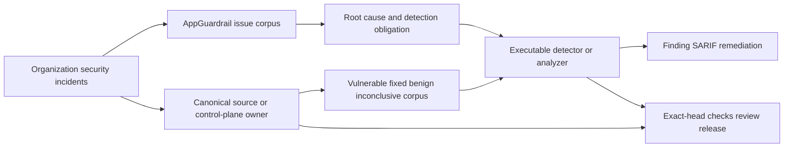

# AppGuardrail product and technical gap baseline

**Scoped refresh:** 2026-09-26
**Authority:** protected PRD/ADR/architecture plus the exact evidence identified below  
**Status:** active-PR working baseline, not a release, certification, or protected-capability claim  
**Canonical writer:** PR #999, `docs/product-technical-gap-baseline`

## Scope and retained evidence

This refresh verifies the #1036 JSON serialization repair and its current CodeQL/review boundary. It also verifies the #1137 network-secret variable boundary and its ordinary successor carryover through #1189, including the #1157 invocation-namespace/path repair, #1158/#1161 credential-flow successors, #1163–#1169 command-rule, directive, file-mode, archive-admission, policy-provenance, SBOM-receipt, and checksum-path successors, the #1170 GitHub merge/release command boundary, the #1171 credential-store boundary, #1172 kubectl/Docker deployment-write boundary, #1173 Terraform/Helm boundary, #1174 Vercel/Fly hosted-deploy boundary, #1175 unsigned-checksum signature-artifact boundary, #1176 bounded path-depth boundary, #1177 AWS/gcloud/az deployment-write boundary, #1179 object-store/containerapp boundary, #1180 registry-publish boundary, #1182 alternate-publish boundary, #1183 gem/NuGet boundary, #1184 Dart pub boundary, #1185 Hex/Conda boundary, #1186 Cabal/Maven boundary, #1187 Gradle/LuaRocks boundary, #1188 SBT/Conan boundary, and #1189 Deno/CocoaPods boundary. It separately verifies #1260's console severity-map own-property repair and executable hostile-key regression, #1217's canonical webhook persistence, HTTPS-only identity, DNS-pinned delivery, redirect, port, missing-key, and successor-carryover boundaries, and #1273's SARIF URI-valued help-metadata repair plus #1269's stacked SARIF rule-index repair and #1226 complete-carryover retirement. It binds the #1192 Caido bootstrap incident to the current `quarantine-sandbox-runtime` HTTP-readiness owner and its positive-LSM evidence boundary. It does **not** relabel every earlier repository/PR observation as current.

The [complete preceding baseline and corpus inventory](product-technical-gap-baseline-history-6d6d7749.md) is incorporated by reference, byte-for-byte, including every detector obligation, prerequisite, FP/FN boundary, Context Map, Gap, action, source/run/artifact identifier, standards reference, and later evidence appendix. Its source is commit `6d6d77495a73a9ae814b138e53c90e2ea19cd3d6`, Git blob `1953b92c6c6fcfbe9a30e2b78094c214c18e6fe6`. The same-directory retained file preserves existing relative-link resolution. Moving a historical observation into a retained snapshot does not close, waive, complete, or retire any valid delta.

This refresh also verifies #1129's path-aware password-indirection repair, aggregate remaining-byte enforcement, symlink-safe `source.path`, and single bounded Claude-plugin artifact inventory. It records both executable RED stages, the exact GREEN tree, resolved review threads, and the still-missing hosted exact-head workflows and qualifying independent review without promoting the stacked Draft to released capability.

Historical timestamps, PR states, head SHAs, and next-action instructions in that inventory must be re-fetched before execution. Substantive unresolved obligations remain open unless later evidence proves completion; newer governing PRD/ADR and CWL DEVELOPMENT PHILOSOPHY v2026-09-02B take precedence over contradictory historical prose. Only the specifically identified #1036/CodeQL, #1137–#1189 plugin-admission, #1192/readiness-owner, #1217 webhook-boundary, #1260 console-severity, #1273 SARIF-metadata, and #1269/#1226 SARIF-index observations below supersede their earlier observations. Other lanes are retained, **not reverified in this refresh**.

The last terminal-complete writer control, head `791e2b5eb5cdf376bf18ce000522bf0117443ff9`, completed all nine of its pull-request workflow runs successfully: Retention Audit Coverage `34706166197`, Security Process `34706166185`, CodeQL PR `34706166188`, Tests `34706166193`, Security Scan `34706166196`, OpenSSF Evidence Coverage `34706166171`, Scan path context coverage `34706166203`, Pinned HTTPS Coverage `34706166195`, and SAST Semgrep `34706166169`. Those results are historical and do not transfer to later heads. #999 still has no qualifying current-head approval and retains eight historical `CHANGES_REQUESTED` reviews; ordinary auto-merge remains the only authorized integration path.

## Goal and evidence contract

AppGuardrail owns the ContextualWisdomLab security-defect corpus and executable scan/SARIF/remediation boundary. The target is USD 20B sale quality through buyer-visible Gap removal, not increasing a rule count or reducing open PRs by closure.

A retained incident is useful when its causal failure, preconditions and observable signals are explicit; the production detector exercises vulnerable, fixed, benign and inconclusive cases; the actual source owner is repaired; and evidence survives ordinary protected integration. Issue text, registry rows, fixtures, model prose, prior-head results and queued workflows are not executable detector truth. Runtime prevention and scanner detection remain separate obligations.

```text
corpus → causal owner/root cause → RED → smallest safe repair → exact-head Checks
→ independent review → ordinary protected merge → immutable release/consumer bump
→ protected-owner oracle refresh → next corpus obligation / buyer-visible Gap
```

Review/check/deployment waits do not block another independent safe lane. No force push, destructive rebase, self-approval, finding suppression, detection bypass, weakened gates, or predecessor-evidence transfer is permitted. Preserve concurrent intent. No valid PR retires without ordinary merge or verified complete successor carryover under the governing exceptions.

## PRD / TRD / architecture status

The canonical documents remain [PRD](PRD.md), [TRD](TRD.md), [ARCHITECTURE](../ARCHITECTURE.md), [UML](UML.md), [ERD](ERD.md), [TRACEABILITY](TRACEABILITY.md), [THREAT_MODEL](THREAT_MODEL.md), [TEST_STRATEGY](TEST_STRATEGY.md), [OPERABILITY](OPERABILITY.md), and the [ADR index](adr/README.md). This document does not create a competing API, schema, detector kernel, or architecture.

The four product planes remain **scan** (detectors/external-engine provenance), **remediate** (safe transformations and reviewable guidance), **control** (tenant-isolated history/authentication/webhook state), and **assurance** (SARIF/report/SBOM/provenance evidence).

The #1036 change alters only the escaped-codepoint alternative of an existing rule. #1157 partitions an existing duplicate-identity admission rule by the documented plugin, Skill/legacy Command, and Agent invocation namespaces; it changes no public schema or finding identity. #1129 replaces repeated eager reads with one internal bounded inventory and narrows an existing psql exemption; it adds no public API, persistent aggregate, or service boundary. Neither repair, #1273's SARIF descriptor serialization change, nor #1269's order-preserving rule-index cache introduces a runtime dependency, database migration, network behavior, permission, workflow, or publication authority. Existing UML/ERD and component boundaries therefore remain unchanged. Future boundary changes must reconcile the owning PRD/TRD/ADR/UML/ERD and security/operability contracts. Rust remains the default for new security/performance runtime work under current CWL governance; this scoped repair is not permission to create a new Python security runtime.

## Context Map



Product repositories retain their domain truth and vulnerable-runtime repair. `ContextualWisdomLab/.github` owns CI/review/security/release control-plane repair; contextual-orchestrator owns provider discovery/routing/delegation and gateway behavior. External engines retain their source/tool/version identity. AppGuardrail consumes released contracts through its own boundary; an owner candidate branch is not permission to copy its implementation, bypass it, or access its database.

## Security-defect corpus — scoped 2026-09-20 observations

| Work | Exact observed evidence | Root cause and detection boundary | Remaining acceptance |
| --- | --- | --- | --- |
| #1036, `feat/skill-supply-chain-detector` | Head `832d066cd3adf6aa455435bc4ef4b12926514b68`, base `develop@e71d37e7c58118e6764c96ab7c4492fe33eed6f8`; open/Ready. Effective repair from `0ef5715468acb674aeb0f3833e820996d4644871` is three normal commits and three paths. | An existing 78-letter raw Cyrillic alphabet had only 39 lowercase letters in its JSON escape alternative, so equivalent uppercase serialized names evaded `skill-name-homoglyph-confusable`. The fix aligns those representations without changing rule identity, severity, paths, or the other three rules. | Eight source/security workflows succeed. CodeQL settlement and qualifying current-head formal approval remain incomplete. No protected merge or release is claimed. |
| Retained #1031 / #1032 threat inventory; #1099 plugin admission | #1099 comment `5644654564` connects the new regression and candidate to its source corpus. | Raw and escaped spellings of the same supported mixed-script identity need the same finding; Cyrillic-only and description-prose values must not supply false mixed-script evidence. | Retain the original incident as regression provenance. #1099 is not completed by this slice; consumers require the eventual released scanner contract. |
| #1129, `security/cwl-issue-detector-families` | RED predecessor `5986b5d83e0dc898bf4dbf43d4287528b54250ff`; fresh-review RED predecessors `546ffaafee3abc472c3b6f83d5a0a68cc80ee604` and `e33d9a22fde6e57da170700e41d56260b1365753`; exact GREEN head `d4f801119ac9eb53fdf84cfd4b3589111f3e8ff5`, tree `7109b3365b30da2848f41443c7843583f36855a4`; stacked on #998 exact `8b95c2bee24567ab3200a96da807259e023eee73`, mergeable Draft. | A path-neutral colon exemption suppressed JS/TS password literals; eager whole-tree materialization and per-file full-budget reads made configured package budgets post-hoc; receipt/license/source/hook/digest consumers rescanned independently; NOTICE-only evidence contradicted the public contract; `Path.exists()` followed a declared `source.path` symlink outside the artifact; read failure collapsed to valid empty bytes; CLI suffix drift skipped JavaScript, TypeScript, and Python hook content. The repair accepts colon-quoted identifiers only on `.sql`/`.psql`, retains quoted `$VAR`, builds one entry/file/byte-bounded inventory reused by every consumer, caps each read at aggregate remaining bytes plus one overflow sentinel, stops at zero remainder, rejects symlinked or uninspectable source-path components, records unreadable regular files as explicit fail-closed evidence while preserving valid empty files, reuses canonical executable suffixes for hook inspection, treats directory-only fanout as oversized, and recognizes non-symlink `LICENSE*`/`NOTICE*`. JS/TS/Python literals, missing/absolute/traversing/symlinked source paths, unreadable manifest/hooks, a single oversized payload, and the first budget overrun remain fail closed. | Initial RED focused set was 6 failed / 9 passed; traversal/source review RED was 3/3; latest unreadable/suffix RED was 6/6. Exact-tree focused tests pass 49/49, coverage-owner tests 32/32 with detector statement coverage 690/690 (100%), the full suite 1,098/1,098, documentation contract 11/11, and compile/diff checks pass. All nine valid review threads are resolved; current RCA is #1099 comment `5746258048`. No hosted exact-head workflow or qualifying independent review exists. Keep Draft until #998 integrates normally, then non-force restack, fresh Checks/review, ordinary merge, immutable release, and LifeOS released-version bump. |
| #1137, `feat/claude-plugin-github-docker-authority-1099` | RED `55f4c02a558bb8e573f27f2467684bc0e8a3b035`; exact GREEN head `07fcbcd0764ff12180e64b7258db96505d1db812`, tree `3920dab8a384a1a89bb6993566f1670a642dd7be`; open/Draft, three ahead / zero behind #1136, mergeable. | `_SECRET_TO_NETWORK` accepted a protected secret name without an identifier terminator. Curl/wget/fetch containing `$OPENAI_API_KEY_DOCUMENTATION` or `${OPENAI_API_KEY_DOCUMENTATION}` was truncated into an `OPENAI_API_KEY` finding. Longer identifier continuations are negative; exact `$NAME` and `${NAME}` network copies remain fail closed. Dynamic indirection and a general shell AST are not claimed. | RED was 2 failed / 1 passed; scoped GREEN is 64/64 with compile/diff checks. There is no hosted exact-head workflow or independent review, so keep Draft. Require current-head coverage/security/CodeQL, approval, ordinary protected integration, release, and consumer validation. |
| #1138 → #1139 → #1140 successor carryover | Ordinary two-parent heads #1138 `94d3d7f5b4d7e16a46291f217f9269d88badf8cc`, #1139 `87d25714d3d7a02eee2cbfcd6759f23a6ea2e901`, and #1140 `e493ba8258f5bacd107f41bc611f301c906d41a6`; each is zero behind its current parent and mergeable. | The chain preserves #1138 unsigned-download/package-install, #1139 released #1036 rule reuse, #1140 materialized plugin scan CLI, and the #1137 precision regression. Scoped exact-tree tests increase 70/70 → 77/77 → 84/84 with compile/diff checks. | All remain Draft without hosted exact-head workflows or independent review. Open/Draft preservation is not completion or evidence transfer. |
| #1141 → #1156 successor carryover | Ordinary two-parent heads extend from #1141 `a1bff47328ca8fe5c762e450537bdbfc692d7292` through #1146 `7bca8ffc0793ad50fc82f957523fe86439711df9`, #1150 `f859b134c4db3e99f64eedc28413931c12dbe90c`, #1151 `df1ba2c3207478393a7fc797470558ad028d931d`, #1153 `b02bfdecec575edf593a72388df2cd749afdf204`, #1154 `fd8673ea21543eb40f05ec0017d20447432d866e`, #1155 `c40e616fa5e4a8268152132e777cbfd8e3da1d14`, and #1156 `12f968c76da6569dd281efdb91b0677fb2e1a754`; each is zero behind its current parent and mergeable. | The chain preserves catalog selection, SARIF receipt, license mismatch, package lifecycle download, dynamic-eval, hidden executable, browser profile, deceptive description, non-standard JSON, malformed UTF-8, NFC identity, vendored scope, and all #1137–#1140 regressions. Exact-tree Claude-plugin tests rise from 104/104 to 205/205 with compile/diff checks. | All remain Draft with zero hosted exact-head workflows and no qualifying independent current-head review. No predecessor evidence transfers and no valid delta is retired. |
| #1157, `feat/claude-plugin-conflicting-identity-1099` | Ordinary two-parent exact head `ba1e146c759e3c6dedd5ea14fe651e0733320697`, tree `c76586500501f96b67f60f1b903a61302028037f`, nine ahead / zero behind current #1156. | The repaired identity logic preserves full legacy Command paths and independent Plugin, Skill/Command, and Agent domains while consuming every predecessor detector. | Exact tree passes the complete Claude-plugin family 221/221 plus compile/diff checks. Zero hosted workflows and no independent approval; keep Draft. |
| #1158, `feat/claude-plugin-secret-to-prompt-1099` | Ordinary two-parent exact head `02d9490358aef41974e0367039cb29a3e712aee8`, tree `8c1816d9f20ff215e54a8aec2f20d7addfd02c44`, four ahead / zero behind current #1157. | Named-secret copies into prompt, log, or child-env sinks remain separate from #1137 network ownership and inherit the full detector lineage. | Exact tree passes the Claude-plugin family 239/239 plus compile/diff checks. Zero hosted workflows and no independent approval; keep Draft. |
| #1161, `feat/claude-plugin-secret-to-mcp-1099` | Ordinary two-parent exact head `e899568e6fd98c0476832054d1f89336ce48af6b`, tree `a5709f7d79acb06f0f3c86c6a74ad05afb4ee858`, ten ahead / zero behind current #1158. | Exact env keys and real `$NAME`, `${NAME}`, or `${NAME:-default}` references in `env`, `args`, `command`, `url`, and headers remain positive; prose and longer identifiers remain negative. | Exact tree passes the Claude-plugin family 256/256 plus compile/diff checks. Zero hosted workflows and no independent approval; keep Draft pending protected integration and release. |
| #1163 → #1169 successor carryover | Ordinary two-parent exact heads: #1163 `edeefc402959d1d8bb1c016b47a885449fa6e0a9` / tree `2d70408b780afc3eb1d385e64631351161d64b88`; #1164 `fe1a2ec5749ad7bba6d1189efb970b73785b4bca` / tree `59e1938524ccfee5dd54524acdb23d6916f0a2f2`; #1165 `4714d13ec38d85a4c2f34e9518064b70127753c8` / tree `5165fd5b7550a6f5a929cd8b86f8d1ef3e637222`; #1166 `348df03ac25d98d6c3ce31b9073f2428b06cd9e0` / tree `a105e56ef887525b0ebead212bc26c6f65cdd013`; #1167 `e091853196297e0bb351752332c017a47525d579` / tree `f6b0886f9b1b1ae16cc15947e37e1a5ef0920746`; #1168 `d39f4c6f0865aa5a83b21c8b6c9c4b25e167d113` / tree `f65f21896960b6faa8c716efe4669b1f5df96105`; #1169 `7f9689b879a6b948a852ac5d78012385199eecff` / tree `efcf85895b37197d44ffb756c6c7c34f78a0da13`. Every head is mergeable and zero behind its current parent. | The chain preserves released #1036 rule reuse on Command/Agent markdown, hide-actions/self-modify/goal-escalation directives, setuid/setgid/world-writable executable modes, zip/tar compression-ratio/nesting/aggregate pre-extraction admission, exact AppGuardrail release/policy provenance, deterministic CycloneDX 1.5 `sbom_sha256`, and first-party checksum admission, together with every #1137–#1161 delta. #1169 additionally preserves the full listed checksum path rather than collapsing missing nested paths to the root basename, and treats only an exact `..` segment as traversal. | Exact-tree Claude-plugin tests rise 265/265 → 275/275 → 287/287 → 311/311 → 317/317 → 323/323 → 352/352; detector/CLI compile and diff checks pass. All seven remain Draft with zero hosted exact-head workflows and no qualifying independent review. The next descendant remains a separate live re-fetch boundary. |
| #1170, `feat/claude-plugin-github-merge-release-1099` | Ordinary two-parent exact head `f5c75be09b9effa753f1c4f29d931ebe74bc786f`, tree `ab082b4e4aa67e012d62e6fe7cd4520057381332`; five ahead / zero behind current #1169, mergeable. | Hook or structural manifest `gh pr merge` and `gh release create|upload|delete|edit` fail closed. Direct typed argv and bounded `sh|bash -c` payloads are positive; description/reporting/assignment/noexec text, malformed/mixed argv, near verbs and non-write verbs remain negative. The successor retains #1169 nested checksum path and exact `..` traversal boundaries. | Targeted GitHub/checksum regression is 60/60 and the complete exact-tree Claude-plugin family is 383/383; compile and diff checks pass. Zero hosted exact-head workflows and no qualifying independent review; keep Draft. Dynamic shell construction beyond bounded literal payloads remains outside this slice. |
| #1171, `feat/claude-plugin-credential-store-1099` | Ordinary two-parent exact head `c4ad59b28f6c3e9c9c1e5fa11f7db557d98799c3`, tree `f8002385507b8bb97ba917c7085305b3c2d207e3`; six ahead / zero behind current #1170, mergeable. | Direct hook or structural-manifest access to netrc, AWS/GitHub CLI/Docker auth, cookie jars, curl home, or SSH private keys fails as `claude-plugin-credential-store-access` with path-label-only snippets. Browser profiles, PAT literals, GitHub merge, Docker socket and benign README/inventory cases retain separate findings or negative boundaries. | Targeted credential/GitHub/checksum regression is 77/77 and the full exact-tree Claude-plugin family is 400/400; compile and diff checks pass. Zero hosted exact-head workflows and no qualifying independent review; keep Draft. |
| #1172, `feat/claude-plugin-deployment-write-1099` | Ordinary two-parent exact head `00cdb7966e10f6f6e283b10619723cefb8b4676a`, tree `84a0ddcdb6138eadb3d0152b2ed86f57b66c901d`; nine ahead / zero behind current #1171, mergeable. | Executable hook or structural-manifest `kubectl apply`, `docker push`, and `docker image push` fail closed, including typed argv and bounded literal `sh|bash -c` payloads. Description/reporting/assignment/noexec content, malformed/near argv, kubectl get, Docker ps/pull, Terraform/Helm, Docker sockets, credential stores, and GitHub writes retain negative or separate-rule boundaries. | Targeted deployment/credential/GitHub/checksum regression is 109/109 and the full exact-tree Claude-plugin family is 432/432; dynamic-eval, compile, and diff checks are preserved. Zero hosted exact-head workflows and no qualifying independent review; keep Draft. |
| #1173, `feat/claude-plugin-terraform-helm-1099` | Ordinary two-parent exact head `6ec09ee32c972655f9e85eea7424df6ad9d3bff5`, tree `a3cf421773e52d39843575490d513287889deb0e`; 42 ahead / zero behind current #1172, mergeable. | Executable hook or structural-manifest `terraform apply` and `helm install` fail closed, including admitted typed argv and bounded literal nested-shell payloads. Reporting/prose/assignment/noexec, malformed argv, wrapper, non-write and near-verb cases remain negative; checksum, GitHub write, credential-store, kubectl/Docker, and dynamic-eval deltas remain present. | Targeted deployment/Terraform/Helm/credential/GitHub/checksum regression is 138/138 and the full exact-tree Claude-plugin family is 461/461; compile and diff checks pass. Zero hosted exact-head workflows and no qualifying independent review; keep Draft. Dynamic wrappers and multiline/dynamic payloads remain bounded follow-up. |
| #1174, `feat/claude-plugin-hosted-deploy-1099` | Ordinary two-parent exact head `efa33479920c2ccfd28bfaeba3cb304f91ce9dfb`, tree `7bc6c895bfa6ec224333265f15937d8346e1d8f3`; 17 ahead / zero behind current #1173, mergeable. | Executable hook or structural-manifest `vercel deploy`, `fly deploy`, and `flyctl deploy` fail closed while reporting/prose/comment and read-only verbs remain outside this class. Restack exposed two fixture-contract failures: a predecessor inventory/pass expectation contradicted this successor's intended ownership, and removal of the declared hook reference correctly raised the separate undeclared-executable rule. The minimal test repair preserves both fail-closed classes. | Hosted/Terraform boundary tests pass 53/53, related detector tests 162/162, and the complete exact-tree Claude-plugin family 485/485; compile and diff checks pass. Zero hosted exact-head workflows and no qualifying independent review; keep Draft. |
| #1175, `feat/claude-plugin-unsigned-checksum-1099` | Ordinary two-parent exact head `5ef57856c2c634b8666ac1017753688bb1702921`, tree `4e5be66317d4768f3f96723581a9b688d6c28e70`; 14 ahead / zero behind current #1174, mergeable. Before integration the branch was 13 ahead / 94 behind and its exact tree reported two stale fixture-contract failures with 426 passes. | The ordinary merge preserves #1175's six-file unsigned-checksum delta and every #1174 repair. A digest row without a non-empty regular sibling `.sig`, `.asc`, `.gpg`, `.bundle`, or `.cosign.bundle` artifact fails `claude-plugin-unsigned-checksum`. Missing or comment-only checksums remain negative; zero-byte and symlink signature files do not admit the package. Digest mismatch remains a separate finding, and this slice does not claim network cryptographic verification. | Focused unsigned-checksum/checksum/hosted/Terraform tests pass 95/95 and the complete exact-tree Claude-plugin family passes 498/498; detector/CLI compile and diff checks pass. Zero hosted exact-head workflows and no qualifying independent review; keep Draft. |
| #1176, `feat/claude-plugin-path-depth-1099` | Ordinary two-parent exact head `b27bd3fe3276544da4f608979b43977e302fa608`, tree `04709f22db48fd541be92b76594732790206ac4d`; 14 ahead / zero behind current #1175, mergeable. Its superseded tree reproduced two stale fixture-contract failures with 436 passes. | A materialized tree or admitted zip/tar member with more than 32 non-empty, non-`.` path components fails `claude-plugin-excessive-path-depth`; exactly 32 is negative. Mixed separators are normalized, archive members are inspected without extraction, and multiple deep tree files collapse to one sanitized tree finding. Zip-slip remains traversal; nested archives and compression/byte budgets remain separate classes. Symlink directories are not followed, and hostile path names, bidi controls, and secrets are absent from snippets and messages. | Focused path-depth/checksum/hosted/Terraform tests pass 105/105 and the complete exact-tree Claude-plugin family passes 508/508; detector/CLI compile and diff checks pass. Zero hosted exact-head workflows, reviews, or review threads; keep Draft. |
| #1177, `feat/claude-plugin-cloud-deploy-1099` | Ordinary two-parent exact head `e820491cc44ed01ac080e966dc3bf7294fcb31cb`, tree `266fb77bcb549ff868d66c047387c175649141a5`; 15 ahead / zero behind current #1176, mergeable. Its superseded tree reproduced three fixture-contract failures with 449 passes. | Executable `aws cloudformation deploy`, `aws deploy create-deployment`, `gcloud run|app|functions deploy`, and `az webapp deploy` fail closed under three provider-specific rule IDs. Read-only cloud commands, README/description prose, comments, and reporting builtins remain negative; a reporting command does not hide a later executable deploy. Vercel/Fly and undeclared executables remain separate classes. Snippets contain canonical command labels, not secrets or bidi controls. | The remaining #1177 fixture RED preserved the separate `claude-plugin-undeclared-executable` invariant by retaining its declared hook reference rather than suppressing a finding. Focused cloud/path-depth/checksum/hosted/Terraform tests pass 106/106 and the complete exact-tree Claude-plugin family passes 522/522; detector/CLI compile and diff checks pass. Zero hosted exact-head workflows and no qualifying independent review; keep Draft. |
| #1179, `feat/claude-plugin-object-store-1099` | Ordinary two-parent exact head `9ff0a9b7947d391398429f2122fb9652ac8ca8b7`, tree `dcfb6c8716ace462bf7700b572abb5bc7b36fcb7`; 17 ahead / zero behind current #1177, mergeable. Its superseded tree reproduced one stale Terraform/Helm fixture failure with 466 passes. | Local-to-S3 and S3-to-S3 `aws s3 cp|sync` fail as `claude-plugin-aws-s3-write-command`; `az containerapp up` fails as `claude-plugin-az-containerapp-up-command`. Provable direct literal S3-to-local downloads, `aws s3 ls`, prose, comments, and reporting builtins remain negative/inventory. Dynamic or ambiguous direction fails closed, and an earlier safe download cannot hide a later upload. CloudFormation, `az webapp deploy`, and hosted deploys remain separate classes. | Focused object-store/cloud/path-depth/checksum/hosted/Terraform tests pass 121/121 and the complete exact-tree Claude-plugin family passes 537/537; detector/CLI compile and diff checks pass. Zero hosted exact-head workflows and no qualifying independent review; keep Draft. |
| #1180, `feat/claude-plugin-registry-publish-1099` | Ordinary two-parent exact head `ee39a153c31324df508f7091cd2b8abbf3840240`, tree `982714aa47460b46c31cfc224979169a9a71ae5a`; 15 ahead / zero behind current #1179, mergeable. Its superseded tree reproduced one stale Terraform/Helm fixture failure with 478 passes. | Executable `npm publish`, `twine upload`, `python -m twine upload`, and `cargo publish` fail under three registry-specific rule IDs. `npm pack`, `cargo check`, `pip install`, prose, comments, and reporting builtins remain negative/inventory; S3 writes retain their separate class. Snippets contain canonical command labels rather than secret or bidi-bearing operands. | Focused registry/object-store/cloud/path-depth/hosted/Terraform tests pass 104/104 and the complete exact-tree Claude-plugin family passes 549/549; detector/CLI compile and diff checks pass. Zero hosted exact-head workflows and no qualifying independent review; keep Draft. |
| #1182, `feat/claude-plugin-alt-publish-1099` | Ordinary two-parent exact head `a931e296f3a54d2a308dfa0a9bc54fa08160f615`, tree `e59c4b33ba710e7c8364b0f61614aeb86714854a`; 12 ahead / zero behind current #1180, mergeable. The prior head was 99 behind after #1180 advanced. | Executable `pnpm publish`, `uv publish`, and `poetry publish` fail under three alternate-publish rule IDs. The only restack conflict was the detector constant block; resolution retains #1180's structured argv, bounded nested-shell parser, and non-executing-builtin boundary. `pnpm list`, prose, comments, reporting builtins, and near/non-write commands remain negative. | Focused alternate/registry tests pass 24/24 and the full exact-tree Claude-plugin family passes 561/561; compile, conflict-marker, and diff checks pass. Zero hosted workflows, reviews, or threads; keep Draft. |
| #1183, `feat/claude-plugin-gem-nuget-1099` | Ordinary two-parent exact head `6950bc2f1a270a8a500d93797b9898f251eca1cc`, tree `74246e730ced03fe9ef98b2c498a87508db4f3c1`; 12 ahead / zero behind current #1182, mergeable. | Executable `gem push`, `nuget push`, and `dotnet nuget push` fail under their registry-specific rules. The constants-only merge preserves structured argv, nested-shell/reporting boundaries and every predecessor detector; list/prose/comment/reporting and near verbs remain negative. | Focused registry-chain tests pass 35/35 and the full Claude-plugin family passes 572/572; compile, conflict-marker, and diff checks pass. Zero hosted workflows, reviews, or threads; keep Draft. |
| #1184, `feat/claude-plugin-pub-publish-1099` | Ordinary two-parent exact head `8aca982fde90bf6c04a66bf9c8931c8b4a5b32d5`, tree `7fc5c3d281fd1924becd1611a5934ab03ef5a4e9`; 10 ahead / zero behind current #1183, mergeable. | Executable `dart pub publish`, `flutter pub publish`, and legacy `pub publish` fail under one bounded rule. `pub get`, prose, comments, reporting builtins, and nonexistent `composer publish`/`go upload` inventions remain negative. The constants-only merge retains every predecessor parser and detector. | Focused registry-chain tests pass 46/46 and the full Claude-plugin family passes 583/583; compile, conflict-marker, and diff checks pass. Zero hosted workflows, reviews, or threads; keep Draft. |
| #1185, `feat/claude-plugin-hex-conda-1099` | Ordinary two-parent exact head `f47582aad40921503c1c029fe700d26c0fda93a9`, tree `b67abcfa074dbbac3f515b31434165b56020ff46`; nine ahead / zero behind current #1184, mergeable, five effective files. | Executable `hex publish`, `mix hex.publish`, `conda upload`, and `anaconda upload` fail under two registry-specific rules. The constants-only resolution preserves structured argv, bounded nested shell, literal heredoc, assignment-prefix, and non-executing reporting-builtin boundaries. `hex info`, `conda list`, prose, comments, reporting builtins, and nonexistent `composer publish`/`go upload` remain negative. | Focused Hex/Conda plus pub/gem/alternate/base-registry tests pass 59/59 and the full exact-tree Claude-plugin family passes 596/596; compile, conflict-marker, and diff checks pass. Zero hosted workflows, reviews, or threads; keep Draft. |
| #1186, `feat/claude-plugin-cabal-mvn-1099` | Ordinary two-parent exact head `bc30ea9b3ed4abed9cb08da80a3392c8690a1aa0`, tree `514c6ee03d9c5436b0203768afe5a0d169e7c3c0`; six ahead / zero behind current #1185, mergeable, five effective files. | Executable `cabal upload`, `cabal v2-upload`, `mvn deploy`, and `mvn deploy:deploy-file` fail under two registry-specific rules. The constants-only resolution preserves structured argv, bounded nested shell, literal heredoc, assignment-prefix, and non-executing reporting-builtin boundaries. `cabal list`, `mvn package`, prose, comments, assignment values, reporting builtins, and nonexistent `composer publish`/`go upload` remain negative. | Focused Cabal/Maven plus Hex/Conda, pub, gem/NuGet, alternate, and base-registry tests pass 74/74 and the full exact-tree Claude-plugin family passes 611/611; compile, conflict-marker, and diff checks pass. Zero hosted workflows, reviews, or threads; keep Draft. |
| #1187, `feat/claude-plugin-gradle-luarocks-1099` | Ordinary two-parent exact head `ea9860218ddb7ae2901df2011980c5207aa88d6d`, tree `bfe641bb8e121043dfcc51352bdfa22e6dbab076`; three ahead / zero behind current #1186, mergeable, five effective files. | Executable `gradle publish`, `gradlew publish`, and `luarocks upload` fail under two registry-specific rules. Conflict resolution preserves structured argv, bounded nested shell, literal heredoc, assignment-prefix, non-executing reporting-builtin boundaries, and #1174's Vercel/Fly hosted-deploy fail-closed fixture. `gradle tasks`, `gradle publishToMavenLocal`, `luarocks list`, prose, comments, assignment values, reporting builtins, and nonexistent `composer publish`/`go upload` remain negative. | Focused Gradle/LuaRocks plus Cabal/Maven, Hex/Conda, pub, gem/NuGet, alternate, base-registry, Terraform/Helm, and hosted-deploy tests pass 142/142 and the full exact-tree Claude-plugin family passes 626/626; compile, conflict-marker, and diff checks pass. Zero hosted workflows, reviews, or threads; keep Draft. |
| #1188, `feat/claude-plugin-sbt-conan-1099` | Ordinary two-parent exact head `5713782b7401c7f64d9ca64f0e52ac74ef83594b`, tree `4f70bd403c3c30b5540dba7a730887d84bffcd69`; 11 ahead / zero behind current #1187, mergeable, five effective files. The superseded exact tree was 10 ahead / 105 behind and passed focused 93/93 and the then-present Claude-plugin family 573/573. | Executable `sbt publish`, `sbt publishSigned`, quoted SBT tasks, executable command-substitution/backtick tasks, and `conan upload` fail under two registry-specific rules. Conflict resolution preserves the child rules and #1187's structured argv, bounded nested shell, literal heredoc, assignment-prefix, expanded non-executing-builtin, Gradle/LuaRocks, and hosted-deploy fixture contracts. `sbt compile`, `sbt publishLocal`, `conan list`, prose, comments, assignment values, reporting builtins, and nonexistent `composer publish`/`go upload` remain negative. | Focused registry/hosted/Terraform tests pass 159/159 and the complete exact-tree Claude-plugin family passes 643/643; compile, conflict-marker, and diff checks pass. Zero hosted workflows, reviews, or threads; keep Draft. |
| #1189, `feat/claude-plugin-deno-pod-1099` | Ordinary two-parent exact head `66e5e7d2287b7887223b40f47447f51aab2dd844`, tree `54135ffc6d1f68c3f394a8c28e78a6e162e9003a`; 17 ahead / zero behind current #1188, mergeable, five effective files. The superseded exact tree was 16 ahead / 106 behind and passed focused 65/65 and the then-present Claude-plugin family 591/591. | Exact executable `deno publish` and `pod trunk push`, including supported quoted CLI/task tokens and inherited bounded argv/nested-shell surfaces, fail under two registry-specific rules. Conflict resolution preserves the child patterns and #1188's structured argv, bounded nested shell, literal heredoc, assignment-prefix, expanded non-executing-builtin, SBT/Conan, Gradle/LuaRocks, and hosted-deploy contracts. `deno info`, near-task suffixes, `pod install`, `pod lib lint`, prose, comments, assignment values, reporting/no-op builtins, malformed or cross-line token assembly, and nonexistent package-manager commands remain negative. | Focused Deno/Pod plus predecessor-boundary tests pass 193/193 and the complete exact-tree Claude-plugin family passes 661/661; compile, conflict-marker, and diff checks pass. Zero hosted workflows, reviews, or threads; keep Draft. |
| #1260, `sentinel/fix-prototype-pollution-5095804661662656300` | Current exact head `0f78f678bde544bda8747dcf5080dc145b1eed91`, tree `4f55cd8f2667e2e592d7ba798361d0c9085fd12b`, is a third semantically inverted deletion child after two ordinary restorations; mergeable Draft. | The original finding misclassified a prototype-chain read as prototype pollution. The verified repair admitted only `SEV` own properties and carried an executable hostile-key regression, but the current concurrent child again deletes that source, regression, CHANGELOG, and RCA and restores raw `SEV[f.severity]`. The current tree is therefore known regressed, not GREEN. | Two direct ordinary restorations proved tree `d2809387...` byte-identical to the 1,003/1,003 GREEN tree, but the active writer repeated the same deletion after each. Eight current-head workflows are queued and SAST is pending; the old approval is stale. Keep Draft and resolve single-writer control before another non-force repair rather than creating an unbounded push loop. |
| #1217, `sentinel-webhook-ssrf-fix-18308094337624526944` | Ordinary-forward exact head `49bf978e934f5c0344a9b568000eb0513e90b530`, tree `4cb263bd7f4e9f0f0e543dd824e16679d36b1d86`; 27 ahead / zero behind `develop`, mergeable Draft. The latest commit is tree-identical to verified owner head `43bc6ba3...`. | The control plane validated one DNS answer and then let `urllib` re-resolve the original hostname for the TCP connection and redirects, leaving a DNS-rebinding TOCTOU gap. Both control-plane and CLI validators now reuse `appguardrail_core.pinned_https`: one resolver decision per HTTPS hop, rejection of every non-global answer, immutable pinned TCP peers, original hostname for TLS identity, bounded responses, and independently validated redirects. Explicit `null` and empty-string deletion remain allowed. | Focused GREEN is 119/119 and the full tree passes 1,029/1,029 on the byte-identical verified owner tree. All nine new exact-head workflows are queued; predecessor review and Checks do not transfer. Valid deltas from #1210/#1231/#1239/#1246/#1262/#1268/#1271 remain carried. |
| #1273, `fix/sarif-help-uri-1216` | RED `75f0ea84f45e197c201b9fed166f9d74a4c9c893`; exact GREEN head `e97f7b20a87f671e3ebfd4ef695c4d41f9dd2f87`, tree `45c9792fcece41b34f948858c6b7a156ed4ba8c6`; two ahead / zero behind `develop`, mergeable Draft. | `findings_to_sarif` copied a human-readable taxonomy reference into URI-valued SARIF `helpUri`. The repair maps repository-owned OWASP defaults to canonical pages, preserves labels in `help.text`, keeps absolute HTTP(S) references, and omits unknown `helpUri`. | RED is 1 failed / 4 passed; focused GREEN 5/5 and full tree 1,002/1,002. Eight workflows are GREEN, but CodeQL `35469231488` failed and the current review state is `CHANGES_REQUESTED`; no protected merge or release is claimed. |
| #1269 canonical successor / retired #1226 duplicate | #1269 exact head `afa17f1cb65478ec8dba5fc5f027a71b4a17fdfc`, tree `ddf763a64cf8dc6d4f38be4e75cbf0a38906b95b`; four ahead / zero behind #1273, mergeable Draft, four effective files. Concurrent head `bd8f5bef98b53e765ee783b0306e9d0ecfac8025` removed the stacked #1273 URI mapping, `help.text`, regression fixtures, changelog fragments, and repeated-rule assertion; normal child `afa17f1c…` restores the audited tree without force update. #1226 `48404ed94d780bcced961b35c48d8ae3e8bc4591` is closed unmerged only after comment `5745354776` recorded complete carryover. | The concurrent writer reconstructed the performance change from an older `develop` shape instead of preserving the current stacked base contract. The recovered canonical successor preserves #1273 URI/display-text semantics, records M findings/R rules complexity as O(M × R) before and O(M + R) after, adds repeated-rule output-index regression and a CHANGELOG fragment, and retains the bounded measurement. | Recovery rerun: focused SARIF 5/5 and full exact tree 1,002/1,002; compile and diff checks pass. The transient regressed head had no hosted evidence. The new exact head currently has no associated hosted runs or qualifying approval; unresolved threads are zero. Keep Draft behind #1273 and require fresh exact-head Checks/review. RCA is bound to #1099 comment `5745607529`. |
| CodeQL PR `34682258948`, attempts 1–2 | Target #1036 stayed at `832d066...`. Attempt 1 Python `103523090675` and Actions `103523090685` failed with `VERDICT_STATE=pending`; dispatch `103523411245` succeeded. After #999 supplied a fresh same-workflow terminal-success control, one failed-jobs rerun produced attempt 2: detect `103529760411` succeeded; Python `103529760009` and Actions `103529760067` each found the matching central dispatch scan job terminal `failure` and failed with `DISPATCH_OUTCOME=success`, `VERDICT_STATE=failure`; dispatch `103530557110` succeeded. | Dispatch success is not scan/SARIF success. Attempt 2 replaces the pending observation with an authenticated terminal producer-job failure while leaving the detector's passing test result separate. | Preserve the required check as failed. No further rerun without a central cause change; no synthetic status, leaf workaround, source-neutral trigger, or approval transfer. |
| Canonical central CodeQL owner #2040 and related #2051 | Fresh owner head is Draft `85522306949bada2b5939608dc911f6374125f1b` on `main@fb17ef556f94f673234aa557254ae52779e9a7b0`, 150 ahead / zero behind, mergeable, 29 effective files. Python Security, Runtime Quality, Trusted uv Materializer Quality, Security Scan, and SAST Semgrep succeeded. CodeQL PR `34686930801` detect and dispatch jobs succeeded, while actions `103535474643` and Python `103535474644` failed at the intentional first-attempt handoff with `DISPATCH_OUTCOME=success`, `VERDICT_STATE=pending`. | The exact logs prove dispatch without an authenticated terminal producer verdict; they do not prove scan success or the separate #2051 base-ref mismatch. No consumer result transfers to the owner. | Keep #2040 Draft while the producer publishes and reruns the exact failed jobs. Require terminal exact-head gates, zero valid unresolved findings, qualifying independent approval, ordinary protected integration, immutable owner release, and consumer validation; no release is claimed. |
| #1192 → `quarantine-sandbox-runtime` #103 / Draft #104 | Owner head `4d738ccc52a3acb3d6ea621e306f628074c96122`, base `feat/runtime-foundation-tdd@5c6a44bb2b35eb17d0315d72db242f4488c3c426`. Native CI `34270054863`: verify `102209085115`, coverage `102209084826`, branch coverage `102209084792`, and hosted negative rootless/AppArmor `102209084617` succeeded; positive-LSM `102209085130` completed `cancelled` before checkout and emitted no job log. | The #1192 Strix specimen exposed a Caido loopback-readiness boundary. #104 causally repaired TCP-only false readiness, runtime-selected Host authority, and malformed HTTP 2xx admission in the canonical runtime owner. Functional GREEN does not supply effective positive confinement evidence. | Keep #104 Draft. `.github#1590` owns the eligible rootless SELinux runner, #2083 owns the released reusable workflow, and #712 owns queue/materialization health. A cancelled required job maps to `incomplete`; no protected integration, immutable release, or consumer bump is claimed. |

### Actual RED to GREEN execution

RED commit `e33988082a5a2c146d4fa27087c3e766a5409603` adds `tests/test_skill_homoglyph_json_case_equivalence.py`. Its 164 cases exercise the real packaged rule loader and production `_scan_file`: 78 mixed-script cases across raw/lower-hex/upper-hex forms, 78 Cyrillic-only negatives, four description negatives, and four alternate `skill`-key positives. JSON decoding verifies value equivalence independently of the matcher.

Hosted RED Tests run `34682100611`, Python 3.13 job `103522497980`, reported **43 failed / 1161 passed**. These were the 39 uppercase name cases and four alternate-key cases. Production commit `79531336a02a05e10fb194b6b021e91ba48e3353` changed all four escaped-codepoint atoms to the same declared alphabet. Final documentation head is `832d066cd3adf6aa455435bc4ef4b12926514b68`.

Hosted final-head Tests run `34682258917`, Python 3.13 job `103522937485`, reported **1204 passed in 14.91 seconds**. Python 3.11 job `103522937541` also completed successfully. The actual checkout is synthetic merge `f1fff397a326b2226134babbd3592babca0f4280`, merging this exact candidate into the base above. Tests, Security Process, Security Scan, SAST Semgrep, Pinned HTTPS Coverage, OpenSSF Evidence Coverage, Retention Audit Coverage, and Scan path context coverage are terminal-success for the candidate's pull-request runs. These facts do not prove global 100% coverage, every security property, or central required-review completion.

Supplemental local probes compiled the packaged expressions and exhaustively compared all 65,536 BMP escape values with the declared 78-letter alphabet. The local repository clone failed DNS resolution; no local full-suite execution is claimed. This remains bounded serialization parity, not arbitrary JSON/YAML parsing or universal confusable detection.

CodeRabbit comment `3995612697` reviewed the RED head. Reply `3995617271` independently inspected final head `832d066...`, confirmed the repair and production-path regressions, and resolved that source thread. All visible inline threads were resolved at this observation. A resolved finding/comment review is not a qualifying formal APPROVED review, and the old Noema approval cannot transfer to this head.

## Detector-development contract

Each retained claim records root cause, preconditions, independently observable signals, false-positive and false-negative boundaries, canonical owner, vulnerable/fixed/benign/inconclusive regression evidence, and exact-head acceptance. Historical fixed incidents remain in that corpus. Stateful syntax/control-flow that no longer fits a bounded rule must converge on the canonical structural analyzer with differential historical oracles; another regex is not an automatic solution.

The complete per-lane obligations and prerequisite graph remain in the [retained corpus inventory](product-technical-gap-baseline-history-6d6d7749.md). In particular, #1088/#1133/#1152, #1080, #1068/#1107, #998, #963 and its Clearfolio causal owner, the #1099 plugin stack, and the #1117/#1192/#1131 dashboard lanes are not closed, superseded, or newly certified by this refresh.

## Assurance state mapping

Retain the candidate `appguardrail.scan-assurance.v1` field `scan_outcome_code`: `clean`, `findings_present`, `incomplete`, `failed`, or `untrusted`. These names do not turn the unmerged #972/#1005 contracts into released functionality.

| Evidence condition | Mapping | Consumer obligation |
| --- | --- | --- |
| All required current identity/digest-valid evidence completed | `clean` only with zero findings; otherwise `findings_present` | Only `clean` may display Clean Scan; apply finding thresholds to findings_present. |
| Missing, queued, running, cancelled, unavailable, inconclusive, stale, or incomplete required execution/detectors/engines | `incomplete`, preserving the original reason | Withhold a clean result and fail the deploy gate closed. |
| Scanner or requested engine execution failed | `failed` | Preserve failure rather than converting it into zero findings. |
| Malformed evidence, repository/commit/digest/count mismatch, future timestamp, or invalid provenance | `untrusted` | Reject the assurance claim. |

The evidence execution lifecycle remains `completed`/`failed`/`incomplete`; external-engine state remains `completed`/`unavailable`/`failed`/`not_requested`. Dashboard, JSON, SARIF, report and gate consumers must agree on the assurance envelope. Missing envelopes never default to clean. The CodeQL pending handoff above remains a failed required check with its pending-verdict reason, not a successful scan.

## Buyer-visible Gap register

Gap identities are preserved. Unrefreshed evidence and detailed exit criteria remain incorporated from the retained inventory; no row below claims new completion.

| ID | Buyer-visible Gap | Owner / retained work | This refresh / required exit |
| --- | --- | --- | --- |
| G-01 | Prove authoritative source conditions rather than caller assertions. | Source-backed detector/evidence owners | Retained in progress; unchanged-head positive/negative/malformed/unavailable/stale cases and immutable source evidence. |
| G-02 | Prevent zero findings from overstating incomplete assurance. | #972 contract; #1005 and later consumers | Retained active work, not reverified; one JSON/SARIF/dashboard/report/gate outcome with missing evidence non-clean. #1273 repairs one bounded SARIF descriptor-validity failure without claiming the wider assurance envelope complete. |
| G-03 | Safely hand remediation/evidence to agent workflows. | Issue #928 / #1006; separate UI/CSP/clipboard work | Retained open; redaction, digest/schema, accessible fallback/focus and hostile-content browser evidence. #1260 repairs one bounded console severity-map own-property failure with executable hostile-key evidence; it does not close the wider UI assurance Gap. |
| G-04 | Defensible retention, deletion, audit and recovery. | Tenant-owned control-plane persistence | Retained open; authorization, migration/rollback, backup/restore, immutable audit and release evidence. |
| G-05 | Compact exact-head buyer evidence package. | Assurance/report/operability owners | Retained open; reproducible source/check/artifact/release digests without raw secrets. |
| G-06 | Resolve stateful regex FP/FN divergence structurally. | #1088/#1133/#1152; #1080; #1099 command-state owners | Still in progress. #1036 closes one bounded spelling-parity miss; #1137 prevents protected secret-name prefix truncation on network commands, with verified carryover through #1189; #1157 repairs invocation-identity domains; #1161 distinguishes real MCP secret references from prose/prefixes and covers the documented URL/header surfaces; #1163–#1189 preserve distinct instruction, mode, archive, provenance, SBOM-digest, checksum-path, bounded GitHub command-context, credential-store, kubectl/Docker, Terraform/Helm, hosted-deploy, unsigned-signature-artifact, path-depth, cloud-provider deployment-write, object-store direction, and registry-publish boundaries. #1129 closes the bounded psql-vs-JS indirection contradiction, makes the existing package budgets operative at traversal/read time, and rejects declared source-path symlink escapes, but it does not claim general language parsing. These bounded fixes do not close the structural-analysis Gap. Preserve historical rule IDs, reachability/state oracles and realistic performance evidence. |
| G-07 | Remove shared required-review/security capacity and settlement failures. | Canonical `.github` / contextual-orchestrator owners | Still open. #2040 has the exact CodeQL consumer canary. The #104 positive-LSM job `102209085130` was cancelled before execution; #1590/#2083/#712 remain the canonical runner/workflow/queue owners. Require authentic terminal evidence, owner GREEN/release and consumer validation. |
| G-08 | Keep the baseline fresh without relabelling stale evidence. | Single writer #999 | Scoped September 26 #1260, #1324, and #1327 evidence is current only for the named exact heads; September 20 observations remain historical and separate from the exact retained prior blob. Re-fetch every other lane before action; ordinary integration and future material refreshes remain required. |

### 2026-09-26 exact refresh — Python shell-call detector (#1324)

PR [#1324](https://github.com/ContextualWisdomLab/appguardrail/pull/1324) is the canonical active owner for the bounded Python shell-call rule repair. Exact head `d8e5af78aa683d94fb2b46c3a4cd376ecc5b12c4` and tree `5e031529b79e0fa3ec13e86cd7a76fc2a03d55e4` are 8 commits ahead / 0 behind protected `develop@e71d37e7c58118e6764c96ab7c4492fe33eed6f8`. Concurrent child `bdef14c0...` replaced the verified finder, deleted 56 lines of regression and the CHANGELOG fragment, and added a backdated regex claim. Exact-production RED detected only 5/6 positive calls because `shell=enabled` became a false negative and reported line start instead of the executable call after UTF-8 text. Ordinary child `d8e5af78...` retains that commit in ancestry while restoring the verified tree; compared with prior GREEN `8d9a6963...` it is 2 ahead / 0 behind with zero effective diff.

The predecessor raw regex reproduced two contract failures: comments/string literals became CRITICAL false positives, and a nested argument before `shell=True` became a false negative. Fresh review then reproduced a wrong-line finding when form feed preceded the real Python newline and a coverage regression for module-qualified `wrapper.os.system(...)`. The ordinary descendants use a standard-library AST finder for direct or module-qualified `os.system` and `subprocess` calls, map only `\n`/`\r\n`/`\r` as Python line boundaries, preserve UTF-8 columns, and retain the legacy regex only for syntax-invalid Python. The generated retrospective `.jules/sentinel.md` delta is absent from the effective protected-base diff; the release-facing delta is recorded in `CHANGELOG.d/1324-python-command-injection-detector.md`.

Exact remote-blob evidence remains compile 2/2, positive 6/6, negative 5/5, separator offsets 2/2, Python newline offsets 3/3, and invalid-syntax fallback 1/1; the focused concurrent-recovery execution independently confirmed positive 6/6, negative 0, UTF-8 exact offset, separator offsets 2/2, invalid fallback 1/1, and production compile. The prior review thread is resolved; all nine new hosted workflows are queued and there is no qualifying exact-head approval. Issue #1099 comments `5844928920` and `5845303014` preserve the original and concurrent-regression RCA. Therefore #1324 remains Draft and provides neither protected functionality nor release evidence.

### 2026-09-26 exact refresh — canonical webhook owner and stored-SSRF detector (#1217 / #1327)

PR [#1217](https://github.com/ContextualWisdomLab/appguardrail/pull/1217) remains the canonical runtime owner at exact head `49bf978e934f5c0344a9b568000eb0513e90b530`, tree `4cb263bd7f4e9f0f0e543dd824e16679d36b1d86`; its newest ordinary child is tree-identical to the verified owner. PR [#1327](https://github.com/ContextualWisdomLab/appguardrail/pull/1327) is an additive detector successor at exact head `a66c5fc55c095535ba6d885ff6705ace6540acfe`, tree `aa15a32e7583eab9ebdffb97770decdac2975068`, 8 commits ahead / 0 behind #1217. Concurrent child `f1ebd72e...` modified canonical production/CLI and removed the 154-line persistence fixture plus detector CHANGELOG; ordinary two-parent `de921817...` retains that child and current owner in ancestry while restoring the verified detector-only tree. Current child `a66c5fc5...` is tree-identical and adds no effective file delta. The effective delta remains limited to `scanner/rules/ssrf.yml`, `tests/test_ssrf_rules.py`, and `CHANGELOG.d/1327-stored-ssrf-rule-contract.md`; the production `appguardrail_core/controlplane.py` blob remains byte-identical to #1217 (`d05e7b079d0564bc7b9956f0f164a79e87dfbf81`).

The detector initially treated any nearby `try: set_webhook(...) except ValueError` as proof that a later URL sink was guarded. A rejected unrelated `set_webhook(..., None)` therefore hid a subsequent unsafe `set_webhook(..., webhook_url)`. The repaired rule binds the exception exclusion to the same captured URL variable and may cross unrelated sinks to find the later unsafe write. Exact remote-blob evidence is positive 8/8, negative 4/4, canonical #1217 production negative 1/1, and compile 2/2. The sole review thread is resolved and CodeRabbit independently reproduced the repaired three-case boundary. Issue #1099 comment `5844883035` preserves the RCA.

#1327 remains mergeable Draft. All nine hosted workflows are queued and no qualifying approval exists. Its detector delta cannot replace, fork, or weaken #1217's DNS-pinned HTTPS transport, TLS hostname, redirect, missing-key, port/DNS-failure, persistence, or explicit-clear contracts. Neither candidate is protected functionality or release evidence.

### 2026-09-26 exact refresh — console severity own-property guard (#1260)

PR [#1260](https://github.com/ContextualWisdomLab/appguardrail/pull/1260) current exact head `0f78f678bde544bda8747dcf5080dc145b1eed91`, tree `4f55cd8f2667e2e592d7ba798361d0c9085fd12b`, is mergeable Draft but known regressed. Concurrent children `086fe9ea6c2d577c1116c25a492b384514583bad`, `02a5e51a14474cccac2d0ab2b0bfdd47cdf23d2f`, and `0f78f678...` each deleted the own-property selector, executable Node regression, CHANGELOG entry, and incident record while reintroducing raw `SEV[f.severity]` prototype-chain lookup. None carried a valid additive delta. Ordinary children `4591947d...` and `426d3068...` restored all four authoritative blobs without force, but the active writer repeated the deletion again.

The restored tree `d2809387...` is byte-identical to the previously verified exact GREEN tree: hostile inherited and malformed severity keys fall back to INFO, visible text remains escaped, and `Object.prototype` remains unchanged. The earlier exact-tree suite was 1,003/1,003. The current head instead equals the repeated deletion tree `4f55cd8f...`. Issue #1099 comments `5844987372` and `5845038508` preserve the first two concurrent-deletion RCA records; the third identical deletion establishes an active single-writer conflict rather than a new detector pattern.

Eight current-head workflows are queued and SAST is pending. The prior approval and prior results do not transfer. #1260 remains Draft; resolve canonical writer control before another ordinary repair, then require the restored exact head to receive terminal GREEN and a qualifying review.

Positive/negative boundaries remain explicit: constant-only `os.system` is still a shell-execution policy finding; unresolved non-literal `shell` is conservatively positive; aliases, wrappers, `getattr`, and positional `shell` arguments remain false-negative boundaries pending symbol resolution. Syntax-invalid fallback may still match non-executable text. This bounded repair advances G-06 but does not complete structural parsing, data-flow/taint analysis, packaging, release, or consumer conformance.

## Technical / TRD gaps

Bounded rule successes do not cover unmodeled syntax. Preserve all historical vulnerable and fixed oracles when migrating stateful detectors. DNS acceptance tests require deterministic resolution. Shell analysis must distinguish executable commands, quoted/comment data, substitutions, interpreter/options, reachable exits, per-transport budgets and total bounds. Shared controls are repaired at their canonical owner, not bypassed in a leaf.

Full meaningful test/branch/docstring coverage, production accuracy, performance, packaging/SBOM/provenance and released consumer conformance remain acceptance obligations. The test counts here establish only their named executions. No persistent schema, public API or architecture status is changed by this documentation refresh.

## Governance and next actions

Keep #1036 Ready for independent review on unchanged `832d066...`; do not merge while CodeQL and current-head approval are incomplete. Keep #1137–#1189 Draft on the exact ordinary lineage above; do not transfer scoped exact-tree tests as hosted, coverage, approval, or release evidence. Re-fetch the next open successor before any further ordinary restack and do not retire any predecessor. Keep #1217 Draft on tree-identical exact child `49bf978e...`; all nine fresh workflows are queued and predecessor evidence does not transfer. Keep #1260 Draft on known-regressed exact head `0f78f678...`; resolve active writer ownership before another repair, then restore the verified tree and obtain fresh Checks/review. Keep #1324 Draft on restored exact `d8e5af78...`; all nine fresh workflows are queued and the regressing child remains preserved in ancestry. Keep #1327 Draft on tree-identical exact `a66c5fc5...`; all nine workflows are queued and its effective delta remains detector-only. Keep #1273 Draft on exact head `e97f7b20...`: eight workflows are GREEN but CodeQL `35469231488` failed and the current review state is `CHANGES_REQUESTED`. Keep #1269 Draft on recovered exact head `afa17f1c...`, stacked behind #1273 with its own fresh Checks/review gates; #1226 is retired solely by verified complete carryover, not by completion. Keep #104 Draft on unchanged `4d738ccc...`: its HTTP-readiness functional repair is GREEN, but cancelled positive-LSM evidence and absent qualifying approval prohibit integration or release. Keep the central CodeQL canary at #2040 and the runner/workflow/queue handoff at #1590/#2083/#712 rather than starting competing owners or adding no-op triggers. Continue another safely owned reproducible corpus obligation while central work proceeds.

Keep #1129 Draft on exact head `d4f80111...`, stacked behind #998. Its local exact-tree GREEN and resolved source threads do not replace hosted exact-head Checks, qualifying independent review, normal parent integration, non-force restack, protected merge, immutable AppGuardrail release, or the LifeOS released-version consumer bump.

Before touching a retained lane, fetch its live head/base/diff, writer ownership, reviews, rulesets and exact logs. Preserve valid concurrent commits, prerequisites and tests through non-force integration. Draft reflects substantive incomplete work; review/Checks alone are merge gates, not universal Ready prerequisites. Never close a predecessor merely because its intent is described elsewhere.

Update this entry point after a material repair, protected merge/release, new reproducible defect or architectural decision. A future compaction must preserve its preceding complete record with the identical blob and a linked inheritance statement. Only verified completion can change a Gap's status; preservation or deferral is not completion.

## Standards and acceptance basis

JSON spelling equivalence is governed by RFC 8259 sections 7 and 8.3. #1273's descriptor contract follows SARIF 2.1.0 `reportingDescriptor.helpUri` URI semantics and the canonical OWASP Top 10:2021 category pages. The #1157 namespace boundary follows the official Claude Code plugin contract: plugin Skills use `/plugin-name:skill-name`, legacy `commands/` load as Skills, and custom Agents are a separate surface (https://code.claude.com/docs/en/plugins; retrieved 2026-09-12). The #1161 execution-field boundary follows the official MCP contract, which permits environment-variable expansion in `command`, `args`, `env`, `url`, and `headers` (https://code.claude.com/docs/en/mcp; retrieved 2026-09-12). This repair uses that equivalence within the existing declared alphabet, without asserting complete parsing or certification. The [retained standards and historical doctoring](product-technical-gap-baseline-history-6d6d7749.md#standards-and-acceptance-basis) remain available; their historical reference dates are not a new review of current standards.

Bray, T. (Ed.). (2017). *The JavaScript Object Notation (JSON) data interchange format* (RFC 8259). Internet Engineering Task Force. https://doi.org/10.17487/RFC8259
