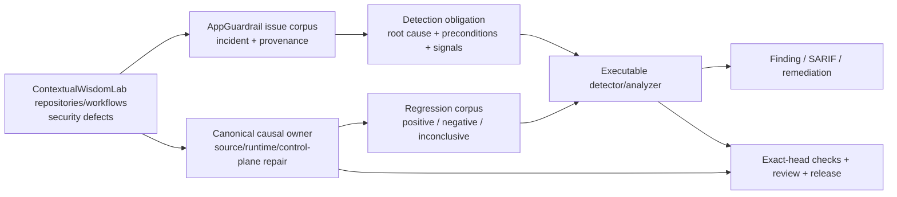

# AppGuardrail product and technical gap baseline

**Snapshot:** 2026-09-02  
**Authority:** protected `develop` documentation plus live exact-head GitHub evidence  
**Status:** working baseline; not a release, certification, or protected-branch capability claim

## Goal and evidence contract

AppGuardrail is the ContextualWisdomLab security-defect corpus and executable detection/remediation boundary. Buyer value is not a rule count: a retained incident becomes useful only when the causal failure is reproducible, its preconditions and observable signals are explicit, safe lookalikes and equivalent misses are tested, the canonical source owner is repaired when necessary, and exact-head evidence survives ordinary protected integration.

Issue text, registry rows, fixtures, predecessor checks, queued workflows, and model reviews are not detector truth. Executable scanner/analyzer evidence is authoritative. Runtime prevention and scanner detection are separate obligations. Missing, unavailable, stale, cancelled, failed, or inconclusive evidence never becomes `Clean Scan` by omission.

The development loop is:

```text
security corpus → causal owner/root cause → RED regression → smallest safe repair
→ exact-head Checks/current-head review → ordinary protected merge/release
→ protected-owner oracle refresh → next corpus item / buyer-visible Gap
```

Review, check, deployment, or release waits are non-blocking across independent safe lanes. Force push, destructive rebase, self-approval, gate weakening, warning suppression, detection bypass, stale-check reuse, and admin protection bypass are prohibited.

## PRD / TRD / architecture status

The protected PRD and `ARCHITECTURE.md` define four separable product planes:

```text
scan       built-in executable detectors + provenance-preserving external engines
remediate  deterministic safe transforms + reviewable verification guidance
control    tenant-isolated scan/history/drift/API-key/webhook behavior
assurance  SARIF, reports, SBOM, CI/release provenance and buyer evidence
```

`docs/PRD.md` remains product authority; `docs/TRD.md` records technical contracts; root `ARCHITECTURE.md` and `docs/UML.md` remain component/control-flow authorities; `docs/TRACEABILITY.md` binds defect classes to executable evidence; `docs/THREAT_MODEL.md`, `docs/TEST_STRATEGY.md`, and `docs/OPERABILITY.md` define abuse, verification and operations. This baseline does not create a competing architecture.

**UML:** existing architecture/UML material remains authoritative; detector work that changes a component boundary must update it.  
**ERD:** AppGuardrail detector fixtures and issue-corpus metadata are evidence artifacts, not a new transactional aggregate. Control-plane persistence remains the database authority; any new persisted evidence aggregate requires tenant ownership, lifecycle, retention/deletion, provenance, rollback and migration contracts before implementation.

## Context Map



Responsibility boundaries:

- **AppGuardrail** owns executable detection, normalized findings/SARIF, regression evidence, remediation and detector traceability.
- **The causal repository** owns vulnerable product/runtime behavior and must carry the source repair when AppGuardrail is not the defect owner.
- **ContextualWisdomLab/.github** owns organization CI/review/security/release control-plane behavior; leaf repositories must not copy or weaken a central control to bypass an owner defect.
- **External scanners** keep source/tool/version provenance. Normalization does not relabel their evidence as built-in AppGuardrail evidence.
- **Exact-head review/check infrastructure** is acceptance evidence, never a substitute for product truth.

## Security-defect corpus — live 2026-09-02 snapshot

| Work / corpus item | Exact observed state | Root cause / reusable security meaning | Next safe action |
| --- | --- | --- | --- |
| AppGuardrail #1088 / Issue #1087, branch `sentinel/detect-transport-only-poll-bound-1087`, exact head `52ab76181f9f6a40a25a0fe1b1e628faacab9eec` | open/mergeable; current exact-head workflows regenerated; CodeQL PR run `33633556278` is `startup_failure` with zero materialized jobs while Tests/security lanes remain queued | verified `ContextualWisdomLab/.github` required-review incident: a retry budget counted only transport failures, so healthy API/no-verdict iterations could hold a runner indefinitely relative to repository control flow. Current review also proved that a textual deadline/attempt exit is not a real bound when an unconditional `continue` makes that exit unreachable. | retain four current detector identities: historical transport-only, renamed causal transport-budget, non-convergent bound-state mutation, and `github-actions-poll-bound-unreachable-exit`. Finish remaining finite-loop, independent-total-bound, executable-`$()` token and `break`/`fi` structural obligations before merge; do not transfer predecessor Checks. |
| `ContextualWisdomLab/.github` protected wall-clock owner repair | protected repair `e29302c05eade7da7b0bdbb453e53980bc9d577b` | adds a 10,800-second total deadline to the original polling owner and fails closed | retain as prevention/control-plane evidence and pinned fixed oracle; it does not by itself satisfy AppGuardrail scanner coverage. |
| `ContextualWisdomLab/.github` #1706, stronger event-driven runner release, latest observed head `21bf1f79a00555fe0f4be797ebac4a426a059094` | open/mergeable but explicitly Proposed/non-merge-ready because connector draft transition failed; temporary v6 source-fix run is active on the current writer | stronger buyer-visible Gap: even bounded multi-hour waiting consumes required-review capacity. Previous source-fix exact logs showed focused event-driven GREEN followed by full-suite regression failures caused by stale/old wake-contract assumptions; current descendant repairs the temporary source writer and reruns RED→GREEN publication | do not merge the RED/source-fix machinery. Require durable one-shot/event reconciliation source, full-suite GREEN, temporary workflow/helper deletion, workflow-triggering publication credential, resulting exact-head central CI/security/current-head review, then ordinary merge. |
| AppGuardrail #1080 / Issue #892, Bearer DNS-rebinding TOCTOU, head `0a752c091489efd4dc7373230f1e242313e7cca6` | open/mergeable; current-head review remains authoritative | preflight URL/DNS validation can diverge from the later credential-bearing connection; family tracks destination/request/credential/reachability and mutation state | finish current-head provenance/control-flow repairs; no predecessor GREEN reuse. This family is also evidence for the structural-analyzer Gap below. |
| AppGuardrail #1068, empty-host / unresolved-DNS SSRF, head `62df0db1a831985fc34dbdc3565cfa2688facc98` | open/mergeable | malformed or unresolved destinations could cross a fail-open validation path | preserve runtime fail-closed repair plus `python-ssrf-empty-host-fail-open` vulnerable/fixed regression; merge only on unchanged exact-head evidence. |
| AppGuardrail #1036, shared-skill supply-chain detection, head `661d5138f1d6db5db0890b7c6ca14042440d6264` | open/mergeable | installable skill/agent manifests can hide mixed-script identifiers, prompt-injection/exfiltration directives, or unresolved placeholders; current grammar deliberately bounds YAML/JSON/prose scope | retain structural-key, flow-YAML and defensive-prose FP/FN oracles; require exact-head CI/review. |
| AppGuardrail #963 / Issue #550, discarded tenant authorization context, head `c656fe68cc616852f51a97e456cdf4e0b54fa168` | open/mergeable | tenant-admin authorization can be checked while returned tenant context is discarded before global reads or tenant-sensitive mutation | keep detector oracle pinned separately from live causal-owner candidate; refresh fixed oracle only after owner protected merge. |
| `ContextualWisdomLab/clearfolio` #541, causal owner for #550, live head `917b97d153196920da76f9ba4f0df761fdf7a4ac` | open/mergeable; descendant of non-destructive security restoration `1337efe45640740b338d021d64e41c045ecf7201` | concurrent `020c0ec...` reintroduced global/controller-local tenant filtering and keyless SHA-256 retry identity while deleting application/repository/HMAC contracts; restoration preserved history while reinstating tenant-scoped ports and keyed/domain-separated HMAC | require owner exact-head CI/security/review and protected merge; then update AppGuardrail #963 protected fixed-source oracle. |
| Issue #309, `naruon` OpenSSF Best Practices badge | open LOW governance/posture; no code location or reproducible source→sink path | security-program maturity signal, not an application vulnerability | do not manufacture a HIGH source detector; track as governance evidence. |
| Closed #310/#311, Code Scanning analysis-category visibility | closed configuration/assurance findings | GitHub could not compare current analysis categories with protected branch | retain as assurance/configuration corpus; only add detector logic when executable category/provenance drift evidence exists. |

Open `security` labels are not the whole corpus. Closed incidents, source-side fixes, review-discovered FP/FN boundaries, exact failed logs, and authenticated workflow evidence remain regression inputs when they encode a reproducible security failure class.

## Detector-development contract

Every retained security defect must record:

1. **Root cause** — security-relevant state transition or missing enforcement, never title/string identity.
2. **Preconditions** — data/control-flow, configuration, dependency, permission, secret, workflow and environment conditions.
3. **Observable signals** — evidence AppGuardrail can acquire independently.
4. **False-positive boundary** — safe lookalikes, including runtime/shell/protocol semantics that make textual similarity non-causal.
5. **False-negative boundary** — equivalent syntax/control-flow not yet modeled.
6. **Causal owner** — AppGuardrail, product repository/runtime, or `.github` control plane.
7. **Regression evidence** — historical vulnerable incident plus fixed/negative/inconclusive oracle.
8. **Acceptance evidence** — unchanged exact-head tests/security checks, current-head review, protected merge, immutable owner release and consumer bump where a released owner contract is involved.

Where regex families need path reachability, mutable state, shell semantics, or increasingly incompatible adjacency exceptions, stop treating another regular expression as the default answer. Preserve existing rule IDs and corpus as migration oracles and move the shared causal state into an executable structural analyzer.

## Buyer-visible Gap register

| ID | Buyer-visible Gap | Current evidence | Smallest valuable slice | Exit evidence | Status |
| --- | --- | --- | --- | --- | --- |
| G-01 | A buyer cannot always prove AppGuardrail observed the authoritative source condition instead of trusting a caller assertion. | PRD detector authority plus source-backed security PRs | one end-to-end source identity → executable assessment → immutable evidence/report slice | positive/negative/malformed/unavailable/stale/adversarial cases; exact source digest and black-box production path | **In progress** |
| G-02 | `0 findings` can overstate assurance when detectors/tools/scope/provenance are incomplete. | PRD typed evidence contract | propagate `clean`, `findings_present`, `incomplete`, `failed`, `untrusted` consistently | dashboard/JSON/SARIF/report/gate agree; missing evidence never renders clean | **Open** |
| G-03 | Enterprise buyers need defensible retention/deletion/audit/recovery for scan evidence. | control-plane schema and retention/audit work | tenant-owned retention/audit policy integrated into live store/API | migration rollback, backup/restore, authorization, immutable audit and release evidence | **Open** |
| G-04 | Acquisition reviewers lack one compact exact-head source/check/provenance/causal-repair package. | OPERABILITY/assurance contracts; evidence distributed | deterministic buyer-evidence package bound to SHA/run/artifact/release | recomputable digest, no raw secrets, failed vs unavailable distinction, protected-head smoke proof | **Open** |
| G-05 | Stateful regex detector families alternate between FP and FN repairs as control-flow/provenance complexity grows. | #1080 and #1088 current review histories; #1088 now needs job/run/loop identity, safety-state causality, mutation convergence, reachable-exit proof, command execution and shell semantics | implement a bounded structural GitHub Actions + shell control-flow/state analyzer first for #1087, preserving current detector IDs and corpus; use the same analyzer pattern for #1080 only after its provenance model is stable | differential corpus against current rules; all historical positives retained; safe negatives stay negative; conditional branch reachability, unreachable control transfers, command-vs-quoted text, declaration order, selected shell/fail-fast state, independent total bounds, and realistic performance measured | **Proposed, now priority architecture Gap** |
| G-06 | Shared required-review/security capacity can be consumed by wait loops even after the original transport-only defect is bounded. | protected `.github` wall-clock repair plus Proposed #1706 event-driven one-shot work | canonical `.github` one-shot admission + exact-run/event reconciliation, no repository-authored polling/model timeout | RED prerequisite→production GREEN; no real sleeps; exact PR/head/run validation; temporary source-fix machinery deleted; full central suite and required security/review GREEN | **Proposed / active owner prerequisite** |
| G-07 | This baseline can become stale while the security corpus changes rapidly. | PR #999 is the single writer | refresh from live exact heads while never claiming open candidates as protected behavior | protected merge of current snapshot; subsequent material changes produce another explicit snapshot | **In progress in #999** |

## Technical / TRD gaps

- Built-in regex rules are valid only for explicitly tested syntax/control-flow. Structural semantics not safely representable must move to an executable analyzer or remain an explicit gap.
- GitHub Actions polling analysis must distinguish per-request transport budgets from total control-flow bounds, preserve job/run/loop locality, model branch and exit reachability, distinguish executable commands from quoted/comment text, and account for selected shell/fail-fast semantics before using shell errors as safety or vulnerability evidence.
- Safety state is causal, not nominal: initialization must precede the candidate loop; deadlines/limits/counters must converge; state in sibling/earlier loops cannot sanitize another loop; textual `exit` is not safety evidence when a prior unconditional transfer makes it unreachable; an independent monotonic total bound must remain authoritative even if a non-owning retry counter resets.
- Missing/queued/failed/stale/cancelled/unavailable evidence are distinct typed states. A required workflow `startup_failure` with zero jobs is control-plane/infrastructure evidence, not a source-test success or failure and never transfers from another head.
- AppGuardrail is security tooling, not mathematical-science code. Rust/native work requires measured isolation/performance justification and a versioned boundary rather than language preference alone.
- Any future database changes use normalized tenant ownership, descriptive identifiers, migration rollback and measured locking/partition strategy; this document introduces no schema.

## Governance and next actions

```text
re-fetch docs/issues/PRs/current heads
→ inspect reviews, unresolved threads and exact logs
→ RED regression on canonical writer
→ smallest causal repair
→ fresh exact-head Checks
→ continue another independent safe lane while waiting
→ ordinary protected merge/release only when current evidence is satisfied
→ refresh owner oracle + corpus + this baseline
```

1. Continue #1088 by repairing current review blockers; keep the new unreachable-exit regression and companion as executable evidence, and do not restore the removed shell-ambiguous `break 0` HIGH rule without an executable selected-shell/fail-fast model.
2. Treat #1088's repeated regex-state divergence—including unreachable exits, independent total bounds, command-substitution tokenization and conditional-block ownership—as migration oracles for G-05 structural GitHub Actions/shell analysis rather than continuing unlimited regex growth.
3. Keep exact-head `startup_failure` with zero jobs classified as central control-plane evidence. Do not churn leaf source or reuse predecessor GREEN; central queue/startup diagnostics remain canonical-owner work.
4. Let `.github` #1706 remain Proposed until its active source-fix run produces durable owner source, full-suite GREEN and self-removal of temporary machinery; then require the resulting exact-head central protection normally.
5. Keep #1080, #1068, #1036 and #963 exact-head evidence independent; predecessor success never transfers.
6. Keep `ContextualWisdomLab/clearfolio` #541 owner evidence separate from AppGuardrail #963 detector maturity until protected owner merge.
7. Refresh this baseline after material exact-head changes, protected merges/releases, new reproducible security classes, or PRD/ADR/ARCHITECTURE boundary changes.

## Standards and acceptance basis

These references guide control design; they are not a claim of CSAP, SOC 2, or another certification.

National Institute of Standards and Technology. (2022). *Secure software development framework (SSDF) version 1.1: Recommendations for mitigating the risk of software vulnerabilities* (NIST Special Publication 800-218). https://doi.org/10.6028/NIST.SP.800-218

OWASP Foundation. (2025). *OWASP Application Security Verification Standard (ASVS) 5.0.0*. https://owasp.org/www-project-application-security-verification-standard/

SLSA. (n.d.). *SLSA specification version 1.2*. Retrieved September 2, 2026, from https://slsa.dev/spec/v1.2/
