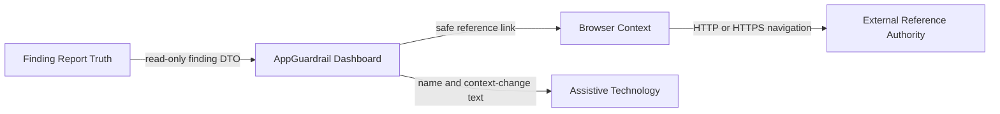
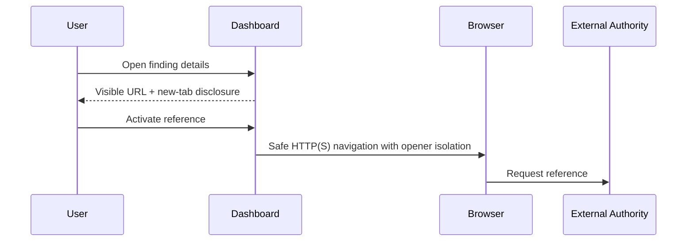

# Product–Technical Gap Baseline

Status: **Proposed**  
Last evidence refresh: 2026-09-20  
Current review: [appguardrail#1272](https://github.com/ContextualWisdomLab/appguardrail/pull/1272)  
Additional measured-performance lane: [appguardrail#1247](https://github.com/ContextualWisdomLab/appguardrail/pull/1247) at `63c6548946ccc98c11b2329f7ac7fd60e6b2f22a`  
Production evidence ancestor: `f76fcbabc867b0953b260908116a162314619f63`

## Goal and loop

AppGuardrail must present scanner findings without changing finding truth or surprising users with an unannounced browsing-context change. Review the exact PR head, preserve the reference-link contract with executable tests, run exact-head checks, obtain real-browser and independent evidence, then merge ordinarily. Pending evidence keeps the change Draft/Proposed.

## PRD

A finding reference must preserve the source URL as visible text, admit only the dashboard's existing safe URL boundary, announce that activation opens a new tab, and expose the icon as decorative. Pointer, touch, keyboard, and assistive-technology users must receive equivalent meaning. Presentation state never replaces the finding record.

## TRD

`scanner/dashboard/index.html` remains the product-owned, dependency-free static dashboard. External references use the reusable `external-reference` class, `target="_blank"`, `rel="noopener noreferrer"`, one English context-change string consistent with the document's current `lang="en"`, and an `aria-hidden`/non-focusable SVG. `tests/test_dashboard_external_reference_contract.py` fixes this source contract. The removed root `test_playwright.py` contained no assertions, used a fixed `/app` path, and was not an executable acceptance gate.

Figma component ID: **none evidenced**. Storybook story: **none evidenced**.

## Context Map

- Finding Report Context owns rule, evidence, remediation, and reference values.
- Dashboard Presentation Context owns escaping, safe-link admission, visible disclosure, focus, and interaction.
- External content never becomes AppGuardrail domain truth.

## UML

## ERD

No database entity or relationship is introduced by #1272. The dashboard consumes an immutable finding-report snapshot; link presentation is derived and must not be persisted as finding truth.

## Exact-head acceptance matrix

| Concern | Current evidence | Status |
|---|---|---|
| Determinism | Source contract fixes class, relationship, disclosure, and decorative SVG semantics | Source PASS; hosted checks pending |
| Semantics | Visible source URL remains distinct from hidden context-change text | PASS |
| Accessibility | Hidden context notice and decorative icon boundary are source-tested | PARTIAL; real AT absent |
| Pointer/touch/keyboard | Native anchor behavior exists; browser pointer, touch, Tab, Enter and context-change replay absent | FAIL |
| Responsive | Inline layout moved to reusable CSS; 320/768/desktop screenshots absent | FAIL |
| Locales | Current document is English; ko/en/ja/zh/vi/es/de/fr resource authority and wrapping evidence absent | FAIL |
| States | Finding detail and reference-present state exist; offline, permission, stale, retry, busy and broken-reference evidence absent | FAIL |
| Large data | Reference-list render and interaction median/p95 absent | FAIL |
| Import/export | Finding report remains input truth; no presentation DTO is exported | PARTIAL |
| Recovery | Close/focus restoration exists; popup-blocked, offline and reload recovery evidence absent | FAIL |

## Gap and action ledger

| Gap | Required action | Status |
|---|---|---|
| Unstable inline presentation | Use the product-owned `external-reference` class | Repaired; checks pending |
| Weak opener isolation declaration | Require `noopener noreferrer` | Repaired; checks pending |
| Decorative SVG focus ambiguity | Require `aria-hidden="true" focusable="false"` | Repaired; checks pending |
| False browser evidence | Remove the assertion-free, fixed-path smoke artifact | Repaired |
| Browser and AT acceptance | Exercise pointer, touch, Tab/Enter, accessible name, focus return and popup-blocked recovery in current Chromium/Firefox/WebKit | Open |
| Responsive evidence | Capture 320 px, 768 px and desktop reference wrapping/overflow screenshots | Open |
| Locale authority | Provide released ko/en/ja/zh/vi/es/de/fr screen resources or a bounded language decision | Open |
| Severity-cache performance claim | Preserve exact/fresh-set semantics; record benchmark command, environment, warm-up, sample size, failure denominator, median/p95, and real calling-path impact before claiming a percentage | Source/test repaired in #1247; measurement open |
| Performance and recovery | Measure realistic reference-list median/p95 and verify offline/reload behavior | Open |

## Release decision

Keep appguardrail#1272 **Draft/Proposed** until exact-head CI and security checks are terminal GREEN, actionable review threads are resolved, current-head independent approval exists, and applicable browser, accessibility, responsive, locale, performance, and recovery rows pass. No release or GitHub Pages publication is claimed.
