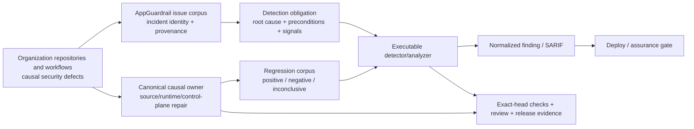

# AppGuardrail product and technical gap baseline

**Snapshot:** 2026-09-02  
**Authority:** protected `develop` documentation plus live GitHub PR/issue evidence  
**Status:** working baseline; it is not a release, certification, or protected-branch capability claim

## Decision summary

AppGuardrail is a persistent security layer for AI-assisted application development. Its buyer value is not the raw count of rules: retained security incidents must become durable, executable detection obligations with reproducible positive, negative, and inconclusive evidence, while prevention/hardening and scanner detection remain separate controls.

The current delivery order is:

1. keep the organization security-defect corpus tied to causal source evidence rather than issue titles;
2. close high-risk detector false negatives and deployment-blocking false positives with the smallest safe test-first change;
3. repair the canonical causal owner when the defect is outside AppGuardrail, then retain that incident as AppGuardrail regression evidence;
4. make `Clean Scan` evidence-qualified rather than synonymous with zero findings;
5. make remediation, retention, audit, release provenance, and buyer evidence independently reproducible.

An open PR, a queued workflow, a registry row, or a model review is not protected-branch truth. A claim becomes current only after the unchanged exact head satisfies its required Checks, current-head review-thread obligations, qualifying independent approval, and ordinary protected merge.

## Product, technical, and architecture contract

The accepted PRD and architecture define four separable planes:

```text
scan       built-in executable detectors + optional external engines
remediate  deterministic safe transforms + reviewable fix/verification guidance
control    tenant-isolated scan history, drift, API keys, and webhooks
assurance  SARIF, reports, SBOM, provenance, CI/release and buyer evidence
```

`docs/PRD.md` is the product-requirement authority; `docs/TRD.md` records technical contracts; `docs/UML.md` and the root `ARCHITECTURE.md` record component/control-flow structure; `docs/TRACEABILITY.md` binds controls to executable evidence; `docs/THREAT_MODEL.md`, `docs/TEST_STRATEGY.md`, and `docs/OPERABILITY.md` define abuse cases, verification, and operational proof. Existing ERD/schema material remains owned by the control-plane schema documentation; this baseline does not invent a second domain model or duplicate `ARCHITECTURE.md`.

The protected PRD invariants require executable detector evidence, positive/negative/inconclusive tests, preserved external-engine provenance, fail-closed inconclusive handling, explicit tenant/egress boundaries, and a `Clean Scan` only after configured evidence completes successfully. Runtime prevention and scanner-detection coverage remain independent obligations.

## Context Map



Responsibility boundaries:

- **AppGuardrail** owns executable detection, normalized findings, regression evidence, and remediation guidance for detectable defect classes.
- **The causal repository** owns the vulnerable application/runtime behavior and must carry the source fix when AppGuardrail is not the defect owner.
- **ContextualWisdomLab/.github** owns shared CI/review/security/release control-plane behavior; leaf repositories must not copy or weaken central controls to bypass an owner defect.
- **Optional external engines** retain their source/tool/version provenance; normalization never relabels their evidence as a built-in AppGuardrail finding.
- **Review/check infrastructure** is acceptance evidence, not product truth. A developer agent cannot self-approve or replace missing exact-head evidence with predecessor results.

## Security-defect corpus refresh — 2026-09-02

The table below is a point-in-time execution register. `queued`, `pending`, `COMMENTED`, or stale predecessor evidence is not passing evidence.

| Work / corpus item | Exact observed state | Root-cause / product meaning | Gap / next safe action |
| --- | --- | --- | --- |
| PR #1088 / Issue #1087, GitHub Actions transport-only polling bound, head `0c79c61347d0a9ecbc3cf9cb985661c412832bd0` | open, mergeable; Tests, Security Process, Security Scan, SAST Semgrep, Pinned HTTPS Coverage, OpenSSF Evidence Coverage, Retention Audit Coverage, and Scan path context coverage are all queued on the exact head | verified `ContextualWisdomLab/.github` incident: an unbounded verdict loop limited consecutive `gh api` transport failures but not the all-success/no-verdict path, allowing required-review runners to remain occupied for hours; protected owner repair `e29302c05eade7da7b0bdbb453e53980bc9d577b` adds a 10,800-second total wall-clock bound | retain vulnerable/fixed source fixtures and FP/FN boundaries; require exact-head checks/review before merge; continue the stronger central one-shot runner-release prerequisite separately |
| ContextualWisdomLab/.github PR #1706, one-shot required-verdict runner release, head `ab0c19f70b06a23bac881a7fd232bb254cd79c7d` | reopened after an incorrect unmerged closure because protected `main` does not carry its remaining RED regression test; exact-head OSV, SAST, SBOM, Scorecard, Secret Scan, Python Security, Security Scan, and CodeQL runs are queued; PR metadata currently remains non-draft because the connected draft-state mutation returned a GraphQL schema error | protected `main@6f70174e338013fec9a000311bc72312f5d4dbf9` still polls up to a 3-hour deadline, while protected dispatch code/tests and the central product baseline already support/describe exact-run `rerun-failed-jobs`; the reopened test requires one live PR read + one review read and immediate fail-closed runner release | treat #1706 as Proposed/RED and not merge-ready; implement the production prerequisite at `.github`, reconcile obsolete poll-specific tests/docs, then require fresh exact-head CI/review; do not close the valid RED delta without complete successor carryover |
| PR #1080 / Issue #892, Bearer DNS-rebinding TOCTOU, head `0a752c091489efd4dc7373230f1e242313e7cca6` | open, mergeable; repository-local Tests, Security Process, Security Scan, SAST Semgrep, Pinned HTTPS Coverage, OpenSSF Evidence Coverage, Retention Audit Coverage, and Scan path context coverage are queued | `_is_safe_url` preflight can be separated from the DNS decision used by a later credential-bearing `urllib` connection; detector family tracks destination, request, credential, reachability, multiline, dynamic-replacement, and unredirected-header boundaries | keep current-head control-flow regressions authoritative; do not reuse predecessor GREEN; merge only after exact-head checks and independent review |
| PR #1068, empty-host / unresolved-DNS SSRF validator, head `62df0db1a831985fc34dbdc3565cfa2688facc98` | open, mergeable; causal control-plane validation now rejects empty host and DNS-resolution failure; current-head acceptance remains gated | malformed or unresolved destinations could previously cross a fail-open validation path; packaged `python-ssrf-empty-host-fail-open` preserves the reusable source-to-success-path pattern | retain historical vulnerable/fixed fixtures; require exact-head checks/review before merge; do not weaken DNS policy for dummy test domains |
| PR #1036, shared-skill supply-chain detectors, head `661d5138f1d6db5db0890b7c6ca14042440d6264` | open, mergeable; repository workflows remain queued/pending | malicious installable skill/agent manifests can use mixed Latin/Cyrillic identifiers, prompt-injection/exfiltration directives, or unresolved placeholders; current rules explicitly bound YAML/JSON syntax and defensive-prose false-positive edges | preserve structural-key and bounded flow-YAML regressions; current-head CI/review is required before integration |
| PR #963 / Issue #550, discarded tenant authorization context, head `c656fe68cc616852f51a97e456cdf4e0b54fa168` | open, mergeable; source-backed vulnerable/fixed fixtures retained; detector semantics unchanged while causal-owner traceability was refreshed | a tenant-admin permission check can be performed while the returned tenant context is discarded before global reads or tenant-sensitive mutations | keep live causal-owner repair provenance separate from the pinned regression oracle; refresh the protected-head negative oracle after canonical owner merge |
| ContextualWisdomLab/clearfolio PR #541, causal owner for #550, head `917b97d153196920da76f9ba4f0df761fdf7a4ac` | open, mergeable; descendant of security restoration `1337efe45640740b338d021d64e41c045ecf7201`; exact-head CI, Security Scan, SAST Semgrep, and fuzz are queued | concurrent `020c0ec0337dce38cca4b7e653c5fb47fe6233c4` had reintroduced controller-local/global tenant filtering and keyless SHA-256 retry identity while deleting tenant-scoped application/repository and HMAC contracts/tests; `1337efe...` restored the complete validated security tree non-destructively and `917b97...` preserves it while adding formatting/Javadoc refinements | require fresh owner exact-head checks/review; after protected merge, refresh AppGuardrail #963 fixed-source oracle from protected Clearfolio rather than treating this open candidate as shipped truth |
| Issue #309, `naruon` OpenSSF Best Practices badge | open LOW governance/posture finding; no code location and no reproducible source-to-sink path | project-security-program maturity signal, not an application vulnerability | do not manufacture a HIGH source detector; track remediation/evidence as governance posture |
| Closed Issues #310/#311, Code Scanning configuration visibility | closed configuration/analysis-category findings | GitHub could not compare current-head analysis categories with the protected branch; this is an assurance-visibility defect, not a source vulnerability | retain as configuration/assurance corpus; detector work should target category/provenance drift only when executable evidence supports it |

The open security-label inventory is not the complete corpus. Closed incidents, source-side fixes, review-discovered false positives/false negatives, failed checks, and authenticated workflow evidence remain valid regression inputs when they encode a reproducible defect class.

## Detector-development contract

For each security-relevant incident, extract and record:

1. **root cause** — the security-relevant state transition or missing enforcement, not the issue title;
2. **preconditions** — data/control-flow, configuration, dependency, permission, secret, or workflow conditions required for the failure;
3. **observable signals** — evidence AppGuardrail can actually acquire without caller assertions;
4. **false-positive boundary** — safe flows that look textually similar but do not preserve the vulnerable path;
5. **false-negative boundary** — equivalent or adjacent syntax/control-flow not yet modeled;
6. **causal owner** — AppGuardrail detector, source repository/runtime, or `.github` control plane;
7. **regression evidence** — historical vulnerable incident plus fixed/negative/inconclusive oracle;
8. **acceptance evidence** — exact-head tests/security checks, current-head review, protected merge, and owner release/consumer bump where applicable.

Issue or registry identity can route the obligation but cannot assert pass/fail. Where bounded regex state begins to diverge across detector-family members, prefer a small structural/state analyzer over accumulating incompatible textual exceptions; retain the historical regex fixtures as migration oracles.

## Buyer-facing gap register

| ID | Buyer-visible gap | Current evidence | Smallest valuable slice | Exit evidence | Status / action |
| --- | --- | --- | --- | --- | --- |
| G-01 | A buyer cannot always verify that AppGuardrail itself observed the authoritative source condition rather than receiving a caller assertion. | PRD-FR-002 and the issue-to-detection architecture require the boundary; several source-backed detector PRs now carry pinned fixtures. | Complete one detector family through `atomic cause → obligation → source identity → executable assessment → independent oracle → persisted evidence → API/report`. | positive, negative, malformed, unavailable, stale, duplicate, adversarial fixtures; production black-box path; exact source/artifact digest | **In progress.** Use the best source-backed security PR as the vertical slice; do not call open-PR evidence protected behavior. |
| G-02 | `0 findings` can overstate assurance when detectors, external tools, scope, or provenance are incomplete. | PRD invariant 10 and assurance-plane requirements define typed evidence states. | Carry `clean`, `findings_present`, `incomplete`, `failed`, and `untrusted` with scope, completion, freshness, commit, schema, and provenance across outputs. | dashboard, JSON, SARIF, reports, and deploy gate agree; missing/failed evidence never renders clean | **Open.** Keep evidence-qualified scan work separately reviewable and bind consumers to the exact findings artifact digest. |
| G-03 | A developer cannot safely transfer remediation/evidence into an agent workflow without CSP, clipboard, redaction, or provenance ambiguity. | Existing remediation contracts and active handoff/UI work provide partial evidence only. | Keep a transport-neutral deterministic redacted bundle, then add CSP-safe listener-based UI actions and accessible fallback. | hostile text inert; exact copy/fallback behavior; provenance schema/digest verified on protected head | **Open.** UI work must retain CSP/accessibility evidence and avoid duplicate listeners or source-copy shortcuts. |
| G-04 | Enterprise buyers need defensible retention, deletion, audit, and recovery semantics for scan evidence. | PRD retention requirements, control-plane schema/migration docs, and retention/audit assurance work. | Integrate retention/audit policy into the live control-plane store/API with tenant ownership, migration rollback, and recovery proof. | migration rehearsal, backup/restore, tenant authorization tests, immutable audit verification, release evidence | **Open.** Treat queued/partial posture checks as evidence state, not completed retention behavior. |
| G-05 | Acquisition reviewers cannot yet consume one compact exact-head package spanning source, checks, provenance, causal repairs, and residual gaps. | OPERABILITY and assurance-plane contracts exist; evidence remains distributed across PRs/issues/runs. | Produce deterministic buyer evidence that separates observed, unavailable, and inferred facts and binds claims to SHA/run/artifact/release identifiers. | independently recomputable digest; no raw secrets; failed vs unavailable distinction; protected-head and post-publish smoke evidence | **Open.** This baseline is the human-readable register; it is not itself the signed buyer evidence package. |
| G-06 | Security detector families with increasingly stateful regexes can diverge in control-flow/provenance semantics and create alternating FP/FN repairs. | #1080 review history repeatedly exercises destination, request, credential, reachability, branch, and mutation state across multiple rule identities. | Define a bounded Python structural/state analyzer for the shared provenance model while preserving rule IDs and regression corpus compatibility. | differential test corpus against existing family; no loss of historical positives; reviewed FP negatives remain negative; performance measured on realistic repositories | **Proposed.** Start only after the current #1080 exact-head repair set stabilizes enough to serve as migration oracle; do not replace working coverage with an unverified rewrite. |
| G-07 | The product/technical gap baseline itself can become stale while the active security corpus changes hourly. | PR #999 was based on August evidence while September security PRs and exact heads changed. | Make this document a maintained evidence register, refresh it from live GitHub state, and keep self-referential PR head outside the document. | protected merge of a current snapshot plus recurring future updates that distinguish historical snapshots from live metadata | **In progress in PR #999.** This refresh records the 2026-09-02 security lanes and current causal-owner heads. |
| G-08 | Shared required-review/security capacity can be consumed by wait loops even when model execution belongs to a separate dispatch worker, delaying every unrelated protected PR. | `.github` incident 5c561→e293 proves transport-only retry bounds were insufficient; protected dispatch already validates exact `required_run_id` and can call `rerun-failed-jobs`, while protected required-verdict source still uses a 3-hour polling loop. Reopened #1706 contains the uncopied RED one-shot runner-release contract. | At canonical `.github`, change the required-verdict job to one authoritative live-PR read plus one paginated current-head review read, fail closed immediately when no verdict exists, and rely on the authenticated exact-run wake/rerun path after a formal receipt. | RED #1706 test becomes GREEN; obsolete polling-specific tests/docs reconciled; no real sleeps; exact-run/event/workflow/head validation retained; central exact-head CI/security/review GREEN; AppGuardrail #1088 fixed oracle still does not regress | **Proposed / prerequisite.** #1706 was reopened because its valid RED delta was closed without carryover. It must not merge until production satisfies the contract; draft-state transition remains operationally pending after a connector GraphQL schema failure. |

## Technical / TRD gaps

- Built-in lightweight regex rules are valid only for explicitly tested syntax/control-flow. Structural patterns that cannot be represented safely must remain external-engine/planned or move behind an executable structural analyzer.
- Detector-family state must use Python identifier case semantics while HTTP header/token semantics use protocol-appropriate case handling.
- GitHub Actions retry detectors must distinguish a per-request/transport bound from a total control-flow bound and must not infer that a sibling job's budget governs the vulnerable polling job.
- Missing, queued, failed, stale, cancelled, and unavailable evidence are distinct typed states; none may become a clean result by omission.
- The scanner/control/remediation/assurance boundaries are already distinct; do not create a shared database or cross-service SQL shortcut to combine them.
- AppGuardrail is security tooling rather than mathematical-science code. A Rust/native component is justified only by measured security/isolation/performance evidence and must sit behind a versioned standalone contract.
- Future database/schema work must use descriptive two-word-or-longer names, normalized tenant ownership, migration rollback, and measured partition/locking strategy. No schema change is introduced by this document.

## UML / ERD status

- **UML:** root architecture and `docs/UML.md` remain the authority for scanner, findings, control-plane, and assurance interactions. Security-detector changes that alter a component boundary must update those diagrams rather than embedding a competing architecture here.
- **ERD:** control-plane persistence remains the only relevant database boundary for this baseline. Detector fixtures and issue-corpus metadata are evidence artifacts, not new transactional aggregates. Any new persisted evidence aggregate must first define tenant ownership, lifecycle, retention/deletion, provenance, and migration semantics in the canonical schema documentation.

## Governance and development loop

The loop is PR-first, exact-head, non-destructive, and **non-blocking across independent safe lanes**:

```text
re-fetch PRs/issues/docs
→ review current heads and exact checks/logs
→ repair valid finding on the canonical writer branch
→ add/retain regression evidence
→ push without force
→ regenerate exact-head checks
→ while that head waits, continue another non-conflicting security lane
→ merge/auto-merge only through ordinary protection
→ re-read corpus and product gaps
```

One writer owns a delta/branch at a time, but a queued review/check does not make unrelated safe implementation work stop. Re-fetch immediately before writes and preserve concurrent intent. Never use force-push, destructive rebase, self-approval, review dismissal as acceptance, required-check removal, warning suppression, fabricated runtime evidence, stale/predecessor Checks, or admin bypass.

A PR reaches zero only by protected merge or by verified complete successor carryover of every valid delta; simple closure is not completion. When a defect belongs to another ContextualWisdomLab repository or `.github`, repair and release the canonical owner first, then update the AppGuardrail regression/oracle and consumer contract rather than copying owner source or weakening a leaf gate. A valid RED prerequisite is preserved as Proposed/Draft until production satisfies it; it is not “complete” merely because a partial predecessor fix merged elsewhere.

## Standards and acceptance basis

These references guide control design and acceptance evidence; they are not a claim of CSAP, SOC 2, or any other certification.

### References (APA 7th)

National Institute of Standards and Technology. (2022). *Secure software development framework (SSDF) version 1.1: Recommendations for mitigating the risk of software vulnerabilities* (NIST Special Publication 800-218). https://doi.org/10.6028/NIST.SP.800-218

OWASP Foundation. (2025). *OWASP Application Security Verification Standard (ASVS) 5.0.0*. https://owasp.org/www-project-application-security-verification-standard/

SLSA. (n.d.). *SLSA specification version 1.2*. Retrieved September 2, 2026, from https://slsa.dev/spec/v1.2/

## Next actions

1. Keep #1088, #1080, #1068, #1036, and #963 exact-head evidence separate; do not transfer predecessor GREEN or reviewer state.
2. Complete the `.github` G-08 prerequisite from reopened #1706: one-shot fail-closed required-verdict admission plus authenticated exact-run wake, then reconcile poll-specific tests/docs and require fresh central exact-head evidence.
3. Keep ContextualWisdomLab/clearfolio #541 exact-head owner evidence separate from AppGuardrail detector maturity; only refresh the fixed-source oracle after the canonical owner reaches protected merge.
4. When a current-head security review produces a reproducible FP/FN, add the smallest production `_scan_file`/runtime regression before or with the repair and retain both the vulnerable and safe oracle.
5. For #1088, add a sibling-job timeout/attempt/deadline adversarial regression before calling the lightweight detector complete; a bound in one job must not suppress a separate vulnerable polling job.
6. Advance G-06 only after the current DNS-TOCTOU family is stable enough to define an analyzer migration oracle; do not trade known coverage for architectural novelty.
7. Refresh this baseline after protected merges, causal-owner releases, materially new security corpus classes, or changes to PRD/ADR/ARCHITECTURE boundaries.
8. Do not call the baseline or product complete until the live PR/issue/source/check audit is re-run and residual gaps are explicit.