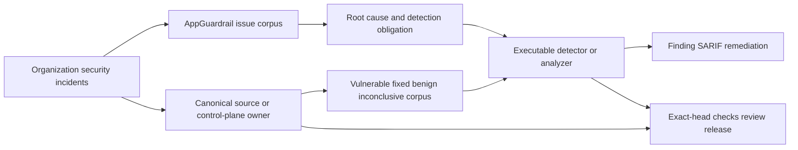

# AppGuardrail product and technical gap baseline

**Scoped refresh:** 2026-10-01
**Authority:** protected PRD/ADR/architecture plus the exact evidence identified below
**Status:** active-PR working baseline, not a release, certification, or protected-capability claim
**Canonical writer:** PR #999, `docs/product-technical-gap-baseline`

## Scope and retained evidence

This refresh verifies the #1036 JSON serialization repair and its current CodeQL/review boundary. It also verifies the #1137 network-secret variable boundary and its ordinary successor carryover through #1189, including the #1157 invocation-namespace/path repair, #1158/#1161 credential-flow successors, #1163–#1169 command-rule, directive, file-mode, archive-admission, policy-provenance, SBOM-receipt, and checksum-path successors, the #1170 GitHub merge/release command boundary, the #1171 credential-store boundary, #1172 kubectl/Docker deployment-write boundary, #1173 Terraform/Helm boundary, #1174 Vercel/Fly hosted-deploy boundary, #1175 unsigned-checksum signature-artifact boundary, #1176 bounded path-depth boundary, #1177 AWS/gcloud/az deployment-write boundary, #1179 object-store/containerapp boundary, #1180 registry-publish boundary, #1182 alternate-publish boundary, #1183 gem/NuGet boundary, #1184 Dart pub boundary, #1185 Hex/Conda boundary, #1186 Cabal/Maven boundary, #1187 Gradle/LuaRocks boundary, #1188 SBT/Conan boundary, and #1189 Deno/CocoaPods boundary. It separately verifies #1260's console severity-map own-property repair and executable hostile-key regression, #1217's canonical webhook persistence, HTTPS-only identity, DNS-pinned delivery, redirect, port, missing-key, and successor-carryover boundaries, #1273's SARIF URI-valued help-metadata repair plus #1269's stacked SARIF rule-index repair and #1226/#1330 complete-carryover retirement, #1314's console scalar/selector boundary plus #1277/#1286 complete-carryover retirement, #1292's single-pass organization inventory plus #1328 complete-carryover retirement, and #1304's read-only exact-SHA workflow-lifecycle detector/review boundary. It binds the #1192 Caido bootstrap incident to the current `quarantine-sandbox-runtime` HTTP-readiness owner and its positive-LSM evidence boundary. It does **not** relabel every earlier repository/PR observation as current.

This refresh additionally records #1333's bounded CodeQL pending-receiver diagnosis and the exact #1273 incident that motivates it. The detector candidate distinguishes authenticated terminal scanner findings from central dispatch/publication/settlement ordering, retains a negative fixture for echoed script text plus a real `VERDICT_STATE: failure`, and leaves canonical owner repair with `.github#1929`; it is Proposed Draft work, not protected functionality or a substitute for the central repair.

The [complete preceding baseline and corpus inventory](product-technical-gap-baseline-history-6d6d7749.md) is incorporated by reference, byte-for-byte, including every detector obligation, prerequisite, FP/FN boundary, Context Map, Gap, action, source/run/artifact identifier, standards reference, and later evidence appendix. Its source is commit `6d6d77495a73a9ae814b138e53c90e2ea19cd3d6`, Git blob `1953b92c6c6fcfbe9a30e2b78094c214c18e6fe6`. The same-directory retained file preserves existing relative-link resolution. Moving a historical observation into a retained snapshot does not close, waive, complete, or retire any valid delta.

This refresh also verifies #1129's path-aware password-indirection repair, aggregate remaining-byte enforcement, symlink-safe `source.path`, and single bounded Claude-plugin artifact inventory. It records both executable RED stages, the exact GREEN tree, resolved review threads, and the still-missing hosted exact-head workflows and qualifying independent review without promoting the stacked Draft to released capability.

Historical timestamps, PR states, head SHAs, and next-action instructions in that inventory must be re-fetched before execution. Substantive unresolved obligations remain open unless later evidence proves completion; newer governing PRD/ADR and CWL DEVELOPMENT PHILOSOPHY v2026-09-02B take precedence over contradictory historical prose. Only the specifically identified #1036/CodeQL, #1137–#1189 plugin-admission, #1192/readiness-owner, #1217 webhook-boundary, #1260 console-severity, #1273 SARIF-metadata, #1269/#1226/#1330 SARIF-index, and #1304 workflow-lifecycle observations below supersede their earlier observations. Other lanes are retained, **not reverified in this refresh**.

The last terminal-complete writer control, head `791e2b5eb5cdf376bf18ce000522bf0117443ff9`, completed all nine of its pull-request workflow runs successfully: Retention Audit Coverage `34706166197`, Security Process `34706166185`, CodeQL PR `34706166188`, Tests `34706166193`, Security Scan `34706166196`, OpenSSF Evidence Coverage `34706166171`, Scan path context coverage `34706166203`, Pinned HTTPS Coverage `34706166195`, and SAST Semgrep `34706166169`. Those results are historical and do not transfer to later heads. #999 still has no qualifying current-head approval and retains eight historical `CHANGES_REQUESTED` reviews; ordinary auto-merge remains the only authorized integration path.

## Goal and evidence contract

AppGuardrail owns the ContextualWisdomLab security-defect corpus and executable scan/SARIF/remediation boundary. The target is USD 20B sale quality through buyer-visible Gap removal, not increasing a rule count or reducing open PRs by closure.

A retained incident is useful when its causal failure, preconditions and observable signals are explicit; the production detector exercises vulnerable, fixed, benign and inconclusive cases; the actual source owner is repaired; and evidence survives ordinary protected integration. Issue text, registry rows, fixtures, model prose, prior-head results and queued workflows are not executable detector truth. Runtime prevention and scanner detection remain separate obligations.

```text
corpus → causal owner/root cause → RED → smallest safe repair → exact-head Checks
→ independent review → ordinary protected merge → immutable release/consumer bump
→ protected-owner oracle refresh → next corpus obligation / buyer-visible Gap
```

Review/check/deployment waits do not block another independent safe lane. No force push, destructive rebase, self-approval, finding suppression, detection bypass, weakened gates, or predecessor-evidence transfer is permitted. Preserve concurrent intent. No valid PR retires without ordinary merge or verified complete successor carryover under the governing exceptions.

## PRD / TRD / architecture status

The canonical documents remain [PRD](PRD.md), [TRD](TRD.md), [ARCHITECTURE](../ARCHITECTURE.md), [UML](UML.md), [ERD](ERD.md), [TRACEABILITY](TRACEABILITY.md), [THREAT_MODEL](THREAT_MODEL.md), [TEST_STRATEGY](TEST_STRATEGY.md), [OPERABILITY](OPERABILITY.md), and the [ADR index](adr/README.md). This document does not create a competing API, schema, detector kernel, or architecture.

The four product planes remain **scan** (detectors/external-engine provenance), **remediate** (safe transformations and reviewable guidance), **control** (tenant-isolated history/authentication/webhook state), and **assurance** (SARIF/report/SBOM/provenance evidence).

The #1036 change alters only the escaped-codepoint alternative of an existing rule. #1157 partitions an existing duplicate-identity admission rule by the documented plugin, Skill/legacy Command, and Agent invocation namespaces; it changes no public schema or finding identity. #1129 replaces repeated eager reads with one internal bounded inventory and narrows an existing psql exemption; it adds no public API, persistent aggregate, or service boundary. Neither repair, #1273's SARIF descriptor serialization change, nor #1269's order-preserving rule-index cache introduces a runtime dependency, database migration, network behavior, permission, workflow, or publication authority. Existing UML/ERD and component boundaries therefore remain unchanged. Future boundary changes must reconcile the owning PRD/TRD/ADR/UML/ERD and security/operability contracts. Rust remains the default for new security/performance runtime work under current CWL governance; this scoped repair is not permission to create a new Python security runtime.

## Context Map


```mermaid
flowchart LR
    Source[Organization security incidents] --> Corpus[AppGuardrail issue corpus]
    Corpus --> Obligation[Root cause and detection obligation]
    Obligation --> Detector[Executable detector or analyzer]
    Regression[Vulnerable fixed benign inconclusive corpus] --> Detector
    Detector --> Finding[Finding SARIF remediation]
    Source --> Owner[Canonical source or control-plane owner]
    Owner --> Regression
    Owner --> Evidence[Exact-head checks review release]
    Detector --> Evidence
```

Product repositories retain their domain truth and vulnerable-runtime repair. `ContextualWisdomLab/.github` owns CI/review/security/release control-plane repair; contextual-orchestrator owns provider discovery/routing/delegation and gateway behavior. External engines retain their source/tool/version identity. AppGuardrail consumes released contracts through its own boundary; an owner candidate branch is not permission to copy its implementation, bypass it, or access its database.

## Security-defect corpus — scoped 2026-09-20 observations

| Work | Exact observed evidence | Root cause and detection boundary | Remaining acceptance |
| --- | --- | --- | --- |
| #1036, `feat/skill-supply-chain-detector` | Head `832d066cd3adf6aa455435bc4ef4b12926514b68`, base `develop@e71d37e7c58118e6764c96ab7c4492fe33eed6f8`; open/Ready. Effective repair from `0ef5715468acb674aeb0f3833e820996d4644871` is three normal commits and three paths. | An existing 78-letter raw Cyrillic alphabet had only 39 lowercase letters in its JSON escape alternative, so equivalent uppercase serialized names evaded `skill-name-homoglyph-confusable`. The fix aligns those representations without changing rule identity, severity, paths, or the other three rules. | Eight source/security workflows succeed. CodeQL settlement and qualifying current-head formal approval remain incomplete. No protected merge or release is claimed. |
| Retained #1031 / #1032 threat inventory; #1099 plugin admission | #1099 comment `5644654564` connects the new regression and candidate to its source corpus. | Raw and escaped spellings of the same supported mixed-script identity need the same finding; Cyrillic-only and description-prose values must not supply false mixed-script evidence. | Retain the original incident as regression provenance. #1099 is not completed by this slice; consumers require the eventual released scanner contract. |
| #1129, `security/cwl-issue-detector-families` | RED predecessor `5986b5d83e0dc898bf4dbf43d4287528b54250ff`; fresh-review RED predecessors `546ffaafee3abc472c3b6f83d5a0a68cc80ee604` and `e33d9a22fde6e57da170700e41d56260b1365753`; exact GREEN head `d4f801119ac9eb53fdf84cfd4b3589111f3e8ff5`, tree `7109b3365b30da2848f41443c7843583f36855a4`; stacked on #998 exact `8b95c2bee24567ab3200a96da807259e023eee73`, mergeable Draft. | A path-neutral colon exemption suppressed JS/TS password literals; eager whole-tree materialization and per-file full-budget reads made configured package budgets post-hoc; receipt/license/source/hook/digest consumers rescanned independently; NOTICE-only evidence contradicted the public contract; `Path.exists()` followed a declared `source.path` symlink outside the artifact; read failure collapsed to valid empty bytes; CLI suffix drift skipped JavaScript, TypeScript, and Python hook content. The repair accepts colon-quoted identifiers only on `.sql`/`.psql`, retains quoted `$VAR`, builds one entry/file/byte-bounded inventory reused by every consumer, caps each read at aggregate remaining bytes plus one overflow sentinel, stops at zero remainder, rejects symlinked or uninspectable source-path components, records unreadable regular files as explicit fail-closed evidence while preserving valid empty files, reuses canonical executable suffixes for hook inspection, treats directory-only fanout as oversized, and recognizes non-symlink `LICENSE*`/`NOTICE*`. JS/TS/Python literals, missing/absolute/traversing/symlinked source paths, unreadable manifest/hooks, a single oversized payload, and the first budget overrun remain fail closed. | Initial RED focused set was 6 failed / 9 passed; traversal/source review RED was 3/3; latest unreadable/suffix RED was 6/6. Exact-tree focused tests pass 49/49, coverage-owner tests 32/32 with detector statement coverage 690/690 (100%), the full suite 1,098/1,098, documentation contract 11/11, and compile/diff checks pass. All nine valid review threads are resolved; current RCA is #1099 comment `5746258048`. No hosted exact-head workflow or qualifying independent review exists. Keep Draft until #998 integrates normally, then non-force restack, fresh Checks/review, ordinary merge, immutable release, and LifeOS released-version bump. |
| #1137, `feat/claude-plugin-github-docker-authority-1099` | RED `55f4c02a558bb8e573f27f2467684bc0e8a3b035`; exact GREEN head `07fcbcd0764ff12180e64b7258db96505d1db812`, tree `3920dab8a384a1a89bb6993566f1670a642dd7be`; open/Draft, three ahead / zero behind #1136, mergeable. | `_SECRET_TO_NETWORK` accepted a protected secret name without an identifier terminator. Curl/wget/fetch containing `$OPENAI_API_KEY_DOCUMENTATION` or `${OPENAI_API_KEY_DOCUMENTATION}` was truncated into an `OPENAI_API_KEY` finding. Longer identifier continuations are negative; exact `$NAME` and `${NAME}` network copies remain fail closed. Dynamic indirection and a general shell AST are not claimed. | RED was 2 failed / 1 passed; scoped GREEN is 64/64 with compile/diff checks. There is no hosted exact-head workflow or independent review, so keep Draft. Require current-head coverage/security/CodeQL, approval, ordinary protected integration, release, and consumer validation. |
| #1138 → #1139 → #1140 successor carryover | Ordinary two-parent heads #1138 `94d3d7f5b4d7e16a46291f217f9269d88badf8cc`, #1139 `87d25714d3d7a02eee2cbfcd6759f23a6ea2e901`, and #1140 `e493ba8258f5bacd107f41bc611f301c906d41a6`; each is zero behind its current parent and mergeable. | The chain preserves #1138 unsigned-download/package-install, #1139 released #1036 rule reuse, #1140 materialized plugin scan CLI, and the #1137 precision regression. Scoped exact-tree tests increase 70/70 → 77/77 → 84/84 with compile/diff checks. | All remain Draft without hosted exact-head workflows or independent review. Open/Draft preservation is not completion or evidence transfer. |
| #1141 → #1156 successor carryover | Ordinary two-parent heads extend from #1141 `a1bff47328ca8fe5c762e450537bdbfc692d7292` through #1146 `7bca8ffc0793ad50fc82f957523fe86439711df9`, #1150 `f859b134c4db3e99f64eedc28413931c12dbe90c`, #1151 `df1ba2c3207478393a7fc797470558ad028d931d`, #1153 `b02bfdecec575edf593a72388df2cd749afdf204`, #1154 `fd8673ea21543eb40f05ec0017d20447432d866e`, #1155 `c40e616fa5e4a8268152132e777cbfd8e3da1d14`, and #1156 `12f968c76da6569dd281efdb91b0677fb2e1a754`; each is zero behind its current parent and mergeable. | The chain preserves catalog selection, SARIF receipt, license mismatch, package lifecycle download, dynamic-eval, hidden executable, browser profile, deceptive description, non-standard JSON, malformed UTF-8, NFC identity, vendored scope, and all #1137–#1140 regressions. Exact-tree Claude-plugin tests rise from 104/104 to 205/205 with compile/diff checks. | All remain Draft with zero hosted exact-head workflows and no qualifying independent current-head review. No predecessor evidence transfers and no valid delta is retired. |
| #1157, `feat/claude-plugin-conflicting-identity-1099` | Ordinary two-parent exact head `ba1e146c759e3c6dedd5ea14fe651e0733320697`, tree `c76586500501f96b67f60f1b903a61302028037f`, nine ahead / zero behind current #1156. | The repaired identity logic preserves full legacy Command paths and independent Plugin, Skill/Command, and Agent domains while consuming every predecessor detector. | Exact tree passes the complete Claude-plugin family 221/221 plus compile/diff checks. Zero hosted workflows and no independent approval; keep Draft. |
| #1158, `feat/claude-plugin-secret-to-prompt-1099` | Ordinary two-parent exact head `02d9490358aef41974e0367039cb29a3e712aee8`, tree `8c1816d9f20ff215e54a8aec2f20d7addfd02c44`, four ahead / zero behind current #1157. | Named-secret copies into prompt, log, or child-env sinks remain separate from #1137 network ownership and inherit the full detector lineage. | Exact tree passes the Claude-plugin family 239/239 plus compile/diff checks. Zero hosted workflows and no independent approval; keep Draft. |
| #1161, `feat/claude-plugin-secret-to-mcp-1099` | Ordinary two-parent exact head `e899568e6fd98c0476832054d1f89336ce48af6b`, tree `a5709f7d79acb06f0f3c86c6a74ad05afb4ee858`, ten ahead / zero behind current #1158. | Exact env keys and real `$NAME`, `${NAME}`, or `${NAME:-default}` references in `env`, `args`, `command`, `url`, and headers remain positive; prose and longer identifiers remain negative. | Exact tree passes the Claude-plugin family 256/256 plus compile/diff checks. Zero hosted workflows and no independent approval; keep Draft pending protected integration and release. |
| #1163 → #1169 successor carryover | Ordinary two-parent exact heads: #1163 `edeefc402959d1d8bb1c016b47a885449fa6e0a9` / tree `2d70408b780afc3eb1d385e64631351161d64b88`; #1164 `fe1a2ec5749ad7bba6d1189efb970b73785b4bca` / tree `59e1938524ccfee5dd54524acdb23d6916f0a2f2`; #1165 `4714d13ec38d85a4c2f34e9518064b70127753c8` / tree `5165fd5b7550a6f5a929cd8b86f8d1ef3e637222`; #1166 `348df03ac25d98d6c3ce31b9073f2428b06cd9e0` / tree `a105e56ef887525b0ebead212bc26c6f65cdd013`; #1167 `e091853196297e0bb351752332c017a47525d579` / tree `f6b0886f9b1b1ae16cc15947e37e1a5ef0920746`; #1168 `d39f4c6f0865aa5a83b21c8b6c9c4b25e167d113` / tree `f65f21896960b6faa8c716efe4669b1f5df96105`; #1169 `7f9689b879a6b948a852ac5d78012385199eecff` / tree `efcf85895b37197d44ffb756c6c7c34f78a0da13`. Every head is mergeable and zero behind its current parent. | The chain preserves released #1036 rule reuse on Command/Agent markdown, hide-actions/self-modify/goal-escalation directives, setuid/setgid/world-writable executable modes, zip/tar compression-ratio/nesting/aggregate pre-extraction admission, exact AppGuardrail release/policy provenance, deterministic CycloneDX 1.5 `sbom_sha256`, and first-party checksum admission, together with every #1137–#1161 delta. #1169 additionally preserves the full listed checksum path rather than collapsing missing nested paths to the root basename, and treats only an exact `..` segment as traversal. | Exact-tree Claude-plugin tests rise 265/265 → 275/275 → 287/287 → 311/311 → 317/317 → 323/323 → 352/352; detector/CLI compile and diff checks pass. All seven remain Draft with zero hosted exact-head workflows and no qualifying independent review. The next descendant remains a separate live re-fetch boundary. |
| #1170, `feat/claude-plugin-github-merge-release-1099` | Ordinary two-parent exact head `f5c75be09b9effa753f1c4f29d931ebe74bc786f`, tree `ab082b4e4aa67e012d62e6fe7cd4520057381332`; five ahead / zero behind current #1169, mergeable. | Hook or structural manifest `gh pr merge` and `gh release create|upload|delete|edit` fail closed. Direct typed argv and bounded `sh|bash -c` payloads are positive; description/reporting/assignment/noexec text, malformed/mixed argv, near verbs and non-write verbs remain negative. The successor retains #1169 nested checksum path and exact `..` traversal boundaries. | Targeted GitHub/checksum regression is 60/60 and the complete exact-tree Claude-plugin family is 383/383; compile and diff checks pass. Zero hosted exact-head workflows and no qualifying independent review; keep Draft. Dynamic shell construction beyond bounded literal payloads remains outside this slice. |
| #1171, `feat/claude-plugin-credential-store-1099` | Ordinary two-parent exact head `c4ad59b28f6c3e9c9c1e5fa11f7db557d98799c3`, tree `f8002385507b8bb97ba917c7085305b3c2d207e3`; six ahead / zero behind current #1170, mergeable. | Direct hook or structural-manifest access to netrc, AWS/GitHub CLI/Docker auth, cookie jars, curl home, or SSH private keys fails as `claude-plugin-credential-store-access` with path-label-only snippets. Browser profiles, PAT literals, GitHub merge, Docker socket and benign README/inventory cases retain separate findings or negative boundaries. | Targeted credential/GitHub/checksum regression is 77/77 and the full exact-tree Claude-plugin family is 400/400; compile and diff checks pass. Zero hosted exact-head workflows and no qualifying independent review; keep Draft. |
| #1172, `feat/claude-plugin-deployment-write-1099` | Ordinary two-parent exact head `00cdb7966e10f6f6e283b10619723cefb8b4676a`, tree `84a0ddcdb6138eadb3d0152b2ed86f57b66c901d`; nine ahead / zero behind current #1171, mergeable. | Executable hook or structural-manifest `kubectl apply`, `docker push`, and `docker image push` fail closed, including typed argv and bounded literal `sh|bash -c` payloads. Description/reporting/assignment/noexec content, malformed/near argv, kubectl get, Docker ps/pull, Terraform/Helm, Docker sockets, credential stores, and GitHub writes retain negative or separate-rule boundaries. | Targeted deployment/credential/GitHub/checksum regression is 109/109 and the full exact-tree Claude-plugin family is 432/432; dynamic-eval, compile, and diff checks are preserved. Zero hosted exact-head workflows and no qualifying independent review; keep Draft. |
| #1173, `feat/claude-plugin-terraform-helm-1099` | Ordinary two-parent exact head `6ec09ee32c972655f9e85eea7424df6ad9d3bff5`, tree `a3cf421773e52d39843575490d513287889deb0e`; 42 ahead / zero behind current #1172, mergeable. | Executable hook or structural-manifest `terraform apply` and `helm install` fail closed, including admitted typed argv and bounded literal nested-shell payloads. Reporting/prose/assignment/noexec, malformed argv, wrapper, non-write and near-verb cases remain negative; checksum, GitHub write, credential-store, kubectl/Docker, and dynamic-eval deltas remain present. | Targeted deployment/Terraform/Helm/credential/GitHub/checksum regression is 138/138 and the full exact-tree Claude-plugin family is 461/461; compile and diff checks pass. Zero hosted exact-head workflows and no qualifying independent review; keep Draft. Dynamic wrappers and multiline/dynamic payloads remain bounded follow-up. |
| #1174, `feat/claude-plugin-hosted-deploy-1099` | Ordinary two-parent exact head `efa33479920c2ccfd28bfaeba3cb304f91ce9dfb`, tree `7bc6c895bfa6ec224333265f15937d8346e1d8f3`; 17 ahead / zero behind current #1173, mergeable. | Executable hook or structural-manifest `vercel deploy`, `fly deploy`, and `flyctl deploy` fail closed while reporting/prose/comment and read-only verbs remain outside this class. Restack exposed two fixture-contract failures: a predecessor inventory/pass expectation contradicted this successor's intended ownership, and removal of the declared hook reference correctly raised the separate undeclared-executable rule. The minimal test repair preserves both fail-closed classes. | Hosted/Terraform boundary tests pass 53/53, related detector tests 162/162, and the complete exact-tree Claude-plugin family 485/485; compile and diff checks pass. Zero hosted exact-head workflows and no qualifying independent review; keep Draft. |
| #1175, `feat/claude-plugin-unsigned-checksum-1099` | Ordinary two-parent exact head `5ef57856c2c634b8666ac1017753688bb1702921`, tree `4e5be66317d4768f3f96723581a9b688d6c28e70`; 14 ahead / zero behind current #1174, mergeable. Before integration the branch was 13 ahead / 94 behind and its exact tree reported two stale fixture-contract failures with 426 passes. | The ordinary merge preserves #1175's six-file unsigned-checksum delta and every #1174 repair. A digest row without a non-empty regular sibling `.sig`, `.asc`, `.gpg`, `.bundle`, or `.cosign.bundle` artifact fails `claude-plugin-unsigned-checksum`. Missing or comment-only checksums remain negative; zero-byte and symlink signature files do not admit the package. Digest mismatch remains a separate finding, and this slice does not claim network cryptographic verification. | Focused unsigned-checksum/checksum/hosted/Terraform tests pass 95/95 and the complete exact-tree Claude-plugin family passes 498/498; detector/CLI compile and diff checks pass. Zero hosted exact-head workflows and no qualifying independent review; keep Draft. |
| #1176, `feat/claude-plugin-path-depth-1099` | Ordinary two-parent exact head `b27bd3fe3276544da4f608979b43977e302fa608`, tree `04709f22db48fd541be92b76594732790206ac4d`; 14 ahead / zero behind current #1175, mergeable. Its superseded tree reproduced two stale fixture-contract failures with 436 passes. | A materialized tree or admitted zip/tar member with more than 32 non-empty, non-`.` path components fails `claude-plugin-excessive-path-depth`; exactly 32 is negative. Mixed separators are normalized, archive members are inspected without extraction, and multiple deep tree files collapse to one sanitized tree finding. Zip-slip remains traversal; nested archives and compression/byte budgets remain separate classes. Symlink directories are not followed, and hostile path names, bidi controls, and secrets are absent from snippets and messages. | Focused path-depth/checksum/hosted/Terraform tests pass 105/105 and the complete exact-tree Claude-plugin family passes 508/508; detector/CLI compile and diff checks pass. Zero hosted exact-head workflows, reviews, or review threads; keep Draft. |
| #1177, `feat/claude-plugin-cloud-deploy-1099` | Ordinary two-parent exact head `e820491cc44ed01ac080e966dc3bf7294fcb31cb`, tree `266fb77bcb549ff868d66c047387c175649141a5`; 15 ahead / zero behind current #1176, mergeable. Its superseded tree reproduced three fixture-contract failures with 449 passes. | Executable `aws cloudformation deploy`, `aws deploy create-deployment`, `gcloud run|app|functions deploy`, and `az webapp deploy` fail closed under three provider-specific rule IDs. Read-only cloud commands, README/description prose, comments, and reporting builtins remain negative; a reporting command does not hide a later executable deploy. Vercel/Fly and undeclared executables remain separate classes. Snippets contain canonical command labels, not secrets or bidi controls. | The remaining #1177 fixture RED preserved the separate `claude-plugin-undeclared-executable` invariant by retaining its declared hook reference rather than suppressing a finding. Focused cloud/path-depth/checksum/hosted/Terraform tests pass 106/106 and the complete exact-tree Claude-plugin family passes 522/522; detector/CLI compile and diff checks pass. Zero hosted exact-head workflows and no qualifying independent review; keep Draft. |
| #1179, `feat/claude-plugin-object-store-1099` | Ordinary two-parent exact head `9ff0a9b7947d391398429f2122fb9652ac8ca8b7`, tree `dcfb6c8716ace462bf7700b572abb5bc7b36fcb7`; 17 ahead / zero behind current #1177, mergeable. Its superseded tree reproduced one stale Terraform/Helm fixture failure with 466 passes. | Local-to-S3 and S3-to-S3 `aws s3 cp|sync` fail as `claude-plugin-aws-s3-write-command`; `az containerapp up` fails as `claude-plugin-az-containerapp-up-command`. Provable direct literal S3-to-local downloads, `aws s3 ls`, prose, comments, and reporting builtins remain negative/inventory. Dynamic or ambiguous direction fails closed, and an earlier safe download cannot hide a later upload. CloudFormation, `az webapp deploy`, and hosted deploys remain separate classes. | Focused object-store/cloud/path-depth/checksum/hosted/Terraform tests pass 121/121 and the complete exact-tree Claude-plugin family passes 537/537; detector/CLI compile and diff checks pass. Zero hosted exact-head workflows and no qualifying independent review; keep Draft. |
| #1180, `feat/claude-plugin-registry-publish-1099` | Ordinary two-parent exact head `ee39a153c31324df508f7091cd2b8abbf3840240`, tree `982714aa47460b46c31cfc224979169a9a71ae5a`; 15 ahead / zero behind current #1179, mergeable. Its superseded tree reproduced one stale Terraform/Helm fixture failure with 478 passes. | Executable `npm publish`, `twine upload`, `python -m twine upload`, and `cargo publish` fail under three registry-specific rule IDs. `npm pack`, `cargo check`, `pip install`, prose, comments, and reporting builtins remain negative/inventory; S3 writes retain their separate class. Snippets contain canonical command labels rather than secret or bidi-bearing operands. | Focused registry/object-store/cloud/path-depth/hosted/Terraform tests pass 104/104 and the complete exact-tree Claude-plugin family passes 549/549; detector/CLI compile and diff checks pass. Zero hosted exact-head workflows and no qualifying independent review; keep Draft. |
| #1182, `feat/claude-plugin-alt-publish-1099` | Ordinary two-parent exact head `a931e296f3a54d2a308dfa0a9bc54fa08160f615`, tree `e59c4b33ba710e7c8364b0f61614aeb86714854a`; 12 ahead / zero behind current #1180, mergeable. The prior head was 99 behind after #1180 advanced. | Executable `pnpm publish`, `uv publish`, and `poetry publish` fail under three alternate-publish rule IDs. The only restack conflict was the detector constant block; resolution retains #1180's structured argv, bounded nested-shell parser, and non-executing-builtin boundary. `pnpm list`, prose, comments, reporting builtins, and near/non-write commands remain negative. | Focused alternate/registry tests pass 24/24 and the full exact-tree Claude-plugin family passes 561/561; compile, conflict-marker, and diff checks pass. Zero hosted workflows, reviews, or threads; keep Draft. |
| #1183, `feat/claude-plugin-gem-nuget-1099` | Ordinary two-parent exact head `6950bc2f1a270a8a500d93797b9898f251eca1cc`, tree `74246e730ced03fe9ef98b2c498a87508db4f3c1`; 12 ahead / zero behind current #1182, mergeable. | Executable `gem push`, `nuget push`, and `dotnet nuget push` fail under their registry-specific rules. The constants-only merge preserves structured argv, nested-shell/reporting boundaries and every predecessor detector; list/prose/comment/reporting and near verbs remain negative. | Focused registry-chain tests pass 35/35 and the full Claude-plugin family passes 572/572; compile, conflict-marker, and diff checks pass. Zero hosted workflows, reviews, or threads; keep Draft. |
| #1184, `feat/claude-plugin-pub-publish-1099` | Ordinary two-parent exact head `8aca982fde90bf6c04a66bf9c8931c8b4a5b32d5`, tree `7fc5c3d281fd1924becd1611a5934ab03ef5a4e9`; 10 ahead / zero behind current #1183, mergeable. | Executable `dart pub publish`, `flutter pub publish`, and legacy `pub publish` fail under one bounded rule. `pub get`, prose, comments, reporting builtins, and nonexistent `composer publish`/`go upload` inventions remain negative. The constants-only merge retains every predecessor parser and detector. | Focused registry-chain tests pass 46/46 and the full Claude-plugin family passes 583/583; compile, conflict-marker, and diff checks pass. Zero hosted workflows, reviews, or threads; keep Draft. |
| #1185, `feat/claude-plugin-hex-conda-1099` | Ordinary two-parent exact head `f47582aad40921503c1c029fe700d26c0fda93a9`, tree `b67abcfa074dbbac3f515b31434165b56020ff46`; nine ahead / zero behind current #1184, mergeable, five effective files. | Executable `hex publish`, `mix hex.publish`, `conda upload`, and `anaconda upload` fail under two registry-specific rules. The constants-only resolution preserves structured argv, bounded nested shell, literal heredoc, assignment-prefix, and non-executing reporting-builtin boundaries. `hex info`, `conda list`, prose, comments, reporting builtins, and nonexistent `composer publish`/`go upload` remain negative. | Focused Hex/Conda plus pub/gem/alternate/base-registry tests pass 59/59 and the full exact-tree Claude-plugin family passes 596/596; compile, conflict-marker, and diff checks pass. Zero hosted workflows, reviews, or threads; keep Draft. |
| #1186, `feat/claude-plugin-cabal-mvn-1099` | Ordinary two-parent exact head `bc30ea9b3ed4abed9cb08da80a3392c8690a1aa0`, tree `514c6ee03d9c5436b0203768afe5a0d169e7c3c0`; six ahead / zero behind current #1185, mergeable, five effective files. | Executable `cabal upload`, `cabal v2-upload`, `mvn deploy`, and `mvn deploy:deploy-file` fail under two registry-specific rules. The constants-only resolution preserves structured argv, bounded nested shell, literal heredoc, assignment-prefix, and non-executing reporting-builtin boundaries. `cabal list`, `mvn package`, prose, comments, assignment values, reporting builtins, and nonexistent `composer publish`/`go upload` remain negative. | Focused Cabal/Maven plus Hex/Conda, pub, gem/NuGet, alternate, and base-registry tests pass 74/74 and the full exact-tree Claude-plugin family passes 611/611; compile, conflict-marker, and diff checks pass. Zero hosted workflows, reviews, or threads; keep Draft. |
| #1187, `feat/claude-plugin-gradle-luarocks-1099` | Ordinary two-parent exact head `ea9860218ddb7ae2901df2011980c5207aa88d6d`, tree `bfe641bb8e121043dfcc51352bdfa22e6dbab076`; three ahead / zero behind current #1186, mergeable, five effective files. | Executable `gradle publish`, `gradlew publish`, and `luarocks upload` fail under two registry-specific rules. Conflict resolution preserves structured argv, bounded nested shell, literal heredoc, assignment-prefix, non-executing reporting-builtin boundaries, and #1174's Vercel/Fly hosted-deploy fail-closed fixture. `gradle tasks`, `gradle publishToMavenLocal`, `luarocks list`, prose, comments, assignment values, reporting builtins, and nonexistent `composer publish`/`go upload` remain negative. | Focused Gradle/LuaRocks plus Cabal/Maven, Hex/Conda, pub, gem/NuGet, alternate, base-registry, Terraform/Helm, and hosted-deploy tests pass 142/142 and the full exact-tree Claude-plugin family passes 626/626; compile, conflict-marker, and diff checks pass. Zero hosted workflows, reviews, or threads; keep Draft. |
| #1188, `feat/claude-plugin-sbt-conan-1099` | Ordinary two-parent exact head `5713782b7401c7f64d9ca64f0e52ac74ef83594b`, tree `4f70bd403c3c30b5540dba7a730887d84bffcd69`; 11 ahead / zero behind current #1187, mergeable, five effective files. The superseded exact tree was 10 ahead / 105 behind and passed focused 93/93 and the then-present Claude-plugin family 573/573. | Executable `sbt publish`, `sbt publishSigned`, quoted SBT tasks, executable command-substitution/backtick tasks, and `conan upload` fail under two registry-specific rules. Conflict resolution preserves the child rules and #1187's structured argv, bounded nested shell, literal heredoc, assignment-prefix, expanded non-executing-builtin, Gradle/LuaRocks, and hosted-deploy fixture contracts. `sbt compile`, `sbt publishLocal`, `conan list`, prose, comments, assignment values, reporting builtins, and nonexistent `composer publish`/`go upload` remain negative. | Focused registry/hosted/Terraform tests pass 159/159 and the complete exact-tree Claude-plugin family passes 643/643; compile, conflict-marker, and diff checks pass. Zero hosted workflows, reviews, or threads; keep Draft. |
| #1189, `feat/claude-plugin-deno-pod-1099` | Current exact head `9a60e8ba38788c347e0f3921aefe29c39735af6e`, tree `eb9a054327fd09166efd5ae874dc6d68ff1a1a6a`; 30 ahead / zero behind current #1188, mergeable, six effective files. Ordinary RED/GREEN ancestry preserves typed argv, nested-shell ownership, capability inventory, typed `env`, command-position, and POSIX `exec` repairs. | Exact executable `deno publish` and `pod trunk push` fail under their existing rules across supported quoted CLI/task tokens, direct typed argv, bounded nested-shell payloads, typed `env`, and POSIX bare `exec`. The shared command-position helper admits only literal execution-preserving prefixes; arbitrary program argv remain negative. Runtime probes confirm `sh`, `bash`, and `dash` execute bare `exec`. | Latest RED is 5 failed / 44 passed across registry, GitHub, and deployment families; GREEN is focused 49/49, complete Claude-plugin 692/692, and full repository 1,782/1,782, with compileall and diff checks passing. Reporting/other-program argv, quoted assignment values, read-only verbs, and typed `command: exec` argv remain negative. Option-bearing/dynamic `exec`, pre-command redirection, and unsupported grammar remain explicit FN boundaries. Zero hosted workflows, reviews, or threads; keep Draft. |
| #1260, `sentinel/fix-prototype-pollution-5095804661662656300` | Current exact head `0f78f678bde544bda8747dcf5080dc145b1eed91`, tree `4f55cd8f2667e2e592d7ba798361d0c9085fd12b`, is a third semantically inverted deletion child after two ordinary restorations; mergeable Draft. | The original finding misclassified a prototype-chain read as prototype pollution. The verified repair admitted only `SEV` own properties and carried an executable hostile-key regression, but the current concurrent child again deletes that source, regression, CHANGELOG, and RCA and restores raw `SEV[f.severity]`. The current tree is therefore known regressed, not GREEN. | Two direct ordinary restorations proved tree `d2809387...` byte-identical to the 1,003/1,003 GREEN tree, but the active writer repeated the same deletion after each. Eight current-head workflows are queued and SAST is pending; the old approval is stale. Keep Draft and resolve single-writer control before another non-force repair rather than creating an unbounded push loop. |
| Retired #1217 / canonical successor #1327 | #1217 final exact `ffe4213ec0503dc3e3e9b044ecd9a5227fd8772d`, tree `4cb263bd7f4e9f0f0e543dd824e16679d36b1d86`, is closed unmerged after repeating the same stale deletion twice. #1327 live exact `892a842765cb1d704ed9236ca08de494074d9551`, tree `05cb63a9cf57293ba10cea2d379b8aa5b6bf434c`, is a fifth source-neutral child after `c571e8c0...`, `051a3fc0...`, `e3fc0e0e...`, and `2309247a...`, with ordinary recovery `6dd38694...` still the verified source parent; 53 ahead / zero behind protected `develop@2949d307...`, mergeable Draft. | The successor restores complete verified owner tree `6460abc8...`, retains the detector rule/fixture/CHANGELOG, and exposes the canonical pinned-transport `Resolver` seam through both URL-validation boundaries. It retains DNS-pinned HTTPS delivery, TLS identity, redirect, persistence, missing-key/port/DNS-failure, protected workflow-lifecycle, seven legacy-IPv4 incident, test and documentation contracts. | Deterministic-resolver and detector focused GREEN is 141/141; full Python 3.11 and 3.13 suites are each 1,127/1,127. Concurrent child `6fcf64d8...` reverted only the four reviewed resolver files and added no valid unique source delta; ordinary child `6dd38694...` preserves it in ancestry and restores the verified tree. All nine fresh exact-head workflows are queued/pending; qualifying approval is absent. Ready is review admission, not protected functionality or release evidence. |
| #1273, `fix/sarif-help-uri-1216` | Initial RED `75f0ea84f45e197c201b9fed166f9d74a4c9c893`; current exact head `4c45491dc1441c2b6fae0a3ec290a982a2de15ad`, tree `d67ee23c4a59a0fae169d394f38fe72d40487e2e`; three ahead / zero behind `develop`, mergeable Draft. | The first repair mapped repository-owned OWASP labels but treated `urlsplit()` as a validator. Malformed bracketed hosts could abort SARIF generation, while whitespace, control characters, and incomplete percent escapes could enter URI-valued `helpUri`. The current writer rejects those candidates, continues to a later valid absolute HTTP(S) reference, and preserves every original label in `help.text`. | Fresh predecessor RED is 2 failed / 5 passed; focused GREEN is 7/7 and production/normalizer compile passes. All nine current-head workflows are queued and no fresh qualifying review exists; predecessor Checks/review are historical and do not transfer. No protected merge or release is claimed. |
| #1269 canonical successor / retired #1226 and #1330 duplicates | #1269 exact head `7ceae5e0c0b98edf17a07a0aa8f74b83d1244440`, tree `020b73e2c747eb0a9f6e13f12ea44402ae200af8`; five ahead / zero behind current #1273, mergeable Draft, four effective files. Ordinary two-parent restack preserves previous #1269 `afa17f1c…` and current #1273 `4c45491d…` in ancestry. Earlier concurrent `bd8f5bef…` remains preserved; #1226 `48404ed9…` and #1330 `92fcc78a…` stay closed unmerged only by verified complete carryover. | The integrated successor preserves #1273 malformed-host and invalid-character URI admission, readable `help.text`, insertion-time `rule_indices`, repeated-rule output-index regression, bounded measurement, exact O(M × R) → O(M + R) documentation, and scoped CHANGELOG fragments. #1330 carried the same production assignment but no rule-index assertion or CHANGELOG and remained based directly on `develop`; its weaker O(N²) note adds no distinct obligation. | Focused SARIF 7/7, production/normalizer compile, conflict-marker, and trailing-whitespace checks pass. Initial exact-head fetch found no hosted runs or qualifying approval; absence is not GREEN. Keep Draft behind #1273 and require fresh exact-head Checks/review. RCA remains bound to #1099 comment `5745607529`. |
| CodeQL PR `34682258948`, attempts 1–2 | Target #1036 stayed at `832d066...`. Attempt 1 Python `103523090675` and Actions `103523090685` failed with `VERDICT_STATE=pending`; dispatch `103523411245` succeeded. After #999 supplied a fresh same-workflow terminal-success control, one failed-jobs rerun produced attempt 2: detect `103529760411` succeeded; Python `103529760009` and Actions `103529760067` each found the matching central dispatch scan job terminal `failure` and failed with `DISPATCH_OUTCOME=success`, `VERDICT_STATE=failure`; dispatch `103530557110` succeeded. | Dispatch success is not scan/SARIF success. Attempt 2 replaces the pending observation with an authenticated terminal producer-job failure while leaving the detector's passing test result separate. | Preserve the required check as failed. No further rerun without a central cause change; no synthetic status, leaf workaround, source-neutral trigger, or approval transfer. |
| Canonical central CodeQL owner #2040 and related #2051 | Fresh owner head is Draft `85522306949bada2b5939608dc911f6374125f1b` on `main@fb17ef556f94f673234aa557254ae52779e9a7b0`, 150 ahead / zero behind, mergeable, 29 effective files. Python Security, Runtime Quality, Trusted uv Materializer Quality, Security Scan, and SAST Semgrep succeeded. CodeQL PR `34686930801` detect and dispatch jobs succeeded, while actions `103535474643` and Python `103535474644` failed at the intentional first-attempt handoff with `DISPATCH_OUTCOME=success`, `VERDICT_STATE=pending`. | The exact logs prove dispatch without an authenticated terminal producer verdict; they do not prove scan success or the separate #2051 base-ref mismatch. No consumer result transfers to the owner. | Keep #2040 Draft while the producer publishes and reruns the exact failed jobs. Require terminal exact-head gates, zero valid unresolved findings, qualifying independent approval, ordinary protected integration, immutable owner release, and consumer validation; no release is claimed. |
| #1192 → `quarantine-sandbox-runtime` #103 / Draft #104 | Owner head `4d738ccc52a3acb3d6ea621e306f628074c96122`, base `feat/runtime-foundation-tdd@5c6a44bb2b35eb17d0315d72db242f4488c3c426`. Native CI `34270054863`: verify `102209085115`, coverage `102209084826`, branch coverage `102209084792`, and hosted negative rootless/AppArmor `102209084617` succeeded; positive-LSM `102209085130` completed `cancelled` before checkout and emitted no job log. | The #1192 Strix specimen exposed a Caido loopback-readiness boundary. #104 causally repaired TCP-only false readiness, runtime-selected Host authority, and malformed HTTP 2xx admission in the canonical runtime owner. Functional GREEN does not supply effective positive confinement evidence. | Keep #104 Draft. `.github#1590` owns the eligible rootless SELinux runner, #2083 owns the released reusable workflow, and #712 owns queue/materialization health. A cancelled required job maps to `incomplete`; no protected integration, immutable release, or consumer bump is claimed. |

### Actual RED to GREEN execution

RED commit `e33988082a5a2c146d4fa27087c3e766a5409603` adds `tests/test_skill_homoglyph_json_case_equivalence.py`. Its 164 cases exercise the real packaged rule loader and production `_scan_file`: 78 mixed-script cases across raw/lower-hex/upper-hex forms, 78 Cyrillic-only negatives, four description negatives, and four alternate `skill`-key positives. JSON decoding verifies value equivalence independently of the matcher.

Hosted RED Tests run `34682100611`, Python 3.13 job `103522497980`, reported **43 failed / 1161 passed**. These were the 39 uppercase name cases and four alternate-key cases. Production commit `79531336a02a05e10fb194b6b021e91ba48e3353` changed all four escaped-codepoint atoms to the same declared alphabet. Final documentation head is `832d066cd3adf6aa455435bc4ef4b12926514b68`.

Hosted final-head Tests run `34682258917`, Python 3.13 job `103522937485`, reported **1204 passed in 14.91 seconds**. Python 3.11 job `103522937541` also completed successfully. The actual checkout is synthetic merge `f1fff397a326b2226134babbd3592babca0f4280`, merging this exact candidate into the base above. Tests, Security Process, Security Scan, SAST Semgrep, Pinned HTTPS Coverage, OpenSSF Evidence Coverage, Retention Audit Coverage, and Scan path context coverage are terminal-success for the candidate's pull-request runs. These facts do not prove global 100% coverage, every security property, or central required-review completion.

Supplemental local probes compiled the packaged expressions and exhaustively compared all 65,536 BMP escape values with the declared 78-letter alphabet. The local repository clone failed DNS resolution; no local full-suite execution is claimed. This remains bounded serialization parity, not arbitrary JSON/YAML parsing or universal confusable detection.

CodeRabbit comment `3995612697` reviewed the RED head. Reply `3995617271` independently inspected final head `832d066...`, confirmed the repair and production-path regressions, and resolved that source thread. All visible inline threads were resolved at this observation. A resolved finding/comment review is not a qualifying formal APPROVED review, and the old Noema approval cannot transfer to this head.

## Detector-development contract

Each retained claim records root cause, preconditions, independently observable signals, false-positive and false-negative boundaries, canonical owner, vulnerable/fixed/benign/inconclusive regression evidence, and exact-head acceptance. Historical fixed incidents remain in that corpus. Stateful syntax/control-flow that no longer fits a bounded rule must converge on the canonical structural analyzer with differential historical oracles; another regex is not an automatic solution.

The complete per-lane obligations and prerequisite graph remain in the [retained corpus inventory](product-technical-gap-baseline-history-6d6d7749.md). In particular, #1088/#1133/#1152, #1080, #1068/#1107, #998, #963 and its Clearfolio causal owner, the #1099 plugin stack, and the #1117/#1192/#1131 dashboard lanes are not closed, superseded, or newly certified by this refresh.

## Assurance state mapping

Retain the candidate `appguardrail.scan-assurance.v1` field `scan_outcome_code`: `clean`, `findings_present`, `incomplete`, `failed`, or `untrusted`. These names do not turn the unmerged #972/#1005 contracts into released functionality.

| Evidence condition | Mapping | Consumer obligation |
| --- | --- | --- |
| All required current identity/digest-valid evidence completed | `clean` only with zero findings; otherwise `findings_present` | Only `clean` may display Clean Scan; apply finding thresholds to findings_present. |
| Missing, queued, running, cancelled, unavailable, inconclusive, stale, or incomplete required execution/detectors/engines | `incomplete`, preserving the original reason | Withhold a clean result and fail the deploy gate closed. |
| Scanner or requested engine execution failed | `failed` | Preserve failure rather than converting it into zero findings. |
| Malformed evidence, repository/commit/digest/count mismatch, future timestamp, or invalid provenance | `untrusted` | Reject the assurance claim. |

The evidence execution lifecycle remains `completed`/`failed`/`incomplete`; external-engine state remains `completed`/`unavailable`/`failed`/`not_requested`. Dashboard, JSON, SARIF, report and gate consumers must agree on the assurance envelope. Missing envelopes never default to clean. The CodeQL pending handoff above remains a failed required check with its pending-verdict reason, not a successful scan.

## Buyer-visible Gap register

Gap identities are preserved. Unrefreshed evidence and detailed exit criteria remain incorporated from the retained inventory; no row below claims new completion.

| ID | Buyer-visible Gap | Owner / retained work | This refresh / required exit |
| --- | --- | --- | --- |
| G-01 | Prove authoritative source conditions rather than caller assertions. | Source-backed detector/evidence owners | Retained in progress; unchanged-head positive/negative/malformed/unavailable/stale cases and immutable source evidence. |
| G-02 | Prevent zero findings from overstating incomplete assurance. | #972 contract; #1005 and later consumers | Retained active work, not reverified; one JSON/SARIF/dashboard/report/gate outcome with missing evidence non-clean. #1273 repairs one bounded SARIF descriptor-validity failure without claiming the wider assurance envelope complete. |
| G-03 | Safely hand remediation/evidence to agent workflows. | Issue #928 / #1006; separate UI/CSP/clipboard work | Retained open; redaction, digest/schema, accessible fallback/focus and hostile-content browser evidence. #1260 repairs one bounded console severity-map own-property failure with executable hostile-key evidence; it does not close the wider UI assurance Gap. |
| G-03a | Keep console scalar rendering fail closed under corrupted API payloads. | #1314 console dashboard | Current exact `1c21254a…` is one tree-identical child of verified `33935474…`/tree `e2388d60…`; it retains the ordinary restoration after child `d9346e7a…` deleted the safe-integer/own-property boundary and corrects two dashboard assertions for the `safeCount` variable. Verified tree evidence is focused 4/4 and full 1,003/1,003 GREEN; #1243 is retired only by verified complete carryover. Nine current-head workflows and qualifying review remain pending, so the wider UI/browser Gap stays open. |
| G-04 | Defensible retention, deletion, audit and recovery. | Tenant-owned control-plane persistence | Retained open; authorization, migration/rollback, backup/restore, immutable audit and release evidence. |
| G-05 | Compact exact-head buyer evidence package. | Assurance/report/operability owners | Retained open; reproducible source/check/artifact/release digests without raw secrets. |
| G-06 | Resolve stateful regex FP/FN divergence structurally. | #1088/#1133/#1152; #1080; #1099 command-state owners | Still in progress. #1036 closes one bounded spelling-parity miss; #1137 prevents protected secret-name prefix truncation on network commands, with verified carryover through #1189; #1157 repairs invocation-identity domains; #1161 distinguishes real MCP secret references from prose/prefixes and covers the documented URL/header surfaces; #1163–#1189 preserve distinct instruction, mode, archive, provenance, SBOM-digest, checksum-path, bounded GitHub command-context, credential-store, kubectl/Docker, Terraform/Helm, hosted-deploy, unsigned-signature-artifact, path-depth, cloud-provider deployment-write, object-store direction, and registry-publish boundaries. #1129 closes the bounded psql-vs-JS indirection contradiction, makes the existing package budgets operative at traversal/read time, and rejects declared source-path symlink escapes, but it does not claim general language parsing. These bounded fixes do not close the structural-analysis Gap. Preserve historical rule IDs, reachability/state oracles and realistic performance evidence. |
| G-07 | Remove shared required-review/security capacity and settlement failures. | Canonical `.github` / contextual-orchestrator owners | Still open. #2040 has the exact CodeQL consumer canary; #1333 adds a bounded AppGuardrail diagnosis for the pending-receiver signature without claiming a leaf source finding. `.github#2405` is the Proposed canonical repair for the reproduced gate-only false GREEN, while `.github#2275/#2276` retain credential/target-permission ownership. The #104 positive-LSM job `102209085130` was cancelled before execution; `.github#1929` and #1590/#2083/#712 remain the settlement, runner, workflow, and queue owners. Require authentic terminal evidence, owner GREEN/release and consumer validation. |
| G-07a | Reconcile live workflow identities with exact protected source without mutation authority. | #1304 / `.github#945` and `.github#1026` contract | Exact `7eb4579a…`/tree `d86d531a…` remains Ready and mergeable. The read-only inventory separates present/orphan/dynamic/unresolved identities and fails closed on visibility or movement. Scanner-level prefilter FNs for shell-valid `git  commit` and `git  push` spacing are RED→GREEN, and all five inline threads are resolved; nine exact-head workflows and a qualifying independent approval remain outstanding. |
| G-08 | Keep the baseline fresh without relabelling stale evidence. | Single writer #999 | Scoped September 26 #1260, #1324, and #1327 plus September 27 #1247, #1326, #1331, and #1333 evidence is current only for the named exact heads; September 20 observations remain historical and separate from the exact retained prior blob. Re-fetch every other lane before action; ordinary integration and future material refreshes remain required. |

### 2026-09-27 exact refresh — performance-contract regression (#1247)

PR [#1247](https://github.com/ContextualWisdomLab/appguardrail/pull/1247) current exact head `bd70c27e4395dfa92511ad9e57d9e88a37fa2c54`, tree `eff69ba8063f2c416bd3b92733a75f59c3a5cef2`, is mergeable Draft. A comment-reactive stale child at `7f9c337dde4f47f201ffc3f01120009b83eda270` reapplied only the native split/join fragment after verified `fe9a567b07b9b523ce3a732e3f1e0f91aa2476af`. It deleted the severity threshold cache, mutation-isolation fixture, ordered reference merge and fixture, Unicode-whitespace fixture, CHANGELOG evidence, and bounded measurement guidance while adding an unsupported `~70% faster` hot-path claim. The precondition is a concurrent writer moving the canonical branch with a partial snapshot after exact-head repair; the observable signal is a nine-commit descendant whose seven-file diff removes verified responsibilities even though its narrow protected-base patch looks additive.

Ordinary child `bd70c27e...` retains every intervening commit in ancestry and restores the exact verified tree without force or destructive rebase. Exact comparison with `fe9a567b...` is 10 commits ahead / 0 behind / 0 changed files. The current-output focused suite at the regressed head still passed 30/30, so no runtime false negative is inferred from elapsed time or test count alone; the defect is lost regression/evidence coverage plus an unmeasured buyer-visible claim. The restored exact tree passes focused 33/33 and full 1,004/1,004, with clean diff checks. The retained contracts bound caller mutation, first-seen reference order/empty filtering, and tabs/newlines/Unicode whitespace; material end-to-end speed improvement remains unclaimed until real-path median/p95 evidence exists.

All nine current-head workflows are queued. Historical approvals name older heads, there is no qualifying current-head approval, and no performance artifact closes the stated measurement Gap. #1247 therefore stays Draft and is neither protected functionality nor release evidence.

### 2026-09-26 exact refresh — Python shell-call detector (#1324)

PR [#1324](https://github.com/ContextualWisdomLab/appguardrail/pull/1324) is the canonical active owner for the bounded Python shell-call rule repair. Live exact head `a2d4968d58f50368aa05b0f52e71d8109dc7e765` and tree `5e031529b79e0fa3ec13e86cd7a76fc2a03d55e4` are 11 commits ahead / 0 behind protected `develop@e71d37e7c58118e6764c96ab7c4492fe33eed6f8`. Concurrent child `bdef14c0...` replaced the verified finder, deleted 56 lines of regression and the CHANGELOG fragment, and added a backdated regex claim. Exact-production RED detected only 5/6 positive calls because `shell=enabled` became a false negative and reported line start instead of the executable call after UTF-8 text. Ordinary child `d8e5af78...` retains that commit in ancestry while restoring the verified tree; tree-identical children `c3ad654b...`, `658814ba...`, and current `a2d4968d...` add no effective delta. The live child is exactly one source-neutral commit ahead of `658814ba...` with zero changed files; its detector-restoration message therefore adds no source, test, repair, or verification evidence. Compared with prior GREEN `8d9a6963...`, the current lineage remains zero effective diff after restoration.

The predecessor raw regex reproduced two contract failures: comments/string literals became CRITICAL false positives, and a nested argument before `shell=True` became a false negative. Fresh review then reproduced a wrong-line finding when form feed preceded the real Python newline and a coverage regression for module-qualified `wrapper.os.system(...)`. The ordinary descendants use a standard-library AST finder for direct or module-qualified `os.system` and `subprocess` calls, map only `\n`/`\r\n`/`\r` as Python line boundaries, preserve UTF-8 columns, and retain the legacy regex only for syntax-invalid Python. The generated retrospective `.jules/sentinel.md` delta is absent from the effective protected-base diff; the release-facing delta is recorded in `CHANGELOG.d/1324-python-command-injection-detector.md`.

Exact remote-blob evidence remains compile 2/2, positive 6/6, negative 5/5, separator offsets 2/2, Python newline offsets 3/3, and invalid-syntax fallback 1/1; the focused concurrent-recovery execution independently confirmed positive 6/6, negative 0, UTF-8 exact offset, separator offsets 2/2, invalid fallback 1/1, and production compile. The prior review thread is resolved; all nine new hosted workflows are queued and there is no qualifying exact-head approval. Issue #1099 comments `5844928920` and `5845303014` preserve the original and concurrent-regression RCA. Therefore #1324 remains Draft and provides neither protected functionality nor release evidence.

### 2026-09-26 exact refresh — canonical webhook owner and stored-SSRF detector (#1217 / #1327)

PR [#1217](https://github.com/ContextualWisdomLab/appguardrail/pull/1217) is retired unmerged at final exact head `ffe4213ec0503dc3e3e9b044ecd9a5227fd8772d`, tree `4cb263bd7f4e9f0f0e543dd824e16679d36b1d86`. Concurrent child `d7d09289...` claimed to acknowledge the protected merge but deleted the new SSRF changelog/regression and protected workflow-lifecycle implementation, rules, documentation and tests—10 files and 3,328 lines, with no valid unique delta. Ordinary repair `1e88b532...` restored verified tree `6460abc8...` byte-for-byte, but immediate child `ffe4213e...` repeated the exact deletion. Direct repair was therefore not stable. PR [#1327](https://github.com/ContextualWisdomLab/appguardrail/pull/1327) is now the complete canonical successor at live exact head `892a842765cb1d704ed9236ca08de494074d9551`, tree `05cb63a9cf57293ba10cea2d379b8aa5b6bf434c`. The live head is a fifth source-neutral child after `c571e8c0...`, `051a3fc0...`, `e3fc0e0e...`, and `2309247a...`, with ordinary recovery `6dd38694...` still the verified source parent; GitHub compare from `c571e8c0...` reports one commit ahead, zero behind, and zero changed files, so its repeated Sentinel message adds no source or verification evidence, while its ancestry preserves prior stable #1327 and final #1217 writer histories, restores every valid #1217/protected-develop byte, retains the detector rule/fixture/CHANGELOG, and adds the deterministic `Resolver` seam plus regression demanded by the current-head review.

Draft predecessor [#1240](https://github.com/ContextualWisdomLab/appguardrail/pull/1240) exact `2102d3e0a026c68cfc6aebb054303b857519053b` is closed unmerged only by verified complete successor carryover into #1217. Its valid persistence-boundary validation, API 400, and explicit-null/empty deletion behavior are present in #1217, while #1217 additionally pins the actual TCP peer, preserves TLS hostname, revalidates redirects, rejects HTTP, malformed ports, resolver failures and missing keys, and retains executable persistence/DNS regression. Current exact-head verification passed focused 182/182 and full 1,126/1,126 on Python 3.11 and 3.13, with Ruff and diff checks passing. Eight fresh hosted workflows are queued, CodeQL is skipped, and earlier review does not transfer; retirement does not promote #1217 beyond Draft.

The detector initially treated any nearby `try: set_webhook(...) except ValueError` as proof that a later URL sink was guarded. A rejected unrelated `set_webhook(..., None)` therefore hid a subsequent unsafe `set_webhook(..., webhook_url)`. The repaired rule binds the exception exclusion to the same captured URL variable and may cross unrelated sinks to find the later unsafe write. Exact remote-blob evidence is positive 8/8, negative 4/4, canonical #1217 production negative 1/1, and compile 2/2. The sole review thread is resolved and CodeRabbit independently reproduced the repaired three-case boundary. Issue #1099 comment `5844883035` preserves the RCA.

#1327 is mergeable Ready for independent review. All nine live-head workflows are queued, and no qualifying approval exists. Ready is review admission, not merge or approval; its detector delta cannot replace, fork, or weaken the carried DNS-pinned HTTPS transport, TLS hostname, redirect, missing-key, port/DNS-failure, persistence, or explicit-clear contracts. The candidate is not protected functionality or release evidence.

### 2026-09-26 exact refresh — console severity own-property guard (#1260)

PR [#1260](https://github.com/ContextualWisdomLab/appguardrail/pull/1260) current exact head `0f78f678bde544bda8747dcf5080dc145b1eed91`, tree `4f55cd8f2667e2e592d7ba798361d0c9085fd12b`, is mergeable Draft but known regressed. Concurrent children `086fe9ea6c2d577c1116c25a492b384514583bad`, `02a5e51a14474cccac2d0ab2b0bfdd47cdf23d2f`, and `0f78f678...` each deleted the own-property selector, executable Node regression, CHANGELOG entry, and incident record while reintroducing raw `SEV[f.severity]` prototype-chain lookup. None carried a valid additive delta. Ordinary children `4591947d...` and `426d3068...` restored all four authoritative blobs without force, but the active writer repeated the deletion again.

The restored tree `d2809387...` is byte-identical to the previously verified exact GREEN tree: hostile inherited and malformed severity keys fall back to INFO, visible text remains escaped, and `Object.prototype` remains unchanged. The earlier exact-tree suite was 1,003/1,003. The current head instead equals the repeated deletion tree `4f55cd8f...`. Issue #1099 comments `5844987372` and `5845038508` preserve the first two concurrent-deletion RCA records; the third identical deletion establishes an active single-writer conflict rather than a new detector pattern.

Eight current-head workflows are queued and SAST is pending. The prior approval and prior results do not transfer. #1260 remains Draft; resolve canonical writer control before another ordinary repair, then require the restored exact head to receive terminal GREEN and a qualifying review.

Positive/negative boundaries remain explicit: constant-only `os.system` is still a shell-execution policy finding; unresolved non-literal `shell` is conservatively positive; aliases, wrappers, `getattr`, and positional `shell` arguments remain false-negative boundaries pending symbol resolution. Syntax-invalid fallback may still match non-executable text. This bounded repair advances G-06 but does not complete structural parsing, data-flow/taint analysis, packaging, release, or consumer conformance.

### 2026-09-26 exact refresh — console scalar and selector trust boundary (#1314)

PR [#1314](https://github.com/ContextualWisdomLab/appguardrail/pull/1314) exact head `3393547408d9bc918c2176fa8d84ba50fd00279b`, tree `e2388d609deea43d7927ebb10412bd9999eafc73`, is six commits ahead / zero behind protected `develop@e71d37e7c58118e6764c96ab7c4492fe33eed6f8` with four effective files. The generated predecessor hardened only summary values and described the issue as HIGH DOM XSS/prototype pollution. Fresh executable reproduction instead showed raw `s.id` terminating a quoted `data-id` attribute, raw `s.total` emitting markup, `"Infinity"` rendering as a positive pill, and sibling trend/history paths bypassing the summary coercion. Uppercasing severity also failed to encode the own-property authorization invariant.

The ordinary successor routes every stats/trend/history count through one non-negative JavaScript safe-integer boundary, escapes scan identifiers with the existing HTML escaper, and accepts only own CRITICAL/HIGH/WARNING/INFO severity keys before falling back to INFO. Markup-bearing, infinite, fractional, negative and object values fail closed. The retrospective `.jules/sentinel.md` delta was restored to protected-base blob `1600d432359ee75778d2eb44694077e709767961`; executable regression and `CHANGELOG.d/1314-console-scalar-rendering.md` carry the durable contract.

After the initial GREEN, child `d9346e7a8b45291ba0791a70f5fc60752a21dcef` removed `safeCount`, the own-property selector, both executable tests and the CHANGELOG fragment while reintroducing the overbroad retrospective `.jules` claim. Both retained regressions failed on that exact behavior. Ordinary fast-forward child `454741cf43be3462e23caeedf21ae8d072556d9c` restores the four verified blobs and the exact prior GREEN tree without destructive history rewrite.

Current child `3393547408d9bc918c2176fa8d84ba50fd00279b` keeps the ordinary restoration in ancestry and updates two retained dashboard-security assertions to the `count` variable introduced by `safeCount`; it does not alter the validated production boundary. Current exact-tree evidence is focused 4/4 and full 1,003/1,003 GREEN, with compileall, conflict-marker and trailing-whitespace checks passing. All nine exact-head workflows are queued and the one historical `CHANGES_REQUESTED` review is not a current-head approval, so #1314 remains mergeable Draft and is neither protected functionality nor release evidence. Issue #1099 preserves root cause, preconditions, observable signals, and FP/FN boundaries.

Current exact head `1c21254ab66a6c2531d2a7e067f2a36c0b946498` is one ahead / zero behind `33935474…` with zero changed files and the same tree `e2388d609deea43d7927ebb10412bd9999eafc73`. Its workspace-cleanup commit adds no valid product delta. Nine workflows are queued and the historical `CHANGES_REQUESTED` review remains non-transferable, so the tree-identical identity does not promote the PR or justify another acknowledgement commit.

Draft predecessors [#1277](https://github.com/ContextualWisdomLab/appguardrail/pull/1277) exact `b950f57fbb5c45f65702df10d9461afdf0e83cb6` and [#1286](https://github.com/ContextualWisdomLab/appguardrail/pull/1286) exact `75e2373fb2e8d330c6a9888e10c6653da9f10a82` are now closed unmerged only by verified complete successor carryover into #1314. File-level comparison shows that #1314 preserves scan-ID escaping and severity fallback while strengthening `Number(value) || 0` into a shared safe-integer contract, replacing case transformation with own-key admission, and adding executable hostile-input regression plus a scoped CHANGELOG. Fresh exact-tree verification passed 2/2, compileall, conflict-marker, and diff checks. #1277's three valid review obligations are resolved by those successor tests and boundaries. The predecessors' retrospective `.jules` prototype-pollution/XSS text is intentionally not carried because an inherited property read is not attacker-controlled prototype mutation; unsupported causal claims are not valid deltas.

Draft predecessor [#1243](https://github.com/ContextualWisdomLab/appguardrail/pull/1243) exact `ab96a9a9b7b3e23e91002ccb913643d0e505238a` is likewise closed unmerged only by verified complete successor carryover into current #1314. The successor preserves its scan-ID escaping and dashboard-security regression, corrects that regression for the `safeCount` transition, and strengthens summary-only `Number(...) || 0` plus uppercase-only lookup into a single bounded scalar/own-key contract with executable hostile values. The retrospective `.jules` prototype-mutation claim remains excluded because it is not supported by the reproduced inherited-property read.

### 2026-09-27 exact refresh — workflow-lifecycle detector review repair (#1304)

PR [#1304](https://github.com/ContextualWisdomLab/appguardrail/pull/1304) exact head `7eb4579ac0840fe9d58add5f2c80c83c57b9742c`, tree `d86d531a0782af57bc051ea18f55bf77def18c9d`, is eight commits ahead / zero behind protected `develop@e71d37e7c58118e6764c96ab7c4492fe33eed6f8` with eight effective files. The feature remains a read-only AppGuardrail inventory/detector: it binds live workflow identities to exact default-branch trees, preserves incomplete/changed visibility as failure, and owns no disable, issue-write, or branch-write primitive.

Fresh code-quality review first found that `write_failure_evidence` intentionally ignored secondary `OSError` without recording why; predecessor `8512ab80…` added the runtime-neutral invariant comment. A security review then reproduced a scanner-level false negative: the structural HIGH regex accepted `git[ \t]+commit`, but the cheap prefilter required literal `git commit`, so a valid `git  commit` workflow never reached the regex. Predecessor `6cdc231a…` split that term. A subsequent outside-diff review found the same mismatch for `git[ \t]+push` in both HIGH rules. Current exact head `7eb4579a…` splits both push prefilters into independent `git` and `push` candidate tokens. The unchanged regexes still require command adjacency plus write authority and the complete mutable-branch or workflow-mutation persistence structure before emitting HIGH. Shell indirection outside spaces/tabs is not claimed.

The latest scanner-level regressions were RED at 2 failed / 5 passed, then focused 7/7 and full 1,067/1,067 passed with compileall and diff checks on the exact tree. All five inline review threads are resolved and the outside-diff finding is addressed by the exact child. The nine new exact-head workflows are queued or pending and there is no qualifying independent current-head approval; local evidence does not replace those gates. #1304 therefore remains Ready, mergeable, and ordinary-auto-merge enabled but is neither protected functionality nor release evidence. Exact-ID disablement remains an independently reviewed operator action after full inventory and owner confirmation.

### 2026-09-27 exact refresh — organization-inventory single-pass successor (#1292)

PR [#1292](https://github.com/ContextualWisdomLab/appguardrail/pull/1292) live exact head `d439c12c1278e54fe12d37ed1583239cc1cf696a`, tree `fa47d924edd2955b6deb2d03490af5ac598851a5`, is the canonical candidate for the bounded aggregation change. It materializes the input once and uses one explicit `repo_list` loop for fork/non-fork collections, language/default-branch counts, supported/unsupported non-fork counts, and private count. The executable AST regression fixes exactly one post-materialization traversal, while existing inventory tests retain semantic results. The live head is a source-neutral child of verified predecessor `5f8cc2cf70d81ac21c8785492918a5903e90bea5`: it is one commit ahead with zero changed files and the same tree. Its “re-submit without changes” message is process history, not source, test, review, or acceptance evidence.

Duplicate [#1328](https://github.com/ContextualWisdomLab/appguardrail/pull/1328) exact `9133987ffc42c57251a6513b4a1b3e1ea497300b` is closed unmerged only by verified complete successor carryover. Its production delta is semantically contained in #1292. Its two back-dated `.jules/bolt.md` entries add no valid contract: the protected guidance already describes the constant-factor boundary and requires production benchmarking before a material wall-clock claim. Fresh exact-tree verification on the shared #1292 tree passed focused 5/5, full 1,002/1,002, compileall, conflict-marker, and diff checks. On live head `d439c12c...`, seven hosted workflows are terminal SUCCESS while CodeQL PR and Security Scan remain queued. Keep #1292 Draft until every live exact-head Check and qualifying review completes; local GREEN and predecessor evidence do not transfer as protected evidence.

### 2026-09-27 exact refresh — reference-extraction performance successor (#1326)

PR [#1326](https://github.com/ContextualWisdomLab/appguardrail/pull/1326) is closed unmerged at final exact head `7a4f3f1365e071e3fad601d40ddf99ab499ed4e8` only by verified complete carryover into #1331. Earlier `a823daaa8571e3375c47a786f5c6dd74c92c762d` was the ordinary integration of original performance head `52502df87e5381ba14c537fe8fae48c8d21dfdc9` with PR #976 semantic-contract head `24d0a0000fab39398d57398030af3840f129813b`. Concurrent child `58588f36f8ac5d67323921879aaa562e5a620e80`, despite a CSS-oriented title, reapplied a stale rules snapshot and deleted the scanner fast path, bracketed-reference contract, exclusive classification, four regressions, and two security CHANGELOG fragments. Ordinary repair `0ac775da5bf9a5ed6b3ea504b6eec6e92ef0fd1f`, tree `3685d26d6eafee13b2acba5763c3c037d8d148eb`, restored every security delta while retaining the valid severity cache and single-lookup high-contrast CSS rendering, but final child `7a4f3f13…` repeated the same stale-snapshot deletion.

A scanner sentinel reproduced RED 1/1 both for the original omission and for concurrent child `58588f36…` after its deleted tests were restored. The current tree preserves the explicit insertion-ordered loops while restoring the required-substring guard, bracketed OWASP/CWE/CVE boundary, CVE retention, exclusive OWASP/CWE classification, docstrings, tests, and CHANGELOG. Fresh focused 9/9, related rules/config/dashboard 37/37, and full 1,005/1,005 are GREEN; compileall, conflict-marker, and diff checks pass. Same-host CPython `timeit` with nine repeats of 200,000 calls compared the earlier integrated rules tree with semantic parent `24d0a000...`: merge median 0.111731→0.064596 seconds, matching extraction 0.303806→0.247064 seconds, and preserved no-reference path 0.014028→0.013521 seconds. These are microbenchmarks, not end-to-end latency evidence; no unmeasured speedup is claimed for the retained concurrent-child changes.

Issue #1099 comments `5848977884` and `5851085066` record the original and concurrent-child root causes, preconditions, observable signals, and FP/FN boundaries. #1326 comment `5851160350` records the complete-carryover rationale before closure. Its hosted Checks/review do not transfer; retirement is not protected integration, release, or consumer conformance.

Draft predecessors [#1069](https://github.com/ContextualWisdomLab/appguardrail/pull/1069) exact `11a1bd9cb1e619f4b41088f02c9e2a0904db7d90`, [#1224](https://github.com/ContextualWisdomLab/appguardrail/pull/1224) exact `650e32786651ad5b4f7776244b3573056cc3a8a8`, tree `8e519b0c8e222af3df68a51ad3eb375f4495b217`, [#1237](https://github.com/ContextualWisdomLab/appguardrail/pull/1237) exact `01a135526f487c5423b54fc1f4563c38504ad621`, [#1297](https://github.com/ContextualWisdomLab/appguardrail/pull/1297) exact `7ec0a6e96230182c47cae9639bf5a56247d0f445`, tree `df97b156549abb4eea959e3760c59d808f092ad7`, and [#1317](https://github.com/ContextualWisdomLab/appguardrail/pull/1317) exact `02343b072f9d633e9af1de29d03087f50e5a97c4`, tree `84ab34b5dd4b22fdfedab92f7cdf020b7c4f4ba9`, are closed unmerged only by verified complete successor carryover into #1326. File-level comparison confirms that #1326 preserves both explicit insertion-ordered dictionary loops, the required-`[` scanner fast path, first-seen deduplication, tuple output, falsey-reference filtering, and #1069's exclusive OWASP/CWE classification while adding the bracketed OWASP/CWE/CVE contract, CVE retention, executable fixtures, docstrings, scoped CHANGELOG, and bounded benchmark evidence. Fresh unchanged-successor verification passes focused 9/9, full 1,005/1,005, compileall, conflict-marker, and diff checks. #1069's two informational review threads and #1297's single informational thread are resolved; #1224/#1317 have no review thread. Backdated “always prefer” guidance, #1224/#1297/#1317's branch-local universal unrolling claims, and source/body comments claiming fixed 10–30%, 16%/40%, or 17×/2× speedups are excluded because runtime/workload/allocation-dependent numbers are not production contracts. Retirement is not completion and transfers no hosted Checks or approval.

### 2026-09-27 exact refresh — measured normalization successor (#1331)

PR [#1331](https://github.com/ContextualWisdomLab/appguardrail/pull/1331) now points to exact head `4fa0e93a4bc1f3d5429239e72aa8a0c6c1bf178a`, tree `a5d36aa5b6cf676d5a8f063c1e2f50a1a48537a2`. It is an ordinary two-parent merge of measured predecessor `96a98d939843e5981960ac9e31ae1306fcb44980` with last verified #1326 repair `0ac775da5bf9a5ed6b3ea504b6eec6e92ef0fd1f`. The earlier stale successor had removed the no-`[` scanner guard, bracketed-reference contract, regression fixtures, and scoped CHANGELOG while claiming an unmeasured blanket 10–15% improvement; current #1331 also carries #1326 final head's valid severity cache and exact CSS scanner blob while excluding its repeated deletions.

A scanner sentinel reproduced RED 1/1. The integrated tree preserves the distinct `normalize_findings` list-comprehension delta, restores #1326's security contract, carries the immutable severity cache and single-lookup high-contrast CSS rendering, and replaces contradictory universal O(1)/speedup doctrine with the actual O(k) return-copy and measured boundary. Related rules/findings/config/dashboard tests pass 45/45, full exact-tree tests pass 1,005/1,005, and compileall, conflict-marker, and diff checks pass. In one same-process CPython workload of 100 findings × 2,000 calls × 15 repeats, generator median was 0.178523 seconds and list-comprehension median was 0.170497 seconds. For 10,000 findings, peak allocation increased from 4,740,024 to 4,805,160 bytes. The result applies only to this bounded normalization path and is not evidence that comprehensions always win or that end-to-end latency improved.

Issue #1099 comment `5849456151` records root cause, preconditions, observable signals, and FP/FN boundaries; #1331 comment `5851159023` records complete #1326 carryover. The only inline review thread is resolved against current code, but the formal review is COMMENTED rather than an approval and nine exact-head workflows are queued. #1331 therefore remains mergeable Draft; no protected integration, release, or consumer conformance is claimed.

### 2026-09-27 exact refresh — CodeQL pending-settlement diagnosis (#1333)

PR [#1333](https://github.com/ContextualWisdomLab/appguardrail/pull/1333) exact head `7a2164f061a6191e6cbb068270525251ca3e2a4f`, based on protected `develop@e71d37e7c58118e6764c96ab7c4492fe33eed6f8`, is a mergeable Draft with one commit, three changed files, 76 additions, and two deletions. The retained corpus incident is #1273 exact `4c45491dc1441c2b6fae0a3ec290a982a2de15ad`: CodeQL run `36237290243` had Python receiver job `108411063071` and Actions receiver job `108411063077` fail with emitted `VERDICT_STATE: pending`, while coordinator job `108469917592` later succeeded. Canonical producer/publication/settlement ownership remains `.github#1929`; the leaf evidence does not prove a source-code vulnerability.

The new diagnosis requires all four observable boundaries: a CodeQL workflow or job identity, failed conclusion, an emitted `VERDICT_STATE: pending` line, and an emitted `##[error]` or `::error::` line promising an exact-job rerun after terminal verdict publication. It then routes the operator to the canonical `.github` producer and settlement jobs for the same repository, PR, base, head, language, and required run/job, while explicitly rejecting broad reruns, no-op wake commits, synthetic statuses, and leaf workflow copies. A negative regression embeds the same message only inside echoed shell source and emits actual `VERDICT_STATE: failure`; that case retains the generic evidence-neutral security diagnosis so real producer failures are not overwritten. Logs that omit, rewrite, or truncate either emitted boundary remain outside this detector and fail through the existing generic path rather than being guessed as settlement failures.

TDD evidence is RED for the missing canonical-settlement route, then focused 26/26 and full 1,003/1,003 GREEN. Every added production line is covered in the focused module report; `git diff --check` and scoped Ruff pass. Default Ruff reports only pre-existing unmodified `FURB188` at `appguardrail_core/issueops.py:121`. All nine exact-head workflows are queued, there are no review submissions or inline threads, and no current-head approval exists. #1333 therefore stays Draft and supplies neither protected detector behavior nor central-owner release evidence.

Fresh canonical-owner reproduction then found a second boundary: `.github#2352@f1a8dc813e6dba4e4905bf3e1b770b6d44344944` required CodeQL run `35805450471` became GREEN on attempt 2 even though producer run `35841640640` failed its later GHAS identity step with HTTP 403. Receiver jobs `107353895415` and `107353895562` accepted the earlier successful SARIF gate alone. Proposed owner repair [`.github#2405`](https://github.com/ContextualWisdomLab/.github/pull/2405) exact `72bcf3bdfc23cccc565367ccdb823d3eacaae115`, tree `c35db692d394d6ee1a38058ec8e3c5d010dc3ab8`, requires clean gate, successful GHAS base/head configuration identity, and preserved SARIF when recovering a clean verdict from an overall-failed producer job; a fully successful producer job remains terminal proof. Independent review also reproduced that a trusted legacy `codeql-dispatch/<language>` status could survive a same-head base retarget or later required run. The owner now dispatches v2 and binds terminal receipts to live base, required run, head, workflow, merge source, and allowlisted publisher; legacy or stale receipts are ignored. Wake-only failure remains separable and a Medium+ finding remains terminal failure. Three executable RED fixtures become focused 91/91 in normal and `GITHUB_ACTIONS=true` modes; the full central suite is 3,372 passed, 28 skipped, 40 subtests. The PR remains mergeable Draft while exact-head workflows and qualifying review are pending, so the owner repair is neither protected nor released and #2275/#2276 remain open.

### 2026-09-27 exact refresh — workflow lifecycle proof repairs (#1304)

PR [#1304](https://github.com/ContextualWisdomLab/appguardrail/pull/1304) now points to exact head `d881143e3526947c7f4a29b666a96434e4cc295c`, tree `ec4525421f9ed758966e1929a45af4a44b0b81e1`. Four reproducible root causes were retained as one causal regression corpus: installed-wheel live mode depended on a repository-only GitHub client; workflow evidence was accepted without two stable registry snapshots bracketed by an exact default-branch SHA; success/failure artifacts could be stale, contradictory, aliased, or partially written; and scanner prefilters disagreed with valid YAML/shell syntax. Preconditions are an installed package outside the repository, registry/default-branch movement during collection, overlapping or pre-existing evidence paths, or write authority combined with a mutable/self-modifying persistence path expressed through quotes, flow mapping, line continuation, or simple variable indirection. Observable signals are a transport/import failure, identity/state drift, artifact identity collision or stale opposite-state evidence, and an executable commit/push structure with an actual workflow permission key.

The repair packages a fixed-origin HTTPS GET-only client, bounds pagination, compares two full `(id,path,state)` registry snapshots, and reads the final default-branch SHA only after the second snapshot. Evidence writes use same-directory temporary files, flush/fsync and atomic replace; resolved aliases and hardlinks are rejected, stale success/failure artifacts are invalidated, and cleanup failure remains fail-closed. Detector regressions cover quoted keys/scalars, flow permissions, continued commands, indirect PR-head pushes, and workflow mutation. Comments, echo/printf text, run-body permission strings, protected literal targets, read-only or non-persistent operations, and ambiguous `github.ref_name` are explicit false-positive boundaries. Complex shell data flow and unmodeled syntax remain false-negative boundaries rather than guessed HIGH findings.

Executable RED fixtures reproduced every causal boundary. GREEN is focused 90/90, full 1,091/1,091, and exact production coverage 520/520 statements plus 232/232 branches; Ruff, compileall, diff check, and an installed-wheel client/adapter smoke pass. Independent review verified all five latest P1 findings resolved. These are local exact-tree results only: all nine new hosted workflows are queued/pending and no qualifying current-head approval exists. Predecessor Checks do not transfer, ordinary auto-merge remains protection-gated, and no protected integration, release, or detector-completeness claim is made.

### 2026-09-30 exact refresh — protected workflow-lifecycle merge and obfuscated-IPv4 claim boundary (#1304 / #1217 / #1347 / #1354)

PR [#1304](https://github.com/ContextualWisdomLab/appguardrail/pull/1304) merged through ordinary protection on 2026-09-27 from exact head `d881143e3526947c7f4a29b666a96434e4cc295c`, tree `ec4525421f9ed758966e1929a45af4a44b0b81e1`, as merge commit `2949d30718752ea5915c7713ba227e8c19d9e5bf`. That merge commit is the current protected `develop` head for this refresh. This advances the bounded workflow-lifecycle detector from Proposed to protected integration; it is not immutable release, organizational deployment, or complete security coverage evidence.

Direct execution at protected `develop@2949d307...` on CPython/Linux returned unsafe from both control-plane and CLI validators for `https://0177.0.0.1/`, `https://0x7f000001/`, `https://0/`, `https://2130706433/`, `https://127.1/`, and `https://0177.1/`. Strict `ipaddress` parsing rejects the legacy spelling, then the existing `socket.getaddrinfo` fallback resolves it to a non-global address and rejects it. The advertised CRITICAL bypass in PR [#1347](https://github.com/ContextualWisdomLab/appguardrail/pull/1347) exact `28d9f71379a49b5fca2b5d51776b5a91d9ea4537`, tree `45574540117885f3c36cb600d1f039f67d68f8f4`, and PR [#1354](https://github.com/ContextualWisdomLab/appguardrail/pull/1354) exact `1ed574a50369bfaba340a467593dd12228164aa5`, tree `9fa9a2b72cce055dcce77c7c191fb4918cb3fd31`, is therefore not reproduced on the current protected path. #1347 adds no executable regression. #1354's three control-plane assertions pass unchanged on protected `develop`, do not cover the CLI wrapper, and do not establish a RED defect. Both siblings are closed unmerged only after the valid incident corpus was completely carried and strengthened in canonical #1217; their duplicate `inet_aton` implementations and unsupported vulnerability prose were intentionally excluded.

The reproducible runtime root cause remains the DNS validation-to-use race now carried by canonical PR [#1327](https://github.com/ContextualWisdomLab/appguardrail/pull/1327) live exact `892a842765cb1d704ed9236ca08de494074d9551`, tree `05cb63a9cf57293ba10cea2d379b8aa5b6bf434c`. Its shared `appguardrail_core.pinned_https` transport fails closed on resolver errors, rejects every non-global resolved address, pins the validated TCP peer for each hop, preserves the original hostname for TLS identity, and independently revalidates redirects. The canonical regression retains seven legacy IPv4 spellings after resolver interpretation. CodeRabbit's 2026-09-30 current-head review also reproduced a test-stability gap: the public-HTTPS smoke test depended on the host resolver. RED rejected the missing `resolver` keyword; both validation boundaries now expose the canonical transport seam and use a deterministic public TCP fixture. Focused verification is 141/141 GREEN and full Python 3.11/3.13 suites are each 1,127/1,127 GREEN. All nine fresh exact-head workflows are queued/pending; no predecessor review transfers. #1327 is Ready for review but is not protected or released functionality.

The obfuscated-literal false-positive boundary assumes the validator and HTTP transport observe the same `getaddrinfo` behavior. A residual parser-disagreement precondition exists when a downstream proxy or platform parser rewrites the target outside this in-process transport; that is outside the current contract and must not be guessed as universal. #1217 fails closed on resolver failure, validates the resolver's actual answer, and uses that immutable address set for connection, so `inet_aton`'s platform-dependent interpretation is not a separate security owner. Complete carryover is bound to exact successor tree `6460abc8...` and local verification; sibling retirement transfers no Checks, approval, protected behavior, completion, or release status.

### 2026-09-30 exact refresh — console response-rendering boundary and Python 3.14 language contract (#1340 / #1345 / #1192 / #1314 / #1356)

PR [#1345](https://github.com/ContextualWisdomLab/appguardrail/pull/1345) exact head `009ad47b4e058a36ac2f5bc5b624f88c6d9d6956`, tree `3eb9f7667579c03a0a268f9423738c62df7d9a8c`, was first moved to Draft after exact protected-path reproduction and is now closed unmerged only under the verified successor rationale below. Protected `develop@2949d30718752ea5915c7713ba227e8c19d9e5bf` does interpolate raw `s.id`, `s.total`, and latest-summary values into `innerHTML`; a replaced or corrupted API response can therefore emit attacker markup. The supported authenticated POST path, however, accepts findings/repo/commit, computes counts from normalized findings, assigns the scan ID with SQLite `lastrowid`, and ignores caller-supplied summary/ID fields. An in-memory HTTP reproduction returned generated integer summaries despite malicious supplied values. Ordinary CI upload does not establish the advertised HIGH administrator-takeover precondition; response replacement, direct database corruption/write, or a contract-violating producer remains necessary.

#1345 adds no executable regression. Its bounded source intent is present in Draft [#1314](https://github.com/ContextualWisdomLab/appguardrail/pull/1314) exact `1c21254ab66a6c2531d2a7e067f2a36c0b946498`, tree `e2388d609deea43d7927ebb10412bd9999eafc73`, while broader Ready [#1192](https://github.com/ContextualWisdomLab/appguardrail/pull/1192) is the canonical browser/responsive writer at exact `ed323eac1fa15305ca72c61cf385586550479e70`, tree `2f80f76698db555db6cb40f34d14145db96662a9`. Its ordinary two-parent commit preserves prior #1192 and current protected develop ancestry, the actual Chromium hostile list/detail oracle, exact ID roundtrip, keyboard/focus interactions, responsive CSS, screenshots, and evidence binding that #1314 does not carry. The prior numeric projection called `Number(value)` before admission: `true`, `"7"`, and `[7]` became valid counts, while an object with `toString: null` threw. The current exact tree admits only JSON number primitives satisfying the non-negative safe-integer contract, with executable Node coverage; focused non-browser contracts pass 4/4 and Python 3.11/3.13 suites each pass 1,093 with the preserved Playwright case deselected locally because Chromium acquisition returned truncated CDN archives. Hosted Tests run `36672501621` is terminal SUCCESS on the unchanged exact head and reran the committed browser oracle. The other seven non-CodeQL workflows, including Security Scan `36672501576`, are also terminal SUCCESS. CodeQL PR `36672501881` is terminal skipped rather than a successful verdict. #1192 is Ready for review; a successful exact-head CodeQL verdict and qualifying independent current-head review remain merge gates. Predecessor carryover reconciliation is complete. This is defensive rendering hardening, not proof of an ordinary ingest exploit.

Draft predecessors [#1340](https://github.com/ContextualWisdomLab/appguardrail/pull/1340) exact `83e4155a123508bb88247cc0948a98838614b041`, tree `b0801f5e1548fe53fc9b170e301e0f176244d017`, and [#1345](https://github.com/ContextualWisdomLab/appguardrail/pull/1345) exact `009ad47b4e058a36ac2f5bc5b624f88c6d9d6956`, tree `3eb9f7667579c03a0a268f9423738c62df7d9a8c`, are closed unmerged only by verified complete carryover into current #1192. #1340's effective source delta was severity normalization despite an unrelated SSRF title; #1192 strengthens it with own-property admission and corrects the unsupported prototype-pollution/DOM-XSS lesson. #1345's ID/count/severity delta is likewise fully present and stronger in #1192, which adds executable Node/Chromium coverage and rejects coercible non-number counts. #1340's remaining current review thread was answered and resolved against the successor. Neither predecessor had a unique test, fixture, API, responsive, or documentation obligation after reconciliation. Retirement transfers no Checks, approval, protected behavior, completion, or release status.

Ready [#1356](https://github.com/ContextualWisdomLab/appguardrail/pull/1356) exact head `8ac8adc467305c560eeb18ba849470fde463d05e`, tree `6db746f5f28377bc68e31f516064914611b3cced`, repairs a separate reproducible runtime-policy inconsistency. String inputs already used appguardrail's basename/last-dot suffix parser, while `Path` inputs delegated to runtime-dependent `Path.suffix`; Python 3.14 reports an empty suffix for `Path("src/....py")`, so protected develop omits the Python axis while the equivalent string input remains detected. The candidate applies one filename parser to both types and moves `Iterable` to `collections.abc`. CodeRabbit then identified that the inherited parity-only test could pass if both representations returned an empty set; ordinary child `e3f7b6ea...` adds an independently derived literal `{"python"}` contract. Independent review identified that the hosted Tests matrix omitted Python 3.14; ordinary child `8ac8adc...` adds Python 3.14 to the project-owned matrix and updates its release contract after central `.github` evidence showed only a specialized single-module coverage workflow rather than a suitable generic multi-version owner. Protected develop's dedicated regression is RED 1/1; exact-tree Python 3.11, 3.13, and 3.14 full suites each pass 1,092/1,092, focused contracts pass 31/31, and scoped Ruff, YAML parse, and diff checks pass. The common parser still requires a final dot after the basename's first character, preserving the hidden-file/no-extension boundary and both slash styles. Eight exact-head workflows, including Tests `36680112170` and Security Scan `36680112100`, are terminal SUCCESS. CodeQL PR `36680112168` is terminal FAILURE because actions job `109809377371` and Python job `109809377404` both emitted `DISPATCH_OUTCOME=success` with `VERDICT_STATE=pending`; coordinator job `109838046410` later dispatched successfully. This is the fail-closed central settlement handoff, not a demonstrated leaf source failure, and its exact jobs promise automatic rerun after terminal verdict publication. No broad or manual rerun is justified without a cause change. Ready admits current-head review; it is not approval, terminal Checks, protected functionality, or release evidence.


### 2026-10-01 exact refresh — operational CodeQL evidence handoff (#1333)

Current-head review of Ready PR [#1333](https://github.com/ContextualWisdomLab/appguardrail/pull/1333) found that the newly added settlement diagnosis was unreachable from the production organization collector. `build_finding` supplied only failure metadata and deliberately omitted raw logs, so neither the emitted `VERDICT_STATE: pending` line nor the exact settlement error could reach `IssueOps.diagnosis()`. This was a valid integration defect, not a reason to weaken the four-part detector boundary or copy arbitrary logs into the corpus.

Two ordinary RED commits preserved the review history. Exact `a5d78e564ff7ee99165cf755e27c6389f8dafbd0` produced one expected failure with 1,093 prior tests passing. Exact `bef2fd487415bf611f434c5da9d9723950639ce0` added the transport boundary contracts and produced exactly three expected failures with the same 1,093 prior passes. Current exact head `d7fccf5261172cc1d2632b1858d5baaf252cd3b0`, tree `8afd267305e0ccd656fb01d4ef8fd2093ab1d81f`, repairs the operational path without force push: only CodeQL failures request a job log; the bearer token is confined to the fixed `api.github.com` first hop; the GitHub-supplied second hop must be credential-free HTTPS and receives no bearer token; the read is bounded to 1,000,000 bytes and does not follow another redirect.

The log is timestamp-normalized and secret-redacted before admission. Only the paired exact pending verdict and settlement error lines are retained; arbitrary log content is discarded. Missing, oversized, malformed, non-HTTPS, or unavailable evidence remains on the existing generic diagnosis with an operational warning, so the repair neither guesses a settlement failure nor suppresses the original finding. Exact-head Tests run `36751254908` passes on Python 3.11 and 3.13, with 1,096/1,096 reported on Python 3.11. The other seven non-CodeQL workflows are terminal SUCCESS. CodeQL run `36751254988` itself supplies a live regression incident: Python job `110010462086` and Actions job `110010462176` each recorded successful dispatch plus `VERDICT_STATE: pending` and the exact-job automatic-rerun promise; coordinator `110010645928` succeeded. This is a central settlement wait, not a leaf source finding, so no broad manual rerun was issued. CodeRabbit confirmed the handoff repair and the only inline thread is resolved, but qualifying current-head approval remains absent. #1333 is Ready and unmerged; protected behavior, immutable release, and corpus deployment are not claimed.

### 2026-10-01 exact refresh — structured argv and shell command position (#1189)

Draft PR [#1189](https://github.com/ContextualWisdomLab/appguardrail/pull/1189) exact head `9a60e8ba38788c347e0f3921aefe29c39735af6e`, tree `eb9a054327fd09166efd5ae874dc6d68ff1a1a6a`, carries every earlier ordinary RED/GREEN stage without Force Push. The lineage preserves direct typed Deno/CocoaPods argv, valid JSON-escaped nested-shell payloads, canonical capability inventory, the misplaced Deno-loop ownership repair, bounded typed `env`, and the executable-position false-positive repair.

The latest corpus reproduction exposed a third shared causal pattern. POSIX bare `exec` replaces the shell and executes the following utility, but the command-position helper treated its following command as inert argv. Direct `gh pr merge`, `kubectl apply`, `npm publish`, `deno publish`, and `pod trunk push` emitted their established rules; prefixing the same commands with bare `exec` emitted none. Independent runtime probes show `sh`, `bash`, and `dash` each execute `exec printf OK`.

The latest RED is 5 failures / 44 passes. The minimal shared GREEN admits only `prefix_tokens == ["exec"]`; current verification is focused 49/49, complete Claude-plugin 692/692, and full repository 1,782/1,782, with compileall and diff checks passing. `echo exec deno publish`, arbitrary program argv, quoted assignment values, read-only `exec deno info`, and typed `{"command":"exec","args":[...]}` remain outside the publish finding. Option-bearing `exec -a`/`exec --`, dynamic argv, pre-command redirections, and unsupported control grammar remain explicit false-negative boundaries. Exact head is 30 ahead / 0 behind its custom base, mergeable, and changes six effective files. It has zero hosted workflow runs, reviews, or threads; no protected, approval, release, or Gap-completion claim is made.

### 2026-10-01 invalid constant-only DOM-XSS candidate (#1366)

PR [#1366](https://github.com/ContextualWisdomLab/appguardrail/pull/1366) exact `eaed72dbd3363bf1e145c93a622a11356e01ddea` was closed unmerged under the no-valid-delta rule. Its claimed HIGH DOM-XSS sinks iterate only compile-time `SEV_ORDER = ['CRITICAL', 'HIGH', 'WARNING', 'INFO']`; findings JSON cannot control those card or option values. Hostile finding severity is folded into the fixed INFO counter, while actual row/detail severity output already uses `esc(s)`. Executing original and proposed option renderers across every reachable value produced byte-identical HTML, and the added test only asserted source strings rather than an attacker-controlled browser path. The retrospective `.jules/sentinel.md` incident was therefore excluded. This retirement suppresses no finding and transfers no Check, review, completion, or release evidence.

### 2026-10-01 exact refresh — console inherited severity fallback (#1362)

Ready PR [#1362](https://github.com/ContextualWisdomLab/appguardrail/pull/1362) exact head `0841e3109d1e980406ef121374011a9abc922e1c`, tree `66fb3b448fe626415557a7a8c14bc36e019e2aae`, is an ordinary child of failed concurrent-writer head `a3521847...`. The failed head replaced the dependency-free executable regression with an unverified Playwright test, reintroduced unrelated index edits, deleted the changelog, and failed Tests plus CodeQL. The ordinary child preserves that history while restoring the verified three-file tree without Force Push. The repaired scope narrows the initially overstated DOM-XSS/prototype-pollution claim to the reproducible console UI-integrity defect. On protected `develop@2949d30718752ea5915c7713ba227e8c19d9e5bf`, an API finding whose severity is the inherited key `constructor` makes `SEV[f.severity]` select and stringify the native `Object` constructor rather than use the fixed INFO color. The executable Node VM probe is RED 1/1 on that exact base.

The candidate admits only own severity keys and otherwise selects `INFO`; the visible untrusted label remains HTML-escaped. Review removed the index-page changes because that page uppercases severity before lookup, so lowercase prototype spellings do not reach inherited keys, and removed the source-regex test because it did not execute a rendered result. Effective delta is three files: console implementation, executable regression, and a bounded CHANGELOG entry. The probe is GREEN 1/1, related dashboard/console tests pass 22/22, and full Python 3.12 passes 1,092/1,092. Python 3.14 separately reproduces only #1356's already-owned `Path("src/....py")` parity defect with 1 failure / 1,091 passes.

The four own severity values retain their static colors and arbitrary labels are escaped. This candidate does not claim protection against a separately mutated `SEV` object/global prototype and does not claim a demonstrated XSS or prototype-pollution exploit. All eight non-CodeQL exact-head workflows are terminal SUCCESS. CodeQL `36782883815` is completed/skipped rather than a successful analysis verdict, unresolved review threads are zero, and qualifying current-head approval is absent. The source-complete head is Ready for independent review; Ready is review admission, not approval, protected behavior, or release evidence.

### 2026-10-01 exact refresh — baseline integrity and unbenchmarked comprehension experiment (#999 / #1363)

PR [#999](https://github.com/ContextualWisdomLab/appguardrail/pull/999) heads `cf922f92...` and `e1e3bbe0...` accidentally replaced this canonical Markdown entry point with a 90,059-byte non-UTF-8 binary blob. GitHub raw, Contents, and blob reads rejected it, making the buyer-facing Gap register and downstream automation unreadable. The last valid complete baseline is the UTF-8 blob at `a3dc308e7863dc858dddca0cb8bfdc8206730cf6`; this ordinary child restores that exact complete record, then reapplies the verified #1362 current-head facts above and this new evidence. The separate retained-history blob `1953b92c6c6fcfbe9a30e2b78094c214c18e6fe6` remains unchanged. UTF-8 decoding, Markdown anchors, and the exact retained-history reference are explicit regression checks before publication.

Closed-unmerged PR [#1363](https://github.com/ContextualWisdomLab/appguardrail/pull/1363) generated a blanket `tuple(generator)`/`dict.fromkeys(generator)` to list/dict-comprehension rewrite across three production modules and four tests without a committed representative benchmark, production input distribution, allocation measurement, or end-to-end scanner result. The list form creates a temporary list before tuple construction. A bounded diagnostic found the expected small-input latency advantage, but at 100,000 elements observed approximately 0.0716 seconds for the generator form versus 0.0730 seconds for the list form while traced peak memory increased from about 485 KB to 854 KB. This disproves the universal optimization rule but is not a portable product benchmark.

Exact head `3bfbac5729cb3120213cfab4a8a534f3447f3ecb`, tree `ec4525421f9ed758966e1929a45af4a44b0b81e1`, preserves both generated commits in ancestry and ordinary-forward restores the protected-base tree: three commits ahead, zero behind, zero effective files. Predecessor CodeQL `36770499850` failed closed only because Python job `110076630096` and Actions job `110076630177` observed successful dispatch with `VERDICT_STATE=pending`; coordinator `110078954031` succeeded. Those predecessor results do not transfer. Reintroduce only a minimal production delta with semantic parity, representative call-count/input distributions, wall/CPU/allocation median and p95, end-to-end buyer-path impact, an explicit memory ceiling, terminal exact-head Checks, and independent current-head review.

Fresh retirement verification reconfirmed that current and protected trees are byte-identical, all eight non-CodeQL workflows are terminal SUCCESS, CodeQL `36799075288` is completed/skipped, and there are no reviews or unresolved threads. #1363 was therefore closed unmerged under the explicit no-valid-delta rule, not as completed work. The experiment history and reintroduction acceptance remain evidence; no Checks, approval, protected behavior, release, or Gap completion transfers from the retirement.


### 2026-10-01 exact refresh — SARIF rule-index complexity regression (#1220)

Ready PR [#1220](https://github.com/ContextualWisdomLab/appguardrail/pull/1220) exact head `7a6ef0fe608041b9be564cdc4d2e29570a275d4e`, tree `2115e98532119b0819fa4ebe7461f2f059762144`, is non-destructively stacked on #1356 exact `8ac8adc467305c560eeb18ba849470fde463d05e`. The merge commit preserves both the prior #1220 head `5df5576dc8f934fdf1fc7556bc417cee7ff313cc` and the prerequisite head as parents; the branch ref advanced with `force:false`. Exact base-to-head comparison is ahead with zero commits behind and only three effective paths: the SARIF implementation, executable regression, and CHANGELOG fragment.

The reproducible cause was rebuilding and linearly scanning `list(rules)` for every result to obtain `ruleIndex`, making distinct-rule comparison work quadratic. Before the repair, 200 distinct rule identities performed 19,900 equality comparisons and failed the explicit `< 1,000` contract. The candidate records each first-seen insertion index once and reuses it. It directly fixes the duplicate/new-rule observable contract to `[0, 0, 1]`, preserves first-seen rule order, and retains the existing rule descriptor. Focused SARIF tests pass 5/5, the stacked SARIF/language set passes 28/28, and a fresh Python 3.14.7 full suite passes 1,093/1,093 with clean diff checks.

The detector boundary is intentionally structural: it prevents a return to repeated prior-rule equality scans, but it is not a buyer-facing wall-clock benchmark. Hash collisions or adversarial equality implementations may still increase dictionary work; dynamic mutation or removal of the paired rule/index maps is outside the current function. Repeated rule IDs remain valid negatives for new-index creation and must reuse the first index. The earlier `50k: 7.76s → 0.57s` / approximately 13x claim remains withdrawn because no right-cleared representative scan distribution, cold/warm repetitions, CPU/allocation/peak-memory median/p95, or error bounds support it.

All eight non-CodeQL workflows on the exact head are terminal SUCCESS: Pinned HTTPS Coverage `36808767090`, OpenSSF Evidence Coverage `36808766994`, Tests `36808767084`, Security Scan `36808767102`, Scan path context coverage `36808767164`, Security Process `36808767034`, Retention Audit Coverage `36808767128`, and SAST Semgrep `36808767076`. CodeQL PR `36808767146` completed/skipped. The historical approval names an older head, the sole inline thread is resolved, and an exact-head manual review is requested but not yet qualifying. #1220 is Ready solely for independent review admission; #1356 must integrate first, and successful CodeQL, qualifying current-head approval, and all remaining protection rules are still merge gates. Neither local GREEN nor skipped CodeQL constitutes protected functionality, approval, release, or Gap completion.


Duplicate PRs [#1359](https://github.com/ContextualWisdomLab/appguardrail/pull/1359) final exact `dff3c317dc4c17a90b2451fb9c0f8220c04380ae`, tree `e8ca6c82e8104ed507f1456ced666ccaf1f3ed73`; [#1336](https://github.com/ContextualWisdomLab/appguardrail/pull/1336) final exact `b48fa21864318555593ec0933adee853766b216a`, tree `22c97016944ec201fc6f8904d3d8d40c91f4d8cd`; and [#1350](https://github.com/ContextualWisdomLab/appguardrail/pull/1350) final exact `b32f53ea8137032e056f746941fd5d41fb16b9e2`, tree `b095430f9cc7a58d1f8798a571d4477afa2a7131`, are closed unmerged solely by verified complete carryover into #1220. Each effective diff contained only the same production lookup and a generated `.jules/bolt.md` entry. #1220 preserves and strengthens the production intent with executable regressions, exact duplicate-index semantics, CHANGELOG, full-suite evidence, and hosted Checks. The excluded notes are backdated or future-dated and carry no executable fixture; #1336's 5.1s→1.3s / 75% and negligible-memory claim, #1359's unspecified benchmark claim, and #1350's unspecified full-suite claim have no committed environment, repetitions, error bounds, or allocation evidence. Retirement transfers no approval, Checks, completion, protected behavior, or release status.

## Technical / TRD gaps

Bounded rule successes do not cover unmodeled syntax. Preserve all historical vulnerable and fixed oracles when migrating stateful detectors. DNS acceptance tests require deterministic resolution. Shell analysis must distinguish executable commands, quoted/comment data, substitutions, interpreter/options, reachable exits, per-transport budgets and total bounds. Shared controls are repaired at their canonical owner, not bypassed in a leaf.

Full meaningful test/branch/docstring coverage, production accuracy, performance, packaging/SBOM/provenance and released consumer conformance remain acceptance obligations. The test counts here establish only their named executions. No persistent schema, public API or architecture status is changed by this documentation refresh.

## Governance and next actions

Keep #1247 Draft on ordinary repaired exact `bd70c27e...`; it is tree-identical to verified `fe9a567b...`, focused 33/33 and full 1,004/1,004 are locally GREEN, but all nine workflows, current-head approval, and real-path median/p95 evidence remain pending.

Keep #1036 Ready for independent review on unchanged `832d066...`; do not merge while CodeQL and current-head approval are incomplete. Keep #1192 Ready on unchanged `ed323eac...`: eight exact-head workflows, including Tests and Security Scan, are terminal SUCCESS, but CodeQL PR is terminal skipped and qualifying approval is absent. Keep #1137–#1189 Draft on the exact ordinary lineage above; do not transfer scoped exact-tree tests as hosted, coverage, approval, or release evidence. Re-fetch the next open successor before any further ordinary restack and do not retire any predecessor. Keep #1327 Draft on fifth source-neutral live exact `892a8427...`, tree `05cb63a9...`; `c571e8c0...`, `051a3fc0...`, `e3fc0e0e...`, `2309247a...`, and ordinary recovery `6dd38694...` remain in ancestry, with `6dd38694...` still its verified source parent. Eight non-CodeQL workflows are terminal SUCCESS, CodeQL PR is completed/skipped, and qualifying current-head approval is absent; predecessor review does not transfer. Ready is review admission; terminal exact-head gates and qualifying review remain merge prerequisites. #1217/#1240/#1347/#1354 are retired solely by complete carryover into #1327. Keep #1260 Draft on known-regressed exact head `0f78f678...`; resolve active writer ownership before another repair, then restore the verified tree and obtain fresh Checks/review. Keep #1292 Draft on source-neutral live exact `d439c12c...`; focused 5/5 and full 1,002/1,002 are locally GREEN and seven hosted workflows succeed, but CodeQL PR, Security Scan, and qualifying review remain incomplete. Keep #1304 Ready on exact `d881143e...`, tree `ec452542...`; focused 90/90, full 1,091/1,091, exact module statement/branch coverage, Ruff, compileall, diff check, and installed-wheel smoke are locally GREEN and the five latest independent P1 findings are resolved, but all nine new hosted workflows are queued/pending and a qualifying current-head approval is absent. Keep #1314 Draft on tree-identical exact `1c21254a...`; it completely carries #1243/#1277/#1286's valid deltas and the regressing child remains in ancestry, but all nine exact-head workflows and qualifying current-head review remain pending. Keep #1324 Draft on source-neutral live exact `a2d4968d...`; all nine workflows are queued, the regressing child remains preserved in ancestry, and the live commit message is not evidence for absent file changes. Keep #1273 Draft on exact head `4c45491d...`: focused 7/7 and compile pass, but all nine exact-head workflows and fresh qualifying review remain pending. Keep #1269 Draft on ordinary-restacked exact head `7ceae5e0...`, five ahead / zero behind current #1273; require its own terminal hosted Checks and qualifying review after parent integration. #1069, #1224, #1226, #1237, #1240, #1243, #1277, #1286, #1297, #1317, #1326, #1328, #1330, #1347, #1354, and #1217 are retired solely by verified complete carryover, not by completion. Keep #104 Draft on unchanged `4d738ccc...`: its HTTP-readiness functional repair is GREEN, but cancelled positive-LSM evidence and absent qualifying approval prohibit integration or release. Keep the central CodeQL canary at #2040 and the runner/workflow/queue handoff at #1590/#2083/#712 rather than starting competing owners or adding no-op triggers. Continue another safely owned reproducible corpus obligation while central work proceeds.

Keep #1129 Draft on exact head `d4f80111...`, stacked behind #998. Its local exact-tree GREEN and resolved source threads do not replace hosted exact-head Checks, qualifying independent review, normal parent integration, non-force restack, protected merge, immutable AppGuardrail release, or the LifeOS released-version consumer bump. #1326 is retired unmerged at exact `7a4f3f13...` solely by verified complete successor carryover, not completion. Keep #1331 Draft on exact `4fa0e93a...`; it carries every valid #1326 delta plus its bounded measured normalization change, but all nine hosted workflows and qualifying current-head approval remain pending.

Keep #1333 Ready on exact `d7fccf5261172cc1d2632b1858d5baaf252cd3b0`, tree `8afd267305e0ccd656fb01d4ef8fd2093ab1d81f`. The valid current-head review finding is repaired through RED→GREEN operational handoff tests; eight non-CodeQL workflows are terminal SUCCESS and the inline thread is resolved. CodeQL run `36751254988` remains a fail-closed pending-settlement failure with successful dispatch/coordinator evidence, and qualifying approval is absent. Do not merge or broad-rerun the leaf; continue canonical `.github` settlement work and require an authenticated terminal verdict plus independent current-head approval.

Closed #1360 unmerged only after exact-head complete-carryover verification into #1192 exact `ed323eac1fa15305ca72c61cf385586550479e70`, tree `2f80f76698db555db6cb40f34d14145db96662a9`. #1192 preserves and strengthens its valid ID escaping, count projection, severity normalization, and rendering boundaries with own-property admission plus Node and Chromium hostile-payload regressions. #1360's `Number(value) || 0` coercion and corresponding `.jules` lesson are excluded because booleans, strings, arrays, and attacker-controlled coercion violate the JSON-number-only fail-closed contract. Retirement transfers no Checks, approval, completion, protected behavior, or release status.Keep `.github#2405` Draft on exact `72bcf3bdfc23cccc565367ccdb823d3eacaae115`; its receiver, settlement, and stale-receipt RED fixtures are locally GREEN, but hosted exact-head workflows and qualifying independent current-head review remain pending. Do not treat `.github#2352` run `35805450471` attempt-2 GREEN as valid acceptance because it predates this proof repair and was produced from a gate-only fallback while GHAS identity failed.

Before touching a retained lane, fetch its live head/base/diff, writer ownership, reviews, rulesets and exact logs. Preserve valid concurrent commits, prerequisites and tests through non-force integration. Draft reflects substantive incomplete work; review/Checks alone are merge gates, not universal Ready prerequisites. Never close a predecessor merely because its intent is described elsewhere.

Update this entry point after a material repair, protected merge/release, new reproducible defect or architectural decision. A future compaction must preserve its preceding complete record with the identical blob and a linked inheritance statement. Only verified completion can change a Gap's status; preservation or deferral is not completion.

## Standards and acceptance basis

JSON spelling equivalence is governed by RFC 8259 sections 7 and 8.3. #1273's descriptor contract follows SARIF 2.1.0 `reportingDescriptor.helpUri` URI semantics and the canonical OWASP Top 10:2021 category pages. The #1157 namespace boundary follows the official Claude Code plugin contract: plugin Skills use `/plugin-name:skill-name`, legacy `commands/` load as Skills, and custom Agents are a separate surface (https://code.claude.com/docs/en/plugins; retrieved 2026-09-12). The #1161 execution-field boundary follows the official MCP contract, which permits environment-variable expansion in `command`, `args`, `env`, `url`, and `headers` (https://code.claude.com/docs/en/mcp; retrieved 2026-09-12). This repair uses that equivalence within the existing declared alphabet, without asserting complete parsing or certification. The [retained standards and historical doctoring](product-technical-gap-baseline-history-6d6d7749.md#standards-and-acceptance-basis) remain available; their historical reference dates are not a new review of current standards.

Bray, T. (Ed.). (2017). *The JavaScript Object Notation (JSON) data interchange format* (RFC 8259). Internet Engineering Task Force. https://doi.org/10.17487/RFC8259
