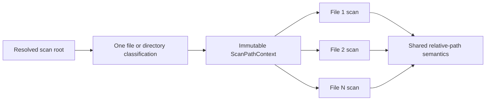

# Scanner path-context reuse and authentication-comment precision

AppGuardrail scans large repositories by streaming files through `_scan_file`. The scan root does not change during that operation, so its file/directory classification, relative-path root, string form, and separator-safe prefix are immutable scan-level data rather than file-level data.

The reusable `appguardrail_core.scan_paths` module exposes that contract independently of the CLI for standalone integrations, organization services, `naruon`, and other modular MSA consumers.

## Architecture

`cmd_scan` observes `scan_path.is_file()` once, builds one frozen context, and passes the same object to every `_scan_file` call. A standalone `_scan_file` caller that does not provide a context retains a safe fallback and performs one classification for that call.

The context preserves the existing behavior:

- directory children are represented relative to the resolved root;
- a path equal to the resolved root is represented as `.`;
- paths outside a directory root retain their full string form;
- a single-file scan falls back to the filename and uses the current working directory as its relative root;
- the root prefix always contains one platform separator, so `repo` does not falsely match `repository`;
- plain strings, `str` subclasses, `Path` values, dotfiles, and platform-specific separators retain their public contracts.

## Deterministic benchmark evidence

The performance gate uses an operation-count benchmark instead of a timing threshold. Wall-clock microbenchmarks in shared CI are affected by runner load, filesystem cache, operating system scheduling, and virtualized storage. The test therefore makes **no wall-clock speedup claim**.

For a representative stream of **10,000** files:

| Root operation | Previous placement | New placement |
|---|---:|---:|
| Root file/directory classification | once inside each `_scan_file` call | once in `cmd_scan` |
| Observed classification count | **10,000** | **1** |
| Context object construction | 10,000 | 1 |
| Context identity across file calls | not applicable | exactly one shared frozen object |

The deterministic result is therefore **10,000 → 1** scan-root classification operations for that workload. This demonstrates removal of redundant metadata decisions without claiming a machine-independent elapsed-time percentage. Operators can run repository-specific profiling separately when deciding whether filesystem latency makes the optimization material in their environment.

## Authentication-deferral rule boundary

The `todo-skip-auth` rule is intended to detect comments that explicitly defer authentication or security work. It must not classify executable hardening code, multiplication expressions, or arbitrary source text as a HIGH finding.

The packaged rule now recognizes:

- Python `#` line comments;
- JavaScript and TypeScript `//` line comments; and
- bounded `/* ... */` block comments, including conventional leading `*` decoration.

A standalone `*` prefix is not treated as a comment. Executable multiline expressions such as `* todo * auth` therefore remain code rather than security-comment evidence. Bounded block-comment expressions stop at the first closing delimiter and avoid scanning an unbounded file as one comment.

## Verification

The protected workflow verifies:

- exact 100% statement coverage for `appguardrail_core/scan_paths.py`;
- frozen-context construction, validation, prefix collision, single-file, directory, and cross-platform contracts;
- the same exact context object across a 2,000-file stream;
- one root classification across a 10,000-file operation-count benchmark;
- one fallback build for standalone `_scan_file` callers;
- `str` subclass behavior in language detection and display paths;
- positive Python, JavaScript, and block-comment findings; and
- negative executable-expression and credential-removal cases.

## References

Python Software Foundation. (2026a). *os—Miscellaneous operating system interfaces* (Python 3.13 documentation). https://docs.python.org/3.13/library/os.html

Python Software Foundation. (2026b). *pathlib—Object-oriented filesystem paths* (Python 3.13 documentation). https://docs.python.org/3.13/library/pathlib.html

Python Software Foundation. (2026c). *re—Regular expression operations* (Python 3.13 documentation). https://docs.python.org/3.13/library/re.html
