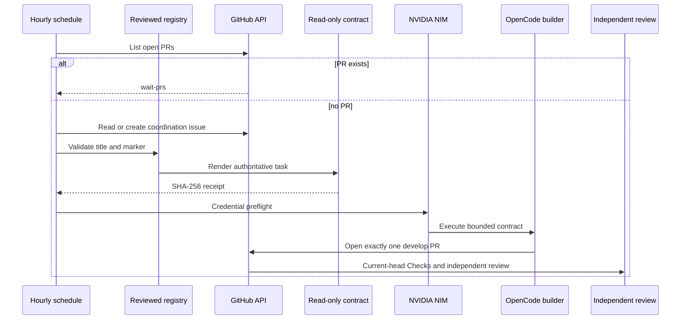

# OpenCode Commercial-Readiness Agent Implementation Plan

**Date:** 2026-08-06  
**Status:** Implementation candidate for protected review  
**Target:** `develop`

## Objective

Replace the hourly Jules label handoff with one NVIDIA NIM-backed OpenCode development agent without changing the independent review-agent credential chain or weakening protected merge requirements.

The scheduler must remain PR-first, default-branch-authoritative, single-flight, fail-closed, modular, and limited to exactly one reviewable product slice.

## Threat model

The following inputs are untrusted and must never become model instructions:

- GitHub issue title, body, and comments;
- pull-request prose;
- repository source documents and generated artifacts;
- webpages, tool output, logs, and downloaded files;
- model-generated follow-up instructions.

The reviewed default-branch `COMMERCIAL_GAPS` registry is the task authority. An issue is only a tracking identity after its exact title and exactly one hidden marker match a registry entry.

Primary risks:

1. indirect prompt injection through issue prose;
2. a duplicated or unknown marker selecting an unintended task;
3. feature-branch code receiving the NVIDIA or GitHub write credential;
4. the builder changing review-agent credentials or approving its own work;
5. parallel agents creating duplicate product slices;
6. an unbounded model run consuming the next hourly slot;
7. a model opening multiple PRs, merging, tagging, or releasing;
8. silent loss of test, documentation, or source-traceability requirements.

## Design decisions

### Registry-derived task contract

The selector validates the coordination issue, then generates `.commercial-agent-contract.md` from the default-branch registry before the NVIDIA secret is exposed. The file is read-only and its SHA-256 digest is passed to the OpenCode prompt.

The model may verify the issue number and hidden marker but must not execute issue prose. This prevents an issue edit from changing model authority without a reviewed code change.

### Built-in NVIDIA provider

Use OpenCode's built-in `nvidia` provider with `NVIDIA_API_KEY`, mapped from the repository's `NVIDIA_NIM_API_KEY` secret. Do not maintain a custom provider definition when the official provider already defines the API endpoint and credential contract.

`COPILOT_GITHUB_TOKEN` must not appear in the workflow or configuration. Review-agent secrets, models, and approval paths remain byte-for-byte outside this change.

### Protected handoff

The builder may create a branch and exactly one PR targeting `develop`; it must not merge, tag, publish, release, alter branch protection, or submit an approval. The ordinary independent review and current-head Checks remain the only path to merge.

## TDD sequence

### RED

1. Add tests requiring exact issue title and exactly one known marker.
2. Add tests proving issue prose is absent from the model-authoritative contract.
3. Add tests requiring the built-in NVIDIA provider and prohibiting custom provider or Copilot credentials.
4. Add tests requiring contract generation, read-only mode, SHA-256 receipt, secret preflight, and immutable action pinning.
5. Add tests requiring default-branch-only execution, PR-first selection, and single-flight concurrency.
6. Run the focused tests and confirm they fail against the inherited Jules workflow.

### GREEN

1. Remove Jules label creation and reconciliation mutation.
2. Validate title and marker identity against `COMMERCIAL_GAPS`.
3. Add registry-derived contract rendering and CLI arguments.
4. Configure the bounded `commercial-builder` agent with built-in NVIDIA models.
5. Update the hourly workflow to create and hash the contract before model credentials.
6. Keep issue reconciliation read-only.
7. Add operator documentation, APA 7th references, and a `CHANGELOG.d` fragment.
8. Add exact module-coverage and workflow-contract gates.

### REFACTOR

1. Remove duplicate old tests and stale Jules vocabulary.
2. Keep source APIs small and fully documented.
3. Preserve deterministic selector output and error categories.
4. Inspect the final diff for unrelated scheduler, reviewer, or credential changes.

## Coverage and verification

Changed production modules must reach exact 100% statement coverage:

- `scripts/ci/commercial_readiness_loop.py`
- `scripts/ci/commercial_readiness_reconcile.py`

Public and non-obvious behavior must retain complete docstrings. Required verification includes:

- focused selector, trust-boundary, reconciliation, documentation, and workflow tests;
- full repository tests;
- `compileall`;
- workflow syntax and immutable action-pin checks;
- SAST and security scans;
- no unresolved review thread;
- exact-head approval from someone other than the last pusher.

The builder itself must not merge. Auto-merge or an explicit SHA-bound merge may act only after every protected gate succeeds.

## Operational sequence

## Failure semantics

Fail before model execution for malformed selector JSON, invalid issue number, unknown or duplicate marker, title mismatch, missing contract, digest failure, or missing NVIDIA secret.

A model/provider failure leaves the coordination issue open. The next hourly pass may retry that same validated issue only when no PR is open. It must not create a duplicate issue or parallel PR.

## Rollback

Rollback is a protected revert of the scheduler merge. The previous issue records remain intact, and manual development/review remain available. Do not restore Jules or Copilot credentials as a rollback mechanism. If NVIDIA service is unavailable, leave the development pass failed and preserve the independent review path.

## Release boundary

Merging this scheduler does not make AppGuardrail release-ready. Version and `CHANGELOG.md` promotion require a separately proven product release candidate. The scheduler PR must not merge itself and must not publish artifacts beyond ordinary test evidence.
